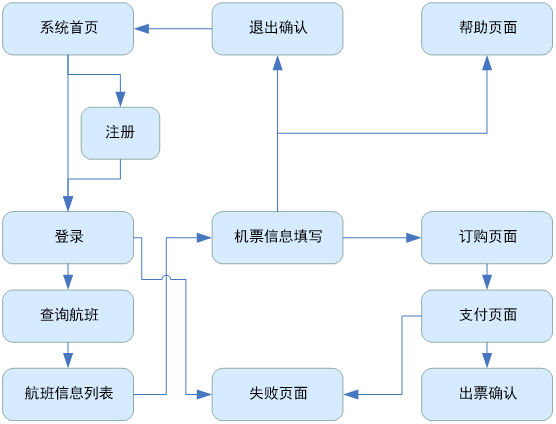

# 人机界面的设计

## 人机界面应具备的特性

人机界面的好坏是评价软件性能与质量的一个重要指标

1. 易使用性
   1. 使用简单
   2. 人机界面中所有术语应标准化和具有一致性
   3. 具有帮助功能
   4. 快速的系统响应和较低的系统成本
   5. 具有容错能力
2. 灵活性
   1. 考虑到用户的特点、能力、知识水平，界面不同
   2. 定制和修改界面
   3. 提供不同详细程度的系统响应信息
3. 复杂性和可靠性
   1. 界面要具有一致性
   2. 常用操作要有快捷方式
   3. 提供必要的错误处理功能
   4. 提供信息反馈
   5. 允许操作可逆
   6. 设计良好的联机帮助
   7. 合理划分并高效地使用显示屏幕

## 图形用户界面设计的一般原则

### 一般交互

提高可交互性的措施有：

1. 一致性：人机界面中的菜单选择、命令输入、数据显示以及其它功能都应使用一致的格式。
2. 提供有意义的反馈：向用户提供视觉和听觉的反馈，以保证在用户和界面间建立双向联系。
3. 在执行有较大破坏性的动作前要求确认
4. 允许取消大多数已完成的操作（UNDO）
5. 减少在动作间必须记忆的信息数量
6. 提高对话、移动和思考的效率
7. 系统应保护自己不受致命错误的破坏
8. 按功能对动作分类，并据此安排屏幕布局。
9. 提供语境相关的帮助机制。
10. 命令用简单的动词或动词短语命名

### 信息显示

1. 只显示与当前语境相关的信息。
2. 使用便于用户迅速吸取信息的方式表现数据。可以用图形取代巨大的表格。
3. 采用一致的标记、标准的缩写和预先定义的颜色
4. 允许用户保持可视化的语境
5. 产生有意义的出错信息
6. 使用大小写、缩进和正文分组来辅助理解
7. 使用窗口分隔不同类型的信息
8. 用“类比”的手法，生动形象地表示信息。如用类似温度计的方式表示储油罐的压力，用红色表示危险区
9. 合理划分并高效使用显示屏空间

### 数据输入

用户与系统交互的大部分时间用于键入命令、数据以及提供其它的系统输入。输入手段主要有键盘、鼠标、数字化仪甚至语音识别系统等。

1. 尽量减少用户输入动作的数量。
2. 允许用户定制输入。如专家用户可以决定创建客户命令或省去警告信息和动作确认。
3. 交互应该是灵活的并可调整到用户喜欢的输入方式。如书记员喜欢键盘输入，经理喜欢鼠标点击

## 人机界面的设计方法

### 实验方法

- 列出实验要考虑的各种独立变量的不同级别。
- 设计一个与实际类似的，在实验室里可控制的任务。
- 实验在一个受控的环境下进行，这样，独立变量以外的因素不会随条件的改变而改变。
- 分析实验结果，进行统计分析

### 预测模型方法

#### GOMS模型

用目标、操作、方法和规则选择来描述模型是如何工作的。通过使用的规则集，还可以预测可能出现的错误

#### 状态转换网络

显示了系统如何从一个状态到另一个状态，可以用于人机界面设计

### 拟人化方法

拟人化方法拟人化方法将人类交流的过程作为人机交互的模型，希望与计算机能像与人一样进行有效的交互。强调界面友好、自然

1. 收集数据，作为计算系统的设计依据
2. 人机交互和人人交互比较，研究技术
   - 自然语言处理
   - 语音识别
   - 辅助任务执行
   - 可适应系统
   - 用户模型

### 认知方法

认知方法将认知科学和认知心理学的理论用于人机界面设计

1. 问题求解

2. 类比推理

3. 空间推理

4. 脚本、计划和目标

5. 心智模型

6. 注意资源

认知方法的成功最终取决于从研究到应用转化的成果

## 人机界面设计的认知基础

### 视觉刺激在人机界面上的呈现方式

主要有特性刺激、运动刺激、视知觉的组织特性等

一些界面元素刺激性的物理特性和运动属性常常会影响知觉，包括亮度、对比度、字体、颜色、位置、图像、声音，以及画面的动感和布局画面的运动等

在界面上使用它们可以增加感染力，表现不同的信息状态，也可以增加视觉上的刺激

刺激呈现的方式影响视知觉。离散的刺激由于它们彼此之间的某种关系组织到一起，成为一个整体知觉。 邻近、相似、封闭

### 视觉搜索的特点对人机界面布局的影响

视觉搜索就是要在很多视觉刺激中搜索出某一个刺激来，被要求搜索的刺激称为“目标刺激”，其他刺激称为“干扰刺激”

视觉搜索有串行搜索和并行搜索两种方式

如果目标刺激和干扰刺激视觉特征没有很大的区别，那么视觉搜索采用串行方式，如果目标刺激和干扰刺激视觉特征有很大的区别，那么采用并行搜索

设计界面应考虑这一因素

### 短时记忆容量和人机界面设计的关系

处理屏幕信息不仅需要知觉这种低级的认知过程，还需要记忆这样的高级认知过程参与

记忆分 长时记忆 和 短时记忆

## 人机界面交互方式

问答式对话界面

- 最简单的人机界面交互方式。
- 优点：容易使用，容易学习，软件编程实现容易，用户回答范围小，不易出错。
- 缺点：效率不高，速度慢，灵活性差，修改扩充不方便。

菜单交互界面

- 特点：让用户在一组多个可能对象中进行选择，各种可能的选择项以菜单项的形式显示在屏幕上。
- 优点：易学易用，由系统驱动，能大大减轻用户的记忆量。不易出错，而且菜单的实现也比较容易。
- 缺点：交互活动受限制，即只能完成预定的交互功能，其次在大系统中使用时速度慢，有时一个简单的功能需经过几级菜单的选项。显示空间限制

填表界面

- 菜单选择在选取选项方面是有效的，但需要输入一些数据项时，则使用填表界面显得比较自然。
- 优点：使用容易、方便、直观、简化数据输入，便于提供帮助。
- 缺点：仅适用于输入数据，占用较多的屏幕空间。

命令语言界面

- 命令语言界面是用户驱动的对话，即由用户发起和控制对话，用户按照命令语言语法输入命令给系统，然后系统解释命令语言，完成命令语言规定的功能，并显示运行结果。
- 适合于熟悉型或专家型用户，而不适合于生疏型用户。
- 优点：对熟练它的用户才真正存在。

查询语言界面

- 信息查询语言是用户与数据库交互的媒介，是用户定义、检索、修改和控制数据的工具。
- 查询语言是非过程化的准自然语言，用户可以使用类似自然语言的语句方式来定义、查询或更新数据库。
- 数据库用户：程序员用户、技术用户、偶然用户。

自然语言界面

- 自然语言：键盘输入文本、手写文字、语音输入等。
- 计算机能理解用户用自然语言表达的请求，并把系统的理解转换成系统语言，然后执行相应的应用功能。
- 缺点：输入冗长、自然语言具有二义性、需要具有应用领域的知识基础以及编程实现困难。
- 优点：最理想、最友好的人机界面类型

## 人机界面的用户分析

用户体验（User Experience，UX）通常是指用户在使用产品或系统时的全面体验和满意度

用户体验主要有下列四个元素组成

- 品牌（Branding）
- 使用性（Usability）
- 功能性（Functionality） 
- 内容（Content）

用户分析是人机界面设计中不可缺少的组成部分，不同研究者对用户有着不同的分类方法

- 按用户是否接受过使用计算机系统知识的培训，可分为未受过训练的用户和受过训练的用户。
- 按使用计算机系统的频率，可分为偶然用户、经常用户（职业用户）以及间歇式使用计算机的用户。
- 按照使用计算机系统的目的，可以分为最终用户、应用开发用户、系统开发维护用户等

### 用户的分类

- 偶然外行型 这类用户很少接触计算机，没有计算机应用的专业知识，缺乏基本的计算机系统知识。
- 初学生疏型 这类用户正在有目的地学习计算机系统，但是，由于时间和经验少，他们还没有形成对计算机系统的全面认识，但对计算机的性能和操作有着一定程度的了解和经验。
- 熟练型 对系统有相当多的经验，并且是熟练的操作员。
- 专家型 对计算机系统具有全面和系统的专业知识，具有操作、使用计算机系统的知识和经验。他们和计算机之间的交互认知距离很小

### 分层的用户模型

- 个性模型
  - 用户对交互风格的偏好
  - 用户对于系统反馈的喜欢，以及用户对于特殊状况下的处理方式
  - 用户对于系统交互形式的学习能力的强弱
- 领域模型
  - 对应用系统的一般任务的认识
  - 对应用系统中的专业任务的理解程度
  - 对应用系统中的专业术语的理解程度
- 常识模型
  - 对计算机交互界面中的控件的认识和操作程度。 控件：菜单、图标、窗口等
  - 对交互设备的的认识和操作程度。交互设备：键盘、鼠标、光笔、语音话筒、眼动设备、头盔
  - 对界面风格的认识和操作程度
  - 对界面功能反馈的认识程度

## 界面设计的4个支柱

- 用户界面需求  用户观察
  - 软件项目的成败经常取决于所有用户和实现者之间理解的精确性和完整性
- 指南文档与过程  理论与模型
  - 在设计过程的前期，用户界面架构师应该产生一套工作指南
- 用户界面软件工具  算法与原型
  - 设计交互系统的困难之一，是客户和用户可能对新系统并没有一个清晰的想法
- 专家评审与可用性测试  受控实验
  - 在将系统交付给客户使用之前，必须对组件进行很多小的和一些大的初步试验
  - 其过程依可用性研究的目标、预期用户数量、错误的危害程度和投资规模而变化很大

## 设计流程

### 用户的观察和分析

- 情境访谈（Contextual Interviews）
  - 走进用户的现实环境，尽量了解你的用户的工作方式、生活环境等情况。
- 焦点小组（Focus Groups）
  - 组织一组用户进行讨论，让你更了解用户的理解、想法、态度和需求。
- 单独访谈（Individual Interviews）
  - 一对一的用户讨论，让你了解某个用户是如何工作，使你知道用户的感受、想要什么及其经历等。

### 设计

- 常用的素材分析方法是对象模型化，即将用户分析的结果按照讨论的对象进行分类整理，并且以各种图示的方法描述其属性、行为和关系
- 对象抽象模型可以逐步转化为不同具体程度的用户视图。
  - 比较抽象的视图有利于进行逻辑分析，称为低真视图（Low-fidelity Prototype）
  - 比较具体的视图更接近于人机界面的最终表达，称为高真视图（High-fidelity Prototype）

### 实施

- 随着产品进入实施阶段，设计师对高真设计原型进行最后的调整，并且撰写产品的设计风格标准（Style Guide），产品各个部分风格的一致性由该标准保证
- 产品实施或投入市场后，面向用户的设计并没有结束，而是要进一步的搜集用户的评价和建议，以利于下一代产品的开发和研制

### 任务分析

- 任务分析是交互设计至关重要的环节，在以用户为中心的设计中，关心的是如何从用户那里理解和获取用户的思维模式，进行充分、直观的表达，并用于交互设计。
- 描述用户行为的工具有很多，目前经常提到的是通用标识语言UML（Unified Markup Language）。

### 以用户为中心的界面设计

- 及早以用户为中心：设计人员应当在设计过程的早期就致力于了解用户的需要。 
- 综合设计：设计的所有方面应当齐头并进发展，而不是顺次发展，使产品的内部设计与用户界面的需要始终保持一致。
- 及早并持续性地进行测试：当前对软件测试的唯一可行的方法是根据经验总结出的方法，即若实际用户认为设计是可行的，它就是可行的。通过在开发的全过程引入可用性测试，可以使用户有机会在产品推出之前就设计提供反馈意见。
- 反复式设计：大问题往往会掩盖小问题的存在。设计人员和开发人员应当在整个测试过程中反复对设计进行修改。

以用户为中心的设计方法

- 图形用户界面设计与评估（Graphical User Interface Design and Evaluation，GUIDE）
- 以用户为中心的逻辑交互设计（Logical User-Centred Interaction Design，LUCID）
- 用于交互优化的结构化用户界面设计（Structured User-Interface Design for Interaction Optimisation，STUDIO）
- 以使用为中心的设计（Usage-Centered Design）
- OVID设计

### 对象建模分析

- 对象建模分析是将系统和用户任务分析的结果转化为用户界面设计的第一步
- 建模是将系统任务的某些概念及其关系用图的方式直观综合地表达出来
- 分析则是将系统的对象抽象为类，列出对象或类的属性、行为、以及对象间的关系

### 视图抽象设计

视图抽象设计通过组合概念模型中的对象和对象操作，提供系统运行的方法和方式，为具体的设计提供指导，并要为系统的不同实施方案提供灵活的界面选择

### 概要设计

针对特定的操作系统或交互方式，对抽象的视图设计做进一步的具体设计，产生视图的概要设计。实际设计中，这些视图通常是用铅笔画在纸上，这样做速度快，而且修改起来也比较方便

### 视图的关联设计

任何一个人机交互系统的界面都可能包括若干状态，用户在不同界面状态下根据自己完成任务需要进行不同的操作；很多交互任务需要从一个状态转化为另一个状态，这就要考虑用户完成任务所需的信息和功能，并将不同交互视图之间的联系和状态转换关系整理清楚

### 视图的全面设计

确定各个视图的具体内容和大致布局，并在每个视图上明确体现与其他视图的关系，保证系统的整体性和和谐性。然后可以借助具体的开发工具进行界面的实际设计

## Web界面设计

Web是一个由许多互相链接的超文本（HyperText）文档组成的系统。分布在世界各地的用户能够通过Internet对其访问，进行彼此交流与共享信息。在这个系统中，每个有用的事物，被称为一种“资源”，其由一个全局“统一资源标识符”（URI）标识；这些资源通过超文本传输协议（HyperText Transfer Protocol）传送给用户；而用户通过点击链接来获得这些资源

Web应用的成功

- 所采用的技术和所能够提供的功能的限制
- 还受Web网页的外观的影响

Web网页的外观经常是最先被用户注意到的。用户对网站的第一印象与界面外观是否友好、吸引人密切相关。所以对于设计人员来说，Web界面设计至关重要。

Web界面设计的人性化、易用性是Web界面设计的核心。

- Web设计是艺术与技术的高度统一
- Web设计要求
  - 主题鲜明
  - 形式与内容统一
  - 强调整体性

### web设计特点

- 交互性，及时交互，主动交互
- 持续性，信息的持续更新
- 多维性，源于超链接，导航清晰
- 多媒体，综合运用多种媒体元素
- 布局不可控
  - 操作系统不同、浏览器种类和版本不同、屏幕大小和分辨率不同

### Web设计的基本原则

主题鲜明，形式与内容的统一，强调整体，减少层次

### Web设计的内容原则

- 主流浏览器正常显示
- 结构层次分明
- 平衡使用多种媒体，达到效率与效果的统一
- 文字通俗易懂
- 重视主页
- 及时更新

### Web设计的风格原则

- 用户 小孩，老人
- 功能 专业，娱乐

### Web设计的语言文化原则

文字排向，颜色，数字，时间格式，货币

### Web界面元素的设计

布局，导航，颜色，文字，视听元素(RIA 

### web界面设计原则

以用户为中心，一致性，简洁与明确，体现特色，兼顾不同的浏览器，良好的导航设计

### 一致性原则

- Web界面的内容和形式应一致。
  - 内容包括：网站显示的信息，如数据、文字内容等。
  - 形式包括：Web界面设计的版式、构图、布局、色彩、风格等。

Web网站标识及页面设计标准确定后，应运用到每个页面上

### 简洁与明确原则

### 体现特色的原则

### 兼顾不同浏览器的原则

### 明确的导航设计的原则

### Web 界面要素设计

- Web界面规划
- 文化与语言

内容、风格与布局、色彩设计

- 内容：Web界面的内容不仅要遵循简洁明确的原则，也要符合确定的设计目标，面向不同的对象要使用不同的口吻和用词
- 风格：Web界面的风格是指网站的整体形象给浏览者的综合感受

- 在限定范围内合理安排图像和文字的位置，根据需要进行分组，按照内在逻辑进行组织排列，体现出一定的条理性
- 布局原则：平衡，呼应，对比，疏密

典型的web布局：“同”或“国”字型，左右对称型，拐角型，标题正文型，左右框架型，上下框架型，封面型，自由型

Web颜色，文本设计，多媒体元素设计

### Web界面设计技术

- 网站&web应用
  - 网站，一组网页的集合，多为静态文本、图像和视频等，交互功能有限。使用“内容管理系统”提供动态文本，但主要作用仍是提供信息的展示。
  - Web应用，一个动态交互的软件系统，用于处理业务流程（有明确的业务规则），运行在Web环境中
- Web应用&桌面应用

- HTML
  - HTML是用来表示网上信息的符号标记语言，是一个跨平台语言。HTML已经成为了Web文档信息的标准方法，是构成Web界面的主要工具
  - HTML语言的标记元素通常分为如下几类：基本标记元素、图形标记元素、表格标记元素、表单标记元素
- JavaScript
  - JavaScript是一种内嵌于HTML中的脚本语言(也可独立出来)，它是一种基于对象和事件驱动并具有安全性能的脚本语言
  - 基本特点：JavaScript是一种脚本编写语言；是基于对象的语言；简单性；安全性；动态性；跨平台性
- 服务器端脚本语言
  - 目前流行的三大服务器端脚本语言是ASP、PHP、JSP
- AJAX技术
  - AJAX（Asynchronous JavaScript and XML）全称为“异步JavaScript和XML”，是一种创建交互式Web界面应用的开发技术，是一种新的架构模式

### Web3D 技术

Web3D可以简单的看成是Web技术和3D技术相结合的产物，是互联网上实现3D图形技术的总称

- VRML：一种建模语言，可用来描述三维物体及其行为，构建虚拟场景
- Java3D：Java语言在三维图形领域的扩展，是一组应用编程接口（API）

## 移动界面设计

### 移动设备

- 连接方式
- 交互方式：输入方式和输出方式
- 设计原则
- 简单直观
  - 个性化设计
  - 易于检索
  - 界面风格一致
  - 避免不必要的文本输入
  - 根据用户要求使服务个性化
  - 最大限度的避免用户出错
  - 文本信息应当本地化
- 设计要素
  - 菜单，按钮，多项列表
  - 文字显示
    - 查看，更多，跳过
- 数据输入
- 图标与图像
- 报警提示
  - 确认提示，信息提示，警告提示，出错提示，持久性提示，等待提示
- 多媒体展示
- 导航设计

### 移动界面设计技术与工具

- 移动应用开发技术

  - .Net 精简框架，J2ME架构，BREW
  - 移动浏览标准协议
    - WAP，WML与WMLScript，XHTML Basic 与XHTML MP

  - 移动设备操作系统
    - Palm OS，Windows Mobile，嵌入式LINUX，Symbian OS/EPOC OS

- 移动应用开发工具

  - 由于移动设备的硬件形式繁多，而且需要在本机上提供良好的开发环境，所以模拟器软件就成为移动应用开发必不可少的一种工具

## 可用性与可用性工程

可用性定义：国际标准化组织（ISO 9241-11）给出的可用性是指特定的用户在特定环境下使用产品并达到特定目标的效力、效率和满意的程度

五个E：有效性（Effective） 效率（Efficient）吸引力（Engaging） 容错能力（Error Tolerant）易于学习（Easy to Learn）

产品开发过程中增强可用性可以带来很多好处

- 提高生产率
- 增加销售和利润
- 降低培训和产品支持的成本
- 减少开发时间和开发成本
- 减少维护成本
- 增加用户的满意度

### 可行性工程

改善系统可用性的迭代过程。其目的就是保证最终产品具有完善的用户界面。

可用性工程的生命周期大体上分为下面几个部分：

1. 了解用户
2. 竞争性分析
3. 设定可用目标
4. 用户参与的设计
5. 迭代设计
6. 产品发布后工作

### 支持可用性的设计原则

- 可学习性：交互系统能否让新手学会如何使用系统，以及如何达到最佳交互效能
  - 可预见性，同步性，熟悉性，通用性，一致性
- 灵活性：体现了用户与系统交流信息方式的多样性
  - 可定制性，对话主动性，多线程，可互换性，可替换性
- 鲁棒性：用户使用计算机的目的是达到某种目标。对到达的目标进行评估
  - 可观察性，可恢复性，响应性，任务规范性

### 可用性评估

软件可用性评估应该遵循以下原则：

- 最具有权威性的可用性测试和评估不应该针对专业技术人员，而应该针对产品的用户。对软件可用性的测试和评估，应主要由用户来完成。
- 软件的可用性测试和评估是一个过程，这个过程在产品开发的初期阶段就应该开始。
-  软件的可用性测试必须是在用户的实际工作任务和操作环境下进行。
- 要选择有广泛代表性的用户。

#### 用户模型法（User Model）

用户模型法是用数学模型来模拟人机交互的过程。这种方法把人机交互的过程看做是解决问题的过程。个模型可以预测用户完成任务的时间。这个方法特别适合于无法进行用户测试的情形。在人机交互领域中最著名的预测模型是GOMS模型。

#### 启发式评估（Heuristic Evaluation）

使用一套相对简单、通用、有启发性的可用性原则（即“启发”）来进行可用性评估

启发式可用性原则共有十条：系统状态可见性，系统与用户现实世界相互匹配，用户控制与自由，一致性与标准，错误预防，识别而不是回忆，使用的灵活性与效率，美观而精炼的设计，帮助用户认识、诊断和修正错误，帮助和文档