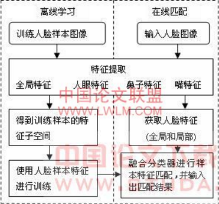
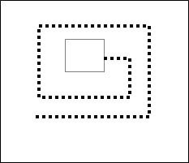
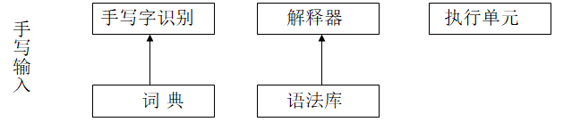
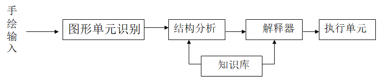
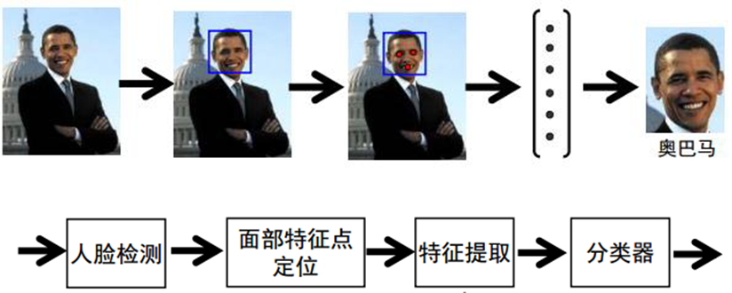
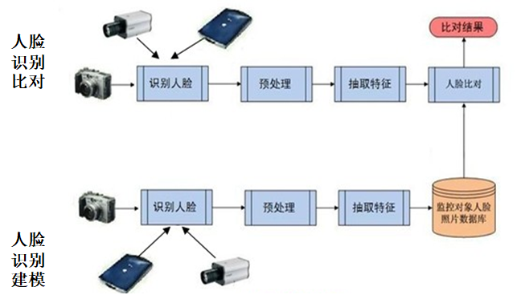

# 图像交互

## 图像交互特点

图像是对客观存在的物体的一种相似性的生动模仿或者描述。它是用各种观测系统以不同的形式和手段观测客观世界而获得的，可以直接或间接作用于人眼并进而产生视知觉的实体。

具体地说，图像可以是各种物体的黑白和彩色图画、手写字符、遥感图片、声波信号、X射线透视胶片、指纹图案、空间物体等。

- 直观视觉图像（图案、图片、文字等）
- 间接转换图像（声音、心率、地震波等）

图像交互的条件是计算机有视觉感知能力，目前人们研究的机器视觉系统分为三个层次：

- 图像处理。是最低级的层次，图像处理主要对图像进行各种加工以改善视觉效果，是一个从图像到图像的过程，输入输出的都是图像，
- 图像识别。是较高级的层次，主要对图像中感兴趣的目标进行监测和测量，以获得他们的客观信息从而建立对图像的描述。图像识别是一个从图像到数据的过程。根据从图像抽取的统计特性或结构信息， 把图像分成给定的类别。
- 图像感知。是机器视觉系统的最高层次，这个层次需要智能推理能力。在图像识别的基础上，得出对图像内容含义的理解以及对原来客观场景的解释，从而指导和规划行动。

图像感知与图像处理、图像识别有密切联系，又有明显区别，主要体现在输入和输出的关系上。

- 图像处理的输入和输出都是图像，主要工作是对图像进行加工。
- 图像感知输入一幅图像，输出对该图像的解释。
- 图像识别对输入模式进行分类，它具有图像感知的内容，但理解的结果与图像感知相比不如后者全面丰富。通常，图像感知包括图像处理和模式识别的内容。

## 图像识别

图像识别过程

- 图像识别主要研究的是目标图像特征提取和分类。
- 目标识别的过程包含两个步骤：
  - 第一步是特征提取，即从原始数据中提取出对分类识别有用的目标信息；
  - 第二步是分类判决，对第一步所获取的信息做适当处理，完成特征信息与目标参数间的相互关联的判决。

图像识别中常用的图像特征：

- 灰度特征。灰度是最容易获得的图像原始信息，几乎包含了图像的全部信息，其他特征都是在灰度特征基础上提取出来的。
- 几何特征。图像识别中可以利用的几何特征有点、线特征等。点特征是图像中满足一定要求的像点；线特征指图像中的曲线、直线等；边缘是图像中由于灰度不连续形成的边界。几何特征较灰度特征不易受到各种因素的影响而发生较大改变。
- 统计特征。如矩特征和纹理特征等。矩特征是图像的一种描绘，具有旋转平移不变性，纹理特征是某种结构在较大范围内做重复排列而形成的特征。

在实际中，若把图像所有特征都收集起来用于识别，图像的特征过多使处理过程中运算次数增多，造成速度减慢。为了提高识别速度，在抽取图像特征之后，还应有一个特征选择过程。

### 图像识别方法

根据抽取特征的不同图像识别方法主要有

#### 统计方法（KL算法、隐马尔可夫(HMM)） 

  统计方法以数学上的决策理论为基础，根据这种理论建立统计学识别模型。其基本模型是在对研究图像进行大量统计分析，找出规律性的认识，抽出反映图像本质特点的特征进行识别。

对于特征抽取，必须把图像的大量原始信息缩减为少数的特征。对文字符号等只可抽取几何形状特征，对声波信号可抽取频谱特征。

#### 句法模式识别方法

句法模式识别方法是从图像的结构特性出发分析图像、识别图像、最后描述图像的方法，具有统计法所不具备的优点。识别图像时，首先鉴别图像中的基元，然后构成一个文法（或多个文法），这种文法将产生一种语言（或多种语言）所构成的句子，以描述被研究的图像

第二步对图像的句子进行文法分析，以确定该句子对指定的文法在句法上是否正确。由此，一个图像能否被识别、识别的好坏取决于能否很好的识别简单的图像基元，以及图像基元之间由组合运算所表示的相互关系。

总结：统计方法很少利用图像本身的结构关系，句法模式识别方法则没有考虑图像在环境中所受的噪声干扰。将二者结合起来，各取所长是可取途径

#### 神经网络

神经网络图像识别技术是一种比较新型的图像识别技术，是在传统的图像识别方法和基础上融合神经网络算法的一种图像识别方法。这里的神经网络是指人工神经网络，在神经网络图像识别技术中，遗传算法与BP网络相融合的神经网络图像识别模型是非常经典的，在很多领域都有它的应用。在图像识别系统中利用神经网络系统，一般会先提取图像的特征，再利用图像所具有的特征映射到神经网络进行图像识别分类。

## 人脸图像识别

面相检测、跟踪、识别

- 检测是指在动态的场景与复杂的背景中判断是否存在面相并分离出面相；
- 跟踪是指对被检测到的面相进行动态目标跟踪；
- 识别则是对被检测到的面相进行身份确认活在面相库中进行目标搜索。

人脸识别的目的是从人脸图像中抽取人的个性化特征，并以此来识别人的身份。

人脸识别经典流程

人脸检测 -> 面部特征点定位 -> 特征提取 -> 分类器

### 人脸检测

1. 预处理

   窗口化。屏蔽。色度归正。直方图均衡。

2. 特征提取

   在人脸检测中常利用面部不同区域的灰度信息形成特征矢量，因为人的眼睛、鼻子、嘴等器官位置大致固定，且灰度分布服从一定规律，所以这种方法简单实用。

3. 面相检测方法分为两类：

   一类是需要反例的方法

   一类是不需要反例的方法

一类是需要反例的方法：即训练样本中必须包括大量背景图像，突出人脸与背景之间的 差别。 

- ANN。多层感知结构的ANN分类器。ANN的训练需要大量正例样本和反例样本以使其收敛于最佳状态，运算量很大，但具有记忆功能，可重复学习。

一类是不需要反例的方法：即训练样本中只包含人脸图像，抽取人脸特征，完全从分析人脸特征出发，这类方法有规则系统等方法。

- 规则系统。是一个小规模的模拟专家系统，不需要反例，规则是合取表达的，即测试图像必须全部满足各条规则才能判定为人脸，规则可从灰度信息或纹理信息中产生。如果眼睛区域的灰度值远高于面颊，则输入的图像不是人脸；如果嘴部的纵条纹过多，则输入图像不是人脸等。
- 由于缺乏反例信息，这种方法只是用于背景比较简单的图像。如在室内，表现出检测精度较高、速度快的优点；在复杂背景条件下，性能将变得很差。

### 人脸识别算法框架

人脸识别算法描述属于典型的模式识别问题，主要由在线匹配和离线学习两个过程组成。

在人脸识别中，特征的**分类能力**、**算法复杂度**和**可实现性**是确定特征提取法需要考虑的因素。所提取特征对最终分类结果有着决定性的 影响 。分类器所能实现的分辨率上限就是各类特征间最大可区分度。因此，人脸识别的实现需要综合考虑特征选择、特征提取和分类器设计。

- 误识率(FAR：False Accept Rate)
  - 表示不同来源的人脸被接受的概率
- 拒识率(FRR：False Reject Rate)
  - 表示来源相同的人脸被拒绝匹配的概率
- 其它常见参数指标
  - 可接入人像照片规模
  - 实时比对规模
  - 首选识别率/前N选识别率
  - 错误报警率/正确报警率
  - 人脸比对速度
  - 特征模板大小（内存占用）

#### 基于几何特征的人脸识别方法

基于几何特征的方法是早期的人脸识别方法之一 。常采用的几何特征有人脸的五官如眼睛、鼻子、嘴巴等的局部形状特征。脸型特征以及五官在脸上分布的几何特征。提取特征时往往要用到人脸结构的一些先验知识。识别所采用的几何特征是以人脸器官的形状和几何关系为基础的特征矢量，本质上是特征矢量之间的匹配，其分量通常包括人脸指定两点间的欧式距离、曲率、角度等。

基于几何特征的识别方法比较简单、容易理解，但没有形成统一的特征提取标准；从图像中抽取稳定的特征较困难，特别是特征受到遮挡时； 对较大的表情变化或姿态变化的鲁棒性较差。

#### 基于相关匹配的方法

基于相关匹配的方法包括**模板匹配法**和**等强度线**方法：

- 模板匹配法：Poggio和Brunelli 专门比较了基于几何特征的人脸识别方法和基于模板匹配的人脸识别方法，并得出结论：基于几何特征的人脸识别方法具有**识别速度快和内存要求小的优点，但在识别率上模板匹配要优于基于几何特征的识别方法。**
- 等强度线法：等强度线利用灰度图像的多级灰度值的等强度线作为特征进行两幅人脸图像的匹配识别。等强度曲线反映了人脸的凸凹信息。这些等强度线法必须在背景与头发均为黑色，表面光照均匀的前提下才能求出符合人脸真实形状的等强度线。

#### 特征脸法

特征脸方法是90年代初期由Turk和Pentland提出的目前最流行的算法之一，具有简单有效的特点, 也称为**基于主成分分析**(principal component analysis,简称PCA)的人脸识别方法。
特征子脸技术的基本思想是：从统计的观点，寻找人脸图像分布的基本元素，即人脸图像样本集协方差矩阵的特征向量，以此近似地表征人脸图像。由于每个特征矢量的图像形式类似于人脸，所以称本征脸。

实际上，特征脸反映了隐含在人脸样本集合内部的信息和人脸的结构关系。将眼睛、面颊、下颌的样本集协方差矩阵的特征向量称为特征眼、特征颌和特征唇，统称特征子脸。特征子脸在相应的图像空间中生成子空间，称为子脸空间。计算出测试图像窗口在子脸空间的投影距离，若窗口图像满足阈值比较条件，则判断其为人脸。 

**基于统计的方法**（KL算法、奇异值分解(SVD)、隐马尔可夫(HMM)法）、基于神经网络的方法、以及：

**弹性图匹配方法**：将物体用稀疏图形来描述 (见下图)，其顶点用局部能量谱的多尺度描述来标记，边则表示拓扑连接关系并用几何距离来标记，然后应用**塑性图形匹配技术**来寻找最近的已知图形（缺点是计算量巨大）。

#### 人脸跟踪

人脸跟踪策略

- 实线框表示已定位的人脸，在下一幅输入图像中，沿虚线指示的轨迹进行检测。
- 检测之前还应完成时空过滤，即进行到（i，j）坐标时，将此处的窗口图像与上一幅相同坐标处的图像相比较，若完全一致，则排除此窗口图像，直接进入下一个扫描点，这样可以提高跟踪速度。
- 检测到人脸图像后，还应与原轨迹出发点的人脸图像进行比较以确认是否为原人脸图像运动后的结果。将此位置信息输入下一幅输入图像，重复上述过程。
- 若考虑人的头部运动是三维的，则跟踪比较复杂。三维运动包括平移和旋转，前者在二维图像中表现为尺寸变化，只要检测时做图像比例的放大或缩小即可；三维旋转跟踪较难，迄今尚未发现有效实用的方法。

## 手写（绘）交互

手写（绘）交互与传统的交互方式有很大区别，传统人机交互通过键盘和鼠标来传递操作意图，手写（绘）交互采用笔在数字化显示屏面上直接写和画来进行交互，是一种更自然的人机交互方式。这种方式交互的计算机的特点是小型、便携。在输入方面表现为自然性，人们不需要任何专业知识或学习就可以使用。

手写(绘)交互得到广泛重视的原因：

- 手写(绘)输入同键盘输入相比更符合人的传统习惯
- 手写(绘)输入对非拼音文字具有更简单和高效的特点
- 手写(绘)输入的输入设备构造相对简单、成本低廉、体积小巧，更适合携带。

手写识别是人机手写(绘)交互中需要解决的主要问题，手写识别的准确率大大影响着人机交互的实际应用程度。

手写识别分为：脱机识别和联机识别。

- 脱机是指通过特定的采集系统（如扫描仪或摄像机）将文字以图像方式采集并输入计算机存储，随后识别系统根据该图像数据进行文字识别的方法。由于识别对象是记录在其他媒介如纸上的，因此是“脱机”或“离线”的。离线识别是在既定文本完全输入之后再对其进行分析的方法，识别过程无须与用户进行交互。
- 联机识别也称在线识别，主要通过各种与计算机相连的二维坐标输入设备如数字化仪、鼠标、写字板等将笔的运动轨迹实时送入计算机并加以识别，即用笔在输入板上写，人一边写，机器一边识别，因此称为联机或在线，其识别过程与用户进行实时交互。

按照识别对象划分，手写联机识别又分为手写文字识别和手绘图识别两种

手写文字的联机识别主要解决将输入数据识别并转换成字符或词句，然后存储显示，或者加以解释和执行

手绘图形的联机识别是对输入绘制的各种图形先从二维平面上对其形状、尺寸、方向等特征进行识别和估计，然后由总体的结构分析得出适当的描述或解释。如图

二者区别：手写文字的联机识别有固定的字符集合以及相应的词法和语法，而手绘图形的联机识别不具备这些特点，图形识别是对一个开放集合做出识别和解释。

### 手写体识别

#### 脱机手写体识别

脱机手写体识别是建立在对图像处理上的认识，书写和识别不同时进行。由于完全建立在对图像数据处理的基础之上，可利用的信息量很少，是字符识别领域最困难的问题之一。

脱机手写体识别一般有两种研究方法：

- 手写字符识别处理，即通过各个字母来识别一个单词，该法关键是对每一单字进行定位，以识别由各个字母组成的单词，不要使用词典就能识别每一单词。
- 手写单词识别，有整体方法和分析方法两种识别方法。
  - 整体方法中识别是对单词的整体进行，并不试图分析单个字符。该法的主要长处是回避了单词分割。但由于该法不依赖字母，单词是用特征值描述的，当增加新单词时，需要人工训练或自动地从单词的ASCII表示中生成单词的描述，导致系统的复杂性和专用词汇量的增加。
  - 分析方法处理若干层次的表示，这些表示层次的抽象水平逐渐递增（特征层、图素或伪字母层和单词层）。这些方法又分为显式（或外部）分割的分析模型和隐式（或内部）分割的分析模型两种方法。前一种方法在识别之前首先分割出图素或者伪字母片段；后一种方法在识别的同时进行分割（分割是识别的副产品）。两种方法都要使用很多词法知识来帮助识别。

手写体的识别方法和识别率取决于对手写的约束的层次，约束主要是手写的类型、写字者的数量、词汇量的大小以及空间布局。以字母为基础的方法（即基于字符的分割和识别）很适合手写印刷体的识别；草体识别则要求更特定和更复杂的技术，必须要求上下文信息来补偿模糊性。

#### 联机手写体识别

联机手写体识别比脱机手写体识别简单，简单之处在于手写板不停采样，用一个时间作为参照物，更容易从中识别重要结构信息，因而可以得到书写的动态信息，如笔画数、笔画顺序、每笔走向等，得到的原始描述是笔画的点坐标序列。脱机手写体识别得到的原始描述是点阵图像，通常要细化才能得到笔段的点阵，细化则会损失信息且不能得到时间顺序信息。

联机识别技术一般包含：数据采集与预处理技术、笔迹分割技术、特征提取、建模以及匹配技术、后处理技术。

- 数据采集。联机数据的采集一般要使用专门外设，对数字式手写板笔尖位置的采样速率达到150次/s；对压敏式感应板，当笔尖与感应板接触并且达到一定压力阈值时下笔状态才会被触发，书写过程中需保持适当压力才不会造成笔迹中断现象；对电磁式感应板，当笔尖与感应板的距离小于设定的阈值时，下笔状态就会被触发。这几种输入装置是目前较为普及的手写输入设备，此外还有触摸屏等。
- 预处理技术。数据采集后的下一步工作是进行预处理，目标是减少或消除笔迹数据中的干扰。
  - 笔迹平滑。由于采集器本身的噪声或量化噪声会对笔迹产生影响，表现为笔迹坐标的快速抖动。减少噪声的方法是采用线性平滑算子（低通滤波器）或非线性平滑算子（中值滤波）来处理笔记数据。对于由于人的书写造成的笔记扰动在预处理时可采取适当方法消除。
  - 重采样。同对原始笔迹坐标数据进行重采样来提取笔尖移动的速度信息，一般以等距采样为多，也有等时间间隔采样的，这一方案需要输入设备的硬件支持。
  - 笔迹校正和规范化。此步骤是为了增强整个识别算法对不同输入方式和书写风格的适应性，通过笔迹校正可以部分减少输入到分类器的同类书籍间的差异，保证较高的分类正确率。
- 笔迹校正通常包括以下几个方面：
  - 形变校正：如扭曲和局部变形，一般先建立几何变形的数学模型，然后根据模型进行校正
  - 方向校正：分为基准方向校正和倾斜校正，一般是先估计出基线的方向参数和书写的倾斜角度，然后进行校正；
- 笔迹分割。通常在两个层次上进行。外部分割先将输入笔迹从时间和空间商划分，分解成具有识别意义的待识单元；内部分割将待识单元继续进行分解，对文字识别就是将其分解成字符单元（西文）或笔画单元（中文等结构化字符）。笔迹分割通常实现起来很困难，对这种笔迹的分割一般需要对特定数据集进行有效训练，以便使系统能够对字符形态变化适应。因此通常没有通用的分割算法，不同的应用对分割方法提出的要求完全不同。
- 特征提取、建模以及匹配技术
  - 特征提取是模式识别过程中的重要工作，会直接影响分类器的设计和性能。特征是对识别对象某种性质描述的量化度量，特征的定义和提取方法与识别对象和识别方法密切相关。对联机手写识别，特征的提取主要是针对输入的笔画数据等。联机数据特征种类从尺度上分为局部特征和全局特征；从类型分为形态特征和结构特征、从特征的性质差别方面分为统计特征和模糊特征等。
  - 局部特征的提取方法简单、计算复杂度低，但易受噪声点影响，特征值不稳定；全局特征分为形态特征和结构特征，形态特征是对曲线形态的一种量化度量，结构特征用于描述文字中基本部分（基元）的结构关系，如基元之间的相对位置、夹角、相交、邻接等。
  - 建模。模型是在完成了特征定义和获取的基础上建立的，建模方法概括为以下几类：
    - 结构化模型，通常用来描述结构特征丰富的对象，如汉字、各种符号以及几何图形等。结构化模型以结构特征为基础建立，一般用于建立模型的基本单元称为基元。
    - 统计模型与模糊模型，这两种模型都是用来描述数据中含有不确定信息的模型。统计模型将输入数据看做随机数据，通过对随机样本集的学习，获得数据的各种统计特征，常用的模型包括隐马尔科夫模型、自组织特征图模型、延迟网络模型等。模糊模型的建立是通过对特征的模糊化来实现的，如使用模糊语言量对特征空间进行模糊化，建立特征量之间的模糊关系以及运算等，该模型的优点是可将专家知识或先验知识直接引入模型，另外模型的训练对数据样本的要求较低，模型稳定性很好。
    - 神经网络模型，通过使用一定的网络拓扑结构以及连接权值来记忆和表述图形的形态特征，通过选择适当的网络模型可以获得较好的鲁棒性和实时性。
  - 在联机识别中，匹配算法的设计也是以特征和模型的选择为基础的，针对不同的应用，广泛应用的有基于形态特征的匹配识别方法、基于统计模型的、基于模糊模型的匹配识别方法、基于神经网络的识别方法等，除此之外，基于混合模型的识别方法也是一个研究热点。
- 后处理。主要目的是对前面的结果进行修正，这通常在更抽象的层次上进行，设计对语句的理解以及相关领域的知识等多个方面，在不同的应用系统中，后处理的形式可以完全不同。

#### 手绘图形的识别

手绘图形的识别是指借助鼠标、笔式输入器以及触摸屏等设备用手自由地绘制出各种图形，计算机通过对这些图形的识别、理解获得执行某种任务所需要的信息的方法。

图形与文字有许多不同，主要表现为：

- 文字具有固定的字符集以及严格的词法和语法，便于对每个特定字符进行特征分析以及对整个字符集的整体特征进行分析。图形一般没有特定的字符集，是一个开放集。
- 文字的笔画形态相对简单，不论曲线字符还是结构字符都有这个特点，而图形笔画形态复杂多样，难以用简单的特征加以描述。
- 文字具有相对较少的几何特征，不论是曲线字符还是结构字符，在书写时通常遵循严格的位置、方向和尺寸的限制，这些限制都有利于预处理算法以及特征的准确获取，对提高识别正确率有很大帮助。图形的几何特征较多，包括方向、尺寸以及封闭、连接、对称、交叉等拓扑特征，这些特征取值的准确估计是非常重要的。
- 文字在结构特征上相对简单。无论是西文（从左到右）还是汉字（左右、上下、里外）在书写时都有很强的规律性，可用来帮助建模。图形的结构特征比较复杂，与汉字相比，对位置特征的量化更细，从而增加了模型的复杂度。

####  文字和图形特征比较

|            | 字符集 | 笔画形态 | 几何特征 | 结构特征 |
| ---------- | ------ | -------- | -------- | -------- |
| 曲线类字符 | 小     | 复杂     | 少       | 少       |
| 结构类字符 | 大     | 简单     | 较多     | 较多     |
| 图形       | 无     | 复杂     | 多       | 多       |

手绘图形识别分为脱机（离线）手绘图形的识别和联机（在线）手绘图形的识别，脱机手绘图形的识别不涉及人机交互过程。

脱机手绘图形识别与联机手绘图形识别有区别。

1. 脱机情况下图形与背景联系紧密，将图形从复杂的背景环境中分离很困难，而联机图形识别可以利用用户输入对象的时序相关性加以分割
2. 脱机识别对笔画的规则性要求较高而联机识别对输入的约束少了很多
3. 脱机样本点是等距采样而联机样本点是等时采样，可以根据笔画移动速度的变化信息来进行笔画分割和图形识别。

联机手绘图形识别与联机手写字识别也有许多不同点，一是联机图形笔画识别比联机手写字的笔画识别困难。如联机手写字符识别无须对圆和椭圆做出区分，但在联机图形识别中必须区分出弧、直线、圆、椭圆等各种曲线以及其他几何基元；另一个不同在于联机手写字识别不需要获得所识别对象的大小、位置、角度等几何参数，而联机图形识别则根据具体问题需要提取相应的几何参数。

联机图形的识别过程主要由两个识别阶段组成：

- 一是笔画（Strokes）与基本图形的识别
- 二是图形的结构识别。笔画与基本图形的识别是整个识别过程的基础部分。

#### 手写交互界面

手写交互的计算机具有交互性、自主性、便携性、分布式以及多种信息和媒体的集成性，因此手写交互的人机界面与传统的人机界面不同，主要有以下交互方式：

- 纸笔的操作方式。在用户手写交互界面中，用户可不受限制地进行书写和绘画，可在同一模式下自由进行文字和图画输入，通过纸笔实现如键盘鼠标的操作。
- 手势交互。即将人手交互时手移动的轨迹记录下来，并赋予每个具有一定特征的手势以一定的交互含义而形成的交互方式 。最普遍的手势交互是三维虚拟现实交互，其中人手持笔的交互也是一种手势交互，它模拟人手编辑和输入的交互模式，如人用笔来删除、复制、插入文字和段落等。
- 双手交互。基于手写交互的计算模式开始研究适合双手使用的双手交互方式以达到快捷自然的操作。

### 数字墨水

Windows N 中使用，数字墨水是一种显示技术，用户在使用数字墨水时，首先通过数字笔在显示器区域上“写字”，接着操作系统会将其保存为一种新的数据类型“ink”，它可以在各种文本处理软件，如Word、写字板、邮件、微博里显示。

从识别技术上看，数字墨水技术类似“图形”+“手写识别”的组合。

数字墨水与传统手写技术的区别在于：传统手写识别技术是将手写笔迹转换成计算机可处理的“文本”，这种转换被限于输入文本，是一种以机器为中心的技术；数字墨水是一种以人为中心的技术，它充分利用书写的自然性和墨水丰富的表达能力，数字墨水分析技术可以对记录下来的“数字墨水”进行结构化和深度分析，分析的是用户的书写内容和书写方式，而不是解决“写的是什么字”。

数字墨水可以用墨水格式保存。将手写的笔迹以墨水形式保存不会丢失任何信息。用户不再需要利用其他的Windows应用程序来吧把手绘、手写笔迹转换为别的格式来保存、发送和编辑。同样，由于Windows平台将“数字墨水”定义为基本数据类型之一，这就如同文本得到操作系统这一级别上的支持，数字墨水在不同应用软件之间变化变得非常容易。

## 人脸图形识别

人脸检测

1、预处理

窗口化。屏蔽。色度归正。直方图均衡。

2、特征提取

在人脸检测中常利用面部不同区域的灰度信息形成特征矢量，因为人的眼睛、鼻子、嘴等器官位置大致固定，且灰度分布服从一定规律，所以这种方法简单实用。

3、面相检测方法分为两类：

- 需要反例的方法：即训练样本中必须包括大量背景图像，突出人脸与背景之间的 差别。 
  - ANN。多层感知结构的ANN分类器。ANN的训练需要大量正例样本和反例样本以使其收敛于最佳状态，运算量很大，但具有记忆功能，可重复学习。
- 不需要反例的方法：即训练样本中只包含人脸图像，抽取人脸特征，完全从分析人脸特征出发，这类方法有规则系统等方法。
  - 规则系统。是一个小规模的模拟专家系统，不需要反例，规则是合取表达的，即测试图像必须全部满足各条规则才能判定为人脸，规则可从灰度信息或纹理信息中产生。如果眼睛区域的灰度值远高于面颊，则输入的图像不是人脸；如果嘴部的纵条纹过多，则输入图像不是人脸等。
  - 由于缺乏反例信息，这种方法只是用于背景比较简单的图像。如在室内，表现出检测精度较高、速度快的优点；在复杂背景条件下，性能将变得很差

## 手写（绘）交互

手写（绘）交互与传统的交互方式有很大区别，传统人机交互通过键盘和鼠标来传递操作意图，**手写（绘）交互采用笔在数字化显示屏面上直接写和画来进行交互，是一种更自然的人机交互方式。**这种方式交互的计算机的特点是小型、便携。在输入方面表现为自然性，人们不需要任何专业知识或学习就可以使用。

手写(绘)交互得到广泛重视的原因：

- 手写(绘)输入同键盘输入相比更符合人的传统习惯；
- 手写(绘)输入对非拼音文字具有更简单和高效的特点；
- 手写(绘)输入的输入设备构造相对简单、成本低廉、体积小巧，更适合携带。