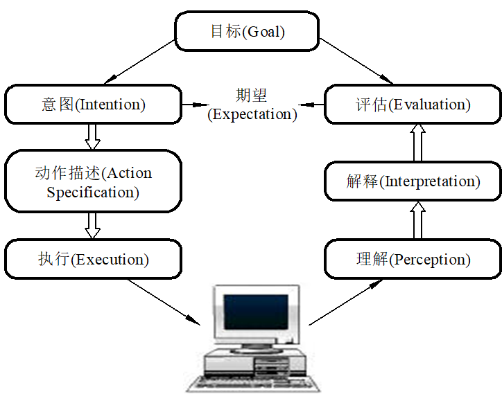
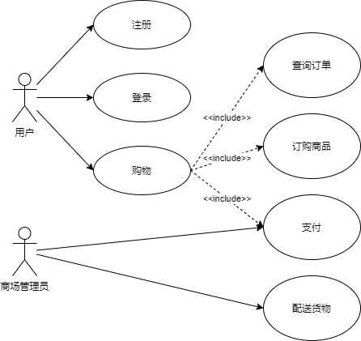
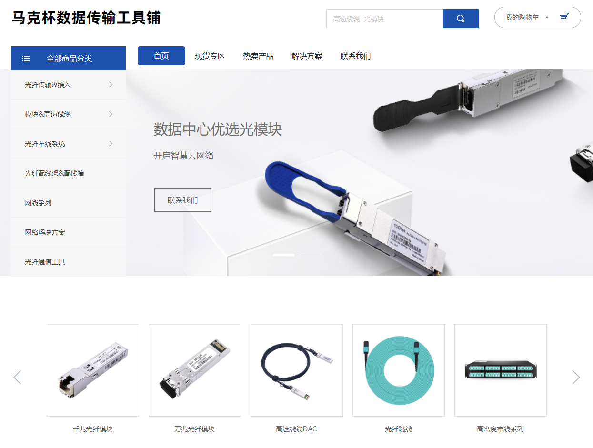
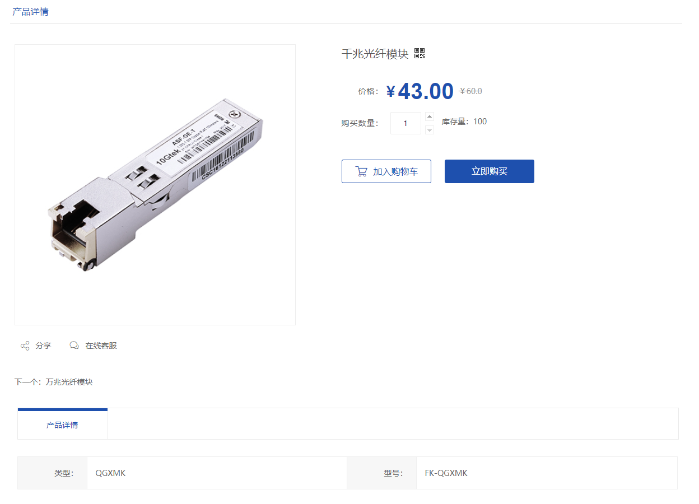
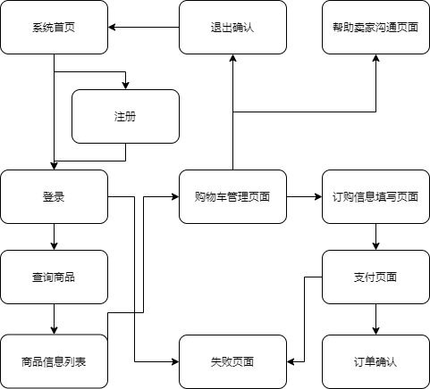
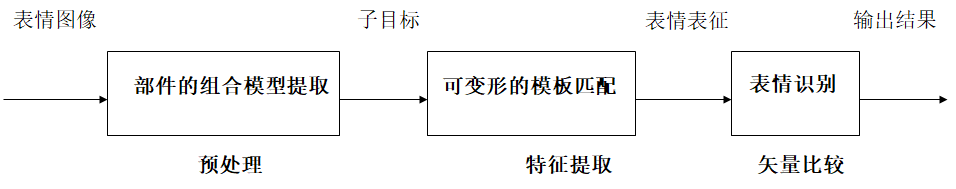

# 复习

:star:重点 :star2:重要

|                                                              | :star:重点 | :star2:重要 |
| ------------------------------------------------------------ | ---------- | ----------- |
| 人机系统`1`                                                  |            | o概念       |
| 人机交互 VS 人机界面                                         |            | o           |
| 发展历史                                                     |            | o           |
| 趋势                                                         |            | o           |
| 人的认知`2`                                                  | o          |             |
| 影响因素                                                     | o          | o           |
| Norman 认知划分                                              | o          |             |
| Norman 执行和评估模型(7个点，优缺点)                         | o          |             |
| 概念模型的概念                                               | o          | o           |
| 基于活动概念模型（4种）                                      | o          |             |
| Norman 行为模型`2.5`                                         | o          |             |
| goms计算模式（数字不一样，按过程写不能少，每年都考）         | o          | o           |
| 人机交互界面模型组成 `2-58`                                  |            | o           |
| 考5个模型                                                    |            |             |
| 人机系统界面`3`                                              |            |             |
| 输入输出设备 （送分）                                        |            |             |
| WIMP 界面中的重要组成                                        |            |             |
| VR概念 AR概念 名称解释                                       | o          |             |
| VR三特点，例子                                               |            |             |
| 设计流程，对象建模分析`4-47` （主要结合web网站，次要是结合手机网站）UML | o          | o           |
| 抽象设计（三个页面，首页）                                   |            |             |
| 视图关联设计 (变成Web购物流程)                               |            |             |
| 原则，移动界面设计`4-106` 稍微结合一下                       |            | o           |
| 遵守原则`4-108` 结合                                         |            |             |
| 数据交互概念`5.1`                                            |            |             |
| 常见输入输出设备                                             |            |             |
| 精确交互非精确交互`5-8`                                      |            |             |
| 语言识别`6`                                                  |            | o           |
| 语言合成 `6-40`                                              |            | o           |
| 语音识别分类                                                 |            |             |
| 孤立与连续识别系统`6-14`                                     | o          |             |
| 语言合成发展方向`6-53`                                       |            |             |
| 图像交互特点`7-3`                                            | o          | o           |
| 图像识别 3内涵                                               |            |             |
| 人脸识别过程`7-12`                                           |            |             |
| 手写识别 概念 `7-46`                                         |            | o           |

## 人机交互

人机系统 指“人”与他所对应的“物”共处于同一时间及空间时所构成的系统

- 人：在所研究的系统中参与系统过程的人
- 机：泛指一切与人处于同一系统中并与人交换着信息、物质和能量的、供人使用的物
- 环境：“人”、“机”共处的、对“人”和“机”有直接或间接影响的周围外部条件

### 人机交互与人机界面

**人机交互** 是指用户与计算机系统之间的通信，它是人与计算机之间各种符号和动作的双向信息交换。这里的“交互”定义为**一种通信**，即**信息交换**，而且是一种双向的信息交换，可由人向计算机输入信息，也可由计算机向使用者反馈信息

**人机界面** 是指人类用户与计算机系统之间的通信媒体或手段，它是人机双向信息交换的支持软件和硬件。这里“界面”定义为**通信的媒体或手段**，它的物化体现是有关的**支持软件和硬件**，如带有鼠标的图形显示终端。

人机交互是通过一定的人机界面来实现的，在界面开发过程中，有时把它们作为同义词使用

### 人机交互的发展历史

1. 命令行界面 CLI
2. 图形用户界面 GUI，也称WIMP界面
3. 多通道人机界面 MMI

发展趋势

- 在未来计算机系统中，强调”以人为本“，”自然、和谐“的交互方式，以实现人机高效合作
- 新一代人机交互技术的发展将主要围绕**集成化、网络化、智能化、标准化**展开

人机交互技术

- 集成化
  - 多样性、多通道交互
  - 多样化
    - 桌面与非桌面，可见和不可见，二维与三维输入，直接间接操作
  - 多通道
    - 交互手段
- 网络化
  - 无线互联网、移动通信网的快速发展，对人机交互技术提出了新的要求, 无处不在的人机交互。
  - 新一代的人机交互技术需要考虑在不同设备、不同网络、不同平台之间的无缝过渡和扩展，支持人们通过跨地域的网络在世界上任何地方用多种简单的自然方式进行人机交互，而且包括支持多个用户之间以协作的方式进行交互。
- 智能化
  - 非精确的信息交流
  - 人机之间的交互像人与人交互一样自然、方便
- 标准化
  - 目前，在人机交互领域，ISO已正式发布了许多的国际标准，以指导产品设计、测试和可用性评估等

## 感知、认识和模型

### 认识影响因素

- 情感
  - 情感因素会影响人的感知和认知能力。如积极的情感会使人的思考更有创造性、解决复杂问题的能力更强，而消极的情感使人的思考更加片面，还会影响其他方面的感知和认知能力。
- 人的个性差异
  - 个性差异可能是长期的，如性别、体力和智力水平；也可能是短期的，如压力和情感因素对人的影响；还可能是随时间变化的，如人的年龄等。

### Norman把认知划分为两个模式

- 经验认知：有效、轻松地观察、操作和响应周围的事件，它要求具备某些专门知识并达到一定的熟练程度，如使用Word字处理系统编辑文档等。
- 思维认知：涉及思考、比较和决策，是发明创造的来源，如设计创作等。
- 认知是人们在进行日常活动时发生于头脑中的事情，它涉及认知处理，如思维、记忆、学习、幻想、决策、看、读、写和交谈等。

### 概念模型及对概念模型的认知

- 概念模型：指的是一种用户能够理解的系统描述，它使用一组集成的构思和概念，描述系统做什么、如何运作、外观如何等

概念模型可以分为两大类：

- 基于活动的概念模型
  - 最常见的活动类型有：指示、对话、操作与导航以及探索与浏览。 
    - 指示：用户通过指示系统应做什么来完成自己的任务，如用户可向某个系统发出指示，要求打 印文件等
    - 对话：是一个**双向**的通信过程，其系统更像是一个交互伙伴，而不仅仅是执行命令的机器，如 电话银行，订票，搜索引擎和援助系统
    - 操作与导航：利用用户在现实世界中积累的知识来操作对象或穿越某个虚拟空间，如可以通过 移动、选择、打开、关闭、缩放等方式来操作虚拟对象
    - 探索与浏览：使用媒体去发掘和浏览信息。网页和电子商务网站都是基于这个概念模型的应用；
- 基于对象的概念模型

### Norman的执行-评估循环模型

在这个模型中，Norman将人机交互过程分为**执行**和**评估**两个阶段，通常由以下七个步骤构成

- 建立目标
- 形成意图
- 动作描述
- 执行动作
- 理解系统状态
- 解释系统状态
- 根据目标和意图评估系统状态 

##### Norman贡献与问题

行为循环和评估的上下文问题

- 运行鸿沟：用户意图与允许的行为之间的不匹配 

- 评估鸿沟：系统表示与用户期望之间的不匹配

缺点：由于它完全以用户为中心，对于计算机系统而言仅仅考虑到系统的界面部分，因此是一个不完整的模型

### GOMS预测模型

泛指整个GOMS模型体系，有四种版本的GOMS模型

- GOMS模型适用于研究和预测用户执行情况的不同方面，如**执行任务的时间、执行任务的策略**等
- 这些模型主要用于**预测用户的执行属性**，从而可选择或设计不同的应用软件和设备

GOMS代表

- 目标Goals  用户要达到什么目的
- 操作Operators  为了达到目标而使用的**认知过程和物理行为**
- 方法Methods  是为了达到目标而采用的**具体步骤**
- 选择规则Selection Rules  用于**选择具体方法**，适用于任务的某个阶段存在**多种方法选择**的情形

#### 优缺点

- GOMS可以用于**预测**专家级用户如何使用一个系统，因而可避免对用户进行可用性测试
- 但GOMS方法很难(有时甚至不可能)预测**普通用户**使用系统(尤其是使用方式非常灵活的系统)执行任务的情况。
- GOMS能够定量地预测用户执行情况，因而对不同的界面或系统能进行**比较分析**，而且相对容易，有助于确定新产品的有效性 
- 只适合分析数据录入类型的计算机任务，而且也只能预测专家级用户的执行情况，无法分析出错的情形

#### GOMS模型描述在微软的Word中删除文本的过程

- **目标**：删除Word中的文本
- 方法1 使用菜单删除文本
- 方法2 使用“删除”键删除文本
- 上述方法的**操作过程**如下：
-  点击鼠标——移动光标——选择菜单——把光标移至操作对象处——按键 
- 在决定应采用何种方法后，**选择规则**如下
- ① 若需要删除大量文本，则使用鼠标，通过菜单进行删除(方法1)；
- ② 若只是删除个别词，则使用“删除”键进行删除(方法2) 

#### 击键层次模型 Keystroke Level Model（大题）

用户执行情况进程量化预测的模型。可以通过比较实用不同的策略完成任务的时间来确定最优的方案

- 下面是Card等人总结出的一组估计时间。
- K=0.2 s，按单个键或者按钮；
- P=1.1 s，使用鼠标或者其他设备指向屏幕的某一点
- H=0.4 s，手在键盘或者其他设备上的复位时间，如手移到鼠标上的时间或者又移到键盘上的时间 
- M=1.35 s，准备做下一步操作的时间，即决策时间；
- R，用户必须等待的计算机响应用户输入的时间。

根据上面的估计时间，可以**预测执行某项任务的时间**，即列出操作的顺序，累计每一项的时间。

图2.7所示的是邮件申请对话框,如果要在姓名对话框里输入Tom,操作过程的顺序和时间如下

- 决策时间(M) 1.35 s
- 伸手到鼠标(H) 0.4 s
- 使用鼠标指向姓名后的文本框(P) 1.1 s
- 鼠标在文本框里点击(K) 0.2 s
- 手移到键盘(H) 0.4 s
- 准备输入姓名的决策时间(M) 1.35 s
- 输入字母T(K) 0.2 s
- 输入字母o(K) 0.2 s
- 输入字母m (K) 0.2 s
- 预测时间为5.4 s。 

### 人机界面模型

人机界面模型主要有:**任务分析模型、对话控制模型、结构模型和面向对象模型等**

- **任务分析模型**基于所要求的系统功能进行**用户和系统活动**的描述和分析
- **对话控制模型**用于描述人机交互过程的**时间和逻辑序列**，即描述人机交互过程的**动态行为的过程** 
- **结构模型**从交互系统软件结构观点来描述**人机界面的构成部件**，它把人机交互中的各因素，如提示符、错误信息、光标移动、用户输入、确认、图形、文本等有机地组织起来
- **面向对象模型**是为支持直接操纵的图形用户界面而发展起来的，**它可以把人机界面中的显示和交互组合成一体作为一个基本对象**，也可以把显示和交互分离为两类对象，建立起相应的面向对象模型

## 人机系统交互界面的构架

### WIMP 界面中的重要组成

- Window 窗口
- Icon 图标
- Menu 菜单
- Pointing Device 指点设备 能够进行这种任务的输入设备。在屏幕上展现给用户的是由输入设备控制的光标

### 虚拟现实

虚拟现实（Virtual Reality，VR/AR）就是借助于计算机技术及硬件设备，建立高度真实感的虚拟环境，使人们通过视觉、听觉、触觉、味觉、嗅觉等感官在其中看、听、触、闻起来像真实的，以产生身临其境的感觉的一种技术

重要特点：:star:

- 沉浸感 immersion
- 交互性 interaction
- 构想性 imagination：构想性强调虚拟现实技术应具有广阔的可想像空间，可拓宽人类认知范围，不仅可再现真实存在的环境，也可以随意构想客观不存在的甚至是不可能发生的环境

### 增强现实技术

增强现实（Augmented Reality，简称AR），是一种实时地计算摄影机影像的位置及角度并加上相应图像的技术，这种技术的目标是在屏幕上把虚拟世界套在现实世界并进行互动。这种技术由1990年提出。随着随身电子产品运算能力的提升，增强现实的用途将会越来越广

定义：把原本在现实世界的一定时间空间范围内很难体验到的实体信息(视觉信息,声音,味道,触觉等),通过科学技术模拟仿真后再叠加到现实世界被人类感官所感知,从而达到超越现实的感官体验,这种技术叫做增强现实技术,简称AR技术

特点：

- 虚实结合
- 实时互动
- 三维定向

例子，虚拟试衣间，AR游戏，AR导航地图

## 设计流程

对象建模分析

视图抽象设计

3页 首页，商品详细，订单信息

视图关联设计

## 五 数据交互

数据交互：人通过输入数据的方式与计算机进行交流的一种方式，是人机交互的重要内容与方式。

### 数据交互设备

输入交互方式分为两类：

- 精确交互方式，一种交互技术来完全说明人机交互目的的交互方式，系统可以精确确定用户的输入。如鼠标、键盘、触摸屏幕、定位器和光笔等。
- 非精确交互方式。是指用户利用不能精确输入的交互方式，如使用话音，姿势、头部追踪、凝视等方式输入。

常见输入输出设备

## 六 语音交互

**语音识别 **是将音频数据转化成文本或其他形式的计算机可以处理的信息的技术。它的研究目的是让机器“听懂”人类的语言

**语音合成** 是通过计算机把数字信息变成语音输出，语音识别和语音合成是语音处理的互逆过程。

### 语言识别系统的分类

- 语音识别系统根据对说话人说话方式的要求，分为孤立语音识别系统和连续语音识别系统
- 根据说话人的依赖程度，分为特定人语音识别系统和非特定人语音识别系统
- 根据词汇量的大小，分为小词汇量、中等词汇量、大词汇量及无限词语音识别系统。

### 孤立语音和连续语音识别系统

在语音识别系统中，按照语音输入方式，要求说话直以单字、单词或是短语为发音单位，发音期间必须有明显的短暂停顿，否则识别会有问题

- 孤立语音识别系统：以单字或单词为单位的识别系统。孤立语音识别系统可以识别有限词汇表中的分离的词和短语，完全依靠声学模型，并不涉及机器的语法及语义分析，用户只能用预先定义好的命令。
- 连续语音识别系统：利用连续发语音词表中相关联的几个单字或单词，识别之前对连续语音进行切分，最后给出连续发音的识别结果。连续语音识别需要用到词与词之间的连接信息

### 语音合成的未来发展方向（B卷）

1. 提高语音合成的自然度，达到更加流利和自然的程度。
2. 丰富合成语音的表现力，使得TTS技术可以实现各种音色(包括不同性别、不同年龄等)的语音输出。
3. 解决中文与其它语种混读问题。
4. 实现多语种的语音合成，即实现方言、少数民族语言的合成技术。
5. 降低语音合成技术的复杂度，减少音库容量，扩大应用领域。
6. 情感语音合成技术。

## 七 图像交互

### 图像交互特点

图像交互的条件是计算机有视觉感知能力，目前人们研究的机器视觉系统分为三个层次：

- 图像处理。是最低级的层次，图像处理主要对图像进行各种加工以改善视觉效果，是一个从图像到图像的过程，输入输出的都是图像，
- 图像识别。是较高级的层次，主要对图像中感兴趣的目标进行监测和测量，以获得他们的客观信息从而建立对图像的描述。图像识别是一个从图像到数据的过程。根据从图像抽取的统计特性或结构信息， 把图像分成给定的类别。
- 图像感知。是机器视觉系统的最高层次，这个层次需要智能推理能力。在图像识别的基础上，得出对图像内容含义的理解以及对原来客观场景的解释，从而指导和规划行动。

#### 图像识别

图像识别主要研究的是目标图像特征提取和分类。

方法：统计方法（KL算法、隐马尔可夫(HMM)），句法模式识别方法，神经网络

### 人脸识别过程

人脸检测 -> 面部特征点定位 -> 特征提取 -> 分类器

### 手绘图形的识别

手绘图形的识别是指借助鼠标、笔式输入器以及触摸屏等设备用手自由地绘制出各种图形，计算机通过对这些图形的识别、理解获得执行某种任务所需要的信息的方法。

## 行为交互

 8.1 表情识别过程 图 

1. 进行人脸面部图像的分析，建立人脸部件的组合模型，提取子目标图像
2. 根据部件的形状分析，建立部件的可变形的模板
3. 根据匹配分析，采用能量优化的方法，经过模板匹配提取目标特征，得到人脸表情的表征矢量，与中性的表情矢量进行比较，达到识别表情的目的。

