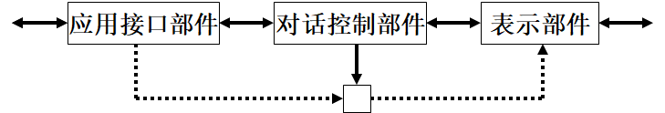
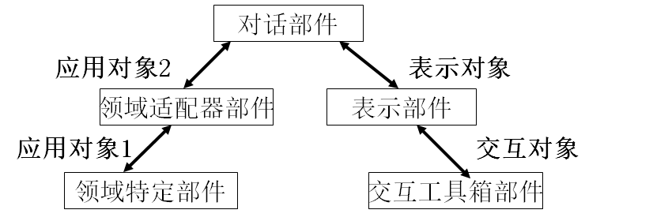
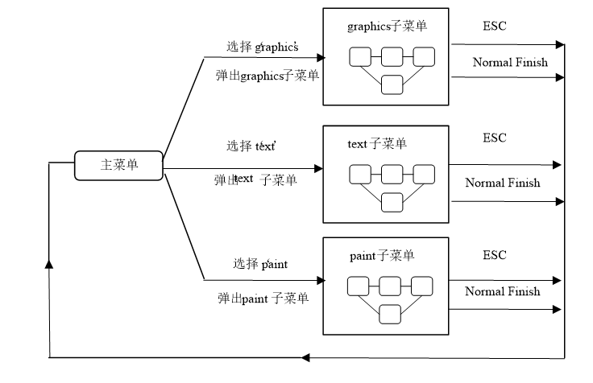

# 感知、认知和模型

## 人的感知

## 认知过程与交互设计原则

## 概念模型及对概念模型的认知

## 分布式认知

## 人机交互模型

**人机交互模型**是对人机交互系统中的**交互机制**进行描述的结构概念模型

目前已提出多种模型，如**用户模型**、**交互模型、人机界面模型、行为模型、评价模型**等

这些模型**从不同的角度**描述了交互过程中人和机器的特点及其交互活动

人机交互模型是开发一个实用人机交互系统的基础

### 行为模型

#### Norman的执行-评估循环模型

一个较早提出一个有一定影响的模型

在这个模型中，Norman将人机交互过程分为**执行**和**评估**两个阶段，通常由以下七个步骤构成

- 建立目标
- 形成意图
- 动作描述
- 执行动作
- 理解系统状态
- 解释系统状态
- 根据目标和意图评估系统状态 

##### 贡献与问题

行为循环和评估的上下文问题

运行鸿沟：用户意图与允许的行为之间的不匹配 

评估鸿沟：系统表示与用户期望之间的不匹配

由于它完全以用户为中心，对于计算机系统而言仅仅考虑到系统的界面部分，因此是一个不完整的模型

#### 修正Norman模型

同时反映交互系统中用户和系统的特征

将交互分为：系统、用户、输入和输出

#### GOMS预测模型

- 目标Goals
- 操作Operators
- 方法Methods
- 选择规则Selection Rules

GOMS可以用于**预测**专家级用户如何使用一个系统，因而可避免对用户进行可用性测试

但GOMS方法很难(有时甚至不可能)预测**普通用户**使用系统(尤其是使用方式非常灵活的系统)执行任务的情况。

GOMS能够定量地预测用户执行情况，因而对不同的界面或系统能进行**比较分析**，而且相对容易，有助于确定新产品的有效性 

只适合分析数据录入类型的计算机任务，而且也只能预测专家级用户的执行情况，无法分析出错的情形

#### 击键层次模型 Keystroke Level Model

用户执行情况进程量化预测的模型。可以通过比较实用不同的策略完成任务的时间来确定最优的方案

### LOTOS (Language Of Temporal Ordering Specification)

T1 ||| T2 (交替Interleaving)

T1 [] T2 (选择)

T1 | [a1,...,an] |T2 （同步Synchronization）

T1 [>T2]（禁止Deactivation）

T1 >> T2 （允许Enabling）

### UAN(User Action Notion)

用户行为标注是一种简单的符号语言，着眼于用户和界面两个交互实体的描述，主要描述用户的行为序列以及在执行任务时所用的界面

标志主要：用户动作标识符和条件选择标识符

## 人机界面模型

- 人机界面模型是**人机界面软件**的**程序框架**，它从理论上和总体上描述了用户和计算机的交互活动
- 随着人机界面功能的增长，人机界面的设计也变得复杂，交互式应用系统中界面代码占70%以上
- 人机界面模型主要有:**任务分析模型、对话控制模型、结构模型和面向对象模型等**
- **任务分析模型**基于所要求的系统功能进行**用户和系统活动**的描述和分析
- **对话控制模型**用于描述人机交互过程的**时间和逻辑序列**，即描述人机交互过程的**动态行为的过程** 
- **结构模型**从交互系统软件结构观点来描述**人机界面的构成部件**，它把人机交互中的各因素，如提示符、错误信息、光标移动、用户输入、确认、图形、文本等有机地组织起来
- **面向对象模型**是为支持直接操纵的图形用户界面而发展起来的，**它可以把人机界面中的显示和交互组合成一体作为一个基本对象**，也可以把显示和交互分离为两类对象，建立起相应的面向对象模型

### 结构模型

#### Seeheim模型

Seeheim模型界面结构清晰，适合界面与应用分别执行，得到较广泛的应用。该模型的三个逻辑部分都有不同的功能和不同的描述方法。

- 表示部件是人机接口的物理层
- 对话控制部件是人机接口的主要部件
- 应用接口部件是应用程序功能的一种表示
- 在界面设计时，这三个部分可对应于词法、语法及语义的三个语言层次

Seeheim模型已广泛用于用户界面软件的设计中，适合界面与应用程序分别执行的场合，不支持直接操作的语法与语义的要求，因此对于直接操作的图形用户界面不适用

#### Arch模型

1. 交互工具箱部件：实现与终端用户的物理交互。

2. 表示部件：协调对话部件和交互工具箱部件之间的通讯。

3. 对话部件：负责任务排队。

4. 领域适配器部件：协调对话部件和领域特定部件之间的通讯。

5. 领域特定部件：控制、操作及检索与领域有关的数据。

上图显示了部件之间传输的对象类型。

在领域特定部件中，应用对象1采用的数据及操作所提供的功能与用户界面并无直接的联系

在领域适配器部件，应用对象2采用的数据及操作所提供的功能与用户界面有关。

表示对象是控制用户交互的虚拟交互对象，含有为用户显示的数据以及用户产生的事件。

交互对象用来实现与用户交互有关的物理介质的方法。

在Arch模型中，可以对各个部件的功能进行不同的定义。对于提供快速图形输出及复杂的语义反馈具有一定的局限性

结构化用户界面模型都基于对话独立性原则，交互系统的设计大体分为两部分：**对话部件和计算部件**

提供较强的语义反馈，是结构化的界面模型支持直接操作图形用户界面的一个关键所在

### 状态转换网络STN

基本思想：定义一个具有一定数量的状态的转换机，称之为有限状态机（FSM），FSM从外部世界中接收到事件，并能使FSM从一个状态转换到另一个状态

最基本的状态转换网络

- 状态转换网络（State Diagrams）
- 扩展状态转换网络（State Charts）

