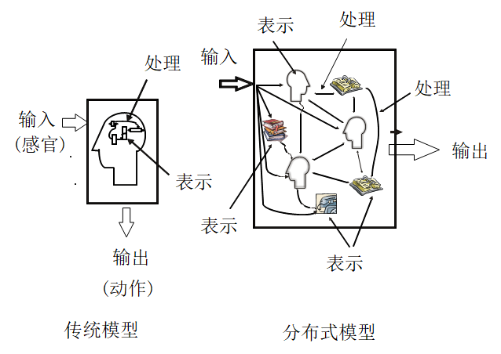
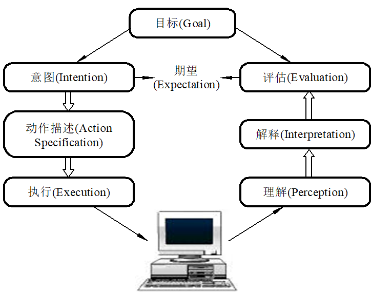
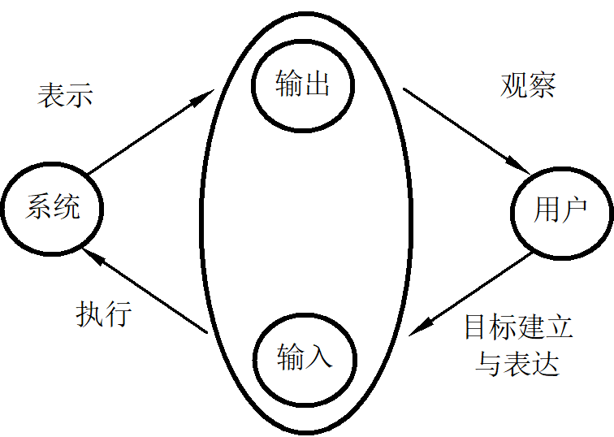
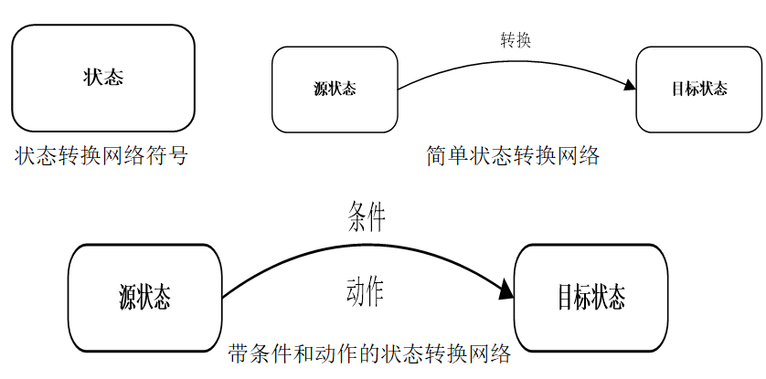

# 感知、认知和模型

## 人的感知

- 视觉
- 听觉
- 触觉

## 认知过程与交互设计原则

- 认知是人们在进行日常活动时发生于头脑中的事情，它涉及认知处理
- Norman把认知划分为两个模式
  - 经验认知：有效、轻松地观察、操作和响应周围的事件，它要求具备某些专门知识并达到一定的熟练程度，如使用Word字处理系统编辑文档
  - 思维认知：涉及思考、比较和决策，是发明创造的来源，如设计创作等

### 常见认知过程

- 感知和识别
- 注意
- 记忆
- 问题解决
- 语言处理

### 影响认知的因素

- 感情
- 人的个性差异

## 概念模型及对概念模型的认知

概念模型：指的是一种用户能够理解的系统描述，它使用一组集成的构思和概念，描述系统做什么、如何运作、外观如何等

设计概念模型的关键过程应包括如下两个阶段

- 了解用户在执行日常任务时做什么
- 选择交互方式，是主动式的提问方式，还是被动式的填表进行检索方式。并决定采用何种交互形式
  - 有关交互方式的决策：更高层次的抽象，它关心的是要支持的用户活动的本质
  - 有关交互形式的决策：关心的是特殊的界面类型

概念模型设计的两种方法

- 根据用户的需要和其他需求去规划产品，了解用户在执行日常任务时做些什么。决定哪一种交互方式能最好地支持用户的实际需要,提出一些实际可行的方案
- 是选择一个**界面比拟**,**比拟**是指用熟悉的或者容易理解的知识去解释不熟悉的、难以理解的问题

### 概念模型可以分为两大类:star:

- 基于活动的概念模型
- 基于对象的概念模型

#### 活动类型的概念模型:star:

最常见的活动类型有

- 指示
  - **指示类模型**描述的是用户通过指示系统应做什么来完成自己的任务
  - 好处是支持快速、有效的交互。因此，**特别适合于重复性的活动**，用于操作多个对象
- 对话
  - **对话类型**的概念模型是基于“人与系统对话”这一模式设计的
  - “对话”是一个**双向**的通信过程，其系统更像是一个交互伙伴，而不仅仅是执行命令的机器
  - 最适用于那些用户需要**查找特定类型**的信息，或者**希望讨论问题**的应用
  - 好处是允许人们(尤其是新手)以一种自己熟悉的方式与系统交互
  - 但“对话”式的概念模型可能发生“答非所问”的误会
- 操作与导航
  - 利用用户在现实世界中积累的知识来操作对象或穿越某个虚拟空间
  - 也可以使用这些活动的扩展方式，即现实世界中不可能的方式来操作对象或穿越虚拟空间
- 探索与浏览
  - 思想是使用媒体去发掘和浏览信息. 网页和电子商务网站都是基于这个概念模型的应用
  - **以上各种类型的活动并不是相互排斥的，它们可以并存**
  - 在**对话**的同时也可以发出**指示**，在**浏览**的同时也可以**定位环境**
  - **探索与浏览**类型用于系统为用户提供结构化的信息，并允许用户**自己摸索和学习新的东西，而不必向系统发问的场合**

### 对象类型的概念模型

是基于**对象**或人造物(如工具、书本或车辆)的模型

这一类模型要更为具体，侧重于特定对象在特定环境中的使用方式，通常是对**物理世界的模拟**

基于对象的概念模型有 “**界面比拟**”和“**交互范型**”

- 界面比拟 是指采用“比拟”的方法将**交互界面的概念模型**与某个(或某些)**物理实体**之间存在着的某些方面的相似性体现在交互界面设计中
  - “界面比拟”将人们的习惯或**熟知的事物**同交互界面中的**新概念**结合起来
  - “桌面”和 “电子表格”既可以归类为基于对象的概念模型，同时也是界面比拟的例子
  - “搜索引擎”是另一个界面比拟的例子
- 交互范型(Interaction Paradigm)指的是我们在构思交互设计时的某种主导思想或思考方式
  - 交互设计领域的主要交互范型就是开发桌面应用——面向监视器、键盘和鼠标的单用户使用等
  - 随着无线、移动技术和手提设备的出现，已开发出各种新的交互范型。这些交互范型已经“超越桌面”

### 对概念模型的认知

一个系统能够做到让用户感到满意，除了在设计开始阶段建立一个好的概念模型以外，还应该考虑如何根据人的认知特点，提供多种手段，使用户能尽快理解关于系统外观及行为即概念模型的构思，这是一个非常基本的问题

### 三个相互联系的概念模型

- **设计模型**——设计师设想的模型，说明系统如何运作。
- **系统映像**——系统实际上如何运作。
- **用户模型**——用户如何理解系统的运作

### 几种认知概念框架

从人们不同的认知特点，讨论用户如何理解系统概念模型

- 思维模型
  - 用户思维模型：人们在学习和使用系统的过程中，积累了有关如何使用系统的知识，而且在一定程度上，也积累了有关系统如何工作的知识
  - 在认知心理学中，思维模型被认为是外部世界的某些因素在人脑中的反映，掌握和运用思维模型使得人们能够进行推测和推理。思维模型牵涉到两个过程—“构建”和“运用”过程，人们既可能进行有意识的思维处理，也可能进行无意识的思维处理
  - 正确的思维模型的建立
    - 在理想情况下，用户开发的思维模型应与设计人员开发的概念模型相符，如何帮助用户达到这个目标是一个非常关键的问题
- 信息处理模型
  - 人们把大脑视为一个信息处理机，信息通过一系列有序的处理阶段进、出大脑。在这些阶段中，大脑需要对思维表示
  - 输入或刺激 --> 编码 --> 比较 --> 响应选择 --> 响应执行 -->输出或响应
  - 局限
    - 日益被人们认同的是在认知发生的上下文中研究、分析认知过程。主要目标是分析环境中的结构如何帮助人类认知，并减轻认知负担
- 外部认知模型
  - 外部认知是要解释人们在与不同外部表示相交互时涉及的认知过程。其主要目的是要详细说明在不同的认知活动、认知过程中使用不同表示的好处
    - 将信息、知识表面化以减轻记忆负担
    - 设计有利于人的信息表示及处理工具，减轻计算负担
    - 标注和认知追踪

### 基于外部认知特点的交互式界面设计原则

使用基于外部认知的方法进行交互设计时，总体原则是要在界面上提供外部表示，以减轻用户的记忆和计算负担。为此，设计人员需要开发不同类型的可视化信息，以便用户解决某个问题，扩充和增强认知能力

- 信息和可视化技术，可用于表示大量的数据，同时允许用户从不同的角度进行交叉比较。
- 设计良好的GUI也能大大减轻用户的记忆负担，用户能够依赖外部表示提供的线索，与系统进行交互

## 分布式认知

分布式认知法描述的是认知系统中发生了什么，它通常描述人员之间的交互，人们使用的物品及工作环境

分布式认知的主要目的是要从信息传播媒介的角度来描述交互。也就是说，它考虑的是信息如何表示，信息在流经不同个人以及使用不同物体时是如何重新表示的。这类信息的转变也称为“表示状态的转变”

在进行分布式认知分析时，通常需要考查：

- 分布式问题的解决方法，包括协议解决方式
- 语言及非语言行为的任务，包括说了什么、眼神和眨眼等暗示什么、什么是没有说出来的
- 使用的各种协调机制，如规则、规程
- 协作活动在进行过程中将用到的各种通信路径
- 如何共享和访问信息

## 人机交互模型

- **人机交互模型**是对人机交互系统中的**交互机制**进行描述的结构概念模型
- 目前已提出多种模型，如**用户模型**、**交互模型、人机界面模型、行为模型、评价模型**等

- 这些模型**从不同的角度**描述了交互过程中人和机器的特点及其交互活动

- 人机交互模型是开发一个实用人机交互系统的基础

### 行为模型

#### Norman的执行-评估循环模型

一个较早提出一个有一定影响的模型

在这个模型中，Norman将人机交互过程分为**执行**和**评估**两个阶段，通常由以下七个步骤构成

- 建立目标
- 形成意图
- 动作描述
- 执行动作
- 理解系统状态
- 解释系统状态
- 根据目标和意图评估系统状态 

##### Norman贡献与问题

行为循环和评估的上下文问题

- 运行鸿沟：用户意图与允许的行为之间的不匹配 

- 评估鸿沟：系统表示与用户期望之间的不匹配

由于它完全以用户为中心，对于计算机系统而言仅仅考虑到系统的界面部分，因此是一个不完整的模型

#### 修正Norman模型

同时反映交互系统中用户和系统的特征

将交互分为：系统、用户、输入和输出

交互过程表现在信息在这四个部分之间的流动和对信息描述方式的转换上，这个模型较好地反映交互的一般特征

- 其中**输入**和**输出**一起形成人机界面(又称人机接口或用户界面) 
- 在人机交互框架模型中，每一个部分都有其自己的**描述语言**，这些语言分别从各自的角度表达了应用领域的概念。
- **系统**语言称为核心语言，核心语言描述**应用领域的计算特征**；**用户**语言或称为任务语言，则描述领域中的**与用户意图表达相关的属性**

一个交互周期中有四个阶段：目标建立、执行、表示和观察

每一个阶段对应着从一种描述语言到另一种描述语言的翻译过程

一个交互周期以用户的目标建立阶段开始 

1. 用户以用户语言的形式在头脑中形成一个能导致该目标的**任务**，并将任务翻译成机器可以识别的“输入语言”

2. 在执行阶段，“输入语言”被翻译成能被系统直接执行的一系列操作，即“核心语言” 
3. 在**表示阶段**，处于新状态下的系统将系统的当前值以“**输出语言**”的形式呈现出来。呈现出来的形式也是多种多样的，如字符、图形图像、语音等 
4. 在观察阶段，用户观察输出，将输出翻译为用用户能够理解的“用户语言”表达的交互结果，与原目标进行比较和评价。

**在**这四个阶段中，前两个阶段**负责对用户意图的理解。用户的意图越容易表达，则计算机理解用户意图往往就越困难。** 

为了使界面的表示更加宜人化，系统可根据所保存的用户行为模型、用户的经验模型以及用户意图(上下文)，提供相应的各具特色的人机交互界

#### GOMS预测模型

泛指整个GOMS模型体系，有四种版本的GOMS模型

- GOMS模型适用于研究和预测用户执行情况的不同方面，如**执行任务的时间、执行任务的策略**等
- 这些模型主要用于**预测用户的执行属性**，从而可选择或设计不同的应用软件和设备

GOMS代表

- 目标Goals  用户要达到什么目的
- 操作Operators  为了达到目标而使用的**认知过程和物理行为**
- 方法Methods  是为了达到目标而采用的**具体步骤**
- 选择规则Selection Rules  用于**选择具体方法**，适用于任务的某个阶段存在**多种方法选择**的情形

##### 优缺点

- GOMS可以用于**预测**专家级用户如何使用一个系统，因而可避免对用户进行可用性测试
- 但GOMS方法很难(有时甚至不可能)预测**普通用户**使用系统(尤其是使用方式非常灵活的系统)执行任务的情况。
- GOMS能够定量地预测用户执行情况，因而对不同的界面或系统能进行**比较分析**，而且相对容易，有助于确定新产品的有效性 
- 只适合分析数据录入类型的计算机任务，而且也只能预测专家级用户的执行情况，无法分析出错的情形

GOMS模型描述在微软的Word中删除文本的过程

- **目标**：删除Word中的文本
- 方法1 使用菜单删除文本
- 方法2 使用“删除”键删除文本
- 上述方法的**操作过程**如下：
-  点击鼠标——移动光标——选择菜单——把光标移至操作对象处——按键 
- 在决定应采用何种方法后，**选择规则**如下
- ① 若需要删除大量文本，则使用鼠标，通过菜单进行删除(方法1)；
- ② 若只是删除个别词，则使用“删除”键进行删除(方法2) 

#### 击键层次模型 Keystroke Level Model

用户执行情况进程量化预测的模型。可以通过比较实用不同的策略完成任务的时间来确定最优的方案

- 下面是Card等人总结出的一组估计时间。
- K=0.2 s，按单个键或者按钮；
- P=1.1 s，使用鼠标或者其他设备指向屏幕的某一点
- H=0.4 s，手在键盘或者其他设备上的复位时间，如手移到鼠标上的时间或者又移到键盘上的时间 
- M=1.35 s，准备做下一步操作的时间，即决策时间；
- R，用户必须等待的计算机响应用户输入的时间。

根据上面的估计时间，可以**预测执行某项任务的时间**，即列出操作的顺序，累计每一项的时间。

图2.7所示的是邮件申请对话框,如果要在姓名对话框里输入Tom,操作过程的顺序和时间如下

- 决策时间(M) 1.35 s
- 伸手到鼠标(H) 0.4 s
- 使用鼠标指向姓名后的文本框(P) 1.1 s
- 鼠标在文本框里点击(K) 0.2 s
- 手移到键盘(H) 0.4 s
- 准备输入姓名的决策时间(M) 1.35 s
- 输入字母T(K) 0.2 s
- 输入字母o(K) 0.2 s
- 输入字母m (K) 0.2 s
- 预测时间为5.4 s。 

### LOTOS (Language Of Temporal Ordering Specification)

时序关系说明语言是一种作为国际标准的形式描述语言，它提供了一种通用的形式语义，可保证描述不存在二义性，便于分析和一致性测试理论的研究

- T1 ||| T2 (交替Interleaving)

- T1 [] T2 (选择)

- T1 | [a1,...,an] |T2 （同步Synchronization）

- T1 [>T2]（禁止Deactivation）

- T1 >> T2 （允许Enabling）

### UAN(User Action Notion)

用户行为标注是一种简单的符号语言，着眼于用户和界面两个交互实体的描述，主要描述用户的行为序列以及在执行任务时所用的界面

标志主要：

- 用户动作标识符
  - 在UAN的表示模型中有一些常用的已经预定义的符号，用来表示常见的用户界面的交互动作
- 条件选择标识符
  - 除了表示动作的符号，UAN模型还包含表示条件及选择的标识符
    - **while**(condition) TASK  当条件condition为真时，循环执行任务TASK；
    - **if**(condition) **then** TASK 如果条件condition满足，则执行任务TASK；
    - **iteration** A* or A+  表示迭代操作；
    - **waiting**  表示等待，可以等待一个条件满足，也可以等待任务中的一个操作执行

## 人机界面模型

- 人机界面模型是**人机界面软件**的**程序框架**，它从理论上和总体上描述了用户和计算机的交互活动
- 随着人机界面功能的增长，人机界面的设计也变得复杂，交互式应用系统中界面代码占70%以上
- 人机界面模型主要有:**任务分析模型、对话控制模型、结构模型和面向对象模型等**
- **任务分析模型**基于所要求的系统功能进行**用户和系统活动**的描述和分析
- **对话控制模型**用于描述人机交互过程的**时间和逻辑序列**，即描述人机交互过程的**动态行为的过程** 
- **结构模型**从交互系统软件结构观点来描述**人机界面的构成部件**，它把人机交互中的各因素，如提示符、错误信息、光标移动、用户输入、确认、图形、文本等有机地组织起来
- **面向对象模型**是为支持直接操纵的图形用户界面而发展起来的，**它可以把人机界面中的显示和交互组合成一体作为一个基本对象**，也可以把显示和交互分离为两类对象，建立起相应的面向对象模型

### 结构模型

#### Seeheim模型

Seeheim模型界面结构清晰，适合界面与应用分别执行，得到较广泛的应用。该模型的三个逻辑部分都有不同的功能和不同的描述方法。

- 表示部件是人机接口的物理层
- 对话控制部件是人机接口的主要部件
- 应用接口部件是应用程序功能的一种表示
- 在界面设计时，这三个部分可对应于词法、语法及语义的三个语言层次

Seeheim模型已广泛用于用户界面软件的设计中，适合界面与应用程序分别执行的场合，不支持直接操作的语法与语义的要求，因此对于直接操作的图形用户界面不适用

#### Arch模型

1. 交互工具箱部件：实现与终端用户的物理交互。

2. 表示部件：协调对话部件和交互工具箱部件之间的通讯。

3. 对话部件：负责任务排队。

4. 领域适配器部件：协调对话部件和领域特定部件之间的通讯。

5. 领域特定部件：控制、操作及检索与领域有关的数据。

上图显示了部件之间传输的对象类型。

- 在领域特定部件中，应用对象1采用的数据及操作所提供的功能与用户界面并无直接的联系

- 在领域适配器部件，应用对象2采用的数据及操作所提供的功能与用户界面有关。

- **表示对象**是控制用户交互的虚拟交互对象，含有为用户显示的数据以及用户产生的事件。
- **交互对象**用来实现与用户交互有关的物理介质的方法。

在Arch模型中，可以对各个部件的功能进行不同的定义。对于提供快速图形输出及复杂的语义反馈具有一定的局限性

结构化用户界面模型都基于对话独立性原则，交互系统的设计大体分为两部分：**对话部件和计算部件**

提供较强的语义反馈，是结构化的界面模型支持直接操作图形用户界面的一个关键所在

形式化语言的描述――产生式规则：

- *if condition then action*
- *condition* *→* *action*
- *condition**：**action*

一般来说，组成界面描述的产生式规则很多，规则定义的顺序并不重要，只要与规则中的条件相匹配，就可以激活相应的动作。产生式规则系统可以是事件引导的，也可以是状态引导的，或者两者都有

### 状态转换网络STN

基本思想：定义一个具有一定数量的状态的转换机，称之为有限状态机（FSM），FSM从外部世界中接收到事件，并能使FSM从一个状态转换到另一个状态

最基本的状态转换网络

- 状态转换网络（State Diagrams）
- 扩展状态转换网络（State Charts）

