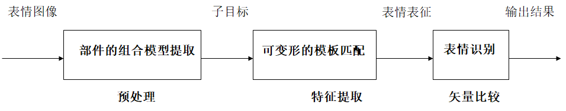
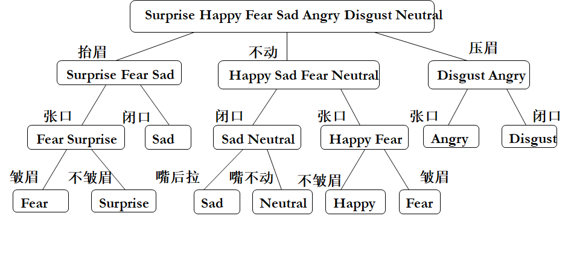
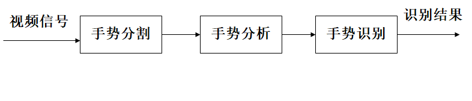

# 行为交互

## 行为交互的特点

人们在相互交流过程中除了使用语音交互外，还常借助身体语言，即通过身体的姿态和动作表达意思，这就是人体行为交互。人体行为交互方法不仅能够加强语言的表达能力，有时还能起到语言交互不能起到的作用，如时装表演、舞台小品表演等

人机行为交互是计算机通过定位和识别人类，跟踪人类肢体运动，跟踪表情特征，从而理解人类的动作和行为，并作出响应的技术

行为交互带来全新的交互方式，计算机通过用户行为能够预测用户想要做什么来满足用户的需要

## 人体行为识别

- 智能识别监控
- 老人监护
- 监控医疗
- 体感游戏
- 步态识别
- 不良行为检测
- 军事演习
- 身份认证
- 智能家居
- 自然人机交互

### 数据获取方式

基于视频，基于传感器

### 一般过程

### 行为特征提取

人的身体模型一般分为与棍棒模型、轮廓模型和体模型，根据这些模型，身体的各部分能被近似成线、二维带状和三维体状。身体的运动可以用身体各部分的运动速度或运动角速度或关节点的运动轨迹来描述

#### 人体结构的运动分析

- 有基于先验模型
  - 首先把每帧图像匹配到一个模型上
- 不基于先验模型
  - 主要依靠前后帧之间的特征的预测和估计

差异主要体现在特征匹配阶段。特征如位置、速度、形状、纹理和颜色。这两种方法也可以组合起来进行不同层次上的处理

提取二维运动信息

- 特征匹配
  - 通过标志性的特征在时间序列的连续匹配来恢复物体的运动参数，特征匹配方法首先在图像中提取感兴趣的特征点，然后在不同时间的图像上跟踪特征点，得到特征点的序列位置，从而得到运动信息
- 光流
  - 通过计算所有像素点的在序列上的位移来恢复运动矢量场

### 人的行为识别

人的行为识别主要有两种：状态空间和模板匹配

状态空间方法首先把每一个静态姿势定义成一个状态，这些状态之间通过一定的概率联系在一起，因此一个运动序列可以被认为是不同静态姿势的各种状态的组合，然后利用联合概率作为行为归纳的判别准则，此法的缺点是没有封闭解，需要非线性优化，计算量较大。

模板匹配是通过把动态序列图像转换成静态的形状模式，然后把它与预先给定的模板进行匹配以确认人的行为的方法，此法的优点是计算量小，但对时域变化非常敏感。

#### 识别模型

支持向量机，K近邻，隐形马尔科夫，随机森林，决策树，朴素贝叶斯，神经网络

## 视线跟踪技术

### 视线运动的特点

视线所指通常反映用户感兴趣的对象，视线运动通常表现为点到点的跳跃式扫描，它有三种主要形式：跳动、注视和平滑尾随跟踪。视线表现为在被观察目标上一系列的停留以及在这停留点之间的飞速跳动

#### 以硬件为基础的视线跟踪

基本工作原理是利用图像处理技术使用能锁定眼睛的特殊摄影机，通过摄入从人的眼角膜和瞳孔反射的红外线连续地记录视线变化，从而达到纪录分析视线跟踪过程的目的

视线跟踪装置有强迫式和非强迫式、穿戴式和非穿戴式、接触式和非接触式之分。精度从0.1 。至1。或2 。不等，以硬件为基础的方法需要用户戴上特制的头盔、特殊的隐形眼镜，或者使用头部固定支架、置于用户头顶的摄像机等，对用户的干扰很大

#### 以软件为基础的视线跟踪

基本工作原理是先利用摄像机获取人眼或脸部图像，然后用软件实现图像中人脸和人眼的定位与跟踪，从而估算用户在屏幕上的注视位置。人的注视方向可以用头的方位和眼睛的方位两种方式来表示。

以头的方位标示注视方向的前提是假设用户的眼球不发生转动或转动角度极小、观察不同方位的目标是通过头部转动来实现的。

以眼睛的方位代表注视方向则是一种由人眼的图像来推测用户在计算机屏幕上注视点的方法，它把人眼图像输入跟踪系统来推断眼睛在计算机屏幕上的注视位置。

#### 视线跟踪技术的应用及局限性

视线跟踪技术在人机交互中的重要应用是代替传统的指点设备鼠标。最近典型的研究是智能视觉控制系统，用户可以用眼睛来执行一定操作，界面与WIMP类似，包括窗口、图标、菜单条以及指针，文件夹和文件分别用红色和蓝色的图标表示，绿色的圆点表示用户当前视点，与WIMP下的鼠标指针等同，带有黄色边框的图标表示用户实际注视的对象。用户结合控制键可完成选择（文件或文件夹）、关闭（窗口）、打开（文件夹）、菜单选样和目标移动五种操作

将视线应用于人机交互必须克服“米达斯接触（Midas Touch）”问题，即用户希望随便看着什么并不必非“意味着”什么，

通常情况下这两种情况一般不可区分。可行的解决方法是结合实际的应用场合采取特殊的措施研制相应的交互技术，例如，采用其他通道（语音或键盘）进行配合就是相当有效的方法。

视线在人机交互中应用的精髓不在于用来独立地利用其指点功能，而是与其他通道相结合提供空间的或其他的约束信息，即使视线跟踪系统的精度很高，在界面设计中单纯依靠视觉信息进行交互的可靠性仍较低

## 面部表情识别

面部表情在人的自然交流过程中扮演一个重要角色因此在自然的人机交互中计算机应具有识别人的表情的功能。计算机可根据用户的表情进行相应的功能调整。

表情识别过程是：

1. 进行人脸面部图像的分析
2. 建立人脸部件的组合模型
3. 提取子目标图像
4. 根据部件的形状分析
5. 建立部件的可变形模板

根据匹配分析，采用能量优化的方法，经过模板匹配提取目标特征，得到人脸表情的表征矢量，与中性的表情矢量进行比较，达到识别表情的目的。

### 面部表情的特点

对面部表情的研究有两种不同的研究结果

- 对情绪的维度分析
- 对情绪的分类

#### 维度分析

多数的维度分析把情绪确定为三维。18世纪，冯特提出情绪三维度量：愉快-不愉快，激动-平静，紧张-轻松。施洛斯伯提出愉快-不愉快，注意-拒绝，唤醒水平这三个维量。此外还有更多维的如控制维、强度维和简单-复杂维等。

有人对情绪进行分类。汤姆金列出八种基本情绪：兴趣、快乐、惊奇、痛苦、恐惧、愤怒、羞怯和轻蔑。伊扎德在此基础上增加了厌恶和内疚两种情绪。艾克曼定义了六种最基本表情：惊奇、恐惧、厌恶、愤怒、高兴和悲伤，以及33种不同的表情倾向。

表情识别过程

面部表情识别

表情是情绪的外在表现。情绪是历史的、现在的、社会的和个体的等诸多方面的综合产物，因此表情变化细致入微、扑朔迷离。为了使计算机在毫无知识经验的状态下完成对表情的分析与识别，可进行以下处理：

- 以简单、单纯的表情为基础，只考虑单一特点的表情
- 忽略复杂的表象，抓住、抽取表情最本质的特点和共性，把复杂问题简单化处理
- 提取计算机图像处理最可能识别的特征作为识别的依据

特征选取的依据是：尽可能携带人脸面部表情特征；尽可能容易提取；信息相对稳定，受光照变化小。表情识别中的特征提取是基于组成部件的识别，确定组成部件的位置和大小信息

面部表情的特征参数。选择表情识别的特征矢量由六个特征参数组成X=（x1,x2,x3,x4,x5,x6）

## 手势交互

手势交互是一种典型的行为交互，以手势体现人的意图是一个非常自然的方式。以人手直接作为计算机的输入设备时人机间的通信将不再需要中间媒体，用户可以简单定义一种适当手势对周围的机器进行控制。

### 手势定义与分类

手势是人手或者手和手臂相结合所产生的各种姿势和动作

- 静态手势（姿态，单个手形）
  - 静态手势对应空间里的一个点
- 动态手势（动作，由一系列姿态组成）
  - 动态手势对应着模型参数空间里的一条轨迹，需要使用随时间变化的空间特征来表述

手势和姿势的主要区别在于，姿势更强调手和身体的形态和状态，而手势更强调手的运动。

#### 手势分类

- 交互性手势与操作性手势
- 自主性手势和非自主性手势
- 离心手势和向心手势

在实际的手势识别系统中通常需要对手势做适当分割、假设和约束。有如下约束：

- 如果整个手处于运动状态，那么手指的运动和状态就不重要
- 如果手势主要由各手指之间的相对运动构成，那么手就应该处于静止状态

### 手势识别系统

目前研究的手势识别系统主要分为基于数据手套的和基于视觉的手势识别系统两类

#### 数据手套

数据手套是虚拟现实系统中广泛使用的传感设备。用户通过数据手套可与虚拟世界进行各种交互操作，如做出各种手势向系统发出命令。用户可通过一只与数据手套对应的在计算机屏幕上显示的虚拟手成为虚拟世界的一员。基于数据手套的手势识别严格地说并不能算作一种真正的“手势识别”。传统的交互设备（如鼠标等）也可认为是一些手势输入设备。基于数据手套手势输入的优点是输入数据量小，速度高，能直接获得手在空间的三维信息和手指的运动信息，可识别的手势种类多且能够进行实时识别。

#### 基于视觉的手势识别

利用摄像机输入手势，优点是不干扰用户，目前采用的手势识别技术主要有以下几方面：

- 模板匹配技术。这是最简单的识别技术，它将传感器输入的原始数据与预先存储的模板进行匹配，通过测量二者之间的相似度来完成识别任务。
- 统计分析技术。这是通过统计样本特征向量来确定分类器的一种基于概率的分类方法。在模式识别中一般采用贝叶斯极大似然理论确定分类函数，该技术的缺点是要求人们从原始数据中提取特定的特征向量，而不能直接对原始数据进行识别
- 神经网络技术。这是一种较新的模式识别技术。具有自组织和自学习能力，具有分布性特点，能有效抗噪声和处理不完整的模式，具有模式推广能力。
- 深度相机。可分割出手型的二值图像（手型轮廓），进而通过轮廓特征进行手势及动作识别

1. 通过一个或多个摄像机获取视频数据流
2. 系统根据手势输入的交互模型检测数据流里是否有手势出现，如有则把该手势从视频信号中分割出来
3. 选择手势模型进行手势分析，分析过程包括特征检测和模型参数估计，识别阶段根据模型参数对手势进行分类并根据需要生成手势描述
4. 系统根据生成的描述去驱动具体应用