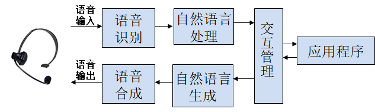
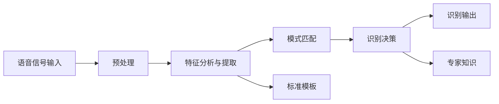
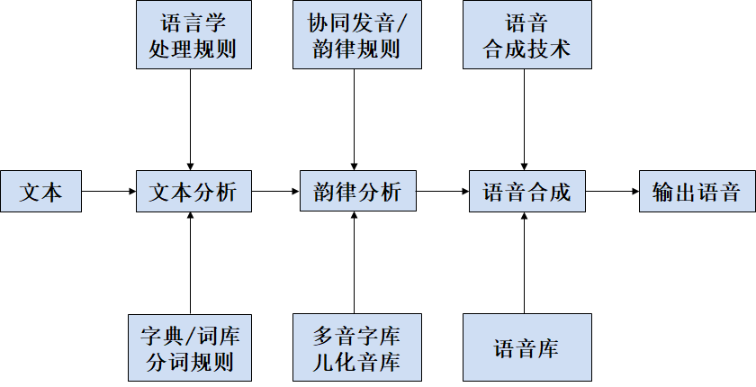
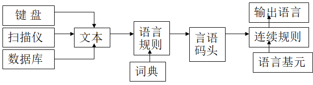

# 语音交互

## 语音交互的特点

语音交互是研究人们如何通过自然的语音或机器合成的语音同计算机进行交互的技术。它是一个多学科交叉的边缘学科，需要语言学、心理学、工程和计算机技术等领域的专业知识，不仅要对语音识别和语音合成技术进行研究，还要对人在语音通道下的交互机理、行为方式等进行研究。

语音交互系统一般采取两种途径

- 用基于语音识别和理解技术的主要依靠音频进行交互的系统。音频包括语音和声音，语音特指人的话音，而声音指除去语音的其他声音，如音乐、铃声等。使用这种方式，人们可以通过语音和声音与计算机进行交互。
- 利用语音技术与系统的其他交互形式（通常是图形交互界面）结合在一起来进行交互的系统。这种方式中语音不再占主导地位，它只是交互系统的一部分。

语音在人机交互过程中的特点

- 语音的高效性。语音是一种高效的交流媒体，包含着丰富的信息，而且语言基本上是人思维的反应。人在使用键盘进行文本输入时，与手指击键输出所想到的词语的同时，用户还会对他的话语和措辞做进一步的琢磨。在对话中，用户在想法的产生和对其进行阐述的过程中，会有更多的参与。
- 自然性。语音与其他交流手段相比更加自然，并且其认知负荷比较低，不需要一直占据用户的注意力
- 灵活性。语音对物理空间的资源占用比较少，受工作空间的限制比较少，可以再空间狭小、照明不佳等不良条件下正常使用，因此适合在不能有效利用视觉通道传递信息的场合中采用。
- 动作与语音同时进行。人可以在进行肢体动作同时讲话，但不能在思考的同时讲话。因此，人们发现在操作计算机时可以在敲键盘和移动鼠标的同时进行思考，但却很难在说话的同时进行思考。语音可单独使用，也可结合鼠标、输入笔等指点式设备进行交互、完成目前WIMP界面中通常的操作任务
- 敏感性。人们对声音信号比较敏感，利用声音进行提示和报警是常用的方法，在信息随机呈现并要求操作员立即采取行动的任务中也非常合适。
- 短暂性。语音信号一旦发出就不可在得到了，因此用户需要记住这些信息，要消耗用户大量的短时记忆资源，增加使用者的记忆负担。
- 信息呈现慢。语音在信息呈现方面很慢，且语音信息难于进行回溯和编辑处理，还会干扰其他的认知任务但是语音被证明在信息的前向处理上很有用，如在紧急环境下的报警为盲人和行动不便者提供输入和输出的途径。
- 使用效率高。语音使用效率较高，说话的表达方式比写字和打字速度快，但对于听众来说，听别人说话却比自己阅读要慢得多。与图形化用户界面相比，语音交互界面是串行的输出方式，速度较慢。因此，语音交互界面可以使用的场合一般是有系统提示引导的问答式交互，而且每一步可供选择的项目不太多或者是用户所熟悉的某一个领域。

综上，语音交互的优缺点如下：

- 优点：人类最习惯的交流方式；认知负荷小（不需要长期占用注意力）；资源占用少（空间和照明）；交互效率高（信息量大）
- 缺点：环境要求严（不能在噪声环境中）；信息的模糊性；非结构化；短暂性；记忆负荷大

## 语言识别

### 语言识别回顾

语音识别是将音频数据转化成文本或其他形式的计算机可以处理的信息的技术。它的研究目的是让机器“听懂”人类的语言

- 语音识别技术的研究从20世纪50年代开始。1952年，AT&T Bell实验室的Davis等人研制成功世界上第一个能识别英文字母发音的实验系统Audry系统。
- 20世纪60年代计算机的应用推动了语音识别的发展，重要成果有提出动态规划（DP）和线性预测分析技术（LP），后者能够很好解决语音信号产生模型的问题，对语音识别产生深远影响。
- 20世纪70年代，语音识别领域得到突破，理论上LP技术得到进一步发展，动态时间归正技术（DTW）基本成熟，特别提出了矢量量化（VQ）隐马尔科夫模型（HMM）；实践上实现了基于现行预测倒谱和DTW技术的特定人孤立语音识别系统。
- 20世纪80年代，HMM模型和人工神经元网络（ANN）在语音识别中成功应用。
- 进入20世纪90年代，多媒体时代的来临迫切要求语音识别系统从实验室走向应用。
- 之后，语音识别技术取得显著进步，开始从实验室走向市场。目前，语音识别技术将进入工业、家电、通信、汽车电子、医疗、家庭服务、消费电子产品等各个领域。 语音识别听写机在一些领域的应用被美国新闻界评为1997年计算机发展十件大事之一。 语音识别技术所涉及的领域包括：信号处理、模式识别、概率论和信息论、发声机理和听觉机理、人工智能等等 

我国语音识别技术的发展

- 孤立字大词汇量语音识别，92年清华大学电子工程系和中国电子器件公司合作研制成功的THED-919特定人语音识别与理解系统
- 连续语音识别，91年四川大学计算机中心实现了一个主题受限制的特定人连续英语-汉语语音翻译演示系统
- 非特定人语音识别方面， 清华大学计算机科学系在87年研制的声控电话查号系统

### 语言识别系统的分类

- 语音识别系统根据对说话人说话方式的要求，分为孤立语音识别系统和连续语音识别系统
- 根据说话人的依赖程度，分为特定人语音识别系统和非特定人语音识别系统
- 根据词汇量的大小，分为小词汇量、中等词汇量、大词汇量及无限词语音识别系统。

#### 孤立语音和连续语音识别系统

在语音识别系统中，按照语音输入方式，要求说话直以单字、单词或是短语为发音单位，发音期间必须有明显的短暂停顿，否则识别会有问题

- 孤立语音识别系统：以单字或单词为单位的识别系统。孤立语音识别系统可以识别有限词汇表中的分离的词和短语，完全依靠声学模型，并不涉及机器的语法及语义分析，用户只能用预先定义好的命令。
- 连续语音识别系统：利用连续发语音词表中相关联的几个单字或单词，识别之前对连续语音进行切分，最后给出连续发音的识别结果。连续语音识别需要用到词与词之间的连接信息

#### 大词汇量和小词汇量的语音识别系统

大词汇量和小词汇量的语音识别系统是根据能识别词汇量的多少来划分的。

- 能识别词汇量小于100个的称为小词汇量识别
- 大于100个的称为中等词汇量识别
- 大于1000个的称为大词汇量识别

#### 特定人和非特定人语音识别系统

特定人（Speaker Dependent,SD）语音识别系统需要用户完成一个建立特定个人语音档案的过程。在这个过程中，用户朗读一个由识别软件预先准备好的文本，识别软件根据用户朗读的信息建立一个符合用户声音和说话模式的语音模型。特定人识别软件缺乏灵活性、不能和其他人共享资源，系统只能识别训练者的声音；但该系统可靠性高，实现难度较低，识别率高

非特定人（Speaker Independent,SI ）语音识别系统针对多个用户的使用而设计，这种软件不需要经过用户进行个人语音库的建立过程，不必经使用者训练就可以识别各种发音者的语音。该系统应用方向是专用的、单任务系统，如查询或查阅系统；其所能够识别的词汇量还很小，但是却是语音识别技术的发展方向

#### 特定人和非特定人语音识别系统之间的研究差距

语音学差异。方言使得不同地方的说话人对同一句子的发音有很大不同，对语音识别系统造成严重影响

生理差异。不同说话人的声道形状、声门特性存在差别，会造成语音频谱特性不同

发音习惯与心理状态差异。这些习惯和心态会对说话的语音频谱特性造成影响，降低语音识别系统性能

#### 说话人之间的差异对非特定人语音识别系统造成的影响

当某一使用该系统的说话人用语音与训练语音库中的所有说话人的语音有较大差异时，对该使用者来说，语音系统的识别性能会严重恶化；

训练一个较好的识别系统需要采集数量很大的说话人的语音用于训练，让训练语音库覆盖更为广泛的语音空间，这样虽可降低差异的影响，但同时会造成识别系统参数分布较广而不是较为尖锐的分布，造成识别性能的普遍下降。

特定人识别系统虽可克服非特定人语音识别系统的缺点，但该系统需要使用者录入大量的语音用于训练，给使用者带来不便

说话人自适应（Speaker Adaptation）算法有效克服特定人和非特定人系统各自的缺点。该方案利用系统使用者少量的训练语音，调整系统参数，使得系统对于该使用者的性能有明显提高。与非特定人系统比较，SA系统的识别性能更优；与特定人系统比较，纳入了非特定人系统的先验信息，需要用户提供的训练音数量远少于没有自适应的识别系统，实用性更好。

“非特定人+自适应 ”是当前众多语音识别系统采用的使用框架

语音识别方法

基于声道模型和语音知识的方法，由于模型及语音知识过于复杂，现阶段没有达到实用阶段

### 语音识别过程

模式匹配方法的语音识别基本过程分为两步：

第一步，建立标准语音库（标准语音模板），系统首先建立有若干训练语句的标准语音数据库供训练者使用，即训练

第二步，将输入的语音信号经过处理后与标准语音模板相匹配，即识别，包括失真估计、识别决策和专家知识运用

建立语音模板的方法是根据语音识别系统的设计要求选择一种识别方法，然后从输入的语音信号中提取这种识别方法要求的语言特征参数，将这些特征参数存储起来形成语音模板、常用的模板匹配方法是概率统计方法，它将未知语音的特征参数与模板一一比较，根据失真测度最小的原则判断匹配结果。当决策失败，可运用专家知识做出判决。整个训练和识别过程如图：

语音识别由三个技术模块组成，即特征提取、模式匹配和标准模板库生成

这三大技术模块涉及的技术包括三个方面

- 语音识别单元的选择
- 特征数据类型的选择
- 模式匹配方法与模型训练技术

#### 语音识别单元的选择

一般先选择一个合适的语音识别的基本信息单元，然后再依据这个基本单元进行模板库训练和模式识别。

语音识别的单元选择有三种：

- 单词（句）单元
- 音节单元
- 音素单元

单词(句)单元是把要识别的词或句子作为一个语音单元，这是早期孤立词识别系统经常选择的基本单元。这种单元模式是以提高模板库存储容量和模式匹配复杂度为代价而获得性能优势的，因此在大词汇量语音识别系统中，这种单元选择会引起运算的组合爆炸而难于实时实现，且要求很大的模板库存储容量

音节识别单元是以一个发音音节为基本单元。音节单元多见于汉语语音识别，主要因为汉语是单音节结构语言，而英语是多音节语音。虽然汉语有着有限闭集的发音优势，但音节单元的选取会遇到音-字转换难题，汉语的一字多音现象给这种后续处理增加了难度。目前，我国基于汉语音节识别单元的汉语全音节语音识别系统取得了丰硕成果，中科院声学所的研究成果已经实用化。

音素识别单元是在西文识别中较常用的基本识别单元。西文在使用音素发音单元时有一定优势，但单元的缩小会引起发音不确定性带来的消极影响，但发音单元选择的缩小仍是由孤立词语音识别迈向连续语音识别的必由之路。近年来许多国内研究机构把声母+韵母的全部模板作为语音识别的基本单元，这样得到的单元模板数量有所增加，其识别性能可以与音节单元的系统媲美。

与语音识别基本单元选择密切相关的是语音识别单元的分割技术，即传统的端点检测技术。一般使用过零率和能量这两种语音信号的特征参数获得可靠的分割精度

#### 特征参数提取

语音识别是语音特征参数模式的比较和识别。语音特征参数的选取对于整个语音识别系统很重要，特征提取就是从语音信号中提取出对语音识别有用的信息。特征提取方式需要根据语音单元的特点提取。

语音特征参数要求：一是用最少的特征来表达原来的语音信号，可以获得最快的模式比较速度；二是语言特征参数最大限度不失真地表示出原来的语音信号。

常用的语音特征有：时域中的平均能量、平均过零率、频域中的整体频谱、前三个共振峰的频率值、带宽、幅值、DFT（离散傅里叶变换）频谱、倒谱和线性预测系数等。

#### 模型训练和模式匹配

模型训练是指按照一定准则，从大量已知模式中获取表征该模式本质特征的模型参数的过程；模式匹配是根据一定准则，使未知模式与模型库中的某一个模型获得最佳匹配的过程

#### 语音识别的后处理

语音信息处理需要在语音声学信号识别的基础上，利用语言学知识进一步纠正识别错误；还能提供一定的反馈信息给声学信号识别系统，帮助声学信号识别系统提高识别性能。语言信息处理的研究方法有：

- 借助统计方法的语料库语言学信息处理技术
- 借助于语法分析的语言信息处理技术。

基于语料库语言学的统计方法在语音识别后处理中多采用n元文法统计模式，本质是让计算机的统计知识代替人对语言的实际知识。基于语料库的统计方法的理论依据是概率理论中的大数定理。语料库语料的性质和时效对语料统计结果的差异是根本性的，如新闻语料的统计结果并不适合于科技文章的处理。

基于文法的语法分析方法进行语音识别的后处理，由于使用对象不同，在语音识别领域除了用在中小规模的系统中以外，目前还没有很成功的系统实现。统计文法知识包括词法、句法、语义甚至语用知识等，一是目前还没有成功的知识表示方法；二是作为一种自然语言比较困难实现在计算机中集成一个具有相当程度语法知识的专家系统。

基于语料库的统计方法，把文法的所有知识归结到单一的转移概率矩阵中，这与丰富多彩的语言表达能力不相称，同时设计文法的计算机专家系统也很难于完成。如何协调二者是当前语言信息处理研究人员的重要课题。

## 语音识别方法

目前有代表性的语音识别方法有：

- 模式匹配法，主要代表是动态规划方法（Dynamic Programming，DP），也叫动态时间规整（Dynamic Time Warping，DTW）
- 统计概率模型方法，主要代表是隐马尔科夫模型（Hidden Markov Model，HMM），
- 人工神经网络方法（Artifical Neural Nerwork，ANN），是一种类似人类的独特学习处理方法。

### 动态时间规整技术

在特征比较时用DTW手段对准是一种非常有力的措施，对提高系统的识别精度非常有效。 DTW是一个典型的最优化问题，用满足一定条件的DTW函数w(n)来描述输入模板和参考模板的时间对应关系，求解两模板匹配时累计距离最小所对应的规整函数。

DTW技术是时间规整和距离测度算法结合起来的一种非线性动态规划技术，它把向量长度成比例线性缩放的概念扩展到以线性缩放曲线为中心的规定区域内的非线性缩放。它的识别性能过分依赖端点检测结果的正确性，因此在语音识别单元较小的识别系统中性能不好。 DTW算法原理简单、易于实现，在孤立语音识别中性能良好，被广泛应用。

### 隐马尔科夫模型

隐马尔科夫模型采用概率统计方法描述时变信号的模型。HMM不是以训练语音序列与标准语音序列之间的概率/度量来进行语音识别的，而是通过计算语音序列是某个语言模型产生的概率大小来进行语音识别的。

HMM方法中，语音序列被看做是马尔科夫随机过程的输出，描述了马尔科夫随机过程所对应的语音序列。这种用马尔科夫随机过程对语音序列进行建模从而进行语音识别的方法称为HMM方法

一个HMM由若干个状态组成，状态之间由状态转移概率连接，每个HMM都具有两个概率：状态转移概率和输出概率

一个HMM包括：状态集合{S}；状态转移概率矩阵（aij）， aij表示从状态Si转移到状态Sj的概率；输出概率矩阵（bj(k)）, bj(k)表示当处于状态Sj时，输出符号k的概率。

HMM描述语音过程成功的原因：

- 各状态驻留时间可变，解决了语音时变问题
- 模型参数通过大量训练数据进行统计运算得到，既可用作特定人语音识别，也可用于不特定人语音识别，只要将大量不同人的多次发音用作训练数据即可。

### 人工神经网络

人工神经网络（ANN）用于语音识别是近年来兴起的研究热点。由于ANN结构特性具有模拟人脑听觉机能的特点，使ANN具有完成复杂模式识别的能力，为很好解决语音识别这样一个复杂模式分类问题提供了新途径。

ANN语音识别方法在提取了语音特征参数之后，不是输入模式与标准模式的比较匹配，而是将标准模式设定为神经网络的输出，针对所有可能的输入模式，自动调整网络的连接权。神经网络最终稳定的输出点就代表了输入模式对应的分类（即期望的标准模式）。

采用ANN技术进行语音识别包含两部分过程：网络学习过程，语音识别过程。

- 网络学习过程是将已知语音学习信号作为学习样本，通过神经网络的自学习最终得到一组连接权和偏置，即构造神经网络的过程；
- 语音识别过程是将待测语音信号作为网络输入，通过网络的联想得出识别结果。这两个过程的关键是求取语音特征参数和神经网络学习

三种语音识别技术比较：

- DTW方法优点是保留语音序列的时序信息，识别算法简单有效缺点是动态规划法计算量较大，不能进行动态训练，只能采用多套样本。一般用于中小字表、特定人或孤立词的语音识别系统中
- HMM方法的特点是便于建立各种层次的语音识别基元（音素、音划、字、词组合句子）的语音模型，容易综合各种不同性质的参数信息，适合于非特定人、大字表、连续语音的识别。缺点是建模本身存在不完善性，对于语音信号的时序反映能力较低等。
- ANN技术在语音识别中主要用来完成分类工作，多用于小字表的分类识别。对于复杂的识别问题（大字表、非特定人）神经网络方法普遍存在收敛缓慢、局部最优和推广能力差的缺点。

说话人识别

说话人辨认，说话人确认/检测，切分和聚类

说话人探测是指对一段包含多个说话人的语音，要正确标注在这段语音中说话人切换的时刻

## 语音合成

语音合成是通过计算机把数字信息变成语音输出，语音识别和语音合成是语音处理的互逆过程。

语音合成的实现途径：一种是先将原始语言信号存储在机器中需要时再重现语音信号，该法本质是一个声音还原过程，不能控制声调、语调，也不能根据所讲内容来变音、转调或改变语气等，且由于存储容量限制，合成的句子有限；另一种是让机器像人类一样说话，模拟人的语言功能，完成从内容到声音的实现过程。

### 语音合成的发展

孤立词/音段阶段，注重音色(音质,音品)

- 语音合成的最早研究始于1779年Kratzen sten的研究．他用一些材料制成具有各种特殊形状的共鸣腔， 目的是研究如何用管形器官模型来模拟5个单元音 A、E 、 I、0、U
- 1791年，Von Kempelen制成了一种能说话的机器
- 1939年, BELL LAB的H.Dudley应用共振峰原理制作了第一个电子合成器VODER(VOice DEmonstratoR).
- 20世纪70年代,线性预测技术用于语音合成

语句阶段，注重韵律

- 1980年,MIT的D.Klatt设计制造了著名的共振峰语音合成器
- 1986年,E.Moulines和F.Charpentier提出了基于时域波形修改的语音合成算法PSOLA
- 2000s，Unit-selection，N. Campbell & A. Black

### 语音合成过程

### 语音生成主要方法

- 规则合成

  - 按韵律规则,缩减规则等,将预先存好的语音单元拼接起来.需要对文本理解,有些复杂

- 参数合成

  1. 共振峰合成(Pitch Synchronous OverLap Add)

  2. LPC（线性预测编码）合成

  3. 其它如LSP和LMA合成

- 波形拼接

  - PSOLA（基音同步叠加）合成

目前的研究主要是按规则的文本-语音转换，即将某种语言的书面语言转换为口头语言，使计算机能够朗读文章。典型的文本语音转换系统如图6.9所示。

现有语音合成方法：波形编辑方式；参数编辑方式。

### 参数合成法

早期的研究主要采用参数合成方法，它是计算发音器官的参数，从而对人的发音进行直接模拟。如著名的Klatt的共振峰合成系统。后来又产生了基于LPC、LSP等声学参数的合成系统。

这些方法用来建立声学模型的过程为：首先录制声音，这些声音涵盖了人发音过程中所有可能出现的读音；提取出这些声音的声学参数，并整合成一个完整的音库。在发音过程中，首先根据需要发的音，从音库中选择合适的声学参数，然后根据韵律模型中得到的韵律参数，通过合成算法产生语音。

参数合成方法的优点，是其音库一般较小，并且整个系统能适应的韵律特征的范围较宽，但其合成语音的音质却往往受到一定的限制。

### 语音合成的未来发展方向

1. 提高语音合成的自然度，达到更加流利和自然的程度。
2. 丰富合成语音的表现力，使得TTS技术可以实现各种音色(包括不同性别、不同年龄等)的语音输出。
3. 解决中文与其它语种混读问题。
4. 实现多语种的语音合成，即实现方言、少数民族语言的合成技术。
5. 降低语音合成技术的复杂度，减少音库容量，扩大应用领域。
6. 情感语音合成技术。