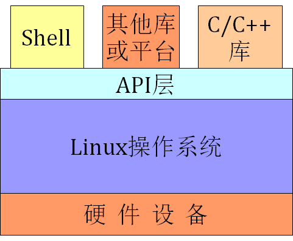
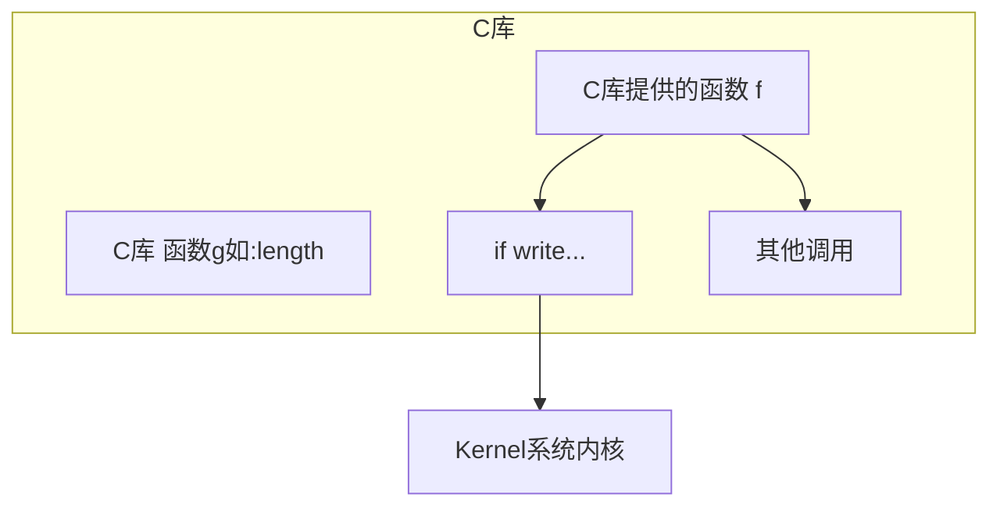

# 介绍

研究方向：

- 操作系统
- 非已失内存应用（掉电之后不会消失，保证数据完整性）
- 分布式计算（RDMA）

技术背景：

- 熟悉Windows内核程序设计
- Windos API/MFC/ATL/WTL应用开发
- Linux API，网络应用程序，内核模块开发

希望学生掌握：

- API开发
- 网络开发
- 内核开发

# 前言

## 教学目的

- 计算机网络普及，巨大的分部系统
- 单机程序弱化，应用云端
- 后台单机系统，集群，web分布
- Linux是后台系统首选

互联网络程序设计涉及到技术

- Web前台技术：html, css, javascript
- Web后台技术：JSP，PHP，Vue, Ruby
- 数据库技术：MySql，Oracle，Sybase，MongoDB
- 分布式处理函数式语言：erlang，scalar
- 底层的：基于操作系统API的socket编程技术

### 程序员角度看计算机系统



```
上层：应用开发工程师 使用各种库进行开发
API：应用开发工程师 基于API的程序开发
Linux：内核工程师 包括驱动、各类内核模块开发
硬件：硬件工程师 包括固件程序、微码的编写
```

**学习系统前从API开始，不要先学封装库**

网络编程：非阻塞

RDMA：（Remote Direct Memory Access，远程直接数据存取）由RDMA、DDP 、MPA3 种协议共间实现，构成了iWARP协议族

课程关注：API和上层

掌握:

- Linux提供的场景编程接口
- 加深对操作系统结构的理解
  - main函数有3个参数，2参数加1一个函数指针

- 系统编程编程方法，能举一反三，对其他系统学习奠定基础

不讨论内核讨论

按照现代程序设计思想，运用API

## 课程主要内容及安排

48学时: 32学时+16学时

参考教程

- UNIX环境高级编程
- Linux程序设计实践（针对封装库）

成绩构成

- 平时60%
  - 作业40%、半期20%、 实验40%
- 期末40%

主要内容：

- 文件系统
  - 文件、目录的操作方法，常用文件IO
    - Linux: open
    - windows: fopen

- 标准IO
  - 标准IO及流的概念、标准IO与文件IO区别、常用IO函数
- 进程
  - 进程概念、状态转换图、进程环境、控制方法等
- 信号
  - 信号处理方式，以及应用程序对信号的捕捉
- 线程
  - 线程本质，线程的创建方式，同步方式

## 学习方法

### 学习路线建议

学习困惑

- 漫无目的、缺乏指导，不知道该如何学习
  - 安全需要学习机器码

- 基本方法
  - 方向要明确
  - 要有步骤、有计划
  - 看书+实践

- 高度重视系统的学习
  - 并不是其他方面不重要
  - 想做好都不容易
  - 但是，道路之间切换难度不一样
- 高度重视C与C++语言学习
  - C和C++程序贴近机器、贴近操作系统，有利于学习研究高性能算法、应用程序
    - CAS x86通过总线加锁实现
    - C与C++可以实现垃圾回收
  - C++是多范式编程语言，有利于学习多种程序设计思想

### 书籍推荐

- 深入理解计算机系统（站在程序员角度）

- C学习

  - C陷阱与缺陷
  - C和指针（加强指针练习）

- 基本C++学习

  - Essential C++(早期版本)
  - Effective C++
  - More Effective C++
  - C++沉思录中面向对象的部分
  - 设计模式精解(早期版本)

-  深入C++学习

  - 深度搜索C++对象模型

- 模板学习（使用模板可以不看）

  - C++ Template: Complete Guide
  - Modern C++ Design（炫）

  **尽量用第三方库或标准库，不要自己编造**

- 模板库学习
  - C++标准程序库
  - Effective STL
  - STL原码剖析（找工作前看）
- C++学习收工
  - Exceptional C++
  - More Exceptional C++
  - C算法卷一、卷二（找工作前看)

**语言到一定程度 可以开始系统学习**

建议首先学习Windows操作系统

- Windows比Linux先进(内核结构，线程)
- 学习Windows能尽快熟悉先进的软件架构(各种架构库，天生的消息循环观察者)
  - 学MFC，学架构设计

#### windows 学习书籍推荐

- Windows API学习
  - Programming Windows 上下册
  - Windows核心编程
- MFC学习（架构学习)
  - MFC基本使用的学习
  - 深入浅出MFC
- COM学习（二进制兼容）
  - COM原理与应用
  - ATL Internals

#### Linux学习

- Linux系统操作
  - 鸟哥Linux私房菜：基础学习篇
  - 鸟哥Linux私房菜：服务器架设篇
- Linux系统API
  - Unix环境高级编程
  - Unix网络编程卷一、卷二
  - C++网络编程卷1、卷2
  - ACE程序员指南(网络公司开发需要学习)
- Linux内核学习
  - 一定要先学Linux设备驱动编程
  - 学习内核源代码(不建议看，要目标)
    - Linux内核完全剖析——基于0.12内核
    - 要有方向性

- 在Linux内存学习到一定程度，可以深入学习操作系统
  - 80X86汇编语言程序设计教程
  - 自己动手写操作系统(第二版orange's 一个操作系统实现)
- 可以选择学习Java、.NET平台

# Unix/Linux 标准化及实现

## Unix发展史

Unix诞生1969

ARPA计划

兼容分时系统CTSS

MULTICS计划

Fortran语言写游戏，GECOS system上运行，占用大

B语言添加Fortran编译器，又使用C

C语言高些全部Unix源程序，V5版

v6版：高级语言编写，少量程序修改移植平台

Berkely 发布 1 BSD的Unix OS

v7：提供工具，mark、shell。Berkely发布 2 BSD，包含vi等工具

## Linux 诞生

1991年，芬兰计算机大二学生Linus开发Linux

- Unix系统昂贵
- AST教授写了一个开源操作系统MINIX
- MINIX用于教学，功能不强
- GNU计划开发众多免费工具软件，如GUN C编译器

### 五大支柱

- UNIX操作系统

- MINIX操作系统

- GNU计划
  - (GNU's Not Unix)计划
  - 自由软件的完整系统

- POSIX标准
  - Portable Operating System Interface for Computing Systems
  - 保证程序在不同操作系统之间移植性
  - 为Linux的设计提供指导
  - Linux与许多Unix系统兼容

- Internet网络
  - 通过网络，全世界计算机爱好者参与编写

## 编程环境介绍

lrzsz（阿里云源的发送文件工具）

Ubuntu默认没有安装编译环境

```bash
$apt-get install build-essential
```

g++的基本使用

```bash
$g++ test.cpp #默认生成a.out
$g++ -o test test.cpp
$g++ -c test.cpp #生成目标文件test.o
$g++ -o test test.cpp -g #调试程序，默认-g2
$g++ -O -o test test.cpp #优化,-o2 -os，开发调试不使用优化，降低编译速度
#release版时才会尝试调用优化
$g++ -S test.cpp  #产生汇编代码test.s
$g++ -E test.cpp > my.txt  #只激活预处理，将结果保存在my.txt中
#先写测试代码，在写功能代码。
$g++ -I../gtest/include test.cpp #指定头文件路径
$g++ -L../gtest -lgtest test.cpp #指定库的路径
$g++ test.cpp –DOK=2   #设宏OK为2
$g++ test.cpp –DOK   #定义宏OK
```
再次编译时为什么会更快

```bash
$ls /root -la
     .cache
#程序编译在当前用户的.cache库里面建立了缓存
```

​	链接器（作用）：合并同名段，重定位

```bash
$gdb #调试
(gdb) break 14 #14行建立断点
(gdb) r #运行
(gdb) next #下一步
(gdb) disass #查看对应的汇编程序步骤
(gdb) step #单步
(gdb) quit #退出调试
```

### 系统调用

过去windows使用0x2e中断作为系统调用入口，Linux使用0x80号

.data 段保存静态的全局，静态局部（非零初始值）

示例1.2

```assembly
.data
	msg : .string "Hello World!\n"
	len = . - msg	#.表示本地

.text

.global main

main:

mov $4, %eax	#write syscall number
mov $1, %ebx	#fd
mov $msg, %ecx 	#buffer
mov $len, %edx	#length
int $0x80

mov $1, %eax	#exit syscall number
mov $5, %ebx	#exit code
int $0x80
```

```bash
$ld -o hello hello.o
ld:warning cannot find entry symblo _start; de...
```

```bash
$as -o hello.o hello.s	#汇编
$ld -o hello hello.o
$ ./hello
Hello World!
$echo $? #获取退出码
5
```

汇编调试

```bash
(gdb)disass _start #显示_start段
0x0000... 
0x0000... 
...
(gdb)b *0x000...
(gdb)r
(gdb)si #step
(gdb)ni #next
(gdb)info reg eax
(gdb)x /20xb 0x6000d2 #/20xb 看20个字节按十六进制显示 看地址
```

x86小端 高高低低：高地址放高位，低地址放地位

默认入口不是main，C库前面有初始化函数

- 现在仍然可以使用0x80
- 编译方法：需要安装nasm

```bash
$as -o hello.o hello.s

$ld -o hello hello.o
```

- 调试：gdb

  ndisass main //段名

  n找到地址后，b *addr

  nr; si; display /i $pc; x /nxb addr

- Intel提供了sysenter/sysexit指令，可以在long mode下运行，但是在AMD上这组指令无效。
- Intel不支持32位中使用syscall/sysret，但和AMD相同，在64位下支持
- 所以，为了兼容性，在64位下使用syscall/sysret

示例1.3

```assembly
.data
	msg : .string "Hello World!\n"
	len = . - msg

.text

.global _start

_start:

mov $1, %eax	#write syscall number eax非64位寄存器
mov $1, %rdi	#fd
mov $msg, %rsi	#buffer 
mov $len, %rdx	#length
syscall

mov $60, %eax	#exit syscall number
mov $5, %rdi	#exit code 5是用户定义的
syscall
```

main函数return 0

- 是将"0"或EXIT_SUCCESS，向外部环境报告程序运行圆满完成
- EXIT_FAILURE，向外部报告
- 其他值，由实现定义

```bash
$echo 
```

#### 内联汇编

示例1.4

```c++
int main()
{
	long ret = 0;
	int fd = 0;
	const char *buffer = "Hello World!\r\n";
	unsigned int size = 14;

	asm volatile("movl $4, %%eax \n\t"
				 "movl %1, %%ebx \n\t"
				 "movl %2, %%ecx \n\t"
				 "movl %3, %%edx \n\t"
				 "int $0x80	 \n\t"
				 "movl %%eax, %0 \n\t"
				 : "=m"(ret)
				 : "m"(fd), "m"(buffer), "m"(size)
				 : "%eax", "%ebx", "%ecx", "%edx", "memory");
	/* 冒号：语句体 
	第一冒号 输出
	第二冒号 %1，%2... 指代这里的对应的参数(fd)(buffer)...
	第三冒号 告诉编译器注意，动用了这些寄存器
	*/
	return 0;
}
```

```bash
$g++ test1_4.cpp
$./a.out
#没有输出
$g++ test1_4.cpp -m32 #按照32位进行编译 -m64可以编译成64位
#这一程序是基于32位的，64位编译不能正常运行
$./a.out
Hello World!
```

练习编一个debug版C库，运行时库

## 程序编译的过程

### 预处理阶段

直接和间接引用的头文件，全部递归引用

### 编译阶段

生成汇编代码

### 汇编阶段

生成.o 文件object，重定位的目标程序

### 链接阶段

同名文件合并，重定位

示例1.5

没有调用C库，没有运行时C的支持，用内联汇编方法让程序正常退出

```c
#define MAX 1

void _start()
{
    int i = MAX + 2;

    asm volatile("movl $60, %%eax \n\t"
                 "movq %0, %%rdi \n\t"
                 "syscall\n\t"
                 :
                 : "m"(i)
                 :);
    /*
    64位前7参数由寄存器之间传输，不需要压栈
    退出码3 (1+2)
    */
}
```

```bash
$cpp test.c > aaa #重定向这个文件到aaa
#打开aaa文件可以看见预处理内容，如：替换了MAX宏
$ls /usr/lib/gcc/x86_64-linux-gnu/ -l
$/usr/lib/gcc/x86_64-linux-gnu/7/cc1 aaa
#cc1plus是 c++编译器
#直接用cc1 编译器，处理预处理程序
#会生成aaa.s，上面这段代码会出现在#APP下面
#32位时+和-在优化之前代表 局部变量
$as -o aaa.o aaa.s	#用汇编编译器将汇编代码转换成object文件
$ld -o a.out aaa.o	#用链接器a是生成的课执行文件
$./a.out	#运行成功但没有返回值
$echo $?
3	#退出返回值

```

ELF文件 ELF文件头部信息有一个标识可以知道64位和32位，大端小端等。COFF等

Windows可以用PE代表可移植可执行

```c
#define MAX 1

void _start()
{
    int i = MAX + 2;
	i = main(); //这里的main函数在其他地方实现，让连接器连接
    asm volatile("movl $60, %%eax \n\t"
                 "movq %0, %%rdi \n\t"
                 "syscall\n\t"
                 :
                 : "m"(i)
                 :);
    /*
    64位前7参数由寄存器之间传输，不需要压栈
    退出码3
    */
}
```



