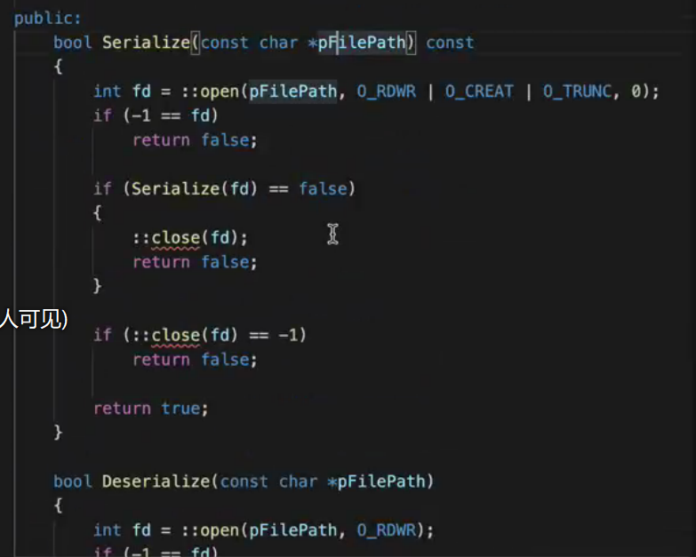
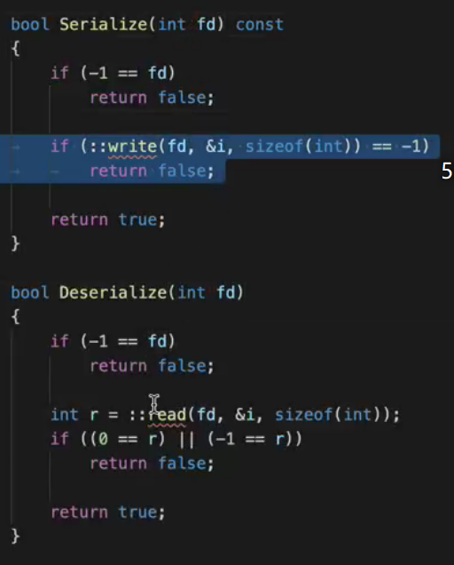
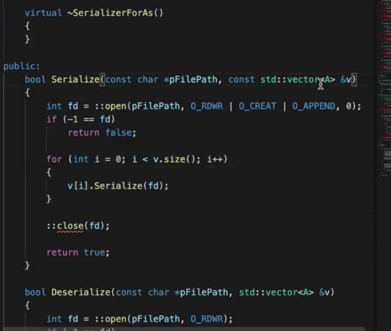
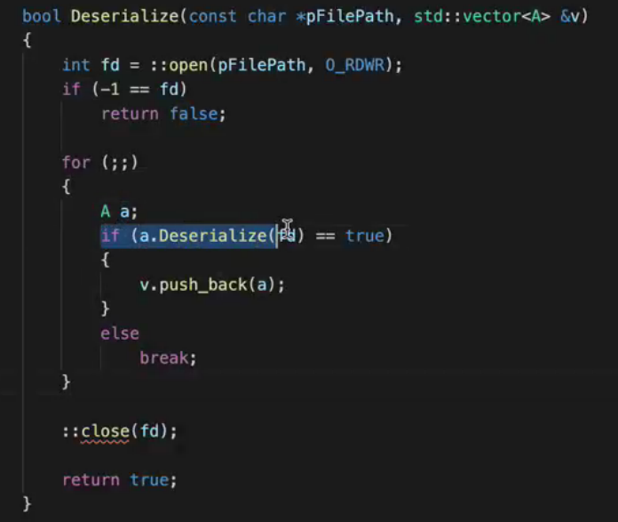
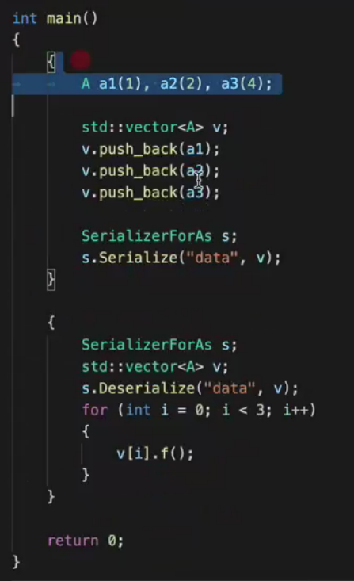

# 编程实验

## 对象序列化

### 序列化

将变量从内存中转换为可存储或可传输的形式的过程。在某些语境下，也被称为pickling或者flattening

#### 常见的序列化工具

XML （HTML是子集）

JSON

protobuf（Google）

pickle（python）

#### 概念区别

数据序列化 数据的存储高效性，不太好阅读 （protobuf, pickle)

数据结构化 XML和JSON也是数据结构化方式

v2 A类

v2 forAs

