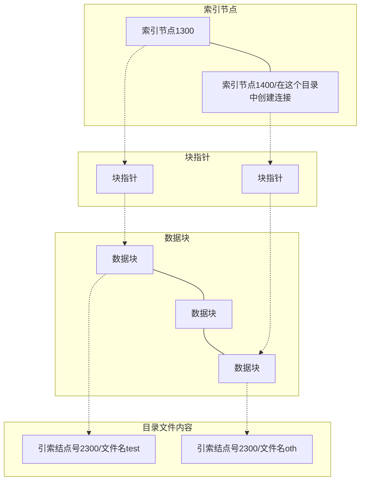

# 文件IO

- 文件基本操作，打开、定位、读写、关闭

- IO效率

- 文件共享(必考)

- 其他重要IO函数

## 文件操作基本顺序

- 打开 open

- 创建 creat

- 定位 lseek

- 读 read

- 写 write

- 关闭 close

### 打开 open

fopen和open，C库fopen有功能扩展

用于打开或者创建一个文件

函数原型

```c
#include<fcntl.h>
int open(const char* pathname, int oflag, ...)
    //打开或创建的文件名，用于指定文件打开模式、标志等信息
    //需要前赋予文件权限，Linux的9个权限
```

#### oflag

- Linux头文件已经为文件打开模式、标志等定义了若干的宏

- oflag需要指定这些宏

- 宏定义在/usr/include/bits/fcntl.h中

- 在该头文件中，只读打开标志被定义为

- #define O_RDONLY  00

- 文件打开模式标志

  	以下三个标志必须指定一个且只能指定一个

  - O_RDONLY ： 只读打开

  - O_WRONLY ： 只写打开

  - O_RDWR   ： 读写打开

- 其他文件标志

   下面的标志是可以选择的，可通过C语言的或运算与文件打开标志进行组合

  - O_APPEND：每次写的数据都添加到文件尾

  - O_TRUNC：若此文件存在，并以(权限)读写或只写打开，则文件长度为0

  - O_CREAT：若文件不存在，则创建该文件。此时，open函数需要第三个参数，用于指定该文件的访问权限位

  - O_EXCL：若同时指定了O_CREAT标志，而文件已经存在，则会出错。可用于测试文件是否存在

返回值

- 整数数据
  - 成功时，返回文件描述符
  - 出错时，返回-1

文件描述符

- Window时返回文件句柄，是同一个描述
- 文件描述符：已打开文件的索引-->通过通过索引找到已打开文件

#### 进程打开文件的内核数据结构


子进程会复制父进程fd_arrag数组

VFS抽象文件系统，方便文件系统与系统进行对接。

task-struct的files可以但不一定共用，不一定每一个进程有files_struct甚至会共享

从fd数组（已打开文件表）里面找到一个没有表项的数组项

读取文件描述符，找到PCB，取出已打开文件表files，读出file结构体

找到dentry（目录项）找到inode(索引节点)

file里面的flag是两个字段，存放open时的标志

进程创建时，创建了task_strct和files_struct的链接

##### 索引节点

- 文件系统索引节点的信息，存储在磁盘上
- 当需要时，调入内存，填写VFS的索引节点（即inode结构）
- 每个文件都对应了一个索引节点
- 通过索引节点号，可以唯一的标识文件系统中的指定文件

```c
struct inode{
    //...
    unsigned long i_no;	// 索引节点号
    umode_t i_mode;	// 文件类型访问
    uid_t i_uid;	//文件拥有者ID
    gid_t i_gid;	//文件拥有者所在组ID
    off_t i_size;	//文件大小
    time_t i_atime;	//文件最后访问时间
    time_t i_mtime;	//文件最后修改时间
};
```

元数据：描述性数据

##### 文件描述符

open函数返回的文件描述符已打开文件表的索引

文件描述符是已打开文件的索引，通过该值可以在fd_array表中检索相应的文件对象

文件描述符是一个非负的整数

文件描述符0、1、2分别对应于标准输入、标准输出、标准出错，在进程创建时，已经打开。

#### 程序演示 open函数

出错处理(2.1)

errno.h头文件中，定义了errno：当API调用出错时，errno说明出错的具体原因

可简单地将errno理解成整型数据

出错信息转换成可读字符串

```c
#include<string.h>
char* strerror(int errno);
```

示例2.2

```c
#include <fcntl.h>
#include <errno.h>
#include <string.h>
#include <iostream>

using namespace std;

int main()
{
  int fd = open("a.txt", O_RDONLY);
  if(-1 == fd)
  {     
    cout << "open error" << endl;
    cout << strerror(errno) << endl;
  }
  
  return 0;
}
```

以前的定义：extern int errno;

多线程环境：

```c
extern int * __errno_location();
#define errno (*__errno_location())
#Win: GetLastError()
```

perror函数

- perror函数根据当前的errno，输出一条出错信息

函数原型

```c
#include<stdio.h>
void perror(const char* msg);
```

示例2.3

```c
#include <fcntl.h>
#include <errno.h>
#include <string.h>
#include <iostream>

using namespace std;

int main()
{
  int fd = open("a.txt", O_RDONLY);
  if(-1 == fd)
  {     
    cout << "open error" << endl;
    perror("test3");
  }
  
  return 0;
}

```

该函数输出：

msg指向的字符串: errno对应的出错信息

### 创建 creat

用于创建一个新文件

函数原型

```c
 int creat(const char *pathname, mode_t mode)
```

参数

- pathname：要创建的文件名（包括路径信息）

- mode：同open的第三个参数，讨论文件的访问权限位时分析

返回值

- 成功返回**只写打开**的文件描述符
- 出错返回-1

creat函数的功能可以用open函数实现

```c
 open(pathname,
 	O_WRONLY | O_CREAT | O_TRUNC,
	mode);
```

为什么需要指定O_TRUNC标志，覆盖已经存在的同名文件

当文件存在时，调用creat函数，会将文件的大小变为0

示例2.2

```c
#include<iostream>
#include<fcntl.h>
#include<unistd.h>
#include<sys/types.h>

using namespace std;

int main()
{    
  int fd = creat("a.txt", S_IRWXU);
    //S_IRWXU 所有者可读可写可执行
  return 0;
}
```

creat函数缺点：它以只写方式打开所创建的文件。若要创建一个临时文件，并先写该文件，然后又读该文件，则必须先调用creat，close，然后再open。简便方法：

```c
open(pathname,
	O_RDWR | O_CREAT | O_TRUNC, 
	mode);
```

### 定位 lseek

lseek函数用于修改当前文件偏移量

当前文件偏移量的作用
- 规定了从文件什么地方开始进行读、写操作

通常，读、写操作结束时，会使文件偏移量增加读写的字节数（一般文件顺序读写，自动调整偏移量，不需要手动调整）

当打开一个文件时，偏移量被设置为0

函数原型

```c
off_t lseek(int filedes,off_t offset,int whence)
```

参数

- 第一个参数filedes：open/creat函数返回的文件描述符

- 第二个参数offset：
  - 相对偏移量：需结合whence才能计算出真正的偏移量
  - 类型off_t：32位机是32位数据类型，64位是64位
- 第三个参数Whence：该参数取值是三个常量之一
  - SEEK_SET： 当前文件偏移量为：距文件开始处的offset个字节
  - SEEK_CUR： 当前文件偏移量为：当前文件偏移量＋offset(可正可负)
  - SEEK_END： 当前文件偏移量为：当前文件长度＋offset(可正可负)

返回值：

- 若成功，返回新的文件偏移量

- 若出错，返回-1

获得当前的偏移量

- off_t CurrentPosition;

- CurrentPosition = lseek(fd, 0, SEEK_CUR);

lseek操作并不引起任何I/O操作，只是修改内核中的记录（修改file结构体中的f_pos）

#### 空洞文件

使用lseek修改文件偏移量后，当前文件偏移量有可能大于文件的长度

在这种情况下，对该文件的下一次写操作，将加长该文件

这样文件中形成了一个空洞。对空洞区域进行读，均返回0


演示2.3

```c
#include <fcntl.h>
#include <iostream>
#include <sys/stat.h>
#include <sys/types.h>
#include <unistd.h>

using namespace std;

int main()
{
  int fd = creat("file.hole", S_IRWXU);
  if (-1 == fd)
  {
    cout << "creat error" << endl;
    return 0;
  }
  char buf[100];//模拟文件原本大小
  for (int i = 0; i < 100; i++)
    buf[i] = 'a';
  if (write(fd, buf, 100) != 100)
  {
    cout << "write 1 error" << endl;
    return 0;
  }
  //文件大小变成100字节
  if (lseek(fd, 50, SEEK_END) == -1)//模拟文件偏移，创建空洞
  {
    cout << "lseek error" << endl;
    return 0;
  }
  if (write(fd, buf, 50) != 50)//再写50个字节
  {
    cout << "write 2 error" << endl;
    return 0;
  }
  return 0;
}
```

这时文件大小变成了200字节

```bash
$ls -l
root 200 Mar 10 file.hole
$od -x file.hole
#*代表与上行相同，全部省略若干行
$od -A x -t x1 file.hole
#用od命令读文件二进制
```

如果偏移太大，大于每次分配磁盘块大小（4KB)，就不占用磁盘空间。

### 读 read

用于从文件中读出数据

函数原型

```c
ssize_t read(int fd, void *buff, size_t nbytes)
```

参数

- 第一个参数fd：文件描述符

- 第二个参数buff：指向缓冲区，用于存放从文件读出的数据

- 第三个参数nbytes：unsigned int；需要从文件中读出的字节数
  - 缓冲区的大小>=nbytes

返回值

- 返回值类型： ssize_t，有符号的，32位机中32bits，64位机中64bits

- 出错：返回-1

- 成功：返回从文件中实际读到的字节数

- 当读到文件结尾时，则返回0

无符号数和有符号数比较，当出错时返回-1与需要读的字节数进行比较时，一定大于需要读字节数，容易判断错误。

很多情况下，read实际读出的字节数都小于要求读出的字节数

- 读普通文件，在读到要求的字节数之前，就到达了文件尾端

- 当从终端设备读时，通常一次最多读一行

- 当从网络读时，网络中的缓冲机构可能造成read函数返回值小于所要求读出的字节数

- 某些面向记录的设备，如磁带，一次最多返回一个记录等

### 写 write

用于向文件里面，写入数据

函数原型

```c
ssize_t write(int fd, const void *buff, size_t nbytes);
```

参数

- 第一个参数fd：文件描述符

- 第二个参数buff：指向缓冲区，存放了需要写入文件的数据

- 第三个参数nbytes：需要写入文件的字节数

返回值

- 返回值类型： ssize_t，有符号的，在32位系统中是32bits，64位是64bits

- 出错：返回-1

- 成功：返回实际写入文件的字节数

write出错的原因

- 磁盘满

- 没有访问权限

- 超过了给定进程的文件长度限制

- 等

当从文件中间某处写入数据时，是插入操作？覆盖操作？还是不能写？（程序演示2.4）

```c
#include <fcntl.h>
#include <iostream>
#include <unistd.h>

using namespace std;

int main()
{
  int fd = open("a.c", O_RDWR);
  char buf = 'q';
  cout << write(fd, &buf, 1) << endl;
  return 0;
}
```

中间写入是**覆盖操作**

当以O_APPEND选项打开一个文件时，能否使用lseek指定文件偏移量？指定之后，从文件什么地方开始进行写？读操作又是如何？（程序演示2.5）

```c
#include <fcntl.h>
#include <iostream>
#include <unistd.h>

using namespace std;

int main()
{
  int fd = open("a.c", O_RDWR | O_APPEND);
  if (-1 == fd)
  {
    cout << "open error" << endl;
    return 0;
  }
  off_t CurrentPosition = lseek(fd, 0, SEEK_CUR);
  cout << "CurrentPosition:  " << CurrentPosition << endl;//当前文件偏移量 0

  char buf = 'm';
  if (write(fd, &buf, 1) == -1)
  {
    cout << "write error" << endl;
    close(fd);
    return 0;
  }
  CurrentPosition = lseek(fd, 0, SEEK_CUR);
  cout << "After writing m, CurrentPosition:  " << CurrentPosition << endl;//修改文件尾部的偏移量 22

  if (lseek(fd, 0, SEEK_SET) == -1)
  {
    cout << "lseek error" << endl;
    close(fd);
    return 0;
  }
  off_t NewCurrentPosition = lseek(fd, 0, SEEK_CUR);
  cout << "NewCurrentPosition:  " << NewCurrentPosition << endl;//文件还可以把偏移量修改到头部

  char buf1 = 'P';//如果修改成功，查看p的出现位置
  if (write(fd, &buf1, 1) == -1)
  {
    cout << "write error" << endl;
    close(fd);
    return 0;
  }
  close(fd);
  return 0;
}
```

只要使用O_APPEND无论lseek如何修改，总是出现在文件尾部，都是写到尾部

### 关闭 close

用于关闭一个已打开的文件

函数原型

```c
int close(int filedes)
```

返回值

- 成功返回0

- 出错返回-1

参数 filedes：文件描述符

引用计数为零时，会自动回收资源

当clsoe函数关闭文件时，会释放进程加在该文件上的所有记录锁

内核会对进程打开文件表、文件对象、索引节点表项等结构进行修改，释放相关的资源

当进程退出时，会关闭当前所有已打开的文件描述符

## IO效率

程序3.3

```c
#define BUFFSIZE 4096
int main()
{
  int n;
  char buf[BUFFSIZE];
	// 对标准输入和标准输出进行了重定向
	//从文件file1读数据
	//程序中，影响效率的关键：BUFFSIZE的取值
  while((n = read(STDIN_FILENO, buf, BUFFSIZE))>0)
       if(write(STDOUT_FILENO, buf, n)  != n)
                   err_sys(“write error”);
  return 0;
}
```

4KB，效率最高，缓存库处理

原因

- Linux文件系统采用了某种预读技术

- 当检测到正在进行顺序读取时，系统就试图读入比应用程序所要求的更多数据

- 并假设应用程序很快就会读这些数据

- 当BUFFSIZE增加到一定程度后，预读就停止了

启示：如何提高I/O效率

慢在哪里？

- 整个磁盘操作的过程是什么：寻道、旋转、读/写
  - 添加缓冲，数据放在连续的扇区，冗余磁盘阵列(RAID)

- 每调用一次read/write，就陷入一次内核

- SSD的情况

改进的思路

- 尽量使磁头顺序移动，如LSF 日志文件

- 利用缓存，减少磁盘I/O、read/write调用次数
  - 用户cache减少系统调用

- 有时轮询比中断好 如：NVME

## 文件共享:star:

### 不同进程打开不同的文件

互不干扰

### 不同进程打开同一个文件


进程B新建file不再寻找inode，直接用进程A找到的Inode。两个进程共享inode

每个进程都有自己的当前文件偏移量

如果A修改了inode，需要B进行更新

在完成每个write后，当前文件偏移量即增加所写的字节数

如果用O_APPEND标志打开了一个文件，则该标志存储在file结构体中。每次执行写操作时，当前偏移量首先被设置为文件长度

### 父子进程共享文件对象的情况

当A--fork-->B会发生这种情况，处于浅拷贝


假设存在以下竞争情况

```c
//进程A
lseek(fd,50,SET);//当前偏移50，返回内核发生调度为B
Write(fd,buf,50);//在偏移为200时写入，发生输入位置偏移
//进程B
lseek(fd,200,SET);//2->5，设偏移200，再次发生调度
write(fd,buf,50);
```

存在模式转换的调度点，发生两个偏移量不一致，ACID（原子性，移植性，隔离性，持久性）

原子操作需要做事件操作

### 同一个进程打开不同的文件


### 同一个进程内的共享（dup等）


在内核中使用，使用dup dup2和fcntl可以有这种情况

```c++
#include <fcntl.h>
#include <iostream>
#include <unistd.h>
using namespace std;

int main()
{
  int fd = open("a.c", O_RDWR);
  if (-1 == fd)
  {
    cout << "open error" << endl;
    return 0;
  }
  int fd2 = dup(fd);
  off_t CurrentPosition = lseek(fd2, 0, SEEK_CUR);
  cout << "CurrentPosition:  " << CurrentPosition << endl;
  lseek(fd, 100, SEEK_SET);//验证修改fd是否对fd2有影响
  CurrentPosition = lseek(fd2, 0, SEEK_CUR);
  cout << "CurrentPosition:  " << CurrentPosition << endl;
  return 0;
}
```

```bash
Current position: 0
Current position: 100
```

证明文件描述符共享一个文件

### 同一个进程内线程的共享


T1:open 3-->pthread T2-->write(3) //创建线程2肯定可以使用文件3

T1:open 4 //T1在创建后打开文件4

T2:write 4 //T2可以打开4，属于以上情况

### dup函数

用于复制一个已经存在的文件描述符

函数原型

```c
int dup(int filedes);
```

返回值

- 成功返回新的文件描述符

- 出错返回-1

参数

- filedes：文件描述符

调用dup函数之前 --> int fd = dup(1); //当前未占用文件描述符中的最小值

使新老文件描述符(1)，都指向同一个文件对象。

### dup2函数

用于复制一个已经存在的文件描述符

函数原型

```c
int dup2(int filedes, int filedes2);
```

#### dup和dup2的区别

- dup返回的新文件描述符一定是当前可用描述符中的最小值

- dup2则将文件描述符复制到指定位置，即将filedes复制到filedes2

- 如果filedes2已经打开，dup2则先将其关闭；若filedes2等于filedes，则直接返回filedes，而不关闭

```bash
$./a.out & #后台运行
#返回进程号
$ls /proc/1696/fd -l #查看进程表
```

## 其他重要IO函数

### sync、fsync、fdatasync函数

通常Linux实现在内核中设有缓冲区高速缓存或页面高速缓存（函数针对内核缓存）

大多数的磁盘I/O都通过缓冲区进行

当将数据写入文件时，内核通常先将数据复制到某一个缓冲区中

如果该缓冲区满或者内核需要重用该缓冲区，则将该缓冲排入到输出队列

等到其达到队首时，才进行实际的磁盘读写操作

整个过程为一种 延迟写

- 延迟写优点
  - 减少了磁盘读写次数

- 延迟写缺点
  - 降低了文件内容的更新速度
  - 当系统发生故障，高速缓冲区中的内容可能丢失(如掉电)

解决办法

- 对缓冲区进行清理，希望将数据写入到磁盘

- sync、fsync、fdatasync起到了刷缓存的作用

#### sync

原型：void sync();

将所有修改过的缓冲区排入写队列，然后就返回

并不等待实际的写磁盘操作结束

sync函数针对的是**所有修改过的缓冲区**，并不仅仅针对某个被修改过的文件

通常称为update的系统守护进程会周期性地调用sync函数，即保证定期冲洗内核缓冲区

#### fsync

函数原型：int fsync(int filedes);

参数与返回值

- filedes：文件描述符

- 返回值：成功返回0，出错返回-1

fsync函数只对文件描述符filedes指定的单一文件起作用

并且**等待写磁盘操作结束**后才返回

#### fdatasycn

函数原型：int fdatasync(int filedes);

参数与返回值

- filedes：文件描述符

- 返回值：成功返回0，出错返回-1

fdatasync和fsync类似，但它只影响文件的数据部分；而fsync不仅影响文件的数据，还同步更新文件的属性。

|          | sync | fsync | fdatasync |
| -------- | ---- | ----- | --------- |
| 等待写   | 否   | 是    | 是        |
| 更新数据 | 是   | 是    | 是        |
| 更新属性 | 是   | 是    | 否        |

### fcntl函数

用于改变**已经打开文件**的性质

函数原型：int fcntl(int filedes, int cmd, .../* int arg */)；

返回值

- 成功时，返回值依赖于第二个参数cmd

- 出错时，返回-1

参数

- 第一个参数filedes：已打开文件的文件描述符
- 第二个参数cmd的五种取值方式：
  - 复制一个现存的描述符（cmd=F_DUPFD）
  - 获得/设置文件描述符标记（cmd=F_GETFD或F_SETFD）
  - 获得/设置文件状态标志（cmd=F_GETFL或F_SETFL）
  - 获得/设置异步I/O信号接收进程（cmd=F_GETOWN或F_SETOWN）
  - 获得/设置记录锁（cmd=F_GETLK,F_SETLK或F_SETLKW）

#### cmd五种取值方式

##### F_DUPFD

复制文件描述符filedes，与dup(2)类似

fcntl返回新文件描述符

新描述符是尚未打开的各描述符中，大于或等于第三个参数值中，各值的最小值

	例子：假设文件描述符0、1、2被占用
	
	fcntl(1, F_DUPFD, 5)返回 5，fcntl(2, F_DUPFD, 1)返回3

**与dup、dup2的异同**

fcntl函数与dup、dup2函数均用于复制文件描述符，即使不同的文件描述符指向同一个文件对象

dup(filedes)等价于	fcntl(filedes, F_DUPFD, 0);

dup2(filedes, filedes2)不完全等价于

	close(filedes2);
	
	fcntl(filedes, F_DUPFD, filedes2);

fcntl与dup2不完全等价

	dup2是一个原子操作（用户层面），而close与fcntl则包括两个函数调用。
	
	在close和fcntl之间可能被信号打断
	
	dup2与fcntl之间有某些不同的errno

##### F_DUPFD

##### F_GETFD

将文件描述符filedes对应的标志，作为返回值返回。

当前只定义了一个文件描述符标志FD_CLOEXEC

##### F_SETFD

设置文件描述符filedes对应的标志。新标志按照第三个参数设置。

##### F_GETFL

fcntl函数返回文件描述符filedes对应的文件状态标志

文件状态标志包括：

- O_RDONLY
- O_WRONLY
- O_RDWR
- O_APPEND
- O_NONBLOCK 非阻塞方式
- O_SYNC 等待写方式
- O_ASYNC 异步方式(仅4.3+BSD)

##### F_SETFL

将fcntl函数的第三个参数，设置为文件状态标志

可以更改的标志包括：O_APPEND、O_NONBLOCK、O_SYNC、O_ASYNC

##### F_GETOWN

获取当前接收SIGIO和SIGURG信号的进程ID或进程组ID

##### F_SETOWN

设置接收SIGIO和SIGURG信号的进程ID或进程组ID

第三个参数arg：

- arg>0时，表示一个进程ID
- arg<0时，其绝对值表示一个进程组ID

#### fcntl函数实例

```c
//获取文件状态标志
int main()
{
  int fd = open("a.txt", O_WRONLY | O_APPEND);
  int val = fcntl(fd, F_GETFL);//获取文件标志，每个标志占一个bit
  if (-1 == val)
  {
    cout << "fcntl error" << endl;
    return 0;
  }
  int accessmode = val & O_ACCMODE; //获取最后两个bit，获取打开模式
  switch (accessmode)
  {
  case O_RDONLY:
    cout << "Read only" << endl;
    break;
  case O_WRONLY:
    cout << "Write only" << endl;
    break;
  case O_RDWR:
    cout << "Read and Write" << endl;
    break;
  default:
    break;
  }
  if (val & O_APPEND)//查看第11位是否为1
    cout << "O_APPEND " << O_APPEND << endl;
  if (val & O_NONBLOCK)
    cout << "O_NONBLOCK " << O_NONBLOCK << endl;
  return 0;
}
```

实例2：添加或删除某个文件状态标志

添加或删除某个文件描述符标志或文件状态标志时，先将现有标志值存放在某个变量中，再对该变量进行修改，最后将该变量设置为新的标志。

不能只是执行F_SETFD或F_SETFL命令，这样会关闭以前设置的标志位。

```c
void set_fl(int fd, int flags)
{
  int val;
  if ((val = fcntl(fd, F_GETFL, 0)) < 0)
    err_sys("fcntl F_GETFL error");
  //设置标志，若清除某标志：val &= ~flags;
  val |= flags;

  if (fcntl(fd, F_SETFL, val) < 0)
    err_sys("fcntl F_SETFL error");
}
```

### ioctl函数

I/O操作的杂物箱

其实现的功能往往和具体的设备有关系

设备可以自定义自己的ioctl命令

操作系统提供了通用的ioctl命令

ioctl类似于windows的DeviceIoControl函数

# 文件和目录

## ext2文件系统在磁盘上的组织

ext2文件系统是Linux土生土长的文件系统

ext2是ext(Extended File System)的完善，因此，ext2为The Second Extended File System

ext2文件系统加上日志支持，即ext3

ext2和ext3在磁盘上的布局大致相同，只是ext3多出了一个特殊的inode，用于记录文件系统日志

### 磁盘布局

假设ext2文件系统所占分区[^ 10]

分区被划分成一个个的块block,每个块均有编号

- 同一个文件系统中，block的大小都是相同的

- 不同的文件系统，block的大小可以不同

- 典型的block大小为1k或者4k

若干块聚集在一起，形成一个块组

分区被划分成若干个块组

每个块组所包括的块个数相同


#### 超级块

每个块组都包含有一个相同的超级块

超级块重复的主要目的：灾难恢复

超级块用于存放文件系统的基本信息

s_magic：ext2文件系统标识0xef53

s_log_block_size：可由它得出块大小

块组包括的块个数、包括的索引节点个数，总的块个数

#### 组描述符

bg_block_bitmap：指向块位图

bg_inode_bitmap：指向索引节点位图

bg_inode_table：指向索引节点表

#### 块位图

当某个bit为1，表示该bit对应的数据块被占用

当某个bit为0，表示该bit对应的数据块未被占用

空间性能和时间性能与块大小成正比

#### 索引节点位图

当某个bit为1，表示该bit对应的索引节点被占用

当某个bit为0，表示该bit对应的索引节点未被占用

与文件一一对应

#### 索引节点表

索引节点表由若干个索引节点组成

一个索引节点对应了一个文件（目录也是一种文件）

每个索引节点都有一个编号，这个编号是全局的，从1开始计数

```c
struct ext3_inode {
 __u16 i_mode;				//File mode 
 __u16 i_uid;     			//Low 16 bits of Owner Uid 
 __u32 i_size;    			//文件大小
 __u32 i_atime;   			//Access time
 __u32 i_ctime;   			//Creation time
 __u32 i_mtime;   			//Modification time
 __u16 i_gid;     			//Low 16 bits of Group Id
 __u16 i_links_count;  	         //Links count
 __u32 i_flags;            		//File flags
 __u32 i_block[EXT3_N_BLOCKS];    //一组 block 指针，存储了文件的内容
......
};
```

查找确定索引节点表，再去确定索引节点

### 目录

目录也是一种文件

通过其索引节点中的i_block字段，可以找到存放目录文件内容的数据块

目录的内容具有固定的格式

目录文件按照固定的格式记录了目录包含了哪些文件

目录中每个文件，都对应了一个目录项

若干个目录项构成了目录文件的内容

```c
struct ext3_dir_entry_2{
	__u32 inode; /* Inode 号数 */
	__u8 file_type;
	char name[EXT3_NAME_LEN]; //File name
	......
};
```

例子

找文件/root/test，假设已知/root索引节点号为1400

1. 在root里面找 test对应的目录项
   1. 块组0在头部寻找不需要信息
   2. 在0块组超级块中查看块组包括的块个数、块组包括的索引节点个数，总的块个数(块组包含的inode个数假设为500)
   3. 通过块组inode个数获取组号
   4. 组内第400个inode号
   5. 确定索引节点表位(bg_inode_table)
   6. 找到/root对应inode
   7. 读取/root文件内容找到test对应的目录项
2. 根据目录项上对应的偏移量找到test

## stat、fstat、lstat函数

### stat函数

用于获取有关文件的信息结构

```c
int stat(const char* restrict pathname, struct stat* restrict buf); 
//这里stat*指的是对应的结构体，命名为了简洁并不规范
```

restrict关键字C99标准引入的，只能用于限定指针，表明指针是访问一个数据对象的唯一且初始的方式

参数与返回值

第一个参数pathname：文件名，需要获取该文件的信息

第二个参数buf：stat函数将pathname对应的文件信息，填入buf指向的stat结构中

返回值：0成功；-1出错

#### restrict关键字

```c
int ar[10];
int* restrict restar=(int *)malloc(10*sizeof(int));
//int* pnew = restar; 但编译器并不会报错
int* par=ar;
/*对restar的操作进行优化，
restar[n] += 8
无法对par的操作优化
par[n] += 8
*/
for(int n=0; n<10; n++) {
   par[n]+=5;
   restar[n]+=5;
   ar[n]*=2;
   par[n]+=3;
   restar[n]+=3;
}
```

实际上在C99标准出来以前，编译器就已经开始支持类似restrict的语义了，如编译器定义了__restrict 

restrict关键词，实际上是用于指示编译器对代码进行优化的

代码清单2.20——查看反汇编代码

```c
#include <stdio.h>

int f(int *a, int *b){
    printf("ok\n");

    *a = 2;
    *b = 3;

    return *a;
}

int main(){
    int p, q, r;
    r = f(&p, &q);

    printf("%d\n", r);

    return 0;
}
```

- gcc test.c -g -O2

```bash
(gdb)disass f
Dump of assembler code for function f:	
```


- 为什么f函数返回值时，不直接返回2，还要从rbx中读取？

- 虽然使用了优化选项，但是编译器依然担心，会有其他方式访问*a代表的存储单元

为f的两个指针参数，都加上restrict关键字

```c
int f(int restrict *a, int restrict *b){
    printf("ok\n");
    *a = 2;
    *b = 3;
    return *a;
}
int main(){
    int p, q, r;
    r = f(&p, &p);
    printf("%d\n", r);
    return 0;
}
```

gcc test.c -g -O2 -std=c99

注意C++语言不支持restrict关键字，但是可以使用__restrict

实验结果：编译器确实做了优化

f(&p, &p)，f函数应返回3

编译器做了错误的优化

	a和b指向了不同的存储单元

- restrict的正确使用，得看程序员的人品

如果将f修改成：int f(int *restrict a, int * b)，编译器还会做优化吗？

- 不会

- 编译器对b是否也指向a所指向的区域存在疑虑

#### stat结构体

```c
struct stat{
    ....................................................
    ino_t st_ino; /* inode number*/
    mode_t st_mode; /* file type & mode */
    nlink_t st_nlink; /* number of hard links */
    uid_t st_uid; /* user ID of owner */
    gid_t st_gid; /* group ID of owner */
    off_t st_size; /* total size, in bytes */
    unsigned long st_blksize; /* blocksize  */
    unsigned long st_blocks; /* number of blocks allocated */
    time_t st_atime; /* time of last access */
    time_t st_mtime; /* time of last modification */
};
```

### fstat、lstat函数

用于获取有关文件的信息结构

```c
int stat(const char* restrict pathname, 
             struct stat* restrict buf);
 int fstat(int filedes, struct stat *buf);
 int lstat(const char* restrict pathname,
              struct stat* restrict buf);
```

lstat返回符号链接本身的信息；stat返回符号链接所引用的文件信息

fstat通过文件描述符；stat通过文件名返回文件的信息

## 文件的基本性质

文件类型，用户ID和组ID，文件访问权限，新文件和目录的所有权，文件时间

### 文件类型

UNIX或Linux系统中的常见文件类型有：

- 普通文件 
- 目录文件 
- 字符特殊文件 ：提供对设备不带缓冲的访问
- 块特殊文件 ：提供对设备带缓冲的访问
- FIFO文件 ：用于进程间的通信，命名管道
- 套接口文件 ：用于网络通信（网络编程课程）
- 符号链接 ：使文件指向另一个文件

struct stat的st_mode包含了文件类型信息

使用如下的宏，判断文件类型

- 普通文件 S_ISREG()
- 目录文件 S_ISDIR()
- 字符特殊文件 S_ISCHR()
- 块特殊文件 S_ISBLK()
- FIFO文件 S_ISFIFO()
- 套接口文件 S_ISSOCK()
- 符号连接 S_ISLINK()

```c
#include <stdio.h>
#include <sys/stat.h>

int main(int argc, char *argv[]){
  int i;
  struct stat buf;
  const char *ptr;

  for (i = 1; i < argc; i++){
    printf("%s: ", argv[i]);
    if (lstat(argv[i], &buf) < 0){
      printf("lstat error");
      continue;
    }

    if (S_ISREG(buf.st_mode))
      ptr = "regular";
    else if (S_ISDIR(buf.st_mode))
      ptr = "directory";
    else if (S_ISCHR(buf.st_mode))
      ptr = "character special";
    else if (S_ISBLK(buf.st_mode))
      ptr = "block special";
    else if (S_ISFIFO(buf.st_mode))
      ptr = "fifo";

#ifdef S_ISLNK
    else if (S_ISLNK(buf.st_mode))
      ptr = "symbolic link";
#endif

#ifdef S_ISSOCK
    else if (S_ISSOCK(buf.st_mode))
      ptr = "socket";
#endif

    else
      ptr = "** unknown mode **";

    printf("%s\n", ptr);
  }
  return 0;
}
```

#### 用户ID和组ID

##### 第一种ID：

- Linux是一个多用户的操作系统。每个用户都有一个ID，用以唯一标识该用户。这个ID，被称为UID。
- 每个用户都属于某一个组，组也有一个ID。这个ID，被称为组ID，GID。

##### 第二种ID：文件所有者相关

- 文件所有者ID：拥有某文件的用户的ID

- 文件所有者组ID：拥有某文件的用户所属组的ID

  struct stat的st_uid和st_gid

##### 第三种ID：实际用户ID和实际组ID

- 进程的实际用户ID：运行该进程的用户的ID
- 进程的实际组ID：运行该进程的用户所属的组ID

##### 第四种ID：有效用户ID和有效组ID

大多数情况下，有效用户/组ID＝实际用户/组ID

- 进程的有效用户ID：用于文件访问权限的检查
- 进程的有效组ID：

```c
#include <stdio.h>
#include <stdlib.h>
#include <sys/stat.h>
#include <sys/types.h>
#include <unistd.h>

int main(void){
  printf("real uid: %d, real gid: %d\n", getuid(), getgid());
  printf("effective uid: %d, effective gid: %d\n", geteuid(), getegid());
  exit(0);
}
```

```bash
root$ ./a.out
real uid: 0, real gid: 0
effective uid: 0, effective gid: 0
root$chmod u+s a.out #root设置“设置ID位”
root$su abc
abc$ ./a.out
real uid: 1001, real gid: 1001
effective uid: 0, effective gid: 1001
abc$chmod u+s a.out #abc设置“设置ID位”
root$a.out
real uid: 0, real gid: 0
effective uid: 1001, effective gid: 0
```

设置用户ID位和设置组ID位

- 在可执行文件的权限标记中，有一个“设置用户ID位”
- 若“设置用户ID位”被设置，表示：执行该文件时，进程的有效用户ID变为文件的所有者
- 对于设置组ID位类似

通过命令行设置用户ID位

- chmod u+s filename   chmod g+s filename
- chmod u-s filename  chmod g-s filename

##### 第五种ID

- 保存的设置用户ID
- 保存的设置组ID
- 上述两者在执行一个程序时包含了有效用户ID和有效组ID的副本

#### 文件访问权限 :star:

三类，每类三个

| 针对文件所有者         | st_mode的bit位置 | 针对与文件所有者  同组的用户 |      | 针对非同组的用户         |      |
| ---------------------- | ---------------- | ---------------------------- | ---- | ------------------------ | ---- |
| 指定所有者是否可读     | 8                | 指定组用户是否可读           | 5    | 指定其他用户  是否可读   | 2    |
| 指定所有者是否可写     | 7                | 指定组用户是否可写           | 4    | 指定其他用户  是否可写   | 1    |
| 指定所有者  是否可执行 | 6                | 指定组用户  是否可执行       | 3    | 指定其他用户  是否可执行 | 0    |

struct stat st_mode; 包含了文件访问权限位

st_mode低11bit，低9位就是9个权限位[0~8]

| st_mode屏蔽 | 意义       |
| ----------- | ---------- |
| S_IRUSR     | 用户－读   |
| S_IWUSR     | 用户－写   |
| S_IXUSR     | 用户－执行 |
| S_IRGRP     | 组－读     |
| S_IWGRP     | 组－写     |
| S_IXGRP     | 组－执行   |
| S_IROTH     | 其他－读   |
| S_IROTH     | 其他－写   |
| S_IWOTH     | 其他－执行 |

if(buf.st_mode & S_IRUSR)｛用户可读｝

open的第三个参数 creat的第二个参数

```c
//测试文件权限位
int main(){
  struct stat buf;
  stat("a.txt", &buf);
  cout << buf.st_mode << endl;
  if(S_IWGRP & buf.st_mode)
    cout << "can read" << endl;
  else
    cout << "cannot write" << endl;
  return 0;
}
```

```bash
root$./a.out
81a4 #1000000 110 100 100 对应a.txt 权限位
can read
$ls -l
-rwxr-xr-x 1 root root a.out
-rw-r--r-- 1 root root a.txt
-rw-r--r-- 1 root root text.cpp
#文件夹/用户权限/组权限/其他人权限 硬链接数量 用户 组 文件名
```

st_mode[11]设置用户ID:star:

st_mode[10]设置组ID

st_mode[9]粘住位：经常访问的文件，且不经常修改。放在交换分区里面

#### 文件存储许可权

- 当打开一个任意类型的文件时，对该文件路径名中包含的每一个目录都应具有**执行许可权**
- **读许可权允许读目录**，获得该目录中所有文件名的列表
- 写目录许可权，改变目录文件本身内容(添删改)
- 目录具有执行权，表示可以搜索该目录（或进入该目录）

对应操作与权限

- 为了在open函数中对一个文件指定O_TRUNC标志，必须对该文件具有**写许可权**

- 为了在一个目录中创建一个新文件，必须对该目录具有**写许可权**和**执行许可权**
- 为了删除一个文件，必须对包含该文件的目录具有**写许可权和执行许可权**，对该文件本身则不需要有读、写许可权
- 如果用6个exec函数中的任何一个执行某个文件，都必须对该文件具有执行许可权

进程访问文件时，内核就进行文件存取许可权测试。这种测试可能涉及到文件的所有者ID、进程有效ID以及进程的添加组ID。**两个所有者ID是文件的性质，而有效ID与添加组ID是进程的性质**

1. 若进程的有效用户ID是0（root），则允许存取；
2. 若进程的有效用户ID等于文件的所有者ID（即该进程拥有文件）
   - **若所有者存取许可权被设置，则允许存取**
   - **否则拒绝存取**
3. 若进程的有效组ID或进程的添加组ID之一等于文件组ID：
   - **若组存取许可权被设置，则允许存取**
   - **否则拒绝存取**
4. 若其他用户存取许可权被设置，则允许存取，否则拒绝存取

综上所述，内核按顺序执行上述4步测试。

若进程拥有此文件，则按用户存取许可权批准或拒绝该进程对文件的存取－不查看组存取许可权。

相类似，若进程并不拥有该文件，但进程属于某个适当的组，则按组存取许可权批准或拒绝该进程对文件的存取－不查看其他用户的许可权。

```bash
root$ls /etc/passwd -l
-rw-r--r-- 1 root root 1598 /etc/passwd
$passwd #命令路径在/usr/bin/passwd
$ls /usr/bin/passwd -l
-rwsr-xr-x 1 root root 1598 /usr/bin/passwd
#设置了 设置用户ID位普通用户运行passwd，有效用户ID是root
```

每个用户都可以使用passwd命令修改密码

passwd命令需要修改/etc/passwd文件

ls -l /etc/passwd

该文件属于超级用户，非超级用户无修改权限

ls -l /usr/bin/passwd

passwd设置了设置用户ID位 ，权限升级

### 新文件和目录的所有权

- 新文件的所有者ID：即创建该文件的进程的有效用户ID
- 新文件的组ID：两种方式
  - 创建该文件的进程的有效组ID
  - 新文件所在目录的组ID
- Linux中的处理
  - 取决于新文件所在目录的设置组ID是否被设置
  - 若设置，新文件的组ID即目录的组ID

演示

```bash
$su abc
abc$mkdir aaa
abc$cd aaa
root@aaa$vim zzz#随便创建
root@aaa$ls -l
-rw-r--r-- 1 root abc zzz
root@$ls -l
drwxrwsr-x 2 abc abc 4096 aaa #目录文件
#这里新文件的组ID与目录保持一致
```

### 文件时间

| time_t对应 字段 | 说明                    |
| --------------- | ----------------------- |
| st_atime        | 文件数据的最后访问时间  |
| st_mtime        | 文件数据的最后修改时间  |
| st_ctime        | i节点状态的最后更改时间 |

i节点状态改变： 更改文件的访问权限、用户ID等等，但并未改变文件的实际内容

用于更改一个文件的访问时间、修改时间

函数原型

```c
int utime(const char* pathname, const struct utimbuf *times);
```

参数与返回值

返回值：0成功；-1出错

第一个参数pathname：文件名，即需要修改时间属性的文件

第二个参数times：指向utimbuf结构的常指针

```c
struct utimbuf {
    time_t actime; //访问时间，自1970年1月1日00:00:00，经过的秒数
    time_t modtime; //修改时间
};
```

- 	当times＝NULL时，使用当前时间更改文件的最后访问时间、最后修改时间
- 	否则，使用utimbuf中相关字段进行修改

## 修改文件属性的函数

### access函数

用于按实际用户ID和实际组ID进行存取许可权测试

注意：不按有效的来，此时不管设置用户ID和设置组ID，与内核检测可能不相等

函数原型：

```c
int access(const char* pathname, int mode);
```

参数

- 第一个参数pathname：要测试的文件名
- 第二个参数mode：四种取值方式
  - R_OK 测试读许可权
  - W_OK 测试写许可权
  - X_OK   测试执行许可权
  - F_OK 测试文件是否存在  （open函数的O_CREAT和O_EXCL合用）

返回值

- 若成功则为0，出错则为-1

### umask函数

用于为进程设置文件方式创建屏蔽字，即**参与**指定文件的访问权限

函数原型：

```c
mode_t umask(mode_t cmask);
```

参数和返回值

- cmask：9个权限常量的组合（通过或运算，177页）
- 返回值：以前的文件方式创建屏蔽字

```c
int main(){
  umask(S_IRGRP | S_IWGRP | S_IROTH | S_IWOTH);//对应的将设置无效
  creat("2.txt", S_IRUSR | S_IWUSR | S_IRGRP | S_IWGRP | S_IROTH | S_IWOTH);
  return 0;
}
```

umask(0) 未设置任何屏蔽字，creat或open相关参数即指定了文件的访问权限

### chmod和fchmod函数

用于改变现有文件的存取许可权

```c
int chmod(const char* pathname, mode_t mode);
```

参数和返回值

- 第一个参数pathname：要改变权限的文件

- 第二个参数mode：新的存取权限位组合


- 返回值：成功则为0，出错则为-1

进程的有效用户ID等于文件的所有者，或者进程具有超级用户权限，才能改变文件的许可权位。

chmod在下列条件下自动清除两个许可权位

- 如果试图设置普通文件的粘住位（S_ISVTX），而且又没有超级用户权限，则mode中的粘住位自动被关闭。这意味着只有超级用户才能设置普通文件的粘住位。

chmod在下列条件下自动清除两个许可权位

- 新创建文件的组ID可能不是调用进程所属的组（新文件的组ID可能是父目录的组ID）
- 如果新文件的组ID不等于进程的有效组ID，以及进程没有超级用户权限
- 那么设置-组-ID位自动关闭。这就防止了用户创建一个设置-组-ID文件，而该文件是由并非该用户所属的组拥有的

#### 粘住位

在UNIX早期版本中，有一位被称为粘住位，如果一可执行程序文件的这一位被设置了，那么在该程序第一次执行并结束时，该程序正文被保存在交换区中，这使得下次执行该程序时能较快地将其装入内存。

正文：机器指令部分

交换区中，文件所占用的数据块是连续存放的；在文件系统中，数据块是随机存放的

#### fchmod

用于改变现有文件的存取许可权

```c
int fchmod(int filedes, mode_t mode);
```

参数和返回值

- 第一个参数filedes：要改变权限的文件描述符
- 第二个参数mode：新的存取权限位组合
- 返回值：成功则为0，出错则为-1

### chown、fchown和lchown函数

用于更改文件的用户ID和组ID

```c
int chown(const char* pathname, uid_t owner, gid_t group);
```

参数与返回值

- 第一个参数pathname：被改的文件名
- 第二个参数owner：文件新的所有者ID
- 第三个参数group：文件新的所有者所在组的ID
- 返回值：0成功；-1出错

#### fchown lchown

```c
int fchown(int fd, uid_t owner, gid_t group);
int lchown(const char *pathname, uid_t owner, gid_t group);
```

lchown更改符号链接本身的所有者，而不是符号链接所指向的文件

#### 权限问题

超级用户进程可以更改文件的用户ID

非超级用户进程拥有某文件，但不可以更改该文件用户ID

```c
int main(){
  cout << chown("a.txt", 1001, 1001) << endl;
  cout << strerror(errno) << endl;
  return 0;
}
```

非超级用户进程更改文件ID

- 进程拥有该文件（有效用户ID等于文件的所有者ID）
- owner等于文件的用户ID，group等于进程的有效组ID或进程的添加组ID之一

你可以修改你所拥有的文件的组ID，但**只能改到你所属于的组**

若非超级用户进程调用成功后，文件的设置用户ID和设置组ID都被清除（安全考虑）

### truncate、ftruncate函数

用于改变文件的长度

```c
int truncate(const char* pathname, off_t length);
```

参数和返回值

- pathname：欲改变长度的文件的文件名
- length：要设置的文件的新长度
- 返回值：成功返回0，出错返回-1

当文件以前的长度>length时，则超过length以外的数据将不复存在

当文件以前的长度<length时，在文件以前长度到length之间，将形成空洞，读该区域，将返回0

#### ftruncate

用于改变文件的长度

```c
int ftruncate(int fd, off_t length)
```

参数和返回值

- fd：欲改变长度的文件的文件描述符
- length：要设置的文件的新长度
- 返回值：成功返回0，出错返回-1

## 硬链接与符号链接

### link、unlink、remove、rename函数

#### link函数

用于创建一个指向现存文件的连接

```c
int link(const char* existingpath, const char* newpath);
struct stat{ ...
    nlink_t st_nlink; /*number of hard links*/ 
...}
```

创建一个新目录项newpath，它引用现存文件existingpath

- 若newpath已经存在，则返回出错
- 增加被引用文件的连接计数




### 符号连接


### symlink、readlink函数


## 目录操作

mkdir、rmdir函数


读目录


### chdir、fchdir、getcwd函数

进程的当前工作目录

搜索所有相对路径名的起点

例如：open(“./a/b.txt”,.............);

假设当前工作目录为/home/test

open打开的路径即：/home/test/a/b.txt

chdir、fchdir用于改变进程的当前工作目录

```c
int chdir(const char *pathname);
int fchdir(int filedes);
```

进程的当前工作目录改为pathname或filedes对应的路径

	成功返回0，出错返回-1

#### getcwd

返回当前工作目录的绝对路径，即以“/”开头的路径

```c
char *getcwd(char *buf, size_t size);
```

- buf：存放绝对路径
- size：buf的大小（注意包括结尾的null字符）
- 成功返回buf，失败返回NULL

------

# 补充

1. **如何提升读取性能**

在cache的帮助下数组的读取5ns，cache会自动完成后面的读取，但链表无法完成。使用位向量减少内存表象，一个bit对应一个表象。

把Key/Value放同一个数组，可以用cache line提升访问速度。会直接命中

2. **Linux进程**

Linux中线程是一种进制，只是共用同一个页表

**TLS（Thread Local Storage）线程局部存储的实现**

3. 第一种

	假设最多支持8个线程。tid = GetTLS.TId()，no = tid %8

4. 第二种

段基址+偏移量=线性地址

GS段和FS段的段基址不是零，每个线程都有自己的FS段

&errorno取地址操作取的是都是偏移量，除了GS段和FS段外

如：

	T1 base = 1000 error:80
	
	T2 base = 2000 error:80
	
	T3 base = 3000 error:80

5. **内存泄漏**

分配了但想释放但是没办法释放（找不到，没引用）

6. **NVME**

AP经过PCIE访问SSD

物理页面可以被多个虚拟页面映射

为了让AP直接访问，减少线程内核开销，用轮询的方法提高了读写效率

7. **深浅拷贝**

浅拷贝：逐指针拷贝；深拷贝：指向的拷贝内容

8. **如何告诉其他进程文件描述符**

全局（不推荐）正确性，互斥

通过消息通信。得到fd事件，主动发消息。或者注册消息，接收方申请获取消息。

9. **关于交换函数**

使用前必须判断 a是否等于b，如果一致直接输出

```c
swap(int *a, int *b){
    if(a == b) return a;
    a = a ^ b;
    a = a ^ b;
    b = a ^ b;
    return b;
}
```

[^ 10]: **分区和卷**

如RAID，一个卷可以对应多个磁盘。甚至还可以对应一个校验盘。简单卷：一个卷对应一个分区

