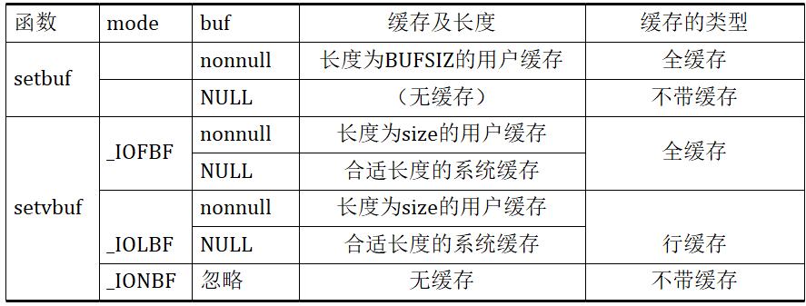
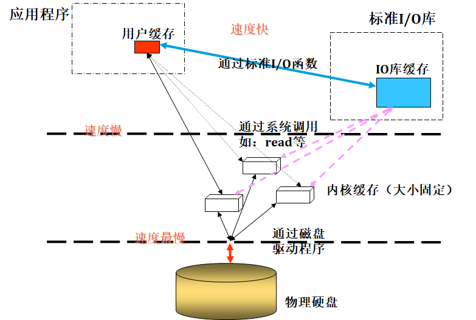

# 标准IO

## 库的编写

缓存问题与程序员影响

### 静态库的编写

假设库文件包含a.h、a1.cpp、a2.cpp（示例3.1）

```c
//a.h
void f();
void g();
```

```c
//a1.cpp
#include<iostream>
#include"a.h"

using namespace std;

void f(){
    cout << "f()" << endl;
}
```

```c
//a2.cpp
#include<iostream>
#include"a.h"

using namespace std;

void g(){
    cout << "g()" << endl;
}
```

```c
#include"a.h"
#include<iostream>
using namespace std;
int main(){
    f();
    g();
    return 0;
}
```

创建库

```bash
$g++ -c a1.cpp a2.cpp
#生成两个文件
$ar -rc libtest.a a1.o a2.o #打包 遵循规范libtest.a
```

使用库

```bash
$g++ -o statictest statictest.cpp –L. -ltest # 符合规范使用库，自动补全libtest.a文件
```

### 动态库的编写

动态库的编写

```bash
$g++ -fpic –shared –o libtest.so a1.cpp a2.cpp # 生成libtest.so
```

fpic f:编译选项，p:位置，i:无关 code 位置无关代码

#### 动态库使用

打开动态链接库，动态加载程序

```c
#include<dlfcn.h>
void *dlopen(const char *file, int mode);
```

- file：动态链接库的文件名，包括路径信息
- mode：动态链接库的使用方式，例如RTLD_LAZY：动态地加入动态链接库中的函数
- 返回值：引用动态链接库的句柄；出错返回NULL

映射动态链接库中的函数

```c
#include<dlfcn.h>
void *dlsym(void *handle, const char *FuncName);
```

- handle：dlopen的返回值
- FuncName：动态链接库中的函数名
- 返回值：FuncName函数被加载后，在进程地址空间中的地址；出错返回NULL

查看出错原因

```c
#include<dlfcn.h>
char *dlerror();
```

返回值：当dlopen、dlsym等函数出错时，dlerror返回字符串说明这些函数出错的原因

卸载动态链接库

```c
#include<dlfcn.h>
int dlclose(void *handle);
```

参数

handle：dlopen的返回值

动态库使用者的编译

```bash
$g++ -o test test.cpp –ldl
```

\#test    出错？

```c
//test.cpp
#include"a.h"
#include<dlfcn.h>
#include<iostream>

using namespace std;

int main()
{
    void *handle = dlopen("./libtest.so", RTLD_LAZY);// 以类的方式打开当前目录下的libtest.so
    if(0 == handle)
    {
    cout << "dlopen error" << endl;
    return 0;
    }

    typedef void (*Fun)();// f和g的函数原型

    Fun f1 = (Fun)dlsym(handle, "f");//f1函数原型

    if(0 == f1)
    {
    cout << "f1 error" << endl;
        char *str = dlerror();
    cout << str << endl;
    return 0;
    }

    (*f1)(); //用函数指针调用函数

    dlclose(handle);

    return 0;
}

```

```bash
$./test
f1 error
./libtest.so:undefined symbol: f #没有找到f函数
$nm libtest.so #查看文件符号
#这返回结果中没有看到f函数
#看可以到_Z1fv和_Z1gv 发现名字有变化
```

动态库导出函数的变形

查看动态库导出的函数 #nm libtest.so

f函数实际上在动态库中的名字是：_Z1fv

将成了Fun f1 = (Fun)dlsym(handle, "f"); f改成f1就可以使用了

### 库编编写注意事项

- 导出函数的名称
- 函数调用约定
- 结构体对齐
- 谁分配谁释放

#### 导出函数的名称

在动态库的实现文件中函数的名称，与动态库导出的函数名称可能不同，编译器会自己绑定名字

使用extern “C”使的导出的函数名称和实际名称一致

```c
//（示例3.3）a.h
extern "C" void f();
extern "C" void g();
```

extern “C”：告诉编译器按C语言的方式设定函数的导出名

<u>不同的编译器、不同的语言，对函数名的修改都有可能不同</u>

#### 函数调用约定

##### C语言调用约定，规范传参

```c
void __cdecl f(int a, int b);  //VC环境
void f(int a, int b) __attribute__((cdecl)) //g++环境
```

- f被表示成_f（不同版本编译器不一定一样）

- 从右至左，将参数压入堆栈（通过栈来传递参数）

- 函数调用者负责压入参数和堆栈平衡

##### 标准调用约定

```c
void __stdcall f(int a, int b);  //VC环境
```

- f被表示成_f@8；8表示参数的字节数，两个参数是8字节

- 从右至左，将参数压入堆栈

- 函数内负责堆栈平衡

##### 快速调用约定

```c
void __fastcall f(int a, int b);  //VC环境
```

- 由寄存器传送参数，用ecx和edx传送参数列表中前两个双字或更小的参数，剩下的参数仍然从右至左压入堆栈

- 函数内负责堆栈平衡（64位寄存器前7个用寄存器传

- C++类成员函数的调用约定：thiscall （可以通过压栈来传，可以通过寄存器传，64位用RDI寄存器存放this指针）

- this指针存放于ecx寄存器中

- 参数从右至左压入堆栈


#### 结构体大小:star:

```c
struct A{
    int i;
};//4字节
struct A{
    char j;
    int i;
};//一字节对齐5字节，二字节对齐6字节，四字节对齐8B
struct B{
    char j;
    short k;
    int i;
}//一字节对齐7字节，二字节对齐8字节，四字节对齐8B，八字节对齐8B
struct B{
    short k;
    int i;
    char j;
}//一字节对齐7字节，二字节对齐8字节，四字节对齐12B，八字节对齐12B
```

对齐min{对齐字节数，成员最大字节长度}

```c++
#pragma(4)
struct A{
    short k;
    int i;
    char j;
    virtual void f();//指针大小为4，虚函数存在虚函数表中
}
```

#### 谁分配谁释放

库内部有自己的堆，库的使用者使用堆的时候，必须由库提供的函数释放。

## 标准IO库

设计目的

- 减少read、write的次数
- 确定缓冲区大小

## 打开流

fopen等函数 (TC2.0的stdio.h)里面 FILE结构体内fd是char类型

### 标准IO库缓冲

标准I/O库提供缓冲的目的：尽可能减少使用read、write调用的次数，以提高I/O效率。

通过标准I/O库进行的读写操作，数据都会被放置在标准I/O库缓冲中中转。

何时进行实际的读写操作？

#### 缓冲类型

全缓冲

- 在填满标准I/O缓冲区后，才进行实际I/O操作（例如调用write函数）
- 调用fflush函数也能强制进行实际I/O操作

行缓冲

- 在输入和输出遇到换行符时，标准I/O库执行I/O操作
- 因为标准I/O库用来收集每一行的缓存的长度是固定的，所以，只要填满了缓存，即使没有遇到新行符，也进行I/O操作

- 终端（例如标准输入和标准输出），使用行缓冲

不带缓冲

- 标准I/O库不对字符进行缓冲存储
- 标准出错是不带缓冲的，为了让出错信息尽快显示出来

#### setbuf函数

用于设置缓冲类型

```c
void setbuf(FILE *fp, char *buf);
```

fp：fopen函数的返回值

buf：用户提供的文件缓冲区，其长度为BUFSIZ

- 若buf为NULL，则为无缓冲
- 若buf不为NULL，则为全缓冲

#### setvbuf函数

用于设置缓冲类型

```c
void setvbuf(FILE *fp, char *buf, int mode, size_t size);
```

fp：fopen函数的返回值



```c
int main(){
  char a[2];
  FILE *fp;
  fp = fopen("a.txt", "w");

  //setbuf(fp, 0); //如果关闭缓存，数据则直接到磁盘

  a[0] = 'a';
  a[1] = 'b';

  fwrite(a, 1, 2, fp);//a写入C库的缓存

  sleep(600);
  return 0;
}
//调用close 时会刷缓存，这样会写进文件中
//普通文件是全缓存的，如果杀死进程，则a数据在C库中没有写入文件中
```

强制标准I/O库进行系统调用，以将数据传递到内核

```c
int fflush(FILE *fp);
```

fp：文件指针；若fp=NULL，则刷新所有输出流

成功返回0，出错返回EOF



### 流的定向

对于ASCII字符集，一个字符用一个字节表示

对于国际字符集，一个字符可用多个字节表示

流的定向决定了所读、写的字符是单字节还是多字节的

#### fwide函数

改变流的定向

```c
int fwide(FILE *fp, int mode);
```

- mode<0，字节定向
- mode>0，宽定向
- mode=0，返回当前流的定向

#### freopen函数

在一个特定的流上打开一个指定的文件，如若该流已经打开了，则先关闭该流

```c
FILE *freopen(const char *pathname, const char *type, FILE *fp);
```

- pathname：要打开的文件名
- type：指定流的读写方式
- fp：特定的流

freopen函数主要用于重定向

即将fp重定向到pathname指定的文件中

```c
int main(){
  freopen("a.txt", "w", stdout); //将标准输出stdout重定向到a.txt文件中
  printf("Hello World\n");
  return 0;
}
```

文件里面并没有，标准输出是行缓冲，重定向之后变成了全缓冲

#### fdopen函数

取一个现存的文件描述符，并使一个标准I/O流与该描舒符相结合

```c
FILE *fdopen(int filedes, const char *type);
```

- filedes：文件描述符
- type：指定流的读写方式
- 返回文件指针

特性与用途

- fdopen常用于由创建管道和网络通信通道函数返回的描述符。

- 这些特殊类型的文件，不能用fopen打开

- 因此必须先调用设备专用函数以获得一个文件描述符

- 然后再用fdopen使一个标准I/O流与该描述符相关联

- 对于fdopen函数，type参数的意义稍由区别

- 因为该描述符已被打开，所以fdopen为写而打开并不截短该文件

- 标准I/O添写方式，也不能用于创建该文件（因为如若一个描述符引用一个文件，则该文件一定已经存在）


#### fclose函数

关闭一个打开了的流

```c
int fclose(FILE *fp);
```

fp：要关闭的流对应的文件指针

成功返回0，出错返回EOF

在该文件被关闭之前，刷新缓存中的输出数据。缓存中的输入数据被丢弃，如果标准I/O库已经为该流自动分配了一个缓存，则释放此缓存。

## 定位流

类似于lseek函数，即指定从文件的什么地方开始进行读写

通常有两种方法定位标准I/O流

#### ftell、fseek函数

```c
long ftell(FILE *fp);//用于获取当前文件偏移量
int fseek(FILE *fp, long offset, int whence);//用于设置当前文件偏移量
```

#### fgetpos、fsetpos函数

```c
int fgetpos(FILE *fp, fpos_t *pos);//获取当前文件偏移量
//pos: fgetpos函数将文件偏移量填入pos中

int fsetpos(FILE *fp, fpos_t *pos);//设置文件偏移量
//pos：存储了要设置的文件偏移量
```

后者是ANSI C引入的。程序要移植到非unix类操作系统，应使用后者。

## 读写流

对流有三种读写方式

- 每次读写一个字符
- 每次读写一行
- 每次读写任意长度的内容

### 每次读写一个字符

```c
int getc(FILE *fp);		//通常是宏
int fgetc(FILE *fp);	//函数
int getchar();//等同于getc(stdin)
```

成功返回欲读字符，若已处于文件尾或出错返回EOF

#### 出错or文件尾

不管出错还是到达文件尾，都是返回EOF。调用ferror或feof

```c
int ferror(FILE *fp);
int feof(FILE *fp);
```

- 当遇到文件结束符时，feof返回真，ferror返回假
- 当出错时，feof返回假，ferror返回真

在大多数实现中，为每个流在FILE对象中维持了两个标志

- 出错标志
- 文件结束标志

调用clearerr清除这两个标志

```c
void clearerr(FILE *fp);
```

### 每次读写一行

```c
char* fgets(char *buf, int n, FILE *fp);
/*
- buf：存放从fp读出的数据
- n：buf的大小
- fp：文件指针
- 返回值：成功返回buf，出错或读到文件尾则为EOF
*/
char* fputs(const char *str, FILE *fp);
/*
str：以null为结尾的字符串
fp：文件指针
返回值：成功返回非负值，出错则为EOF
*/
```

fgets函数一直读到下一个新行符为止，但是不超过n-1个字符

**buf缓存以null字符结尾**:star2:

若读到下一个新行符，会超过n-1个字符，则只会返回一个不完整的行，缓存总是以null字符结尾。

下一次的fgets调用会继续读该行。

```c
int main(){
    char buf[10];
    FILE *fp;

    fp = fopen("a.txt", "r");//一行的文件,一个换行

    if (fgets(buf, 10, fp) == NULL){
        printf("file end\n");
    }
    else{
        printf("not file end\n");
    }

    printf("%s\n", buf);

    if (fgets(buf, 10, fp) == NULL){
        printf("file end\n");
    }
    else{
        printf("not file end\n");
    }

    fclose(fp);
    return 0;
}
```

```c
int main(){
    char buf[10];
    FILE *fp;
    fp = fopen("b.txt", "r");//b.txt两行的文件

    fgets(buf, 10, fp);
    printf("%s\n", buf);
    fclose(fp);
    return 0;
}
```

### 直接IO

每次I/O操作读写某种数量的对象，而每个对象具有指定的长度

例如，可读写一个二进制数组、结构

```c
size_t fread(void *ptr, size_t size, size_t nobj, FILE *fp);
size_t fwrite(const void *ptr, size_t size, size_t nobj, FILE *fp);
```

- ptr：用于读写的缓冲区
- size：每个对象的大小
- nobj：要读写的对象个数
- fp：文件指针

返回值

- 返回读/写的对象数

```c
//读写一个二进制数组
float data[10];
fwrite(data, sizeof(float), 4, fp);
//读写一个结构
struct{
   int a;
   int b;
}item;
fwrite(&item, sizeof(item), 1, fp);
```

## 格式化IO

### 格式化输出

```c
int printf(const char* format, ....);
int fprintf(FILE *fp, const char *format, ...);
int sprintf(char *buf, const char *format, ...);
```

- printf将格式化数据写到标准输出
- fprintf写至指定的流
- sprintf写入数组buf中
- 前两者返回输出字符数，后者返回写入数组的字符数

sprintf将格式化的字符送入数组buf中，并在该数组的尾端自动加入一个null字符，但该字节不包括在返回值中

sprintf函数可能会造成由buf指向的缓冲区的溢出，调用者要确保缓冲区足够大

```c
int snprintf(char* buf, size_t n, const char* format, ……);
```

缓冲区长度为n，超过缓冲区尾端的任何字符都会被丢弃

### 格式化输入函数

```c
int scanf(const char* format, ....);
int fscanf(FILE *fp, const char *format, ...);
int sscanf(char *buf, const char *format, ...);
```

## 临时文件

创建临时文件可以用以前介绍的creat，然后立即unlink，也可以用以下方法

```c
char *tmpnam ( char *ptr );
FILE *tmpfile ( void );   /* 返回文件指针 */
char *tempnam ( const char *directory, const char *prefix );
```

- 第一个函数产生一个与现在文件名不同的有效路径名字符串（每次调用均不同）
- 第二个函数创建一个临时二进制文件（wb+），在关闭该文件或程序结束时，该文件自动删除
- 第三个函数是第一个函数的变体，在产生路径名时，指定其目录和文件名前缀
