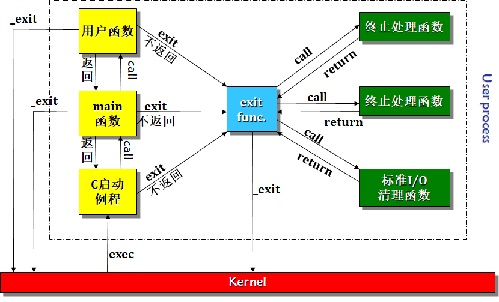
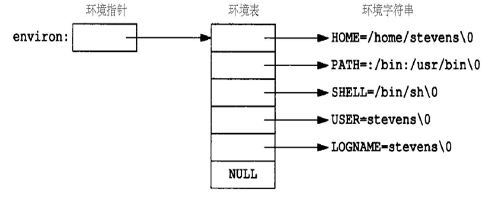
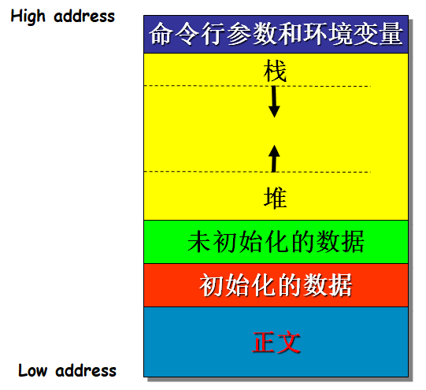
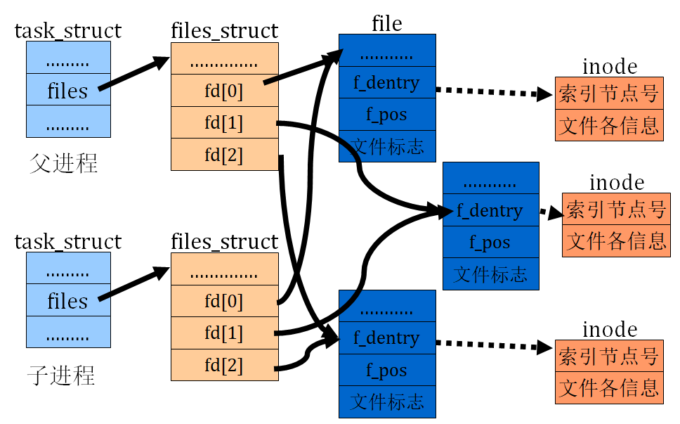

# 进程

## 进程环境

### main函数和命令行参数

通常，C程序总是从main函数开始执行

```c
int main(int argc, char *argv[]);
```

argc：命令行参数的个数

argv：指向命令行参数的各个指针所构成的数组，指向环境变量表

### 进程的启动和终止

8种方式使进程终止

正常终止

- 从main返回
- 调用exit (并不好，终止了回收)
- 调用 _exit或 _Exit
- 最后一个线程从其启动例程返回
- 最后一个线程调用pthread_exit

异常终止

- 调用abort
- 接到一个信号并终止
- 最后一个线程对取消请求做出响应

#### 进程终止

```c
void exit(int status);
void _Exit(int status);
void _exit(int status);
```

status：进程的终止状态

exit函数执行一个标准I/O库的清理关闭操作（为所有打开流调用fclose函数）后，进入内核

_Exit、 _exit函数立即进入内核

````c
#include<stdlib.h>
int main(){
  exit(34);
}//echo $?查看终止状态
````

#### atexit函数

当进程终止时，程序可能需要进行一些自身的清理工作，如资源释放等等

atexit函数提供了进行这样工作的机会

它允许用户注册若干终止处理函数，当进程终止时，这些终止处理函数将会被自动调用

```c
int atexit(void (*func)(void));
```

func：函数指针，返回值为void，无参

成功返回0，出错返回非0值

```cpp
#include <iostream>
#include <stdlib.h>

using namespace std;

void f(){
  cout << "in function f()" << endl;
}
void g(){
  cout << "in function g()" << endl;
}
void h(){
  cout << "in function h()" << endl;
}

int main(){
  atexit(f);
  atexit(g);
  atexit(h);
  exit(4);
}
```

```bash
$./a.out
in function h()
in function g()
in function f()
```

可见任务是以栈顺序注册，退出也是按栈的方式退出

现在 //exit(4); 虽然我们没有写return，编译器也会自动添加，从栈上取回返回地址返回C库

再将 exit(4)换成_exit(4);因为立即进入内核，C库无法进行调用

注意：先注册的函数，后被运行

调用_exit函数并不会触发终止处理函数



### 环境表和环境变量

每个进程都会接收到一张环境表，通过environ找到环境表

```c
extern char **environ;
```

环境字符串：name=value



C 数组传入函数方法

1. 数组，长度
2. 数组头指针，数组尾指针
3. 给头指针(结尾放NULL)

访问环境变量的方法

- 直接使用environ
- 使用getenv和putenv等函数

getenv函数用于获取环境变量值

```c
char* getenv(const char *name);
```

- 返回与name关联的value的指针，若未找到则返回NULL
- 返回的指针是指向新分配的内存，还是环境表中存在的值？（程序4.4）

```cpp
int main(void){
    char *p = getenv("SHELL");
    cout << p << endl;
    cout << "value of p: " << std::hex << (unsigned long)p << endl;
    cout << "value of environ: " << std::hex << (unsigned long)environ << endl;

    char **q = environ;
    for(;;){
        if(*q == NULL) break;
        cout << std::hex << (unsigned long)(*q) << " : " << *q << endl;
        q++;
    }
    return 0;
}
```

```bash
p: 7ffce5940f0d
7ffce5940f07 : SHELL = /bin/bash
```

在表内，并不是新分配的地方

#### 设置环境变量

三种方法：

- putenv
- setenv
- unsetenv

putenv函数将形式为name=value的字符串，放入环境表中；若name已经存在，则先删除其原来的定义。

```c
int putenv(char *str);
int setenv(const char* name, 
             const char* value, 
             int rewrite);
```

- setenv将环境变量name的值设置为value。
- 若name已经存在
  - rewrite != 0，则删除其原先的定义
  - rewrite == 0，则不删除其原先的定义

nunsetenv函数用于删除某个环境变量

```c
int unsetenv(const char* name);
```

删除name的定义

```cpp
char *item1 = "Student=OK";
int main(){
    char *item2 = new char[10];
    item2[0] = 'A';
    item2[1] = '=';
    item2[2] = 'B';
    item2[3] = 0;

    char item3[4];
    item3[0] = 'C';
    item3[1] = '=';
    item3[2] = 'D';
    item3[3] = 0;

    putenv(item1);//直接使用内存，没有进行新的分配
    putenv(item2);
    putenv(item3);

    char **q = environ;
    for (;;){
        if (*q == NULL) break;
        cout << std::hex << (unsigned long)(*q) << " : " << *q << endl;
        q++;
    }

    cout << "address of item1: " << hex << (unsigned long)item1 << endl;
    cout << "address of item2: " << hex << (unsigned long)item2 << endl;
    cout << "address of item3: " << hex << (unsigned long)item3 << endl;
    return 0;
}
```

### 存储空间布局

#### C程序存储空间布局



7FF...最高的用户态地址

栈： 主要用于支撑函数调用存放参数、局部变量等

堆：用于动态分配内存

未初始化：程序执行之前，将此段中的数据初始化为0，如：long sum[1000];

初始化：包含了程序中需明确赋初值的变量，如全局变量int maxcount=99;

正文：CPU执行的机器指令部分，正文段通常是共享、只读的

#### 不同系统的进程地址空间

Win95到2000 共享空间少，系统卡死情况就变少了

Linux64位的空间分配比32位简单，因为资源宽松，没有复杂的手段

查看Linux进程的地址空间

- $cat /proc/进程ID/maps
- /proc目录中的文件并不是真正的磁盘文件，而是由内核虚拟出来的文件系统，当前系统中运行的每个进程在/proc下都有一个子目录，目录名就是进程的id，查看目录下的文件可以得到该进程的相关信息。

### 内存分配

三个用于内存分配的函数

- malloc：分配指定字节数的存储区，此存储区中的初始值不确定
- calloc：为指定数量指定长度的对象分配存储空间，该空间中的每一位都初始化为0
- realloc：更改（增加或者减少）以前分配区的长度

C++中使用new

```c
void *malloc(size_t size);
void *calloc(size_t nobj, size_t size);
void *realloc(void *ptr, size_t newsize);
```

注意：三个函数返回的指针一定是适当对齐的

free函数用于释放已分配的内存，即将内存归还给堆

函数原型

```c
void free(void *ptr);
```

### setjmp和longjmp函数

```c
void g(){}
void f(){
  g();
}
void main{
    f();
}
```

在左侧的代码中，main函数调用了f函数，f函数中又调用了g函数

假设当g函数内部处理出错时，希望main函数能够感知到这一出错情况

这种情况下，最好重构代码:star2:

g函数内部处理出错，main函数能被通知到，可能的方法：

- 用goto，但层级一多也麻烦

- g函数通过返回值通知f函数，f函数再通过返回值通知main函数？（考虑函数调用深度）
- 使用setjmp和longjmp
- 使用C++异常处理

setjmp和longjmp函数实现函数之间的跳转

```c
int setjmp(jmp_buf env);
void longjmp(jmp_buf env, int val);
```

setjmp函数用于设置跳转的目的位置

longjmp函数进行跳转

- env：保留了需要返回的位置的堆栈情况
- setjmp的返回值：直接调用该函数，则返回0；若由longjmp的调用，导致setjmp被调用，则返回val（longjmp的第二个参数）

#### 各类变量的情况

```cpp
#include<setjmp.h>
mp_buf jmpbuffer;

void g(){
  cout << "in g()" << endl;
  longjmp(jmpbuffer, 2);
}

void f(){
  cout << "in f()" << endl;
  g();
  cout << "leave f()" << endl;
}

int globval;
int main()
{
  int autoval;
  register int regival; // 寄存器变量
  volatile int volaval; // 易失性内存
  static int statval;  

  cout << "begin" << endl;

  globval = 90;
  autoval = 91;
  regival = 92;
  volaval = 93;
  statval = 94;
  
  int i = setjmp(jmpbuffer);
  cout << "setjmp return code: " << i << endl;
  if(2 == i)
  {
    cout << "error code: "<< i << endl;
    cout << "globval= " << globval << "; ";
    cout << "autoval= " << autoval << "; ";
    cout << "regival= " << regival << "; ";
    cout << "volaval= " << volaval << "; ";
    cout << "statval= " << statval << "; " << endl;
    return 0;
  }

  globval = 0;
  autoval = 1;
  regival = 2;
  volaval = 3;
  statval = 4;

  cout << "globval= " << globval << "; "; // 0
  cout << "autoval= " << autoval << "; "; // 91
  cout << "regival= " << regival << "; "; // 92
  cout << "volaval= " << volaval << "; "; // 3
  cout << "statval= " << statval << "; " << endl; // 4

  f();  
  return 0;
}
```

当调用longjmp函数后，在main中的各类变量的值是否改变回原来的值？

1. **全局变量、静态变量、易失变量不受优化的影响**
2. **在优化的版本，自动变量和寄存器变量存储在寄存器中**

#### 变量回滚

```c
typedef struct{
    unsigned j_sp;  // 堆栈指针寄存器
    unsigned j_ss;  // 堆栈段
    unsigned j_flag;  // 标志寄存器
    unsigned j_cs;  // 代码段
    unsigned j_ip;  // 指令指针寄存器
    unsigned j_bp; // 基址指针 
    unsigned j_di;  // 目的指针
    unsigned j_es; // 附加段
    unsigned j_si;  // 源变址
    unsigned j_ds; // 数据段
} jmp_buf; 
```

- 保证局部变量在longjmp过程中一直保存它的值的方法：把它声明为volatile变量。（适合那些在setjmp执行和longjmp返回之间会改变的变量）
- 存放在内存中的变量，将具有调用longjmp时的值，而在CPU和浮点寄存器中的变量则恢复为调用setjmp函数时的值
- 优化编译时，register和auto变量都存放在寄存器中，而volatile变量仍存放在内存

volatile变量：一般在多线程中使用的比较多

- 例如有一个int x，有两个线程都要对其读写
- 有些编译器或CPU会将x保存在寄存器中，读的时候直接读取寄存器中的内容，而不是真实的x在内存中的内容
- 线程1，对x进行加1操作，此时内存中x的值为2
- 线程2想读x，结果从寄存器中读出1
- 给变量加上volatile，指示程序每次读写变量都必须从内存中读取，不要进行缓存（寄存器）

```c
#include        <stdio.h>
#define DATAFILE        "datafile"
FILE * open_data(void)
{
        FILE    *fp;
        char    databuf[BUFSIZ];  /* setvbuf makes this the stdio buffer */
        if ( (fp = fopen(DATAFILE, "r")) == NULL)
                return(NULL);
    // databuf是个局部变量，在退出前。C库认为是空的所以用了这个databuf，导致了
        if (setvbuf(fp, databuf, BUFSIZ, _IOLBF) != 0) 
                return(NULL);
        return(fp);             /* error */
}
```

#### 自动变量潜在问题

问题：

- open_data函数返回后，它在栈上所使用的空间将由下一个被调用函数所占用
- 但是标准I/O库仍使用位于栈上的databuf缓冲区
- 存在冲突和混乱

解决办法：

- 使用全局存储空间
- 使用静态存储空间
- 从堆中分配

```cpp
/* 异常处理 */
 void g(){
  printf("in g()\n");
  throw(32); // 逐层抛异常
}
void f(){
  printf("in f()\n");
  g();
  printf("leave f()\n");
}

int main(){
  printf("begin\n");
  
  try{ // C语言没有try和catch
      f();
  }
  catch(int a){
      printf("in catch: %d\n", a);
  }  

  return 0;
}
// head.h // try和catch的实现藏在这里
#include<setjmp.h>
jmp_buf jmpbuffer;
#define try \
    int jmp; \
    jmp = setjmp(jmpbuffer); \
    if(0 == jmp) \

#define throw(a) longjmp(jmpbuffer, a);

#define catch(a) \
    a = jmp; \
    if(0 != jmp)
```

```bash
$./a.out
begin
in f()
in g()
in catch: 32
```

#### Resource limits

Every process has a set of resource limits, some of which can be quire and changed by following functions.

```c
#include  <sys/time.h>
#include  <sys/resource.h>
int  getrlimit ( int resource,  struct  rlimit  *rlptr );
int  setrlimit ( int resource,  const struct  rlimit  *rlptr );
 
struct  rlimit {
	rlim_t     rlim_cur;    /* soft limit:  current limit */
	rlim_t     rlim_max;   /* hard limit:  maximum value for rlim_cur*/
}

```

resource musta be on of

- **RLIMIT_CPU**. CPU time limit in seconds. When the process reaches the soft limit, it is sent a SIGXCPU signal. 
- **RLIMIT_DATA** . The maximum size of the process  data segment (initialized data, uninitialized data, and heap).
- **RLIMIT_FSIZE**. The maximum size of files that the process may create. Attempts to extend a file beyond this limit result in delivery of a SIGXFSZ signal.  
- **RLIMIT_LOCKS**. A limit on the combined number of flock() locks and fcntl() leases that this process may establish.
- **RLIMIT_MEMLOCK**. The maximum number of bytes of virtual memory that may be locked into RAM using **mlock**() and **mlockall**().
- **RLIMIT_NOFILE**. Specifies a value one greater than the maximum file descriptor number that can be opened by this process. 
- **RLIMIT_NPROC**. The maximum number of processes that can be created for the real user ID of the calling process. 
- **RLIMIT_STACK**. The maximum size of the process stack, in bytes. Upon reaching this limit, a SIGSEGV signal is generated. 
- Etc.

Three rules govern the changing of the resource limits：

1. A soft limit can be changed by any process to a value less than or equal to its hard limit. 软的限制可以修改但小于等于硬限制
2. Any process can lower its hard limit to a value greater than or equal to its soft limits.  大于等于软的限制
3. Only superuser process can raise a hard limit.

## 进程控制

### 进程标识符

每个进程都有一个非负整型表示的唯一进程ID

进程ID总是唯一的

当进程终止后，其ID值可以重用

在unix中

- ID为0的进程：调度进程，称为swapper
- ID为1的进程：init进程，自举过程结束时由内核调用
- ID为2的进程：页守护进程，负责支持虚拟存储系统的分页操作

获取进程常见标识符

- 调用进程的进程ID：pid_t getpid();
- 调用进程的父进程ID：pid_t getppid();
- 调用进程的实际用户ID：uid_t getuid();
- 调用进程的有效用户ID：uid_t geteuid();
- 调用进程的实际组ID：gid_t getgid();
- 调用进程的有效组ID：gid_t getegid();

查看进程情况

```bash
$ps -ef | less
```

### fork等函数

一个进程可以调用fork函数创建一个新进程

新进程被称为子进程

````c
pid_t fork(void);
````

- fork函数调用一次，但是返回两次
- 在子进程中返回0，在父进程中返回子进程ID，出错返回-1
- 通过返回值，可以确定是在父进程还是子进程中

父进程 page（线性Addr）=物理地址 指向父进程的正文段和数据段

子进程 父进程 对应了自己的正文段（优化时只读的共享直接指向父进程正文段）和数据段

window会指定执行文件

小于等于4字节 eax寄存器返回，子进程ID eax寄存器

子进程和父进程继续执行fork调用之后的指令

子进程是父进程的副本

- 子进程获得父进程数据空间、堆和栈的副本
- 父子进程并不共享这些存储空间

- 父子进程共享正文段（只读的）

为了提高效率，fork后不并立即复制父进程空间，采用了COW（Copy-On-Write）

- 当父子进程任意之一，要修改数据段、堆、栈时，进行复制操作，但仅复制修改区域

为什么write调用的输出只有一次，而printf调用的输出出现了两次？

子进程中，变量的值改变了；而父进程中，变量的值没有改变。原因？

在使用fork函数时，一定要牢记子进程复制了父进程的地址空间

- 父进程在fork之前new了一个对象，子进程需要delete它吗？
- 父进程在fork之前open的文件，子进程需要close文件描述符吗？

fork的子进程，从堆里面复制需要进行释放。但是很难释放

复制父进程文件表，指向同一个file对象，引用计数加一。

为什么write调用的输出只有一次，而printf调用的输出出现了两次？

- write调用是不带用户空间缓冲的。在fork之前调用write，其数据直接写到了标准输出上
- 标准I/O库是带缓冲的，当标准输出连接到终端设备时，它是行缓冲，否则为全缓冲。
- 当printf输出到终端设备时，由于遇到换行符，因此缓冲被刷。子进程的数据空间中无缓冲内容
- 当重定向到文件时，变为全缓冲。fork后，子进程的数据空间中也有内容。所以输出两次

#### 父子进程共享文件对象



父子进程对同一文件使用了一个文件偏移量

上例中，父进程等待了子进程两秒钟，所以他们的输出才没有混乱；否则有可能出现乱序

文件描述符的常见处理方式

- 父进程等待子进程完成。父进程无需对描述符做任何处理，当子进程终止后，文件偏移量已经得到了相应的更新
- 父子进程各自执行不同的程序段，各自关闭文件描述符

#### Difference between parent and child after <u>fork</u>

Properties inherited from parent:

- **Real user/group ID, effective user/group ID**
- **Supplementary group ID**
- **Process group ID**
- **Session ID；**
- **Control terminal.**
- **Set-user/group-ID**
- **current work directory**
- **File mode mask**
- **Signal mask；**
- **environment；**
- **Resource limits**

Difference between parent and child：

- **return value from fork**
- **Process ID**
- **Parent process ID**
- **The child’s value for tms_utime ,tms_stime,tms_cutime,tms_ustime are set to 0**
- **File locks do not be inherited by child**
- **Pending alarm are cleared for child**

#### fork函数常见用法

一个父进程希望复制自己，使父子进程同时执行不同的代码段

- 网络服务程序中，父进程等待客户端的服务请求，当请求达到时，父进程调用fork，使子进程处理该次请求，而父进程继续等待下一个服务请求到达

一个进程要执行一个不同的程序

- 子进程从fork返回后，立即调用exec执行另外一个程序

代码4.10：封装fork（研究生课程）

#### vfork函数

vfork与fork的函数原型相同，但两者的语义不同

vfork用于创建新进程，而该新进程的目的是exec一个新程序（执行一个可执行的文件）

由于新程序将有自己的地址空间，因此vfork函数并不将父进程的地址空间完全复制到子进程中。

子进程在调用exec或exit之前，在父进程的地址空间中运行

vfork函数保证子进程先执行，在它调用exec或者exit之后，父进程才可能被调度执行

```c
int glob = 6;
int  main(void){
        int       var;
        pid_t   pid;
        var = 88;

	printf("pid = %d, glob = %d, var = %d\n", getpid(), glob, var);
        printf("before fork\n"); 

        if ( (pid = vfork()) < 0){ // 暂时阻塞
                cout << "fork error" << endl;
		return 0;
	}
        else if (pid == 0){
                glob++;
                var++;
		printf("In Child\n");

		_exit(0);
        } 

	printf("In Parents\n");
        printf("pid = %d, glob = %d, var = %d\n", getpid(), glob, var);
        
	return 0;
}
```

```bash
pid = 2263, glob = 6, var = 88
before fork
In child
In parents
pid = 2263, glob = 7, var = 89 
```

子进程中对glob、var加1操作，结果改变了父进程中的变量值。原因？父子是一个共享的关系

### exit函数

正常终止

- 从main返回
- 调用exit：ISO C定义
- 调用_exit或_Exit：前者由ISO C定义，后者由POSIX.1定义
- 最后一个线程从其启动例程返回
- 最后一个线程调用pthread_exit

异常终止

- 调用abort：产生SIGABRT信号
- 接到某些信号
- 最后一个线程对取消请求做出响应

不管进程如何终止，最后都会执行内核中的同一段代码：为相应进程关闭所有打开描述符，释放内存等等

若父进程在子进程之前终止了，则子进程的父进程将**变为init进程**，其PID为1；保证每个进程都有父进程

当子进程先终止，父进程如何知道子进程的终止状态（exit(5)）

- 内核为每个终止子进程保存了终止状态等信息
- 父进程调用wait等函数，可获取该信息

当父进程调用wait等函数后，内核将释放终止进程所使用的所有内存，关闭其打开的所有文件

僵尸进程：对于已经终止、但是其父进程尚未对其调用wait等函数的进程

```c
int  main(void){
	pid_t pid;
	printf("before fork\n"); 

	if ( (pid = fork()) < 0){
		cout << "fork error" << endl;
		return 0;
	}
	else if (pid == 0){
		cout << "Child exit" << endl;
		exit(2);
    } 
	else{
		sleep(600);
	}        
	return 0;
}
```

程序演示(4.14 后台启动) ps

- Defunct：死了的

对于父进程先终止，而被init领养的进程会是僵尸进程吗？

- init对每个终止的子进程，都会调用wait函数，获取其终止状态

### wait等函数

当一个进程正常获知异常终止时，内核就向其父进程发送SIGCHLD信号

父进程可以选择忽略该信号，也可以提供信号处理函数

系统的默认处理方式：忽略该信号，不关心就传个0

wait函数可用于获取子进程的终止状态

```c
pid_t wait(int *statloc);
```

- statloc：可用于存放子进程的终止状态
- 返回值：若成功返回终止进程ID，出错返回-1

调用wait函数之后，进程可能出现的情况

- 如果所有子进程都还在运行，则阻塞等待，直到有一个子进程终止，wait函数才返回
- 如果一个子进程已经终止，正等待父进程获取其终止状态，则wait函数会立即返回
- 若进程没有任何子进程，则立即出错返回

注意：若接收到信号SIGCHLD后，调用wait，通常wait会立即返回

参数statloc

- statloc可以为NULL，表明父进程不需要子进程的终止状态。为了防止子进程成为僵尸或者需等待子进程结束
- 若statloc不是空指针，则进程终止状态就存放在它指向的存储单元中

statloc指向的存储单元，存放了诸多信息，可以通过系统提供的宏获取

| 宏                   | 说明                                                         |
| -------------------- | ------------------------------------------------------------ |
| WIFEXITED(status)    | 若为正常终止子进程返回的状态，则为真。  对于这种情况可以执行WEXITSTATUS(status)，  取子进程传递给exit、_exit、_Exit参数的低8位 |
| WIFSIGNALED(status)  | 若为异常终止子进程返回的状态，则为真。  对于这种情况可执行WTERMSTG(status)，  取使子进程终止的信号编号 |
| WIFSTOPPED(status)   | 若为当前暂停子进程的返回的状态，则为真。  对于这种情况，可执行WSTOPSIG(status)，  取使子进程暂停的信号编号 |
| WIFCONTINUED(status) | 若在作业控制暂停后已经继续  的子进程返回了状态，则为真       |

尽量用自己的通信方式，避免用宏通信

```c
int main(void)
{
	pid_t pid;
	printf("before fork\n");

	if ((pid = fork()) < 0){
		cout << "fork error" << endl;
		return 0;
	}
	else if (pid == 0){
		exit(4);
	}
	else{
		int status;
		wait(&status);
		if (WIFEXITED(status)){
			cout << "exit code: " << WEXITSTATUS(status) << endl;
		}
	}
	return 0;
}
```

#### waitpid函数

waitpid函数可用于等待某个特定的进程

如果一个进程有几个子进程，那么只要有一个子进程终止，wait就返回

如何才能等待一个指定的进程终止？

- 调用wait，然后将其返回的进程ID和所期望的进程ID进行比较
- 如果ID不一致，则保存该ID，并循环调用wait函数，直到等到所期望的进程ID为止
- 下一次又想等待某一特定进程时，先查看已终止的进程列表，若其中已有要等待的进程，则无需再调用wait函数

```c
pid_t waitpid(pid_t pid, int *statloc, int options);
```

- 成功返回进程ID，失败返回-1
- statloc：存放子进程终止状态，不关心可以传个0进去

参数pid

- pid==-1：等待任一子进程，同wait
- pid>0：等待进程ID为pid的子进程
- pid==0：等待其组ID等于调用进程组ID的任一子进程
- pid<-1：等待其组ID等于pid绝对值的任一子进程

参数options：可以为0，也可以是以下常量或运算的结果

- WCONTINUED
- WUNTRACED
- WNOHANG：若pid指定的子进程并不是立即可用的，则waitpid不阻塞，此时其返回0

程序演示waitpid的非阻塞版本

```c
int main(void)
{
	pid_t pid;
	printf("before fork\n");
	if ((pid = fork()) < 0){
		cout << "fork error" << endl;
		return 0;
	}
	else if (pid == 0){
		cout << "child sleep" << endl;
		sleep(5);
		cout << "child exit" << endl;
	}
	else{
		sleep(1);
		if (waitpid(pid, NULL, WNOHANG) == 0){ // 不关心终止状态无阻塞
			cout << "waitpid return 0" << endl;
		}

		wait(NULL);
	}

	return 0;
}
```


### exec等函数

### 更改用户ID和组ID

system函数

进程会计

用户标识和进程时间

## 进程关系