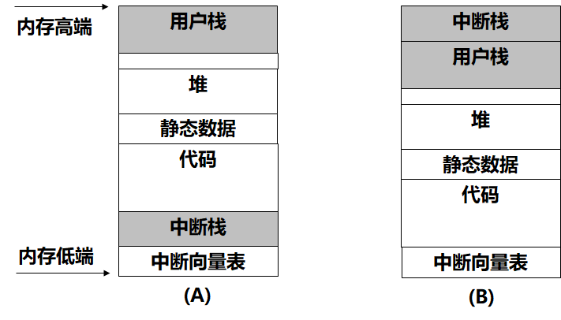
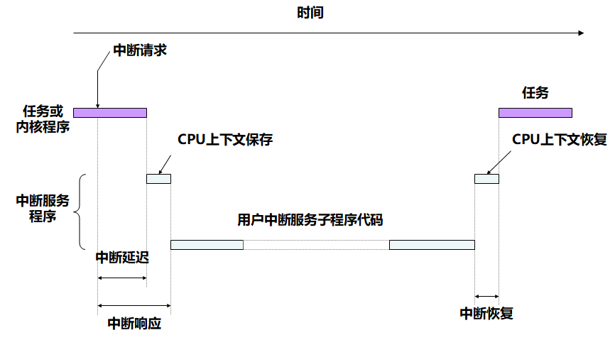
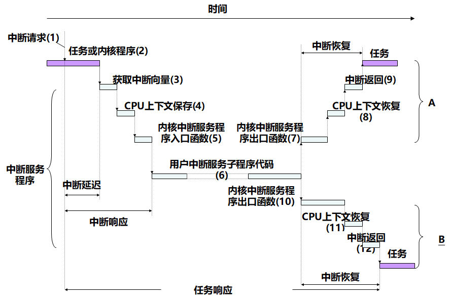

# 中断管理

## 中断概述

发展过程

- 中断（interrupt）最初被用来替换I/O操作的**轮询处理**方式，以提高I/O处理的效率
- 随后，中断又包含了**自陷**（trap，也称为**内部中断或是软件中断**）的功能
- 后来，中断的概念得到进一步扩大，被定义为导**致程序正常执行流程发生改变的事件**（不包括程序的分支情况）。可把概念被扩大的中断称为**广义中断**

在实际应用中，广义的中断通常被分为中断、自陷和异常（exception）等类别。

- 中断是由于CPU外部的原因而改变程序执行流程的过程，属于异步事件，又称为硬件中断。自陷和异常则为同步事件
- 自陷表示通过处理器所拥有的**软件指令**、可预期地使处理器正在执行的程序的执行流程发生变化，以执行特定的程序。自陷是**显式的事件**，需要无条件地执行
  - Motorola 68000系列中的Trap指令
  - ARM中的SWI指令
  - Intel 80x86中的INT指令

- 异常为CPU自动产生的自陷，以处理异常事件
  - 如被0除、执行非法指令和内存保护故障等
  - **异常没有对应的处理器指令**，当异常事件发生时，处理器也需要无条件地挂起当前运行的程序，执行特定的处理程序

## 中断的分类

分类方式

- 硬件中断是否可以被屏蔽
  - 可屏蔽中断和不可屏蔽中断
- 中断源
  - 硬件中断和软件中断
- 中断信号的产生
  - 边缘触发中断和电平触发中断
- 中断服务程序的调用方式
  - 向量中断、直接中断和间接中断  

### 可屏蔽中断和不可屏蔽中断

由于中断的发生是异步的，程序的正常执行流程随时有可能被中断服务程序打断。如果程序正在进行某些重要运算，中断服务程序的插入将有可能改变某些寄存器的数据，造成程序的运行发生错误

可屏蔽中断：能够被屏蔽掉的中断

- 外部设备的中断请求信号一般需要先通过CPU外部的中断控制器，再与CPU相应的引脚相连

- **可编程中断控制器**可以通过软件进行控制，以禁止或是允许中断。

不可屏蔽中断：在任何时候都不可屏蔽的

- 一个比较典型的例子是掉电中断，当发生掉电时，无论程序正在进行什么样的运算，它都肯定无法正常运行下去。这种情况下，急需进行的是一些掉电保护的操作。对这类中断，应随时进行响应

### 硬件中断和软件中断

硬件中断：由于CPU外部的设备所产生的中断

- 异步事件：可能在程序执行的任何位置发生，发生中断的时间通常是不确定的

软件中断：同步中断或是自陷，通过处理器的软件指令来实现

- 产生中断的<u>时机是预知的</u>，可根据需要在程序中进行设定
- 软件中断的处理程序以**同步的方式**进行执行
- 其处理方式同硬件中断处理程序类似

软件中断是一种非常重要的机制

- 系统可通过该机制在**用户模式执行特权模式**下的操作
- 是**软件调试**的一个重要手段，如Intel 80x86中的INT 3，使指令进行单步执行，调试器可以用它来形成观察点，并查看随程序执行而动态变化的事件情况

### 边缘触发中断和电平触发中断

边缘触发中断：中断线从低变到高或是从高变到低时，中断信号就被发送出去，并只有在下一次的从低变到高或是从高变到低时才会再度触发中断

- 事件发生的时间非常短，有可能出现中断控制器丢失中断的情况
- 如果多个设备连接到同一个中断线，即使只有一个设备产生了中断信号，也必须调用中断线对应的所有中断服务程序来进行匹配（寻找中断来源），否则会出现中断的软件丢失情况

电平触发中断：在硬件中断线的**电平发生变化**时产生中断信号，并且中断信号的有效性将持续保持下去，直到中断信号被清除(常用方式)

- 能够降低中断信号传送丢失的情况
- 能通过更有效的方式来服务中断，每个为该中断服务后的ISR都要向外围设备进行确认，然后**取消**该设备对中断线的操作
- 当中断线的最后一个设备得到中断服务后，**中断线的电平就会发生变化**，不用对连接到同一个硬件中断线的所有中断服务程序进行尝试

### 向量中断、直接中断和间接中断

向量中断：通过**中断向量**来调用中断服务程序

- 中断硬件设备的硬件中断线（也称为中断请求IRQ）被中断控制器汇集成中断向量（interrupt vector）
- 每个中断向量对应一个中断服务程序（interrupt service routine，ISR），用来存放**中断服务程序的入口地址**或是**中断服务程序的第一条指令**
- 系统中通常包含多个中断向量，存放这些中断向量对应中断服务程序入口地址的内存区域被称为中断向量表
- 在Intel 80x86处理器中，中断向量表包含256个入口，每个中断向量需要四个字节（存放中断服务程序的首址）
- ARM的中断向量表开始于内存地址0x00000000或是0xFFFF0000处

直接中断：中断对应的中断服务程序**的入口地址是一个固定值**，当中断发生的时候，程序执行流程将直接跳转到中断服务程序的入口地址，执行中断服务程序

间接中断：中断服务程序的入口地址由**寄存器**提供

### 中断控制器

对多个可屏蔽中断源进行管理，使CPU核心能和更多的中断资源相联系。

能够对中断进行排队

- 避免中断信号的丢失
- 对不同的中断进行优先级配置，使高优先级中断能够中断低优先级中断，满足系统中具有更高时间约束特性功能的需要

Intel 80x86的可编程中断控制器8259A

采用主从式和级联式等实现多设备管理

在基于x86的架构中，8259是一个非常通用的中断控制器芯片（称为PIC，programmable interrupt controller）

每个PIC只能够处理8个中断，为支持更多数量的中断，需要组织成菊花链（daisy chain）的方式，把一个PIC的输出连接到另一个PIC的输入上

## 中断处理的过程

中断处理的过程分为

- 中断检测
- 中断响应
- 中断处理

### 中断检测

中断检测在**每条指令结束时**进行，检测是否有中断请求或是否满足异常条件

为满足中断处理的需要，在指令周期中使用了**中断周期**

在中断周期中，处理器检查是否有中断发生，即是否出现中断信号

- 没有中断信号：处理器继续运行，并通过取指周期取当前程序的下一条指令
- 有中断信号：将进入中断响应，对中断进行处理

### 中断响应

中断响应是由处理器内部硬件完成的中断序列，而不是由程序执行的。

中断响应过程

- 保存当前程序执行位置和执行状态
- 屏蔽中断
- 跳转到ISR

在Intel 80x86中，中断响应过程的操作如下

1. 对可屏蔽中断，从8259中断控制器芯片读取中断向量号
2. 将标志寄存器EFLAG、CS和IP压栈
3. 对于硬件中断，复位标志寄存器中的IF和TF位，禁止可屏蔽外部中断和单步异常
4. 根据中断向量号，查找中断向量表，根据中断服务程序的首址转移到中断服务程序执行

### 中断处理

中断处理：执行中断服务程序

- 中断服务程序用来处理自陷、异常或是中断
- 尽管导致自陷、异常和中断的事件不同，但大都具有相同的中断服务程序结构

中断服务程序的主要内容：

1. 保存上下文：保存中断服务程序将要使用的所有寄存器的内容，以便于在退出中断服务程序之前进行恢复
2. 如果中断向量被多个设备所共享，为了确定产生该中断信号的设备，需要轮询这些设备的中断状态寄存器
3. 获取中断相关的其他信息
4. 对中断进行具体的处理
5. 恢复保存的上下文
6. 执行中断返回指令，使CPU的控制返回到被中断的程序继续执行

中断嵌套

- 如果对一个中断的处理还没有完成，又发生了另外一个中断，则称系统中发生了中断嵌套

处理方式

- 非嵌套的中断处理方式：在处理一个中断的时候，禁止再发生中断
- 嵌套的中断处理方式：定义中断优先级，允许高优先级的中断打断低优先级中断的处理过程

#### 非嵌套的中断处理方式

处理中断的时候，将屏蔽所有其他的中断请求

- 如果程序执行过程中发生了中断，在执行中断服务程序的时候将禁止中断
- 中断服务程序执行完成后，恢复正常执行流程被中断的程序之前再使能中断，并由处理器检查是否还有中断

特点

- 非嵌套中断处理方式使中断能够按发生顺序进行处理，ISR设计简单
- 没有考虑优先级，使高优先级中断不能得到及时的处理，甚至导致中断丢失

#### 嵌套的中断处理方式

嵌套的中断处理方式：定义中断优先级，允许高优先级的中断打断低优先级的中断的处理过程

- 中断服务程序只**屏蔽**那些比当前中断优先级低或是与当前中断优先级相同的中断，在完成必要的上下文保存后即使能中断
- **高优先级中断**请求到达的时候，需要对当前中断服务程序的状态进行保存，然后调用高优先级中断的服务程序
- 当高优先级中断的服务程序执行完成后，再**恢复**先前的中断服务程序继续执行

**发生中断嵌套时**，如果需要进行任务调度，任务的调度将延迟到最外层中断处理结束时才能发生(没有嵌套的时候才能用OS_Sched)

```c
if((OSIntNesting ==0)&&(OSLockNesting == 0))
```

## 实时内核的中断管理

中断服务程序通常包括三个方面的内容

1. 中断前导：保存中断现场，进入中断处理
2. 用户中断服务创新：完成对中断的具体处理
3. 中断后续：恢复中断现场，退出中断处理

实时多任务系统中，内核会接管ISR的前导和后续部分，同时提供其他中断管理功能

### 中断接管程序负责中断前导和中断后续部分内容

- 硬件中断发生后，中断接管程序获得控制权，先由中断接管程序进行处理，然后才将控制权交给相应的用户中断服务程序
- 用户中断服务程序执行完成后，又回到中断接管程序
- 中断处理前导：保存必要的寄存器，并根据情况在中断栈或是任务栈中设置堆栈的起始位置，然后调用用户中断服务程序
- 中断处理后续：实现中断返回前需要处理的工作，主要包括恢复寄存器和堆栈，并从中断服务程序返回到被中断的程序
- 如果需要在用户中断服务程序中使用关于**浮点运算**的操作，<u>中断前导和中断后续中还需要分别对浮点上下文进行保存和恢复</u>
- 用户中断服务程序被组织为一个表，称为虚拟中断向量表


ucosii中断管理比较弱，没有这个结构

如果中断处理导致系统中出现比被中断任务具有更高优先级的就绪任务出现：

- 需要把高优先级任务放入就绪队列；
- 把被中断的任务从执行状态转变为就绪状态
- 完成用户中断服务程序后，在中断接管程序的中断后续处理中激活重调度程序，使高优先级任务能在中断处理工作完成后得到调度执行

在允许中断嵌套的情况下，在执行中断服务程序的过程中，如果出现高优先级的中断：

- 当前中断服务程序的执行将被打断，以执行高优先级中断的中断服务程序
- 当高优先级中断的处理完成后，被打断的中断服务程序才又得到继续执行
- 发生中断嵌套时，如果需要进行任务调度，任务的调度将延迟到最外层中断处理结束时才能发生

中断服务程序使用被中断任务的任务栈空间

- 在允许中断嵌套处理的情况下，如果中断嵌套层次过多，中断服务程序所占用的任务的栈空间可能比较大，将导致任务栈溢出。

使用**专门的中断栈**来满足中断服务程序的需要，降低任务栈空间使用的不确定性

- 在系统中开辟一个单独的中断栈，为所有中断服务程序所共享。
- 中断栈必须拥有足够的空间，即使在最坏中断嵌套的情况下，中断栈也不能溢出。

如果实时内核没有提供单独的中断栈，就需要为任务栈留出足够的空间，不但要考虑通常的函数嵌套调用，还需要满足中断嵌套的需要。

- 使用单独的中断栈还能有效降低整个系统对栈空间的需求，否则需要为每个任务栈都预留处理中断的栈空间。

 中断栈在内存中的布局情况



```c
YourISR:
    Save all CPU registers;                                 (1)
    Call OSIntEnter() or, increment OSIntNesting directly;  (2)
    if (OSIntNesting == 1) {                                (3)
        OSTCBCur->OSTCBStkPtr = SP;                         (4)
    }
    Clear interrupting device;                              (5)
    Re-enable interrupts (optional)                         (6)
    Execute user code to service ISR;                       (7)
    Call OSIntExit();                                       (8)
    Restore all CPU registers;                              (9)
    Execute a return from interrupt instruction;            (10)

void OSIntEnter (void){
    OS_ENTER_CRITICAL();
    OSIntNesting++;
    OS_EXIT_CRITICAL();
}
void OSIntExit (void){
OS_ENTER_CRITICAL();
if ((--OSIntNesting | OSLockNesting) == 0) {
    OSIntExitY = OSUnMapTbl[OSRdyGrp];
    OSPrioHighRdy = (INT8U)((OSIntExitY << 3) +
    OSUnMapTbl[OSRdyTbl[OSIntExitY]]);
    if (OSPrioHighRdy != OSPrioCur) {
        OSTCBHighRdy = OSTCBPrioTbl[OSPrioHighRdy];
        OSCtxSwCtr++;
        OSIntCtxSw();
        }
    }
    OS_EXIT_CRITICAL();
}
```

### 实时内核通常提供如下中断管理功能

- 挂接中断服务程序。把一个函数（用户中断服务程序）同一个虚拟中断向量表中的中断向量联系在一起。当中断向量对应中断发生的时候，被挂接的用户中断服务程序就会被调用执行
- 获得中断服务程序入口地址。根据中断向量，获得挂接在该中断向量上的中断服务程序的入口地址
- 获取中断嵌套层次。在允许中断嵌套的处理中，获取当前的中断嵌套层次信息
- 开中断
- 关中断

## 用户中断服务程序

### 用户ISR编写规则

如果处理器或实时内核允许中断嵌套，要求中断服务程序是**可重入**的

- 中断服务程序将可能被另外的中断服务程序所抢占

中断服务程序应该尽可能比较短

- 由于中断服务程序中通常都对中断进行了屏蔽
- 保证其他中断和系统中的任务能够得到及时处理
- 中断服务程序通常都只处理一些必要的操作，其他操作则**通过任务**的方式来进行
- 中断服务程序只是进行与外围设备相关的数据的读写操作，并在需要的情况下向外围设备发送确认信息，然后唤醒另外的任务进行进一步的处理

- 用来**配合中断服务程序**的另外的任务通常被称为**DSR（deferred service routine）**

 ISR与DSR相结合的中断处理方式

```c
/*Uses to handle data from dataReceiveISR*/
dsrTask(){
       while(1){
            wait_for_signal_from_isr();
            process_data_of_ISR();
       }
}

/*Uses to receive data by interrupt
没有处理过的数据，可以放在任务里面做*/
dataReceiveISR(){
       …
       get_data_from _device();
       send_signal_to_wakeup_dsrTask();
       …
}
```

#### 中断服务程序使用内核接口的特殊性

- 在中断服务程序中可以使用实时内核提供的API
- 但一般只能使用不会导致调用程序可能出现阻塞情况的编程接口，如进行挂起任务、唤醒任务、发送消息等操作（因为某些传参方式无法使用）
- 不要使用分配内存、获得信号量等可能导致中断服务程序的执行流程被阻塞的操作
  - 对中断的处理不受任务调度程序的控制，并优先于任务的处理
  - 如果中断出现被阻塞的情况，将导致中断不能被及时处理，其余工作也就无法按时继续进行，将严重影响整个系统的确定性
- 不能使用关于对象创建和删除方面（如任务创建与任务删除）的操作

#### 中断服务程序与任务的主要交互机制包括

- 共享内存：中断服务程序同任务共享变量、缓冲区，实现中断服务程序与任务之间的通信
- 信号量：中断服务程序可以释放任务正在等待的信号量
- 消息队列：中断服务程序可以把消息发送给正在等待该消息的任务
- 管道：中断服务程序可以把消息写到任务可以进行消息读取的管道中
- 异步信号：中断服务程序可以向任务发送异步信号，使任务对应的异步信号处理程序能够得到执行

因为可抢占性，usosii在退出中断时可能会产生新的中断

## 中断时序*

- 中断延迟时间(Interrupt latency time)
  - 是指从硬件中断发生到开始执行中断处理程序第一条指令之间的这段时间
  - 中断发生到系统获知中断，并开始执行中断服务程序所需最大时间
  - 中断延迟时间 ＝ 最大关中断时间＋硬件开始处理中断到开始执行ISR第一条指令之间的时间
- 中断响应时间(response time)：中断的响应过程的时间
  - 抢占式：中断响应时间（抢占式调度） ＝ 中断延迟 ＋ 保存CPU内部寄存器的时间 ＋ 内核中断服务程序入口函数的执行时间
  - 前后台：中断响应时间 ＝ 中断延迟 ＋ 保存CPU内部寄存器的时间
- 中断恢复时间(recovery time) ：指从中断响应成功（即开始执行中断服务例程(ISR)的第一条指令时刻）一直到中断服务函数执行完毕再到切换回被中断的任务的接着一条代码执行所经历的时间
  - 中断恢复时间 ＝ 恢复CPU内部寄存器的时间 ＋ 执行中断返回指令的时间

中断延迟时间与中断响应时间的区别

- 前者指到中断服务程序的第一条指令
- 而后者指到用户的中断服务程序的第一条指令

非抢占式调度内核的中断时序图



前后台系统的中断时序与之类似，区别：非抢占前面可能是任务或内核，前后台是后台程序

抢占式调度内核的中断时序图



10 由DSR进行管理，可能不会回到原有程序，不同分支出口时间可能不同

中断延迟时间是指从中断发生到系统获知中断，并且开始执行中断服务程序所需要的最大滞后时间

中断延迟时间受到系统关中断时间的影响

- 实时系统在进入临界区代码段之前要关中断，执行完临界代码之后再开中断
- 关中断的时间越长，中断延迟就越长，并且可能引起中断丢失
- 中断延迟时间

“硬件开始处理中断到开始执行ISR第一条指令之间的时间”由硬件决定

在确定中断延迟时间时，要使用**最坏情况下的关中断时间**，即最大关中断时间

“最大关中断时间”取决于两方面的因素：

- 内核关中断时间
  - 内核在执行一些临界区的代码时采取了关中断
- 应用关中断时间
  - 在应用程序中也可以关中断
- 关中断的最长时间应该是这两种关中断时间的最大值

前后台系统和非抢占式调度系统：

- 保存CPU上下文（主要是其内部寄存器的内容）以后立即执行用户的中断服务子程序代码

抢占式调度系统：

- 处理中断时先要做一些处理
- 确保中断返回前调度程序能正常工作
- 要先调用**内核中断服务程序入口函数**
  - 通知内核即将进行中断服务，使得内核可以跟踪中断的嵌套，以便在解除中断嵌套后进行重调度

中断恢复时间

**用户中断服务程序结束后**回到被中断代码之间的时间

前后台系统和非抢占式调度系统：

- 恢复CPU上下文的时间
- 执行中断返回指令的时间
