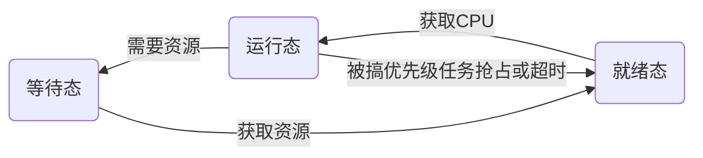

# 任务管理与调度


```c
int main(void)
{
     // Initialize uCOS-II.
    OSInit();
    // Create the first task
    OSTaskCreate(TestTask1, (void *) 11, &TestTaskStk1[TASK_STK_SIZE], 11);
    // Start multitasking.
    OSStart();
    return 0;
}

void TestTask1(void *pdata)
{   printf("%4u: ***** Test Task 1 First call *****\n", OSTime);

    //Create 3 other tasks
    OSTaskCreate(TestTask2, (void *) 22, &TestTaskStk2[TASK_STK_SIZE], 22);     
    OSTaskCreate(TestTask3, (void *) 33, &TestTaskStk3[TASK_STK_SIZE], 33);
    OSTaskCreate(TestTask4, (void *) 10, &TestTaskStk3[TASK_STK_SIZE], 10);

    while (1)
    {   
        printf("%4u: ***** Test Task 11 *****\n", OSTime);
        OSTimeDly(1);                                                           
    }
}
void TestTask2(void *pdata)
{   
    while (1)
    {   printf("%4u: ***** Test Task 22 *****\n", OSTime);

        OSTimeDly(1);
    }
}

void TestTask3(void *pdata)
{   
    while (1)
    {
        printf("%4u: ***** Test Task 33 *****\n", OSTime);
        OSTimeDly(1);
    }
}

void TestTask4(void *pdata)
{   
    while (1)
    {
        printf("%4u: +++++ Test Task 10 +++++\n", OSTime);
        OSTaskSuspend(10); //Suspend yourself

    }
}
```

 采用多任务的好处

- 任务的**规模较小**

  每个任务更容易编码和调试，其质量也更容易得到保证

- 不少**应用本身**就是由多个任务构成的

  如一个应用可能需要进行以下任务的处理：计算、从网络获取数据和刷新显示屏幕

  采用多任务的处理方式是应用问题的一个非常自然的解决方式

- 任务之间具有较高的独立性，耦合性小

  通过增加新的任务就能方便的**扩充系统功能**

- **实时性强**

  保证紧急事件得到优先处理成为可能

在嵌入式实时系统中

- 任务（task）通常为进程（process）和线程（thread）的统称

- 任务是调度的基本单位

进程最初由Multics的设计者在60年代提出来的，主要包括以下内容 

- 一个正在执行的程序；

- 计算机中正在运行的程序的一个实例；

- 可以分配给处理器，并由处理器执行的一个实体；

- 由一个顺序的执行线程、一个当前状态和一组相关的系统资源所刻画的活动单元。

进程由**代码、数据、堆栈**和**进程控制块**构成

- 进程控制块包含了操作系统用来控制进程所需要的信息：
  - 进程状态
  - CPU寄存器
  - 调度信息
  - 内存管理信息
  - I/O状态信息等

早期的进程，包含了以下两个方面的内容 

- 资源。进程是资源分配的基本单位，一个进程包括一个保存进程映像的虚拟地址空间、主存、I/O设备和文件等资源。

- 调度执行。进程作为操作系统的调度实体，是调度的基本单位。

随着操作系统的发展，进程所包含的两个方面的内容逐渐被分开

- 轻量级进程或线程：调度执行的单位

- 进程：资源分配的单位
  - 线程是进程内部一个相对独立的控制流，由线程上下文和需要执行的一段程序指令构成
  - 在进程中，所有线程共享该进程的状态和资源，可以访问相同的数据

使用线程的优势

- 创建：在一个已有进程中创建一个新线程比创建一个全新的进程所需的时间开销少；
- 终止：终止一个线程比终止一个进程所花费的时间少；
- 切换：线程切换比进程切换所花费的时间少；
- 通信：使同一进程内部不同线程之间的通信效率得到显著提高。

在大多数操作系统中，不同进程之间的通信需要内核的干预，而同一进程内部不同线程之间则可直接通信。  

大多数嵌入式实时内核：**单进程/多线程**模型，或简单地称为**任务模型**

- 把整个应用当作一个没有定义的进程来对待；

- 应用则被划分为多个任务的形式来进行处理。

- 适用于实时性要求较高的、相对简单的应用

也有一些嵌入式实时操作系统采用了**多进程/多线程**模型：

- 系统中包含多个进程，每个进程对应又包含多个线程

- 适合于处理复杂的应用

## 任务

任务是一个具有**独立功能**的**无限循环**的程序段的一次运行活动，是实时内核调度的单位，具有以下特性

- 动态性：任务状态是不断变化的
  - 一般分为**就绪态、运行态和等待态**。
  - 在多任务系统中，任务的状态将随着系统的需要不断进行变化。
- 并行性
  - 系统中同时存在多个任务，这些任务在宏观上是同时运行的。
- 异步独立性
  - 每个任务各自按**相互独立**的**不可预知**的速度运行，走走停停。 

### 任务内容

任务主要包含以下内容 

- 代码：一段可执行的程序

- 数据：程序所需要的相关数据（变量、工作空间、缓冲区等）

- 堆栈

- 程序执行的上下文环境

```c
void YourTask (void *pdata){
    /* USER CODE */
    OSTaskDel(OS_PRIO_SELF);//转到休眠状态
}
OSTaskCreate(TestTask1, (void *)11,&TestTaskStk1(TASK_STK_SIZE),11);//这里的11是用户自定义的数字可以不一样，这里引用了函数指针和指明了使用的堆栈
```

任务与程序的区别 

- 任务能真实地描述工作内容的并发性，而程序不能；

- 程序是任务的组成部分
  - 除程序外，任务还包括数据、堆栈及其上下文环境等内容；

- 程序是静态的，任务是动态的；

- 任务有生命周期，有诞生、有消亡，是短暂的；而程序是相对长久的；

- 一个程序可对应多个任务，反之亦然；

- 任务具有创建其他任务的功能，而程序没有。 

任务上下文环境（context）

- 包括了实时内核**管理任务**、以及处理器**执行任务**所需要的所有信息。
  - **任务优先级**
  - **任务的状态**等实时内核所需要的信息
  - 以及处理器的**各种寄存器的内容（hardware context）**：程序计数器、堆栈指针、通用寄存器等的内容

- 任务的上下文环境通过**任务控制块**（Task Control Block，TCB）来体现。

按照到达情况的可预测性，任务可以划分为

- 周期任务（periodic task）：周期任务每隔一个固定的时间间隔就会执行一次

- 非周期任务：非周期任务执行的间隔时间则为不确定的
  - sporadic task：有最小到达间隔时间限制
  - aperiodic task：没有到达时间限制

按照重要程度，可分为

- 关键任务（critical task）：为需要得到**及时执行**的任务，否则将出现灾难性的后果

- 非关键任务（noncritical task）：如果没有得到及时执行，则不会产生严重后果 

### 任务参数

- 优先级（priority）

- 周期（period）

- 计算时间（computation time）

- 就绪时间（ready time）

- 截止时间（deadline）

#### 任务优先级

表示任务对应工作内容在处理上的优先程度

优先级越高，表明任务越需要得到优先处理

任务的优先级分为静态优先级和动态优先级。

静态优先级：任务的优先级被确定后，在系统运行过程中将不再发生变化；

动态优先级：系统运行过程中，任务的优先级是可以动态变化的。 

#### 周期

周期任务所具有的参数，表示任务周期性执行的间隔时间

#### 任务的计算时间

任务在**特定硬件环境下**被完整执行所需要的时间，也被称为是**任务的执行时间**（execution time）

由于任务每次执行的软件环境的差异性，导致任务在各次具体执行过程中的计算时间各有不同

通常用**最坏情况下的执行时间**（worst case time）或是需要的最长执行时间来表示，也可用**统计时间**（statistical time）来表示

#### 任务的就绪时间

任务具备了在处理器上被执行所需要条件时的时间。 

#### 任务的截止时间

意味着任务需要在该时间到来之前被执行完成。

截止时间可以通过**绝对截止时间**（absolute deadline）和**相对截止时间**（relative time）两种方式来表示

- 相对截止时间为任务的绝对截止时间减去任务的就绪时间。

截止时间可以分为**强截止时间**（hard deadline）和**弱截止时间**（soft deadline）两种情况：

- 具有强截止时间的任务即为**关键任务**，如果截止时间不能得到满足，就会出现严重的后果。

- 拥有关键任务的实时系统又被称为**强实时**（hard real-time）系统，否则称为**弱实时**（soft real-time）系统。 

## 任务管理

### 任务状态与变迁

任务拥有的**资源情况**是不断变化的，导致**任务状态**也表现出不断变化的特性。

不同的实时内核实现方式对任务状态的定义不尽相同，但是都可以概括为三种基本的状态：

- 等待（waiting）：任务在等待某个事件的发生；

- 就绪（ready）： 任务等待获得处理器资源；

- 执行（running）：任务获得处理器资源，所包含的代码内容正在被执行。 

在单处理器系统中：

- 任何时候都**只有一个任务在CPU中执行**
  - 如果没有任何事情可做，就运行**空闲任务**执行空操作
- 任何一个可以执行的任务都必须处于**就绪状态**
  - 调度程序从任务的**就绪队列**中选择下一个需要执行的任务。
  - 处于就绪状态的任务拥有除CPU以外的其他所有需要的资源。
- 任务还可能处于**等待状态**
  - 如果任务在需要等待I/O设备或其他任务提供的数据，而数据又还没有到达该任务的情况下，就处于等待状态

任务会在不同的状态之间进行转换，即任务状态的变迁




包含三个任务和一个调度程序。调度程序用来确定下一个需要投入运行的任务，因此**调度程序本身也需要占用一定的处理时间**。

#### uCOS 的状态转换


休眠态（DORMENT）该任务驻留在程序空间，但还没交给μC/OSⅡ管理。通过就绪链管理

就绪态（READY）任务为运行已经准备就绪，但由于该任务的优先级比正在运行的任务的优先级低，还暂时不能运行。

运行态（RUNNING）任务掌握了CPU的控制权，正在运行中。 

挂起态（WAITING）又称为等待事件态，指该任务在等待某一事件的发生，例如等待信号量、等待某共享资源由暂时不能使用变成能使用的状态等。

被中断态（ISR）当中断发生时，原来正在运行的任务暂时不能运行，就进入了该状态。

中断态，主要是由系统节拍click产生的

### 空闲任务

Which is executed when none of the other tasks is ready to run. 

The idle task is always set to the lowest priority. 

The idle task can never be deleted by application software. 

Idle Task is created by OS

```c
void  OS_TaskIdle (void *pdata)
{
    /* Prevent compiler warning for not using 'pdata‘ */
    pdata = pdata;  
    for (;;) 
    {
        OS_ENTER_CRITICAL();
        OSIdleCtr++; //记录这个值，计算CPU利用率
        OS_EXIT_CRITICAL(); //临界区
        /* Call user definable HOOK                   */
        OSTaskIdleHook(); 
    }
}
```

OSIdleCtr is used by the statistics task to determine how much CPU time (in percentage) is actually being consumed by the application software.

### 任务控制块

任务管理是通过对任务控制块（Task Control Block，TCB）的操作来实现的。 

**任务控制块是包含任务相关信息的数据结构**

- 包含了任务执行过程中所需要的所有信息。

任务控制块大都包括以下信息：

- 任务的名字

- 任务执行的起始地址

- 任务的优先级

- 任务的状态

- 任务的硬件上下文（堆栈指针、PC和寄存器等)

- 任务的队列指针等内容 

为节约内存，任务数量通常需要进行预先配置

- 按照配置的任务数量初始化任务控制块，一个任务对应一个初始的任务控制块，形成一个**空闲任务控制块链**。

在任务创建时，实时内核从空闲任务控制块链中为任务分配一个任务控制块。

- 随后对任务的操作，都是基于对应的**任务控制块**来进行的。

- 当任务被删除后，对应的任务控制块又会被实时内核回收到**空闲任务控制块链**。 

### 任务切换

任务切换（context switching）

- 保存当前任务的上下文，并恢复需要执行的任务的上下文的过程。

当发生任务切换时

- 当前正在运行的任务的上下文就需要通过该任务的任务控制块保存起来；

- 把需要投入运行的任务的上下文从对应的任务控制块中恢复出来。


在时刻8即发生了任务切换，任务1的上下文需要保存到任务1的任务控制块中去。

经过调度程序的处理，在时刻10任务2投入运行，需要把任务2的任务控制块中关于上下文的内容恢复到CPU的寄存器中。  

任务切换将导致任务状态发生变化

- 当前正在运行的任务将由**运行状态**变为**就绪或是等待**状态；

- 需要投入运行的任务则由**就绪状态**变为**运行状态**。

任务切换基本步骤

1. 保存任务上下文环境
2. 更新当前运行任务的控制块内容，将其状态改为就绪或等待状态
3. 将任务控制块移到相应队列（就绪队列或等待队列）
4. 选择另一个任务进行执行(调度)
5. 改变需投入运行任务的控制块内容，将其状态变为运行状态
6. 恢复需投入运行任务的上下文环境

任务切换时机

- 中断、自陷
  - 如当I/O中断发生的时候
    - 如果I/O活动是一个或多个任务正在等待的事件，内核将把相应的处于等待状态的任务转换为就绪状态
    - 同时，内核还将确定是否继续执行当前处于运行状态的任务，或是用高优先级的就绪任务抢占该任务
  - 自陷
    - 由于执行任务中当前指令所引起，将导致实时内核处理相应的错误或异常事件，并根据事件类型，确定是否进行任务的切换
- 运行任务因缺乏资源而被阻塞
  - 如，任务执行过程中进行I/O操作时（如打开文件），如果此前该文件已被其他任务打开，将导致当前任务处于等待状态，而不能继续执行
- 时机片轮转调度时
  - 内核将在时钟中断处理程序中确定当前正在运行的任务的执行时间是否已经超过了设定的时间片
  - 如果超过了时间片，实时内核将停止当前任务的运行，把当前任务的状态变为就绪状态，并把另一个任务投入运行
- 高优先级任务处于就绪时
  - 如果采用基于优先级的抢占式调度算法，将导致当前任务停止运行，使更高优先级的任务处于运行状态

```c
void OS_Sched (void)
```

Context-switch under 80x86

```assembly
_OSCtxSw    PROC   FAR
            PUSHA                                  ; Save current task's context
            PUSH   ES                              ;                                         
            PUSH   DS                              ;                                         
;
            MOV    AX, SEG _OSTCBCur             ; Reload DS in case it was altered
            MOV    DS, AX                          ; 
;
            LES    BX, DWORD PTR DS:_OSTCBCur      ; OSTCBCur->OSTCBStkPtr = SS:SP           
            MOV    ES:[BX+2], SS                   ; 
            MOV    ES:[BX+0], SP                   ; 
;
            CALL   FAR PTR _OSTaskSwHook                                                     
;
            MOV    AX, WORD PTR DS:_OSTCBHighRdy+2 ; OSTCBCur = OSTCBHighRdy                 
            MOV    DX, WORD PTR DS:_OSTCBHighRdy   ; 
            MOV    WORD PTR DS:_OSTCBCur+2, AX     ; 
            MOV    WORD PTR DS:_OSTCBCur, DX       ; 
;
            MOV    AL, BYTE PTR DS:_OSPrioHighRdy  ; OSPrioCur = OSPrioHighRdy               
            MOV    BYTE PTR DS:_OSPrioCur, AL            
;
            LES    BX, DWORD PTR DS:_OSTCBHighRdy 
;                                                    SS:SP = OSTCBHighRdy->OSTCBStkPtr 
            MOV    SS, ES:[BX+2]                   ; 
            MOV    SP, ES:[BX]                     ; 
;
            POP    DS                              ; Load new task's context                
            POP    ES                              ;                                        
            POPA                                   ;                                        
;
            IRET                                   ; Return to new task                     
;
_OSCtxSw    ENDP
```

### 任务队列

从空闲中选取一个空TCB，放新的TCB


Free TCBs after OS_TCBInit() in uCOS

任务队列

任务队列通过任务控制块实现对系统中所有任务的管理。

单就绪队列和单等待队列(参考操作系统)

队列由任务控制块构成

队列 Head --> TCB1 --> TCB2 -->TCBn -->NULL

单等待队列

- 资源对应的事件发生时，实时内核需要扫描整个等待队列，搜索等待该资源的任务，并按照一定的策略选取任务，把任务的任务控制块放置到就绪队列。
- 如果系统的资源和任务比较多，搜索等待该资源的任务所需要的时间就比较长，会影响整个系统的实时性。

可采用一种多等待队列的处理方式

- 资源对应的事件发生时，能够在较短的时间内确立等待该资源的任务等待队列。

对于就绪任务，如果采用上述队列方式进行管理，在基于优先级的调度处理中，要获得当前具有**最高优先级**的就绪任务：

- 方式一：任务就绪时，把就绪任务的任务控制块放在就绪队列的末尾。
  - 调度程序需要从就绪队列的头部到尾部进行一次遍历，才能获得就绪队列中具有最高优先级的任务；
- 方式二：就绪队列按照优先级从高到低的顺序排列。
  - 新的就绪任务到达时，需要**插入**到就绪队列的合适位置，确保就绪队列保持优先级从高到低排列的顺序性。

在这两种处理方式中，所花费的时间与任务数量有密切的关系，具有**不确定性**。

为提高实时内核的确定性，可采用一种被称为**优先级位图**的就绪任务处理算法。 

### 优先级位图算法

每个任务都有一个优先级


```c
char OSRdyGrp; //优先级就绪组
char OSRdyTbl[8]; //优先级就绪表
```

X3,Y4的35号，35[10]=00 100 011[2]  通过位移操作

优先级映射表OSMapTbl

char OSMapTbl[8] = {0x01, 0x02, 0x04, 0x08, 0x10, 0x20, 0x40, 0x80};

OSMapTbl的数组元素的下标与任务优先级的**高三位或低三位**相对应。 OSMapTbl的数组元素对应的二进制值中，位为1的位表示OSRdyGrp或是OSRdyTbl[]的对应位也为1。

以OSRdyGrp或是OSRdyTbl[]数组元素的值为索引，获取该值对应二进制表示中1**出现的最低二进制位的序号（0-7）**

**任务进入就绪态**

```c
//v1
OSRdyGrp |= OSMapTbl[priority >> 3];
OSRdyTbl[priority >> 3] |= OSMapTbl[priority & 0x07];
```

低版本使用掩码的方式，现在已经去除使用优先级判定表char OSUnMapTbl[256]

```c
//v2.88
OSTCBList               = ptcb;
OSRdyGrp               |= ptcb->OSTCBBitY; /* Make task ready to run */
OSRdyTbl[ptcb->OSTCBY] |= ptcb->OSTCBBitX;
OSTaskCtr++;       /* Increment the #tasks counter  
```

任务退出就绪态 

```c
//v1
if((OSRdyTbl[priority >> 3] &= ~OSMapTbl[priority & 0x07]) == 0)
 OSRdyGrp &= ~OSMapTbl[priority >> 3]; 
```

```c
//v2.88
y = ptcb->OSTCBY;
OSRdyTbl[y] &= ~ptcb->OSTCBBitX; /* Make task not ready */
if (OSRdyTbl[y] == 0){
    OSRdyGrp &= ~ptcb->OSTCBBitY;
}
```

获取进入就绪态的最高优先级

```c
//v1
high3Bit = OSUnMapTbl[OSRdyGrp]; //0x50->4/high3Bit
low3Bit = OSUnMapTbl[OSRdyTbl[high3Bit]]; //0x88->3/low3Bit
priority = (high3Bit << 3) + low3Bit; //两3bit合并获得 35:00 100 011
```

ucOS中，任务按优先级进行组织，以优先级为数组元素下标，通过OSTCBPrioTbl[]即可找到相应的TCB。 这是一张辅助表，帮助直接找到相应的PCB

````c
//v2.88
static void OS_SchedNew(void){
#if OS_LOWEST_PRIO <= 63 /* See if we support up to 64 tasks */
    INT8U y;

    y = OSUnMapTbl[OSRdyGrp];
    OSPrioHighRdy = (INT8U)((y << 3) + OSUnMapTbl[OSRdyTbl[y]]);
#else /* We support up to 256 tasks */
    INT8U y;
    INT16U *ptbl;
````

为了保证，反解析的速度用常数做解析表。一个优先级一个位，不存在一个优先级多个任务

### 任务管理机制

任务管理用来实现对任务状态的直接控制和访问

内核的任务管理是通过系统调度来体现，主要包括任务创建、任务删除、任务挂起、任务唤醒、设置任务属性等内容。

**创建任务**的过程即为分配任务控制块的过程。

- 在创建任务时，通常需要确定任务的名字和任务的优先级等内容，确立任务所能使用的堆栈区域。
- 任务创建成功后，通常会为用户返回一个标识该任务的ID，以实现对任务的引用管理。

**删除任务**把任务从系统中去掉，释放对应的任务控制块。

**挂起/唤醒任务**把任务变为等待状态，可通过唤醒任务操作把任务转换为就绪状态。

**设置任务属性**可以用来设置任务的抢占、时间片等特性，以确定是否允许任务在执行过程中被抢占或是对同优先级任务采用时间片轮转方式运行等。
**改变任务优先级**用来根据需要改变任务的当前优先级。
**获取任务信息**获得任务的当前优先级、任务的属性、任务的名字、任务的上下文、任务的状态等内容，便于用户进行决策。

#### 任务创建

任务创建为任务分配和初始化相关的数据结构。

任务创建时通常需要使用如下信息：

- 任务的名字
- 任务的初始优先级
- 任务栈
- 任务属性
- 任务对应的函数入口地址
- 任务对应函数的参数
- 任务删除时的回调函数

栈空间：

由于不同任务运行时需要的大小不同，由内核进行任务栈的分配就不能适应应用任务的多样性需求。

通常由**用户指定**任务运行过程中需要使用的栈空间。

确定任务到底需要多少栈空间是一个比较困难的事情。大都需要进行一个反复修正的过程：

- 在最开始的时候，根据应用的类型，为任务分配一个比预期估计更大的栈空间；
- 使用**栈检测函数**，定期监控任务对栈的使用情况，并据此对任务栈的大小进行调整。

任务可以包含多种属性

- 任务是否可被抢占
- 是否采用时间片轮转调度方式调度
- 是否响应异步信号
- 任务中开放的中断级别
- 是否使用数字协处理器等内容
  - 如果任务需要进行浮点运算，在创建任务时实时内核应为任务分配浮点堆栈空间，以在任务切换时保存或是恢复数字协处理器的上下文内容。

任务对应函数的入口地址

​	表示所创建任务起始执行的入口

任务创建通常需要完成以下工作：

- 获得任务控制块TCB
- 根据实时内核用户提供的信息初始化TCB
- 为任务分配一个可以唯一标识任务的ID
- 使任务处于就绪状态，把任务放置到就绪队列
- 进行任务调度处理

OSTaskCreate in uCOS 

INT8U OSTaskCreate()

demo

```c
int main(void){
     // Initialize uCOS-II.
    OSInit();                                                               
    // Create the first task
    OSTaskCreate(TestTask1, (void *) 11, &TestTaskStk1[TASK_STK_SIZE], 11); 
    // Start multitasking.
    OSStart();                                                              
    return 0;
}

void TestTask1(void *pdata)
{   printf("%4u: ***** Test Task 1 First call *****\n", OSTime);
    //Create 3 other tasks
    OSTaskCreate(TestTask2, (void *) 22, &TestTaskStk2[TASK_STK_SIZE], 22);     
    OSTaskCreate(TestTask3, (void *) 33, &TestTaskStk3[TASK_STK_SIZE], 33);
    OSTaskCreate(TestTask4, (void *) 10, &TestTaskStk3[TASK_STK_SIZE], 10);

    while (1)
    {   
        printf("%4u: ***** Test Task 11 *****\n", OSTime);
        OSTimeDly(1);                                                           
    }
}
```

#### 删除任务

内核根据任务创建时获得的ID删除指定的任务。

在删除一个任务时，需要释放该任务所拥有的资源。

- 释放任务所拥有的资源通常由内核和任务共同完成。
  - 内核通常只释放那些由内核为任务分配的资源
  - 如任务名字和TCB等内容所占用的空间。
  - 由任务自己分配的资源则通常由任务自身进行释放
  - 如任务的堆栈空间，以及其他一些任务申请的资源，信号量、timer、文件系统资源、I/O设备和使用malloc等函数动态获得的内存空间等。 

任务删除通常需要进行以下工作：

- 根据指定的ID，获得对应任务的TCB
- 把任务的TCB从队列中取出来，挂入空闲TCB队列
- 释放任务所占用的资源

OSTaskDel()

#### 挂起任务

挂起指定任务，直到通过唤醒任务对任务进行解挂。

- 一个任务可以把自己挂起
  - 当任务把自己挂起后，会引起任务的调度，实时内核将选取另外一个合适的任务进行执行。
- 任务被挂起后，该任务将处于等待状态

挂起任务通常需要进行以下工作：

- 根据指定的ID，获得对应任务的TCB
- 把任务的状态变为等待状态，并把TCB放置到等待队列
- 如果任务自己挂起自己，进行任务调度

OSTaskSuspend()

#### 任务睡眠

使当前任务睡眠一段指定的时间，时间到后，任务又重新回到就绪状态。

任务睡眠通常需要进行以下工作：

- 修改任务状态，把任务状态变为等待状态
- 把任务TCB放置到时间等待链
- 进行任务调度

#### 关于任务扩展

任务扩展

- 便于应用能够向系统中添加一些关于任务的附加操作
- 为应用提供在系统运行的关键点上进行干预的手段

可把应用提供的函数挂接到系统中去

- 在创建任务、任务上下文发生切换或是任务被删除的时候这些被挂接的函数能够得到执行

任务扩展的时机通常包含以下情况：

- 任务创建时
- 任务删除时
- 任务上下文切换时

任务扩展功能实现方式：

- 任务扩展表
- 应用编程接口

##### 任务扩展表处理

任务扩展表用来存放实现任务扩展处理的例程，实时内核通过查找任务扩展表来获取扩展处理的入口函数。

通过创建任务扩展表，把任务扩展例程添加到系统中去；通过删除任务扩展表则可把任务扩展例程删除掉。

通过单独的API实现任务扩展

为任务创建、任务删除和任务上下文切换分别提供了添加和删除任务扩展处理例程。  

HOOK in uCOS

```c
void          OSIntCtxSw(void);
void          OSStartHighRdy(void);
void          OSTaskCreateHook(OS_TCB *ptcb);
void          OSTaskDelHook(OS_TCB *ptcb);
void          OSTaskStatHook(void);
OS_STK  *OSTaskStkInit(void (*task)(void *pd), void *pdata, OS_STK *ptos, INT16Uopt);
void          OSTaskSwHook(void);
void          OSTimeTickHook(void);
```

## 任务调度

### 基于优先级的可抢占调度

任务调度要解决的问题

- WHAT：按什么原则分配CPU
-  任务调度算法
- WHEN：何时分配CPU
- 任务调度的时机
- HOW： 如何分配CPU
- 任务调度过程

**调度**

计算机发展初期

- 通常都要集中在计算机所在的地方，人为地以作业（job）的方式把工作内容一件一件地提交给计算机进行处理，也就不存在调度的概念

随后，出现了计算机的批处理方式

- 计算机把作业按照**先来先服务**的方式进行处理，体现了一种非常简单的调度概念

后来出现多道程序处理方式，调度才变得复杂和重要起来

调度用来确定**多任务环境下任务执行的顺序和在获得CPU资源后能够执行的时间长度**。

操作系统通过一个**调度程序**来实现调度功能。

- 调度程序以**函数**的形式存在，用来实现操作系统的调度算法。
- 调度程序本身并不是一个任务，是一个函数调用，可在内核的各个部分进行调用。

调用调度程序的具体位置又被称为是一个调度点（scheduling point），调度点通常处于以下位置：

- 中断服务程序的结束位置
- 任务因等待资源而处于等待状态
- 任务处于就绪状态时等

以实时系统视角，调度本身需要一定的系统开销，需要花费时间来计算下一个可被执行的任务。

- 竭力使用**最优调度方案**往往并不是一个明智的办法
- 高级的调度程序通常具有**不可预见性**，需要花费更多的时间和资源
- 并且其复杂性也增加了应用编程人员的使用难度。

简单是实时内核所强调的主要特点

- 实用的实时内核在实现时大都采用了简单的调度算法，以确保任务的实时约束特性和可预见性是可以管理的。

复杂的、高级的调度算法则通常用于研究领域 

内核的主要职责就是要确保所有的任务都能够**满足任务的时间约束特性要求**

- 时间约束特性来源于任务的不同需求（如截止时间、QoS等），且同一个任务在不同时候也可能具有不同的时间约束特性。
  - 比如，机器人中用来控制行动的任务在障碍环境下行走所需要考虑的约束特性就比行走在开放环境下要多得多。
- 能够同时适应所有情况的调度算法是不存在的。

#### 调度算法

调度算法研究

- 从理论上来说，最优调度只有在能够完全获知所有任务在处理、同步和通信方面的需求，以及硬件的处理和时间特性的基础上才能实现。
  - 实际的应用很难实现，特别是需要获知的信息处于动态变化的情况下。
  - 即使在这些需要的信息都是可以预见的情况下，常用的调度问题仍然是一个**NP难题**。
  - 调度的复杂性将随调度需要考虑的任务和约束特性的数量呈现出指数增长。
- 调度算法不能很好地适应系统负载和硬件资源不断增长的系统。
- 当然，这并不意味着调度算法不能解决只有少量、定义好的任务的应用的需求。

设计调度程序时，通常需要综合考虑如下因素：

- 截止时间 (Deadline)
- 响应时间 (Response time)
- CPU的使用率 (CPU utilization)
- 输入/输出设备的吞吐率 (I/O device throughput)
- 公平性 (Fairness)
- 确定性 (Predictability)
- …

这些因素之间具有一定的冲突性。

- 比如可通过让更多的任务处于就绪状态来提高CPU的使用率，但这显然会降低系统的响应时间。
- 调度程序的设计需要优先考虑最重要的需求，然后在各种因素之间进行折衷处理。

调度算法：是在一个特定时刻用来确定将要运行的任务的一组规则

## 优先级反专