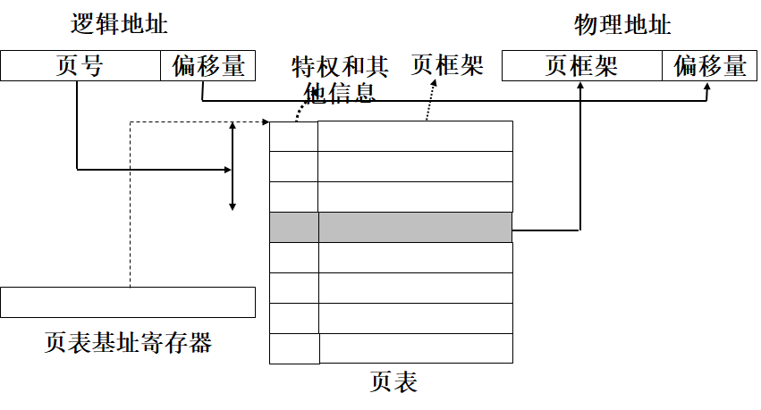

# 内存管理

## 内存管理概述

### 内存管理机制

定义：把**物理的存储**资源用一定的规则和手段管理起来，以供操作系统和应用程序使用

主要操作：内存块的分配和回收

评价指标：内存利用率、内存块分配和回收的效率、时间确定性

两种分配方法：静态分配和动态分配

- 静态分配简单，但必须事先预知分配的数量（代码大小、数据大小），且缺乏灵活性
- 动态分配灵活，但会消耗额外的时间和内存开销，可能产生内存碎片

### 通用内存分配

内存空间划分：代码区，静态数据区和动态数据区

静态分配：发生在编译和链接时，全局变量和静态变量；开始运行就分配，运行结束才释放。

动态分配：发生在程序调入和执行时，局部变量和返回值等；需要时分配，使用完就可以释放。

- 栈：一种线性结构，后进先出，存放函数的参数和返回值、局部变量......
- 堆：一种链式结构，用于调用malloc和free分配/释放的内存。如果调用malloc分配，但缺少调用free释放，会造成内存泄漏。

```c
// 栈内存分配
char*   AllocStrFromStack()
{
    char pstr[100];
    return pstr; //退出释放
}
// 堆内存分配
#include <stdlib.h>
int main() {
 	char *str; // 局部变量
 	if ((str = malloc(15)) ==NULL)  { // 动态分配
  		printf("Not enough memory to allocate buffer\n");
  		exit(1);
 	}
 	// 内部处理
 	strcpy(str,"hello world");	//初始化
	printf("String is %s\n",str);
 	free(str); // 释放：指针记录的内容还在
	str = NULL; // 清楚为空指针，不可用
}

```

使用malloc()和free()的内存分配特点

- 需要编译器库提供malloc()和free()函数
- 执行时间不具有确定性
- 可能明显增大RTOS内核的代码大小

嵌入式实时内核内存管理要求

- 实时性
  - 内存分配尽可能快，且具有**确定**性。
- 可靠性
  - 内存分配请求必须得到**满足**，否则有严重后果。例如飞机燃油系统的内存分配。
- 高效性
  - 内存分配尽可能**减少浪费**

不同实时内核所采用的内存管理方式不同，有的简单，有的复杂

实时内核所采用的内存管理方式与应用领域和硬件环境密切相关

- 在强实时应用领域，内存管理方法就比较简单，甚至不提供内存管理功能
- 一些实时性要求不高，可靠性要求比较高，且系统比较复杂的应用在内存管理上就相对复杂些，可能需要实现对操作系统或是任务的保护

### 嵌入式实时操作系统在内存管理方面特点

- 快速而确定的内存管理
  - **不使用内存管理**：最快速和最确定的内存管理方式，适用于那些小型的嵌入式系统，系统中的任务比较少，且数量固定
  - 通常的操作系统都至少具**有基本的内存管理方法**：提供内存分配与释放的系统调用
- 不使用虚拟存储技术
  - 虚拟内存技术：为用户提供一种不受物理存储器结构和容量限制的存储管理技术，是桌面/服务器操作系统为在所有任务中使用有限物理内存的通常方法，每个任务从内存中获得一定数量的页面，并且，当前不访问的页面将被置换出去，为需要页面的其他任务腾出空间
  - 置换是一种**具有不确定性**的操作：当任务需要使用当前被置换出去的页面中的代码和数据时，将不得不从磁盘中获取页面，而在内存中另外的页面又可能不得不需要先被置换出去
- 在嵌入式实时操作系统中一般不使用虚拟存储技术，以**避免页面置换所带来的开销**
- 内存保护
  - 平面内存模式flat mode
    - 应用程序和系统程序能够对**整个内存空间**进行访问
    - 平面内存模式比较简单，易于管理，性能也比较高
    - 适合于程序简单、代码量小和实时性要求比较高的领域
  - 内存保护
    - 应用比较复杂、程序量比较大的情况
    - 防止应用程序破坏操作系统或是其他应用程序的代码和数据

## 实时内核内存管理机制

常用内存管理方式

- 固定大小存储区
  - 在指定边界的一块地址连续的内存空间中，实现固定大小内存块的分配。
- 可变大小存储区
  - 在指定边界的一块地址连续的内存空间中，实现可变大小内存块的分配。

应用根据需要从固定大小存储区或者可变大小存储区中获得一块内存空间，用完后将该内存空间释放回相应的存储区。

### 固定大小存储区管理

 可供使用的一段连续的内存空间被称为是一个分区， 分区由大小固定的内存块构成，且分区的大小是内存块大小的整数倍数

一个大小为512字节的分区，内存块为128个字节的分区 

```c
typedef struct 
{
     PartitionID    	ID;             		/*分区的ID,ID表示分区的标识*/
     PartitionName    Name;		              /*分区的名字*/
     void             	*starting_address;	/*分区的起始地址*/
     int	          	length;          		/*分区的长度,分区的存储单元的数量*/
     int		buffer_size;      		/*内存块的大小*/
     PartitionAttribute  	attribute;         	/*属性*/
     int          		number_of_used_blocks;  	/*剩余内存块数*/
     MemoryChain    	memory;           		/*内存块链,一个指针,指向分区中由空闲内存块组成的双向空闲内存块链表的头结点*/
}   Partition;

```


分区的操作 

- 创建分区
- 删除分区
- 从分区得到内存块
- 把内存块释放到分区
- 获取分区ID
- 获取当前创建的分区的数量
- 获取当前所有分区的ID
- 获取分区信息

如果内存块处于**空闲状态**，将使用内存块中的几个字节作为控制结构，用来存放用于双向链接的前向指针和后向指针

在**使用内存块**时，内存块中原有的控制信息不再有效，其中的所有存储空间都可以被使用

固定大小存储区管理的**系统开销**对用户的影响为零

由于内存块的大小固定，不存在**外碎片**的问题

存在**内碎片**的问题

### 可变大小存储区管理

一种基于堆的管理方式（与传统堆操作不同）

- 堆为一段连续的、大小可配置的内存空间，用来提供可变内存块的分配。
- 可变内存块称为段，最小分配单位称为页，即段的大小是页的大小的整数倍。
- 如果申请段的大小不是页的倍数，实时内核将会对段的大小进行调整，调整为页的倍数。
  - 例如，从页大小为256个字节的堆中分配一个大小为350字节的段，实时内核实际分配的段大小为512个字节。 

```c
typedef struct {
      HeapID	ID;             	         /*堆的ID*/
      HeadName	name;          	          /*堆的名字*/
      TaskQueue	waitQueue; 	          /*任务等待队列,如果任务从堆中申请段不能得到满足，将被阻塞在堆的等待队列上*/
      void		*starting_address;	          /*内存空间起始地址*/
      int		length;		          /*内存空间长度/字节,堆的大小*/
      int		page_size;	          /*页长度（字节）*/
      int		maximum_segment_size;  /*最大可用段大小*/
      RegionAttribute	attribute;            /*堆的属性*/
      int		number_of_used_blocks;  /*分配的块数,已分配使用的内存块的数量*/
      HeapMemoryChain   	memory;           /*堆头控制结构,空闲段链表*/
}Heap; 
```

- 可变大小存储区中的空闲段通过双向链表链接起来，形成一个空闲段链
  - 在创建堆时，只有一个空闲段，其大小为整个存储区的大小减去控制结构的内存开销
  - 从存储区中分配段时，可依据首次适应算法，查看空闲链中是否存在合适的段
  - 当把段释放回存储区时，该段将被挂在空闲段链的链尾
    - 如果空闲链中有与该段相邻的段，则将其合并成一个更大的空闲段
    - 由于对申请的内存的大小作了一些限制，避免了内存碎片的产生


在段的控制块中设置了一个标志位，表示段被使用的情况：1表示该段正被使用，0表示该段空闲。

在固定大小存储区管理方式中，只有在空闲状态下，内存块才拥有控制信息。在可变大小存储区管理方式中，无论段空闲或是正在被使用，段的控制结构都始终存在。 

堆的操作 

- 创建堆
- 从堆中得到内存块
- 释放内存块到堆中
- 扩展堆
- 获得已分配内存块的实际可用空间大小
- 删除堆
- 获得堆的ID
- 获得在堆上等待的任务数量
- 获得等待任务的ID列表
- 获得堆的数量
- 获得堆列表
- 获得堆信息

### Memory management in uC/OS-II


```c
/* MEMORY CONTROL BLOCK   MCB    */
typedef struct {           

    /* Pointer to beginning of memory partition*/
    void   *OSMemAddr;

    /* Pointer to list of free memory blocks   */
    void   *OSMemFreeList;    

    /* Size (in bytes) of each block of memory */         
    INT32U  OSMemBlkSize; 

    /* Total number of blocks in this partition*/
    INT32U  OSMemNBlks;
 
    /* Number of memory blocks remaining in this partition*/
    INT32U  OSMemNFree;                
} OS_MEM;
```


*List of free memory control blocks created by* *OS_MemInit*

Each memory control block can be used to manage a partition

```c
void OS_MemInit (void)
```

- 功能：初始化内存控制块MCB链，形成空闲MCB链表
- 所在文件os_mem.c

创建分区              OSMemCreate

从分区获得内存块      OSMemGet

释放内存块到指定分区  OSMemPut


Partition after OSMemGet

1. 链首头指向pblk
2. OSmemFreeList 指向下一块头

Partition after OSMemPut

1. 链首头指向下一块的头
2. OSmemFreeList 指向链首

## 内存保护

### 保护内容

防止地址越界：每个应用程序都有自己独立的地址空间，当应用程序要访问某个内存单元时，由硬件检查该地址是否在限定的地址空间之内，只有在限定地址空间之内的内存单元访问才是合法的，否则需要进行**地址越界**处理

防止操作越权：对于允许多个应用程序共享的存储区域，每个应用程序都有自己的访问权限，如果一个应用程序对共享区域的访问违反了权限规定，则进行**操作越权**处理

### 保护实现

内存保护可通过硬件提供的MMU（memory management unit）来实现

早期的嵌入式操作系统大都没有采用MMU：

- 一方面是出于对硬件成本的考虑
- 另一方面是出于实时性的考虑

嵌入式系统发展到现在，硬件成本越来越低，MMU所带来的成本因素基本上可以不用考虑

原来的嵌入式CPU的速度较慢，采用MMU通常会造成对时间性能的不满足，而现在CPU的速度也越来越快，并且采用新技术后，已经将MMU所带来的时间代价降低到比较低的程度

目前，大多数处理器都集成了MMU

- 大幅度**降低**那些通过在处理器外部添加MMU模块的处理方式所存在的**内存访问延迟**
- MMU现在大都被设计作为处理器内部指令执行**流水线的一部分**，使得使用MMU不会降低系统性能，相反，如果系统软件不使用MMU，还会导致处理器的性能降低
- 在某些情况下，不使能MMU，跳过处理器的相应流水线，可能导致处理器的性能降低80%左右

嵌入式CPU具有MMU的功能已经是一种必要的趋势。

由于采用MMU后对应用的运行模式甚至开发模式都会有一些影响，大量嵌入式操作系统都没有使用MMU

对于安全性、可靠性要求高的应用来讲，如果不采用MMU，则几乎不可能达到应用的要求

- 如果没有MMU的功能，将无法防止程序的无意破坏，无法截获各种非法的访问异常，当然更不可能防止应用程序的蓄意破坏了
- 采用MMU后，便于发现更多的潜在问题，并且也便于问题的定位
  - 未采用MMU时，内存模式一般都是平面模式，应用可以任意访问任何内存区域、任何硬件设备，程序中出现非法访问时，开发人员是无从知晓的，也非常难于定位

MMU通常具有如下功能 

- **内存映射**
- 检查逻辑地址是否在**限定的地址范围内**，防止页面地址越界
- 检查对内存页面的访问是否违背**特权信息**，防止越权操作内存页面
- 在必要的时候（页面地址越界或是页面操作越权）产生**异常**


大多数处理器的典型页面大小为4K字节，有些处理器也可能使用大于4K字节的页面，但**页面大小总是2的幂**，以对发生在MMU中的地址映射行为流水线化

当页放置到物理内存时，页面将放置到**页框架**（page frame）中

- 页框架是物理内存的一部分，具有与页面同样的大小，且开始地址为页面大小的整数倍
- MMU包含着能够把逻辑地址映射为物理地址的表，称为**页表**
  - **操作系统**能够在需要的时候对这种映射关系进行改变
    - 应用程序对内存的需求发生变化或是添加或删除应用程序的时候
    - 在应用程序中的任务发生上下文切换时



每个内存页还具有一些特权和状态信息

- MMU提供二进制位来标识每个页面的特权或状态信息。这些二进制位用来确定页面中的内容是否：
  - 可被处理器指令所使用（执行特权） 
  - 可写（写特权） 
  - 可读（读特权） 
  - 已被回写（脏位） - 与CACHE配合
  - 当前在物理内存中（有效位）-  虚拟存储

在操作系统的支持下，MMU还提供**虚拟存储**功能，即在任务所需要的内存空间超过能够从系统中获得的物理内存空间的情况下，也能够得到正常运行。

- 当需要的页面被添加到逻辑地址空间时，任务对内存页面的合法访问，将自动访问到物理内存
- 页面当前不在物理内存中时，将导致页面故障异常，然后操作系统负责从后援存储器（如硬盘或是FLASH存储设备）中获取需要的页面，并从产生**页面故障**的机器指令处重新执行

MMU通常具有如下不同功能程度的使用方式 

- 0级，内存的平面使用模式
  - 没有使用MMU，应用程序和系统程序能够对整个内存空间进行访问
  - 采用该模式的系统比较简单、性能也比较高，适合于程序简单、代码量小和实时性要求比较高的领域
  - 大多数**传统的嵌入式操作系统**都采用该模式
- 1级，处理具有MMU和内存缓存的嵌入式处理器
  - 通常只是打开MMU，并通过创建一个域（domain，为内存保护的基本单位，每个域对应一个页表）的方式来使用内存，并对每次内存访问执行一些必要的地址转换操作
  - 该模式仍然只是拥有MMU打开特性的平面内存模式
- 2级，内存保护模式 现代操作系统
  - MMU被打开，且创建了静态的域（应用程序的逻辑地址同应用程序在物理内存中的物理地址之间的映射关系在系统运行前就已经确定），以保护应用和操作系统在指针试图访问其他程序的地址空间时不会被非法操作
  - 通常使用消息传送机制实现数据在被MMU保护起来的各个域之间的移动
- 3级，虚拟内存使用模式
  - 通过操作系统使用CPU提供的内存映射机制，内存页被动态地分配、释放或是重新分配
  - 从内存映射到基于磁盘的虚拟内存页的过程是透明的

区别

- 0级模式为大多数传统嵌入式实时操作系统的使用模式，同1级模式一样，都是内存的平面使用模式，不能实现内存的保护功能
- 2级模式是目前大多数嵌入式实时操作系统所采用的内存管理模式，既能实现内存保护功能，又能通过静态域的使用方式保证系统的实时特性
- 3级模式适合于应用比较复杂、程序量比较大，并不要求实时性的应用领域


在这种一一对应的使用方式中，应用程序的逻辑地址同应用程序在物理内存中的物理地址相同，简化了内存管理的实现方式

在嵌入式实时操作系统中，MMU通常被用来进行内存保护

- 实现操作系统与应用程序的隔离
- 应用程序和应用程序之间的隔离
- 防止应用程序破坏操作系统的代码、数据以及应用程序对硬件的直接访问
- 对于应用程序来讲，也可以防止别的应用程序对自己的非法入侵，从而破坏应用程序自身的运行

在内存保护方面，MMU提供了以下措施 

- 防止地址越界
  - 通过限长寄存器检查逻辑地址，确保应用程序只能访问逻辑地址空间所对应的、限定的物理地址空间，MMU将在逻辑地址超越限长寄存器所限定的范围时产生异常 
- 防止操作越权
  - 根据内存页面的特权信息控制应用程序对内存页面的访问，如果对内存页面的访问违背了内存页面的特权信息，MMU将产生异常