# 同步、互斥与通信

## 概述

多任务系统中任务之间/任务与ISR的关系

- 相互独立：仅竞争CPU资源
- 互斥：竞争除CPU外的其他资源
- 同步：**协调**彼此运行的**步调**，保证协同运行的各个任务具有正确的执行次序
- 通信：彼此间**传递数据或信息**，以协同完成某项工作

任务能以以下方式与中断处理程序或其他任务进行同步或通信：

- 单向同步或通信：一个任务与另一个任务或一个ISR同步或通信
- 双向同步或通信：两个任务相互同步或通信。双向同步不能在任务与ISR之间进行，因为ISR不能等待

在单处理器平台上，嵌入式操作系统内核提供的同步、互斥与通信机制主要包括：

- 互斥：互斥信号量（mutex）
- 同步：信号量（semaphore）、事件（组）（Flag\event group）、异步信号（asynchronous signal）
- 消息通信：邮箱（mailbox）、消息队列（message queue）
- 非结构化数据交换和同步：管道（pipe）

以下一些机制也可用于同步与通信（在单处理器或多处理器系统中）

- 全局变量，共享内存，Sockets，远程过程调用（Remote Procedure Call），自旋锁

嵌入式多任务系统中，任务间的耦合程度是不一样的

- 耦合度：对任务之间关联程度的度量
- 耦合程度较高：任务之间需要进行大量的通信，相应的系统开销较大；
- 耦合程度较低：任务之间不存在通信需求，其间的同步关系很弱甚至不需要同步或互斥，系统开销较小

任务划分准则之一：耦合度高的模块尽量划分在同一任务内

## 信号量

这一部分可以查看操作系统

### 信号量的种类及用途

信号量用于实现任务与任务之间、任务与中断处理程序之间的**同步与互斥**

- 互斥信号量：用于解决互斥问题。它比较特殊，可能会引起优先级反转问题。

- 二值信号量：用于解决同步问题

- 计数信号量：用于解决资源计数问题

将信号量进行种类细分，可以根据其用途，在具体实现时做专门处理，提高执行效率和可靠性

### 互斥信号量

用互斥信号量保护的代码区称作“**临界区**”，临界区代码通常用于对**共享资源**的访问。**互斥信号量的值被初始化成1**，表明目前没有任务进入“临界区”，但最多只有一个任务可以进入“临界区”

共享资源可能是一段存储器空间、一个数据结构或I/O设备，也可能是被两个或多个并发任务**共享的任何内容**

使用互斥信号量可以实现**对共享资源的串行访问**，保证只有成功地获取互斥信号量的任务才能够释放它

**互斥信号量的值被初始化成1**，表明目前没有任务进入“临界区”，但最多只有一个任务可以进入“临界区”

第一个试图进入“临界区”的任务将成功获得互斥信号量，而随后试图进入用同一信号量保护的临界区的所有其他任务就必须等待

当任务离开“临界区”时，它将释放信号量并允许正在等待该信号量的任务进入“临界区”

互斥信号量是一种特殊的二值信号量，一般它支持**所有权、递归访问、任务删除安全**等概念和一些**避免优先级反转、饥饿、死锁等互斥所固有问题的协议**

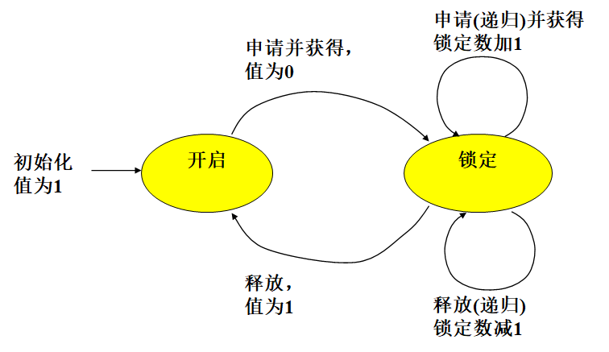

**所有权**：当一个任务通过获取互斥信号量而将其锁定时，得到该互斥信号量的所有权。相反，当一个任务释放信号量时，失去对其的所有权

当一个任务拥有互斥信号量时，其他的任务不能再锁定或释放它，即任务要释放互斥信号量，必须事前先获取该信号量

#### 嵌套（递归）资源访问

如果Task1调用RoutineA，而RoutineA又调用RoutineB，并且三者访问相同的共享资源，就发生了递归共享资源的访问同步问题

一个递归的互斥信号量允许嵌套锁定互斥信号量，而不引起死锁

每个获取信号量的调用必须与释放信号量的调用相匹配

用于**同步的信号量不支持嵌套**访问

#### 删除安全

在一个受信号量保护的临界区，经常需要保护在临界区执行的任务不会被意外地删除

删除一个在临界区执行的任务可能引起意想不到的后果，造成保护资源的信号量不可用，可能导致资源处于破坏状态，也就导致了其它所有要访问该资源的任务无法得到满足

为避免任务在临界区执行时不被意外删除：

- 提供“任务保护”和“解除任务保护”原语对
- 同时，为互斥信号量提供“删除安全”选项。在创建信号量的时候使用这个选项，当应用每次获取信号量时**隐含**地使能“任务保护”功能，当每次释放信号量时隐含地使用“解除任务保护”功能

#### 各种互斥机制比较:star2:

| 比较项目             | 关中断                                                       | 使用测试并置位指令                         | 禁止任务切换                                 | 使用信号量                                       |
| -------------------- | ------------------------------------------------------------ | ------------------------------------------ | -------------------------------------------- | ------------------------------------------------ |
| 锁定范围             | **互斥力度最强**，锁定所有外部可屏蔽中断，凡是以中断形式到达的外部事件以及与之相关联的任务或处理过程均得不到执行 | 凡是使用该指令访问共享资源的代码           | 所有任务                                     | 只影响竞争共享资源的任务                         |
| 对系统响应时间的影响 | 如果关中断的时间较长，对系统的响应性能有很大影响             | 较小                                       | 如果禁止切换的时间过长，则影响系统的响应性能 | 对系统响应性能有一定影响，**可能导致优先级反转** |
| 实现时的系统开销     | 小                                                           | 小                                         | 小                                           | 较大                                             |
| 注意事项             | 关中断时间要尽量短                                           | 不是所以处理器都具有这种指令，影响可移植性 | 关调度的时间要尽量短                         | 需采用一定的策略解决优先级反转问题               |

### 二值信号量

二值信号量主要用于任务与任务之间、任务与中断服务程序之间的同步

- 用于同步的二值信号量初始值为0，表示同步事件尚未产
- 任务申请信号量以等待该同步事件的发生
- 另一个任务或ISR到达同步点时，释放信号量（将其值设置为1）表示同步事件已发生，以唤醒等待的任务

### 计算信号量

计数信号量用于控制系统中共享资源的多个实例的使用，允许多个任务同时访问同一种资源的多个实例

计数信号量被初始化为n（非负整数），n为该种共享资源的数目

常用于生产者和消费者问题，mutex empty full

### 信号量机制的主要数据结构


信号量控制块：管理所有创建的信号量，内核在系统运行时动态分配和回收信号量控制块

互斥和二值信号量控制块结构: Binary_Semaphore_Control_Block

- wait_queue 任务等待队列
- attributes 信号量属性
  - lock_nesting_behavior试图嵌套获得时的规则
  - wait_discipline 任务等待信号量的方式（FCFS还是优先级等）
  - priority_ceiling 优先级天花板值
- lock 是否被占有
- holder 拥有者
- nest_count 嵌套层数

计数信号量控制结构Counting_Semaphore_Control_Block

- wait_queue 任务等待队列

- attributes 计数信号量属性

  - maximum_count    最大计数值

  - wait_discipline 任务等待信号量的方式

- count 当前计数值

#### 信号量内部实现机制实例说明 µC/OS-II

事件控制块ECB：同步与通信机制的基本数据结构

```c
typedef struct{
INT8U OSEventType;//事件类型
INT8U OSEventGrp;//等待任务所在的组 与等待任务列表是一对的
INT16U OSEventCnt;//计数器（信号量）
void *OSEventPtr;//指向消息或消息队列的指针
INT8U OSEventTbl[OS_EVENT_TBL_SIZE];//等待任务列表
}OS_EVENT;
```


当一个事件发生后，**等待事件**列表中优先级最高的任务（即在.OSEventTbl[]&OSEventGrp中所有被置1的位中优先级数值最小的任务）得到该事件


当.OSEventTbl[n]中的任何一位为1时，OSEventGrp中的第n位为1。 与任务就绪列表类似！

将一个任务插入到等待事件的任务列表中 与将一个任务插入到就绪列表中的操作类似！

从等待事件的任务列表中使任务脱离等待状态 与将任务从就绪列表中清除的操作类似！

在等待事件的任务列表中查找优先级最高的任务 与查找优先级最高的就绪任务的操作类似！

空闲事件控制块，也是从空的结构里面选一个装入

```c
static void OS_InitEventList (void)
```

返回类型：无 参数：无

功能：初始化事件控制块ECB链，形成空闲ECB链表，所在文件os_core.c

### 典型的信号量操作

#### 创建信号量

功能：根据应用传递的参数创建一个信号量

参数：信号量的名字、属性和初始值等。

内核动作：

- 从空闲信号量控制块链中分配一个信号量控制块，并初始化信号量属性。
- 创建成功时，为其分配唯一的ID号返回给应用。
- 如果已创建信号量数量已达到用户配置的最大数量，就返回错误。

信号量的属性

- 信号量类型
- 任务等待信号方式
  - 先进先出
  - 优先级
- 优先级反转问题的解决方法（只适用于互斥信号量）
  - 优先级继承算法
  - 优先级天花板算法，需给出所有可能获得此信号量的任务中优先级最高的任务的优先级
  - 与任务删除安全、递归访问以及解决优先级反转的策略相关的参数

```c
OS_EVENT *OSSemCreate (INT16U cnt)
{
 OS_EVENT *pevent;
 pevent = OSEventFreeList;//从空闲事件控制块链中取得一个ECB
 if (OSEventFreeList != (OS_EVENT *)0) {
 OSEventFreeList = (OS_EVENT *)OSEventFreeList->OSEventPtr;
 }
 if (pevent != (OS_EVENT *)0) { //初始化ECB的各个域
  pevent->OSEventType = OS_EVENT_TYPE_SEM; //事件类型为信号量
  pevent->OSEventCnt = cnt; //信号量的初始计数值
  pevent->OSEventPtr = (void *)0;
  OS_EventWaitListInit(pevent); //初始化等待任务列表
 }
 return (pevent); //调用者需检查返回值，如果为NULL则表示建立失败
}
```

#### 获取（申请）信号量

功能：试图获得应用指定的信号量。

- if   信号量的值大于0
- then  将信号量的值减1
- else  根据接收信号量的选项，将任务放到等待队列中，或是直接返回

当所申请的信号量不能被立即获得时，可以有以下几种选择：

- 永远等待
- 不等待，立即返回，并返回一个错误状态码
- 指定等待时限（可有效避免死锁）

注意：

- 不允许在ISR中选择等待
- 当任务选择等待时，将被按FIFO或优先级顺序放置在等待队列中

如果任务等待一个使用**优先级继承算法**的互斥信号量，且它的优先级高于当前正占有此信号量的任务的优先级，那么占有信号量的任务将继承这个被阻塞的任务的优先级。

如果任务成功地获得一个采用**优先级天花板算法**的互斥信号量，它的优先级又低于优先级天花板，那么它的优先级将被抬升至天花板。  

```c
//获取（等待）一个信号量
void OSSemPend (OS_EVENT *pevent, INT16U timeout, INT8U *err)
{
 if (pevent->OSEventCnt > 0) { //信号量值大于0，成功获得信号量并返回
  pevent->OSEventCnt--;
  *err = OS_NO_ERR;
  return;}
 OSTCBCur->OSTCBStat |= OS_STAT_SEM; //设置任务状态为等待信号量
 OSTCBCur->OSTCBDly = timeout; //设置等待时限
 OS_EventTaskWait(pevent);//将任务放置到信号量的等待列表中
 OS_Sched(); //内核实施任务调度，系统切换到另一就绪任务执行
 if (OSTCBCur->OSTCBStat & OS_STAT_SEM) { //判断任务恢复执行的原因，如果等待时限超时但仍然未获得信号量，则返回超时信息
  OSEventTO(pevent);
  *err = OS_TIMEOUT;
  return;}
 OSTCBCur->OSTCBEventPtr = (OS_EVENT *)0;
 *err = OS_NO_ERR; //任务由于获得信号量而恢复执行，本调用成功返回
}
//无等待地请求
INT16U OSSemAccept (OS_EVENT *pevent)
{
 INT16U cnt;
 cnt = pevent->OSEventCnt;
 if (cnt > 0) {
  pevent->OSEventCnt--;
 }
 return (cnt);
}
```

注意：即使不能成功获得信号量（返回值为0），调用者也不会被阻塞。此函数可以在中断处理程序中使用。

#### 释放信号量

功能：释放一个应用指定的信号量。

- if   没有任务等待这个信号量
- then  信号量的值加1
- else  将信号量分配给一个等待任务（将相应的任务移出等待队列，使其就绪）

如果使用了优先级继承或优先级天花板算法，那么执行该功能（系统调用）的任务的优先级将恢复到原来的高度

```c
INT8U OSSemPost (OS_EVENT *pevent)
{
 if (pevent->OSEventGrp!=0x00) { //如果有任务在等待该信号量
  OS_EventTaskRdy(pevent, (void *)0, OS_STAT_SEM); //使等待任务列表中优先级最高的任务就绪
  OS_Sched(); //内核实施任务调度
  return (OS_NO_ERR);//成功返回
 }
 if (pevent->OSEventCnt < 65535) {//如果没有任务等待该信号量，并且信号量的值未溢出
  pevent->OSEventCnt++; //信号量的值加1
  return (OS_NO_ERR);//成功返回
 }
 return (OS_SEM_OVF);//信号量溢出
}
```

#### 删除信号量

功能：从系统中删除应用指定的一个信号量

内核动作：将信号量控制块返还给系统

删除信号量的不一定是创建信号量的任务

**如果有任务正在等待**获得该信号量，执行此功能将使所有等待这个信号量的任务回到就绪队列中，且返回一个状态码指示该信号量已被删除

企图获取已删除的信号量将返回一个错误；

在互斥信号量正被使用时（已经被某任务获取），不能删除它。因为该信号量正在保护一个共享资源或临界代码段，该动作可能造成数据崩溃或其他严重问题。

```c
OS_EVENT *OSSemDel(OS_EVENT *pevent, INT8U opt, INT8U *err)
{
 BOOLEAN tasks_waiting;
 if(pevent->OSEventGrp!=0x00{//根据是否有任务在等待信号量设置等待标志
  tasks_waiting=TRUE;
 }else{
  tasks_waiting=FALSE;
 }
 switch(opt){
  case OS_DEL_NO_PEND://如果有任务等待信号量则不删除信号量
   if(task_waiting==FALSE{//没有任务等待，释放ECB回空闲链
    pevent->OSEventType=OS_EVENT_TYPE_UNUSED;
    pevent->OSEventPtr=OSEventFreeList;
     OSEventFreeList=pevent;//调整空闲ECB链头指针
    *err=OS_NO_ERR;
    return((OS_EVENT)0);
   }else{
     *err=OS_ERR_TASK_WAITING;//有任务等待，删除信号量失败
     return(pevent);
   }
  case OS_DEL_ALWAYS://无论有无任务等待都删除信号量
    //将等待列表中的每个任务都设置成就绪
   while(pevent->OSEventGrp!=0x00){
   OS_EventTaskRdy(pevent,(void *)0, OS_STAT_SEM);}
   //释放该信号量的ECB回空闲控制块链
   pevent->OSEventType=OS_EVENT_TYPE_UNUSED;
   pevent->OSEventFreeList;
    OSEventFreeList=pevent;
   //如果之前有任务等待信号量，内核实施任务调度
   if(tasks_waiting==TRUE){OS_Sched();}
   *err=OS_NO_ERR;
   return((OS_EVENT *)0);
  default:
   *err=OS_ERR_INVALID_OPT;
   return(pevent);
 }
}
```

#### 清除信号量的任务等待列表

为了清除等待一个信号量的所有任务，某些内核支持Flush操作，以便释放信号量等待任务列表中的所有任务。当多个任务的执行必须在某些点相遇时，需要这样的机制。

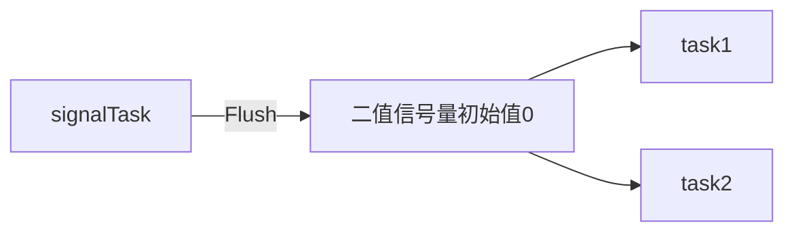

## 邮箱和消息队列

### 通信方式概述

#### 直接通信

通信双方必须明确知道彼此  

Send (P，message) – 发送一个消息到任务P

Receive(Q，message) – 从任务Q接收一个消息

直接通信具有如下特性

- 每对任务之间仅存在一个链接
- 链接可以是单向，也可以是双向

#### 间接通信

通信双方不需要指出消息的来源或去向，通过中间机制通信

send(A，message) – 发送一个消息给邮箱A

receive(A，message) – 从邮箱A接收一个消息

间接通信具有如下特性

- 只有当任务共享一个公共邮箱时链接才建立
- 一个链接可以与多个任务相联系
- 每个任务可以使用几个通信链接

### 邮箱和消息队列概述

消息：**内存空间中一段长度可变的缓冲区**，其长度和内容均可以由用户定义，其内容可以是实际的数据、数据块的指针或空

消息队列：属于**间接通信方式**

消息机制在任务之间、任务和ISR（中断服务程序）之间提供**消息传递或同步**

对消息内容的解释由应用完成

- 从**操作系统**观点看，消息没有定义的格式，所有的消息都是字节流，没有特定的含义。
- 从**应用**观点看，根据应用定义的消息格式，消息被解释成特定的含义。
- 应用可以只把消息当成一个标志，这时消息机制用于实现**同步**

一些操作系统内核把消息进一步分为：邮箱和消息队列

- 邮箱仅能存放**单条**消息，它提供了一种低开销的机制来传送信息。每个邮箱可以保存一条大小为若干个字节的消息(ucosIII 取消)
- 消息队列可存放**若干**消息，提供了一种任务间缓冲通信的方法

消息机制可支持**定长与可变长度**两种模式的消息，可变长度的消息队列需要对队列中的每一条消息增加**额外的存储开销**

- 创建邮箱             OSMboxCreate

- 删除邮箱             OSMboxDel

- 申请消息             OSMboxPend

- 发送消息             OSMboxPost

- 申请消息（不带阻塞） OSMboxAccept

- 获取邮箱信息         OSMboxQuery


##### OSMboxCreate函数

```c
OS_EVENT *OSMboxCreate (void *pmsg)
```

返回类型：指向事件控制块的指针

参数：存储消息的指针pmsg；

功能：创建一个邮箱

所在文件：os_mbox.c

### 消息队列机制的主要数据结构

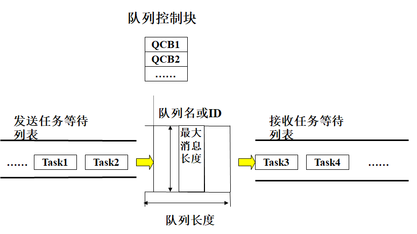

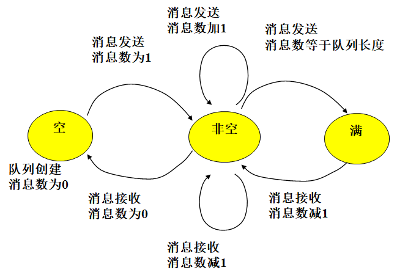

消息队列控制块

- 管理所有创建的消息队列，系统运行时**动态分配和回收消息队列控制块**

消息队列缓冲区：**存放发送到该队列的消息**

- 接收者从缓冲区中取出消息
- 消息的发送或接收有两种方法（影响消息缓冲区结构）
  - 将数据从发送任务的空间**完全拷贝**到接收任务的空间中（效率较低，执行时间与消息大小有关）
  - 只传递指向数据**存储空间的指针**（提高系统性能，一般情况）

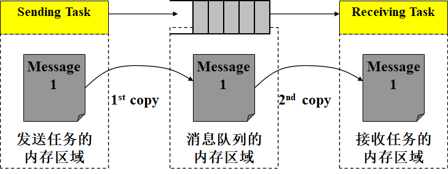

发送和接收消息的消息拷贝和内存使用

- 这种消息传递方法效率低、占用空间大
- 一种效率更高的方式是**传递消息指针**

| 消息队列控制块    | 消息队列缓冲区（环形缓冲） |
| ----------------- | -------------------------- |
| wait_queue        |                            |
| max_message_count |                            |
| numer_of_message  |                            |
| wait_descipline   |                            |
| queue_state       | 队头，消息队列空间头部     |
| queue_in          | 消息头 指向message         |
| queue_out         | 消息尾                     |
| queue_end         | 队尾，消息队列空间尾部     |

queue_in~out：number_of_message

queue_start~end：max_message_count

```c
typedef struct os_q {         /* QUEUE CONTROL BLOCK */
   struct os_q   *OSQPtr;      /* 空闲链表中当next指针使用  */
    void         **OSQStart;     /* 消息队列缓冲区的起始地址 */
    void         **OSQEnd;       /* 消息队列缓冲区的结束地址 */
    void         **OSQIn;          /* 放消息的指针  */
    void         **OSQOut;       /* 取消息的指针 */
    INT16U      OSQSize;       /* 消息队列缓冲区的容量 */
    INT16U      OSQEntries;     /* 当前放置在消息队列缓冲区中的消息数目  */
} OS_Q;
```

消息队列机制即要用到ECB，还要用到QCB

### 典型的消息队列操作

- 创建消息队列
- 发送普通消息
- 发送紧急消息
- 发送广播消息
- 接收消息
- 删除消息队列
- 获取有关消息队列的各种信息

队列管理函数调用

- 创建消息队列             OSQCreate
- 删除消息队列             OSQDel

- 接收消息                 OSQPend

- 发送消息          OSQPost

- 发送广播消息             OSQFlush

- 获取消息队列信息             OSQQuery


#### 创建消息队列

创建消息队列时，分配队列控制块,调用时可以指定如下参数：

- 消息的最大长度
- 每个消息队列中最多的消息数
- 消息队列的属性
  - 任务等待消息时的排队方式：FIFO或PRIORITY

系统为新创建的消息队列分配唯一的ID

#### 发送消息

**普通消息放队尾，紧急消息放队首**

如果有任务正在等待消息（即消息队列为空），则普通消息发送和紧急消息发送的执行效果是一样的。任务从等待队列移到就绪队列中，消息被拷贝到任务提供的缓冲区中（或者由接收任务得到指向消息的指针）。

如果没有任务等待，发送普通消息将消息放在队列尾，而发送紧急消息将消息放在队列头。

如果发送消息时队列已被填满，则不同的操作系统可能采取不同的处理办法：

- 挂起试图向已满的消息队列中发送消息的任务（不适用于中断服务程序）
- 简单地丢弃该条消息并向调用者返回错误信息

#### 广播消息

在此之前所有试图从队列中接收消息的任务此时都将获得相同的消息。该功能拷贝消息到各任务的消息缓冲中（或者让所有的等待任务得到指向消息的指针），并唤醒所有的等待任务。

```c
INT8U OSQPost (OS_EVENT *pevent, void *pmsg)
```

返回类型：出错信息
参数：事件控制块的指针pevent，消息指针pmsg；
功能：向一个消息队列放置一条消息
所在文件：os_q.c

#### 接收消息

如果**指定的消息队列中有消息**，则将其中的第一条消息拷贝到调用者的缓冲区（或者将第一条消息指针传递给调用者），并从消息队列中删除它。

如果**此时消息队列中没有消息**，则可能出现以下几种情况：

- 永远等待消息的到达：等待消息的任务按FIFO或优先级高低顺序排列在等待队列中
- 等待消息且指定等待时限：等待消息的任务按FIFO或优先级高低顺序排列在等待队列中，但等待时限到了就不再等待，有效预防死锁。
- 不等待，强制立即返回：ISR必须选这个方式

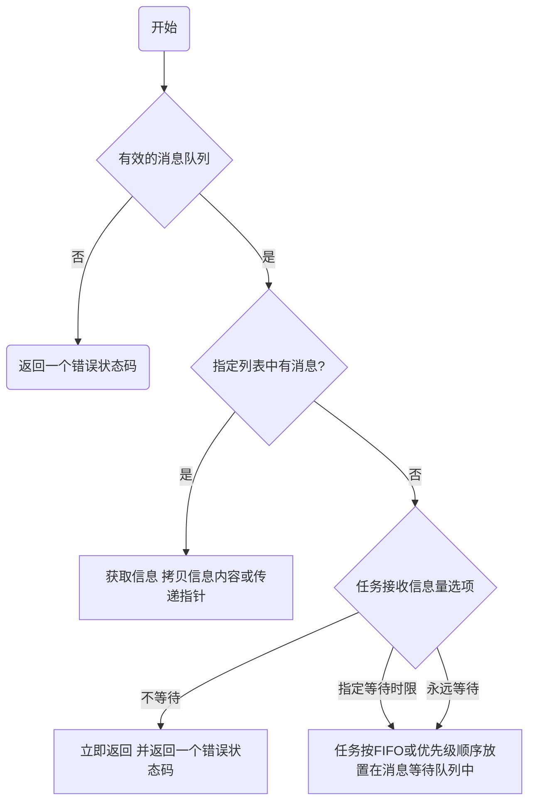

等待任务列表有先进先出，优先级的次序

```c
void *OSQPend (OS_EVENT *pevent, INT32U timeout, INT8U *perr)
```

- 返回类型：指向一条消息的指针
- 参数：事件控制块指针pevent，等待时间timeout，出错信息指针perr；
- 功能：向一个消息队列申请一条消息
- 所在文件：os_q.c

#### 删除消息队列

主要动作：从系统中删除指定的消息队列，释放**消息队列控制块**及**消息队列缓冲区**。

任何知道此**消息队列ID**号的代码都可以删除它。

注意：消息队列被删除后，所有等待从这个消息队列接收消息的任务都回到**就绪态**，并得到一个错误信息表明消息队列已被删除。

#### 消息队列的其他典型使用

紧耦合的单向数据通信：发送任务发送消息后要求一个响应信号，表明接收任务已经成功接收到消息。（是一个同步信号，确认信号）

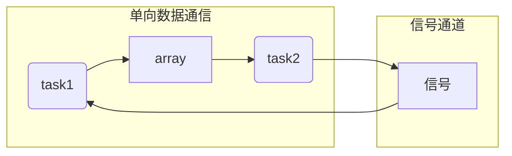

紧耦合的双向数据通信 ：如果数据需要在任务之间双向流动，则可以采用紧耦合的双向数据通信模式（也称为全双工通信）。

## 事件

### 事件概述

在嵌入式实时内核中，事件是指一种表明预先定义的系统事件已经发生的机制

事件机制用于任务与任务之间、任务与ISR之间的同步。其主要的特点是可实现一对多的同步

一个事件就是一个标志(Flag)，不具备其它信息。

一个或多个事件构成一个事件集。事件集可以用一个指定长度的变量（比如一个8bit, 16bit或32bit的无符号整型变量，不同的操作系统其具体实现不一样）来表示，而每个事件由在事件集变量中的某一位来代表。

事件及事件集有以下特点：

- 事件间**相互独立**
- 事件仅用于**同步**，不提供数据传输功能
- 事件**无队列**，即多次发送同一事件，在未经过任何处理的情况下，其效果等同于只发送一次

提供事件机制的意义在于：

- 当某任务要与**多个任务或中断服务同步**时，就需要使用事件机制
- 若任务需要与一组事件中的任意一个发生同步，可称为**独立型同步**（逻辑“或”关系）
- 任务也可以等待若干事件都发生时才同步，称为**关联型同步**（逻辑“与”关系）

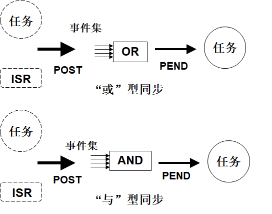

#### 术语

发送事件集 。指在一次发送过程中发往接收者（比如任务）的一个或多个事件的组合。

待处理事件集。指已被发送到一个接收者但还没有被接收（即正在等待处理）的所有事件的集合。

事件条件。指事件接收者在一次接收过程中期待接收的一个或多个事件的集合。

- “或”型同步：待处理事件集只要包括事件条件中的任一事件即可满足要求；
- “与”型同步：其二是待处理事件集必须包括事件条件中的全部事件方可满足要求。  

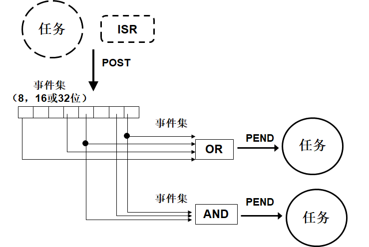

多对多同步：用多个事件的组合发信号给多个任务

### 事件机制的主要数据结构

不同操作系统对事件机制的实现有所不同

事件集控制块：管理所有**创建**的事件集，例如：uCOS-II

事件集附属于任务，**不需创建**，其相关参数成为任务控制块的一部分，例如OSEK OS(汽车用，用期望事件集)

事件标志组数据结构 OS_FLAG_GRP

```c
typedef struct{
 INT8U OSFlagType;//指示本数据结构的类型
 void *OSFlagWaitList;//指向等待事件标志的任务链表的第一个节点(os_flag_node)
 OS_FLAGS OSFlagFlags;//事件集标志的当前状态
}OS_FLAG_GRP;
```

事件标志节点数据结构 OS_FLAG_NODE

```c
typedef struct{
 void *OSFlagNodeNext;//后驱指针
 void *OSFlagNodePrev;//前驱指针
 void *OSFlagNodeTCB;//任务控制块指针
 void *OSFlagNodeFlagGrp;//指回OS_FLAG_GRP结构
 OS_FLAGS OSFlagNodeFlags;//所等待的事件标志组合
 INT8U OSFlagNodeWaitType;//等待类型（与、或）
}OS_FLAG_NODE;
```

事件标志组、事件标志节点及任务控制块之间的关系

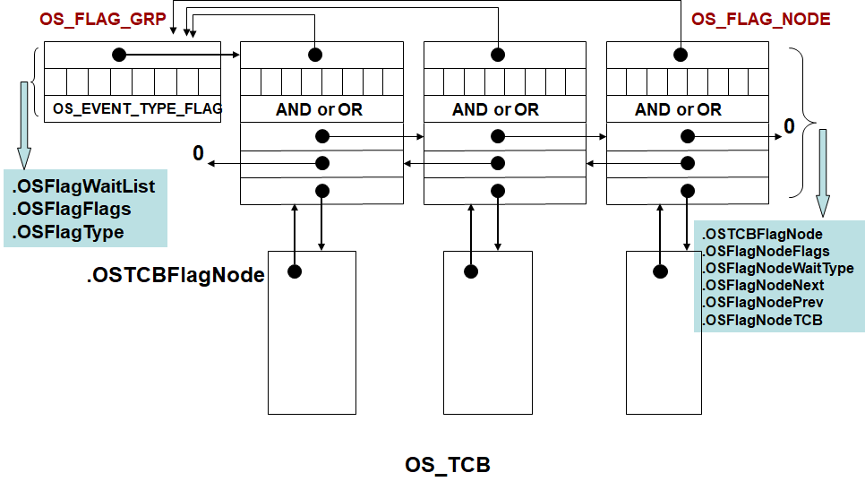

### 典型的事件操作

#### 创建事件集

申请空闲事件集控制块，设置事件集属性，初始化控制块中的域，分配ID号。事件集相当于标志集

```c
OS_FLAG_GRP  *OSFlagCreate(OS_FLAGS flags, INT8U *err)
{
 OS_FLAG_GRP  *pgrp;
 pgrp=OSFlagFreeList;//获取一个空闲事件标志组结构
 if(pgrp!=(OS_FLAG_GRP *)0){//获取成功，初始化该结构中的域
  OSFlagFreeList=(OS_FLAG_GRP *)OSFlagFreeList->OSFlagWaitList;//调整空闲结构链头指针
  pgrp->OSFlagType=OS_EVENT_TYPE_FLAG;
  pgrp->OSFlagFlags=flags;//初始化当前各事件标志的状态
  pgrp->OSFlagWaitList=(void *)0;//尚无任务等待事件标志
  *err=OS_NO_ERR;
 }else{*err=OS_FLAG_GRP_DEPLETED;}
 return(pgrp);
}

```

#### 删除事件集

回收事件集控制块到空闲链中，等待接收该事件集的任务被恢复就绪

```c
OS_FLAG_GRP *OSFlagDel(OS_FLAG_GRP *pgrp, INT8U opt, INT8U *err)
{
  BOOLEAN tasks_waiting;
  OS_FLAG_NODE *pnode;
  if (pgrp->OSFlagWaitList != (void *)0)
    tasks_waiting = TRUE; //有任务等待
  else
    tasks_waiting = FALSE; //无任务等待
  switch (opt)
  {
  case OS_DEL_NO_PEND: //在无任务等待时才删除事件标志组
    if (tasks_waiting == FALSE)
    { //无任务等待，释放控制块到空闲链中
      pgrp->OSFlagType = OS_EVENT_TYPE_UNUSED;
      pgrp->OSFlagWaitList = (void *)OSFlagFreeList;
      OSFlagFreeList = pgrp;
      *err = OS_NO_ERR;
      return ((OS_FLAG_GRP *)0);
    }
    else
    { //有任务等待，删除失败
      *err = OS_ERR_TASK_WAITING;
      return (pgrp);
    }
  case OS_DEL_ALWAYS:                             //无论是否有任务等待，都删除事件标志组
    pnode = (OS_FLAG_NODE *)pgrp->OSFlagWaitList; //获取等待头节点
    while (pnode != (OS_FLAG_NODE *)0)
    { //遍历整个等待任务链，使每个等待任务就绪
      OS_FlagTaskRdy(pnode, (OS_FLAGS)0);
      pnode = (OS_FLAG_NODE *)pnode->OSFlagNodeNext;
    }
    pgrp->OSFlagType = OS_EVENT_TYPE_UNUSED;
    pgrp->OSFlagWaitList = (void *)OSFlagFreeList;
    OSFlagFreeList = pgrp; //释放控制块回空闲链
    if (tasks_waiting == TRUE)
      OS_Sched(); //如果之前有任务等待，
    *err = OS_NO_ERR;
    内核实施调度
    return ((OS_FLAG_GRP *)0);
  default:
    *err = OS_ERR_INVALID_OPT;
    return (pgrp);
  }
}
```

#### 发送事件（集）

调用者（任务或中断）构造一个事件（集），将其发往接收者（比如目标任务）。可能会出现以下几种情况之一：

- 目标任务正在等待的事件条件得到满足，任务就绪
- 目标任务正在等待的事件条件没有得到满足，该事件（集）被按位“或”操作，保存到目标任务的待处理事件集中，目标任务继续等待
- 目标任务未等待事件（集），该事件（集）被按位“或”操作，保存到目标任务的待处理事件集中

```c
OS_FLAGS OSFlagPost(OS_FLAG_GRP *pgrp, OS_FLAGS flags, INT8U *err)
{
  OS_FLAG_NODE *pnode;
  BOOLEAN sched = FALSE; //初始化调度标志
  OS_FLAGS flags_cur, flags_rdy;

  pgrp->OSFlagFlags |= flags;                   //按位或，置位事件标志
  pnode = (OS_FLAG_NODE *)pgrp->OSFlagWaitList; //获取任务等待链头节点
  while (pnode != (OS_FLAG_NODE *)0)
  { //如果有任务等待，遍历等待链
    switch (pnode->OSFlagNodeWaitType)
    {
    case OS_FLAG_WAIT_SET_ALL: //”与”方式等待
      flags_rdy = pgrp->OSFlagFlags & pnode->OSFlagNodeFlags;
      if (flags_rdy == pnode->OSFlagNodeFlags)
      { //符合等待条件
        if (OS_FlagTaskRdy(pnode, flags_rdy) == TRUE)
          sched = TRUE; //如果任务就绪，设置调度标志
      }
      break;
    case OS_FLAG_WAIT_SET_ANY: //”或”方式等待
      flags_rdy = pgrp->OSFlagFlags & pnode->OSFlagNodeFlags;
      if (flags_rdy != (OS_FLAGS)0)
      { //有满足条件的事件标志
        if (OS_FlagTaskRdy(pnode, flags_rdy) == TRUE)
          sched = TRUE; //如果任务就绪，设置调度标志
      }
      break;
    }
    pnode = (OS_FLAG_NODE *)pnode->OSFlagNodeNext; //下一个等待事件标志的节点
  }
  if (sched == TRUE)
    OS_Sched(); //如果设置了调度标志，则实施调度
  *err = OS_NO_ERR;
  return (pgrp->OSFlagFlags);
}
```

#### 接收事件（集）

在接收事件（集）时可以有如下选项

- WAIT 接收事件（集）时可等待

  - 接收者永远等待，直到事件条件被满足后成功返回；

  - 接收者根据指定的时限等待

- NO_WAIT 接收事件（集）时不等待

满足方式

- EVENT_ALL 待处理事件集必须包含事件条件中的全部事件方可满足要求，

  即按照“与”条件接收事件

- EVENT_ANY 待处理事件集只要包含事件条件中的任一事件即可满足要求，

  即按照“或”条件接收事件

```c
OS_FLAGS OSFlagPend(OS_FLAG_GRP *pgrp, OS_FLAGS flags, INT8U wait_type, INT16U timeout, INT8U *err)
{
  OS_FLAG_NODE node; // OS_FLAG_NODE作为局部变量存在于调用该函数的任务堆栈中
  OS_FLAGS flags_cur;
  OS_FLAGS flags_rdy;
  switch (wait_type)
  {
  case OS_FLAG_WAIT_SET_ALL: //任务以“与”方式等待事件标志
    flags_rdy = pgrp->OSFlagFlags & flags;
    if (flags_rdy == flags)
    {                                  //事件标志当前状态与等待条件相符
      pgrp->OSFlagFlags &= ~flags_rdy; //清除（即“消费”）满足条件的事件标志
      flags_cur = pgrp->OSFlagFlags;
      *err = OS_NO_ERR;
      return (flags_cur); //返回处理后的事件标志组
    }
    else
    {
      OS_FlagBlock(pgrp, &node, flags, wait_type, timeout);
    }
    //事件标志当前状态与等待条件不相符，任务被阻塞
    break;
  case OS_FLAG_WAIT_SET_ANY: //任务以“或”方式等待事件标志
    flags_rdy = pgrp->OSFlagFlags & flags;
    if (flags_rdy != (OS_FLAGS)0)
    {                                  //有满足条件的事件标志
      pgrp->OSFlagFlags &= ~flags_rdy; //清除（即“消费”）满足条件的事件标志
      flags_cur = pgrp->OSFlagFlags;
      *err = OS_NO_ERR;
      return (flags_cur); //返回处理后的事件标志组
    }
    else
    {
      OS_FlagBlock(pgrp, &node, flags, wait_type, timeout);
    }
    //事件标志当前状态与等待条件不相符，任务被阻塞
    break;

  default:
    flags_cur = (OS_FLAGS)0;
    *err = OS_FLAG_ERR_WAIT_TYPE;
    return (flags_cur);
  }
  OS_Sched(); //当前任务被放到事件标志等待链后，内核实施任务调度
              //这里会退出一段时间再回来
  if (OSTCBCur->OSTCBStat & OS_STAT_FLAG)
  {                                    //判断任务重新就绪的原因，如果是等待超时
    OS_FlagUnlink(&node);              //将任务从事件标志等待链中解除下来
    OSTCBCur->OSTCBStat = OS_STAT_RDY; //设置当前任务状态为就绪
    flags_cur = (OS_FLAGS)0;           //无效的事件标志状态
    *err = OS_TIMEOUT;                 //超时信号
  }
  else
  {                                                //任务重新就绪的原因是在限定时间得到了满足条件的事件标志
    pgrp->OSFlagFlags &= ~OSTCBCur->OSTCBFlagsRdy; //清除（即“消费”）满足条件的事件标志
    flags_cur = pgrp->OSFlagFlags;
    *err = OS_NO_ERR;
  }
  return (flags_cur);
}
```

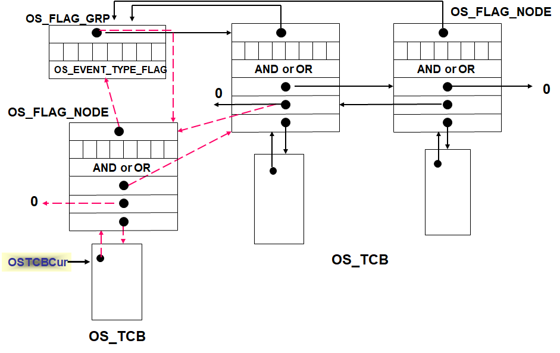

将一个空白的OS_TCB填入内容并插入队列中

```c
OS_FLAGS OSFlagAccept(OS_FLAG_GRP *pgrp, OS_FLAGS flags, INT8U wait_type, INT8U *err)
{
  OS_FLAGS flags_cur, flags_rdy;
  *err = OS_NO_ERR;
  switch (wait_type)
  {                          //判断等待事件标志的方式
  case OS_FLAG_WAIT_SET_ALL: //”与”方式等待
    flags_rdy = pgrp->OSFlagFlags & flags;
    if (flags_rdy == flags)
      pgrp->OSFlagFlags &= ~flags_rdy; //事件标志当前状态与等待条件相符，清除（即“消费”）相应的事件标志
    else
      *err = OS_FLAG_ERR_NOT_RDY; //不符合条件，返回错误信息
    flags_cur = pgrp->OSFlagFlags;
    break;
  case OS_FLAG_WAIT_SET_ANY: //”或”方式等待
    flags_rdy = pgrp->OSFlagFlags & flags;
    if (flags_rdy != (OS_FLAGS)0)
      pgrp->OSFlagFlags &= ~flags_rdy; //事件标志当前状态与等待条件相符，清除（即“消费”）相应的事件标志
    else
      *err = OS_FLAG_ERR_NOT_RDY; //不符合条件，返回错误信息
    flags_cur = pgrp->OSFlagFlags;
    break;

  default:
    flags_cur = (OS_FLAGS)0;      //0表示无效的事件标志组
    *err = OS_FLAG_ERR_WAIT_TYPE; //错误的等待类型
    break;
  }
  return (flags_cur);
}
```

### 事件机制的典型应用

1. 发送方（Task1或ISR）发送信息（消息或信号量）；
2. 发送方（Task1或ISR）设置相应的事件标志（指示消息或信号量的发送）
3. 接收方（Task2）检测事件标志集，判断是否满足其接收条件（“与”条件接收或“或”条件接收）
4. 接收方（Task2）根据事件标志集的指示定向接收信息（消息或信号量），达到和不同发送方（Task1或ISR）同步或通信的目的

Teak2不能预先知道谁更快发生，Task1发消息还是ISR发信号量

## 异步信号*

### 异步信号概述

异步信号机制用于任务与任务之间、任务与ISR之间的**异步操作**，它被任务（或ISR）用来通知其它任务某个事件的出现。

异步信号标志依附于任务。需要处理异步信号的任务由**两部分组成**，一个是与异步信号无关的**任务主体**，另一个是ASR（异步信号服务例程）。

一个ASR对应于一个任务。当向任务发送一个异步信号，如果该任务正在运行则中止其自身代码的运行，转而运行与该异步信号相关的服务例程；或者当该任务被激活时，在投入运行前执行ASR。

异步信号机制也可以称作**软中断**机制，异步信号又被称为软中断信号。由软件产生

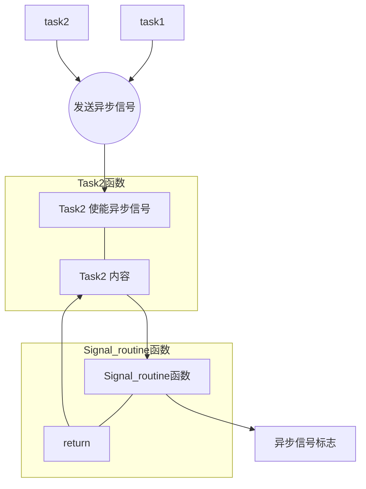

### 异步信号机制与中断机制的比较

相同点

- 具有中断性。对中断的处理和对异步信号的处理都要先暂时地中断当前任务的运行。
  - 有相应的服务程序
- 根据中断向量，有一段与中断信号对应的服务程序，称为ISR（Interrupt Service Routine）
  - 根据异步信号的编号，有一段与之对应的服务程序，称为ASR（Asynchronious Service Routine）
- 可以屏蔽其响应
  - 外部硬件中断可以通过相应的寄存器操作被屏蔽
  - 任务也可屏蔽对异步信号的响应

不同点

- 实质不同
  - 中断由硬件或者特定的指令产生，不受任务调度的控制
  - 异步信号由系统调用（使用发送异步信号功能）产生，受到任务调度的控制

处理时机（或响应时间）不同

- 中断触发后，硬件根据中断向量找到相应的服务程序执行。在退出中断服务程序之前会进行重调度，所以中断结束后运行的任务不一定是先前被中断的任务
- 异步信号通过发送异步信号的系统调用触发，但是系统不一定马上开始对它的处理
  - 如果接收异步信号的不是当前任务，则ASR要等到接收任务被调度、完成上下文切换后才能执行，之后再执行任务自身的代码
  - 任务也可以给自己发送异步信号，在这种情况下，其ASR将马上执行

执行的环境不同

- 一般地，ISR在独立的上下文中运行，操作系统为之提供专门的堆栈空间
- ASR在相关任务的上下文中运行，所以ASR也是任务的一个组成部分

### 异步信号机制与事件机制的比较

同样是标志着某个事件的发生，事件机制的使用是**同步**的（同步信号），而异步信号机制是**异步**的。

- 对一个任务来说，什么时候会接收到事件是已知的，因为接收事件的功能是它自己在运行过程中**调用**的。
- 任务**不能预知何时会收到一个异步信号**，并且一旦接收到了异步信号，在允许响应的情况下，它会中断正在运行的代码而去执行异步信号处理程序。

### 异步信号机制的主要数据结构

一种异步信号控制结构Asynchronous_Signal_Control_Block

- enabled 是否使能对异步信号的响应
- handler 处理例程
- attribute_set ASR的执行属性
- signals_posted  使能响应时，已发送但尚未处理的信号
- signals_pending 屏蔽响应时，已发送但尚未处理的信号
- nest_level ASR中异步信号的嵌套层数

### 典型的异步信号操作

#### 安装异步信号处理例程

为任务安装一个异步信号处理例程（ASR）。仅当任务已建立了ASR，才允许向该任务发送异步信号，否则发送的异步信号无效。当任务的ASR无效时，发送到任务的异步信号将被丢弃。

调用者需指定ASR的入口地址和执行属性。

```c
//异步信号处理例程的一般形式
void  handler(signal_set)
{
 switch(signal_set)
 {
  CASE SIGNAL_1:
   动作1；
   break;

  CASE SIGNAL_2:
   动作2；
   break;
  ......
 }
}
//signal_set参数为任务接收到的异步信号集。
```

#### 发送异步信号到任务

- 任务或ISR可以调用该功能发送异步信号到目标任务，发送者指定目标任务和要发送的异步信号（集）。
- 发送异步信号给任务对接收任务的执行状态没有任何影响。
- 在目标任务已经安装了异步信号处理例程的情况下，如果目标任务不是当前执行任务，则发送给它的异步信号就会等下一次该任务占有处理器时再由相应的ASR处理，任务获得处理器后，将首先执行ASR。
- 如果当前运行的任务发送异步信号给自己或收到来自中断的异步信号，在允许ASR处理的前提下，它的ASR会立即执行。