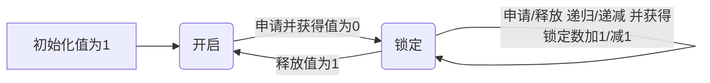
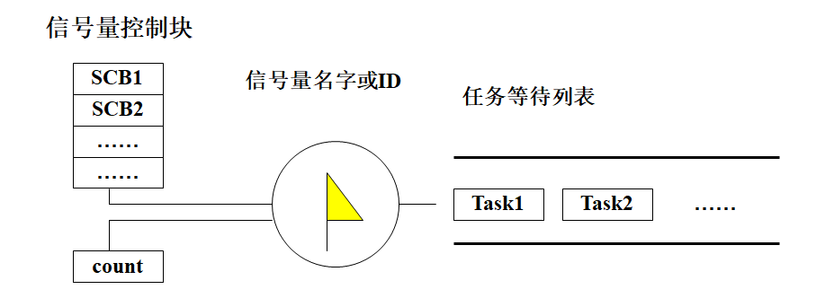
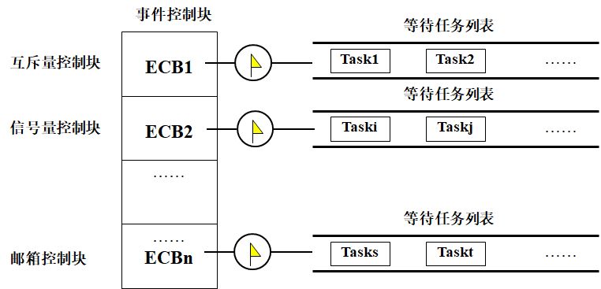
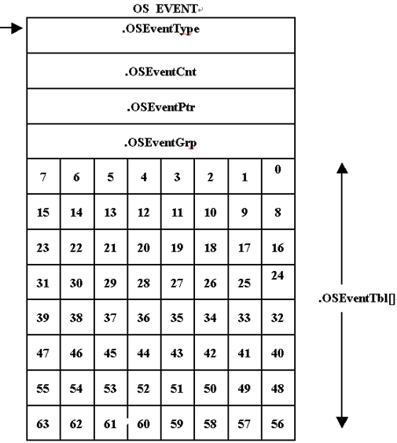

# 同步、互斥与通信

## 概述

多任务系统中任务之间/任务与ISR的关系

- 相互独立 仅竞争CPU资源
- 竞争除CPU外的其他资源（互斥）
- 同步 协调彼此运行的步调，保证协同运行的各个任务具有正确的执行次序 
- 通信 彼此间传递数据或信息，以协同完成某项工作

任务能以以下方式与中断处理程序或其他任务进行同步或通信：

- 单向同步或通信：一个任务与另一个任务或一个ISR同步或通信
- 双向同步或通信：两个任务相互同步或通信。双向同步不能在任务与ISR之间进行，因为ISR不能等待

在单处理器平台上，嵌入式操作系统内核提供的同步、互斥与通信机制主要包括：

- 互斥， 互斥信号量（mutex）
- 同步，信号量（semaphore）、事件（组）（Flag\event group）、异步信号（asynchronous signal）
- 消息通信，邮箱（mailbox）、消息队列（message queue）
- 非结构化数据交换和同步 ，管道（pipe）

以下一些机制也可用于同步与通信（在单处理器或多处理器系统中）

- 全局变量，共享内存，Sockets，远程过程调用（Remote Procedure Call），自旋锁

嵌入式多任务系统中，任务间的耦合程度是不一样的

- 耦合度：对任务之间关联程度的度量
- 耦合程度较高：任务之间需要进行大量的通信，相应的系统开销较大；
- 耦合程度较低：任务之间不存在通信需求，其间的同步关系很弱甚至不需要同步或互斥，系统开销较小

任务划分准则之一：耦合度高的模块尽量划分在同一任务内

## 信号量

这一部分可以查看操作系统

### 信号量的种类及用途

信号量用于实现任务与任务之间、任务与中断处理程序之间的同步与互斥。

互斥信号量：用于解决互斥问题。它比较特殊，可能会引起优先级反转问题。

二值信号量：用于解决同步问题

计数信号量：用于解决资源计数问题

### 互斥信号量

用互斥信号量保护的代码区称作“**临界区**”，临界区代码通常用于对**共享资源**的访问。**互斥信号量的值被初始化成1**，表明目前没有任务进入“临界区”，但最多只有一个任务可以进入“临界区”

共享资源可能是一段存储器空间、一个数据结构或I/O设备，也可能是被两个或多个并发任务共享的任何内容

使用互斥信号量可以实现对共享资源的串行访问，保证只有成功地获取互斥信号量的任务才能够释放它

互斥信号量是一种特殊的二值信号量，一般它支持**所有权、递归访问、任务删除安全**等概念和一些**避免优先级反转、饥饿、死锁等互斥所固有问题的协议**。



**所有权**：当一个任务通过获取互斥信号量而将其锁定时，得到该互斥信号量的所有权。相反，当一个任务释放信号量时，失去对其的所有权

当一个任务拥有互斥信号量时，其他的任务不能再锁定或释放它，即任务要释放互斥信号量，必须事前先获取该信号量

#### 嵌套（递归）资源访问

如果Task1调用RoutineA，而RoutineA又调用RoutineB，并且三者访问相同的共享资源，就发生了递归共享资源的访问同步问题

每个获取信号量的调用必须与释放信号量的调用相匹配

用于**同步的信号量不支持嵌套**访问

#### 删除安全

在一个受信号量保护的临界区，经常需要保护在临界区执行的任务不会被意外地删除

删除一个在临界区执行的任务可能引起意想不到的后果，造成保护资源的信号量不可用，可能导致资源处于破坏状态，也就导致了其它所有要访问该资源的任务无法得到满足

为避免任务在临界区执行时不被意外删除：

- 提供“任务保护”和“解除任务保护”原语对
- 同时，为互斥信号量提供“删除安全”选项。在创建信号量的时候使用这个选项，当应用每次获取信号量时**隐含**地使能“任务保护”功能，当每次释放信号量时隐含地使用“解除任务保护”功能。 

| 比较项目             | 关中断                                                       | 使用测试并置位指令                         | 禁止任务切换                                 | 使用信号量                                   |
| -------------------- | ------------------------------------------------------------ | ------------------------------------------ | -------------------------------------------- | -------------------------------------------- |
| 锁定范围             | 互斥力度最强，锁定所有外部可屏蔽中断，凡是以中断形式到达的外部事件以及与之相关联的任务或处理过程均得不到执行 | 凡是使用该指令访问共享资源的代码           | 所以任务                                     | 只影响竞争共享资源的任务                     |
| 对系统响应时间的影响 | 如果关中断的时间较长，对系统的响应性能有很大影响             | 较小                                       | 如果禁止切换的时间过长，则影响系统的响应性能 | 对系统响应性能有一定影响，可能导致优先级反转 |
| 实现时的系统开销     | 小                                                           | 小                                         | 小                                           | 较大                                         |
| 注意事项             | 关中断时间要尽量短                                           | 不是所以处理器都具有这种指令，影响可移植性 | 关调度的时间要尽量短                         | 需采用一定的策略解决优先级反转问题           |

### 二值信号量

二值信号量主要用于任务与任务之间、任务与中断服务程序之间的同步

- 用于同步的二值信号量初始值为0，表示同步事件尚未产
- 任务申请信号量以等待该同步事件的发生
- 另一个任务或ISR到达同步点时，释放信号量（将其值设置为1）表示同步事件已发生，以唤醒等待的任务

### 计算信号量

计数信号量用于控制系统中共享资源的多个实例的使用，允许多个任务同时访问同一种资源的多个实例

计数信号量被初始化为n（非负整数），n为该种共享资源的数目

常用于生产者和消费者问题，mutex empty full

### 信号量机制的主要数据结构



信号量控制块：管理所有创建的信号量，内核在系统运行时动态分配和回收信号量控制块

互斥和二值信号量控制块结构: Binary_Semaphore_Control_Block

- wait_queue 任务等待队列
- attributes 信号量属性
  - lock_nesting_behavior试图嵌套获得时的规则 
  - wait_discipline 任务等待信号量的方式（FCFS还是优先级等）
  - priority_ceiling 优先级天花板值
- lock 是否被占有
- holder 拥有者
- nest_count 嵌套层数

计数信号量控制结构Counting_Semaphore_Control_Block

- wait_queue 任务等待队列

- attributes 计数信号量属性

  - maximum_count    最大计数值

  - wait_discipline 任务等待信号量的方式

- count 当前计数值

#### 信号量内部实现机制实例说明 µC/OS-II

事件控制块ECB：同步与通信机制的基本数据结构

```c
typedef struct{
INT8U	OSEventType;//事件类型
INT8U	OSEventGrp;//等待任务所在的组 与等待任务列表是一对的
INT16U	OSEventCnt;//计数器（信号量）
void	*OSEventPtr;//指向消息或消息队列的指针
INT8U	OSEventTbl[OS_EVENT_TBL_SIZE];//等待任务列表
}OS_EVENT;
```



当一个事件发生后，**等待事件**列表中优先级最高的任务（即在.OSEventTbl[]&OSEventGrp中所有被置1的位中优先级数值最小的任务）得到该事件



当.OSEventTbl[n]中的任何一位为1时，OSEventGrp中的第n位为1。 与任务就绪列表类似！

将一个任务插入到等待事件的任务列表中 与将一个任务插入到就绪列表中的操作类似！

从等待事件的任务列表中使任务脱离等待状态 与将任务从就绪列表中清除的操作类似！

在等待事件的任务列表中查找优先级最高的任务 与查找优先级最高的就绪任务的操作类似！

空闲事件控制块，也是从空的结构里面选一个装入

### 典型的信号量操作

创建信号量

获取（申请）信号量

释放信号量

删除信号量

清除信号量的任务等待列表 

获取有关信号量的各种信息 

## 邮箱和消息队列

## 事件

## 异步信号*