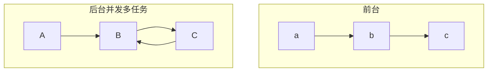

# 嵌入式系统概述

## 计算机发展阶段

IBM大型机，七十年代PC机，无处不在计算机

普适计算（Ubiquitous computing（ubicomp）、pervasive computing）：强调和环境融为一体的计算概念

边缘计算：边缘计算起源于传媒领域，是指在靠近物或数据源头的一侧，采用网络、计算、存储、应用核心能力为一体的开放平台，就近提供最近端服务。

云计算：云计算（cloud computing）是分布式计算的一种，指的是通过网络“云”将巨大的数据计算处理程序分解成无数个小程序，然后，通过多部服务器组成的系统进行处理和分析这些小程序得到结果并返回给用户

智能计算：智能计算只是一种经验化的计算机思考性程序，是人工智能化体系的一个分支，其是辅助人类去处理各式问题的具有独立思考能力的系统。

云计算与分布式计算关系：云计算属于分布式计算的范畴，是以提供对外服务为导向的分布式计算形式

### 嵌入式系统定义

- 看不见的计算机，一般不能被用户编程, 它有一些专用的I/O设备, 对用户的接口是应用专用的。
- An embedded system is a computer system contained within some larger device or product with the intent purpose of providing monitoring and control services to that device.
- “Any sort of device which includes a programmable computer but itself is not intended to be a general-purpose computer.”
- 通常将嵌入式计算机系统简称为嵌入式系统。

- IEEE: “Device used to control，monitor，or assist the operation of equipment，machinery or plants”.
- 嵌入式系统是以应用为中心、以计算机技术为基础、软件硬件可裁剪、适应应用系统对功能、可靠性、成本、体积、功耗严格要求的专用计算机系统。

专用的(系统)：specific

| 特征       | 通用计算机                                                   | 嵌入式系统                                                   |
| ---------- | ------------------------------------------------------------ | ------------------------------------------------------------ |
| 形式和类型 | 看得见的计算机  按其体系结构、运算速度和结构规模等因素分为大、中、小型机和微机。 | 看不见的计算机 形式多样，应用领域广泛，按应用划分         |
| 组成       | 通用处理器、标准总线和外设 软件和硬件相对独立             | 面向应用的嵌入式为处理器总线和外部接口多集成在处理器内部 软件与硬件是紧密集成在一起的 |
| 开发方式   | 开发平台和运行平台都是通用计算机                             | 采用交叉开发方式，开发平台一般是通用计算机，运行平台是嵌入式系统 |
| 二次开发性 | 应用程序可重新编制                                           | 一般不能再编程                                               |

### 嵌入式系统组成

- 嵌入式系统一般由嵌入式硬件和软件组成

- 硬件以包含微处理器的SoC为核心集成存储器和系统专用的输入/输出设备

- 软件包括：初始化代码及驱动、嵌入式操作系统和应用程序等，这些软件有机地结合在一起，形成系统特定的一体化软件。

## 嵌入式系统发展历程

20世纪70年代及以前:单片机时代

20世纪80年代：具备简单嵌入式操作系统

20世纪80年代末到90年代后期：数字化应用促进软硬件进一步发展

21世纪初开始：无线技术、物联网、多核芯片技术

- 嵌入式系统的出现和兴起
  - 出现：20世纪60年代 航空军事领域
  - 兴起：1965~1970 军事、航空航天领域、工业控制

- 嵌入式系统开始繁荣
  1. 微处理器
  2. 单板机（不是单片）,OEM产品
  3. 总线
  4. 单片机、DSP(数字信号处理器)
  5. 软件技术进步
  6. 嵌入式系统的开发从作坊式向分工协作规模化的方向发展

### 嵌入式系统应用走向纵深

- 分布控制，柔性制造，数字化通讯，数字化家电。领域扩展
- 嵌入式系统硬件
  - 32位嵌入式微处理器
- 嵌入式系统的软件
- 嵌入式软件危机
- 大量采用嵌入式操作系统
  - 功能不断扩大和丰富，内核、网络、文件、图形接口
  - 嵌入式开发工具

μC/OS嵌入实时多任务操作系统 Micro-Controller Operating System

- 优先级调度

- 可抢占内核

- 可移植性好

- 代码严谨规范

### 嵌入式系统的特点

- 形式多样、面向特定应用
  - 量体裁衣、去除冗余
  - 低功耗、体积小、集成度高、集成在芯片内部
  - 应用系统和操作系统一体化
- 处理器和处理器系统结构类型多
  - 通用计算机少数处理器和体系结构
  - IP设计
  - 几十种体系结构和上千种的嵌入式微处理器
- 关注成本
  - 系统成本
  - 消费类
    - 一次性开发成本
    - 产品成本：BOM、外壳保证和软件版税
    - 成本=总体成本/产品总量=NRE成本/产品总量+每个产品成本
- 实时性和可靠性
  - 大多数实时系统都是嵌入式系统
  - 固化运行或直接加载大内存中运行，具有快速启动的功能，软实时硬实时
  - 具有出错处理和自动复位功能，可靠设计尤其重要
  - 包括一些机制，软件内存保护和重启动机制
- 适用多种处理器、可裁剪、轻量型、实时可靠、可固化的嵌入式操作系统
  - 高可靠嵌入式操作系统：时、空、数据隔离
- 开发专门工具和特殊方法
  - 采用交叉开发
  - 宿主机 --> 目标机

# 嵌入式系统的分类

## 嵌入式处理器位数来分

- 4、8、16、32位是主流
- 64位比较少

## 应用来分

- 家电，通信，工控，移动，汽车

## 速度分类

- 强实时系统：**其系统响应时间**在**毫秒或微秒级**。
- 一般实时系统： 其系统响应时间在**几秒**的数量级上,其实时性的要求比强实时系统要差一些。
- 弱实时系：其系统响应时间约为**数十秒**或更长。这种系统的响应时间可能随系统负载的轻重而变化。

#### 实时系统

定义：在**限定响应时间**内提供**所需水平服务**的系统

一个实时系统的正确性不仅取决于**程序的逻辑正确性**，也取决于**结果产生的时间**：如果系统的时间约束条件得不到满足，将会发生系统出错

**实时并不等于快！**它是一个针对应用需求的概念，确切定义应该是“及时”，即在系统允许的时间范围内完成任务。

- **ES**: Embedded Systems嵌入式系统
- **RTS**: Real-Time Systems实时系统
- **ERTS**: Embedded Real-Time Systems嵌入式实时系统

嵌入式系统和实时系统互相交集

## 按嵌入式系统软件结构分类

### 循环轮询系统

- 优点
  - 对于简单的系统而言，便于编程和理解。

  - 没有中断的机制，程序运行良好，不会出现随机的问题。

- 缺点

  - 有限的应用领域。

  - 对于大量的I/O服务的应用，不容易实现。

  - 大的程序不便于调试。

适合于慢速和非常快速的简单系统

### 前后台系统

**是中断驱动系统的一种**

- 后台是一个循环轮询系统一只在运行
- 前台是由一些中断处理过程组成
- 当有一前台事件(外部事件)发生时，引起中断, 进行前台处理, 处理完成后又回到后台(通常又称主程序)

- 需要考虑的是**中断的现场保护和恢复，中断嵌套**，中断处理过程与主程序的**协调(共享资源)**问题。

- **系统的性能主要由以下指标来刻画：**
  - 中断延迟时间(Interrupt latency time)：是指从硬件中断发生到开始执行中断处理程序第一条指令之间的这段时间
  - 中断响应时间(response time)：中断的响应过程的时间
    - 中断响应时间=关中断的最长时间 + 保护CPU内部寄存器的时间 + 进入中断服务函数的执行时间 + 开始执行中断服务程序(ISR)的第一条指令时间
  - 中断恢复时间(recovery time) ：指从中断响应成功（即开始执行中断服务例程(ISR)的第一条指令时刻）一直到中断服务函数执行完毕再到切换回被中断的任务的接着一条代码执行所经历的时间

### 单处理器多任务系统

对于一个复杂的嵌入式实时系统来说，

- 当采用中断处理程序加一个后台主程序这种软件结构难以实时的、准确的、可靠的完成时

- 存在一些互不相关的过程需要在一个计算机中同时处理时

需要采用实时多任务系统

#### 结构

由**多个任务，多个中断处理**过程，**实时操作系统**组成的有机的整体。 

　　每个任务是顺序执行的，并行性通过操作系统来完成，任务间的相互通信和同步也需要操作系统的支持。 

#### 多任务系统

- 多个顺序执行的程序并行运行。

- 宏观上看，所有的程序同时运行，每个程序运行在自己独立的CPU上。

- 实际上，不同的程序是共享同一个CPU和其它硬件。因此，需要RTOS来对这些共享的设备和数据进行管理。

- 每个程序都被编制成无限循环的程序，等待特定的输入，执行相应的任务等。

- 这种程序模型将系统分成相对简单的，相互合作的模块。

**优点**

- 将复杂的系统分解为相对独立的多个子系统（线程）， 达到“分而制之”的目的，从而降低系统的复杂性。

- 保证系统的实时性。

- 系统的模块化好，提高系统的可维护性。

**缺点**

- 需要采用一些新的软件设计方法。
- 需要增加功能：线程间的协调，同步和通信功能。
- 需要对每一个**共享资源互斥**。
- 导致线程间的竞争。
- 需要使用RTOS，RTOS要增加系统的开销。

多任务可运行在**多个处理器**上，由操作系统统一调度，处理。

宏观上看是并发的，微观上看也是并发的。

多处理机系统分为两种

- 紧耦合系统(tightly-coupled system)
  - 通过临界资源共享资源
  - 一个任务的执行依赖于另一个任务
- 松耦合系统(loosely-coupled system)
  - 每一个组件对其他独立组件的定义所知甚少或一无所知。

嵌入式系统常采用片上多处理器系统(Multi-Processor System on Chip)

# 嵌入式系统的发展趋势

- 支持日趋增长的功能密度

- 灵活的网络联接

- 轻便的移动应用

- 多媒体的信息处理、低功耗、人机界面友好互动

- 支持二次开发和动态升级等

高可靠的嵌入式实时操作系统

基于模型，正确构造的高可靠嵌入式开发工具

高可靠的认证体系

​	高可信要求

​	Reliability，Maintainability，Availability，Safety，Security

形成行业标准：行业性嵌入式硬件平台

面向应用领域的、高度集成的、以32位嵌入式微处理器为核心的SOC（System On Chip）将成为应用主流

嵌入式应用软件的开发需要强大的开发工具和操作系统的支持

嵌入式系统联网成为必然趋势，驱动了大量新的应用

嵌入式系统向新的嵌入式计算模型方向发展 