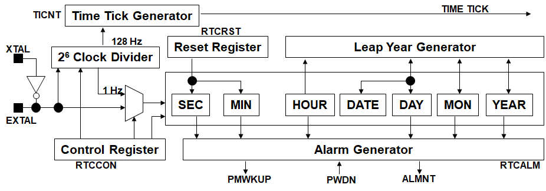
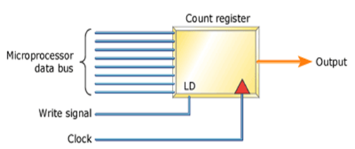
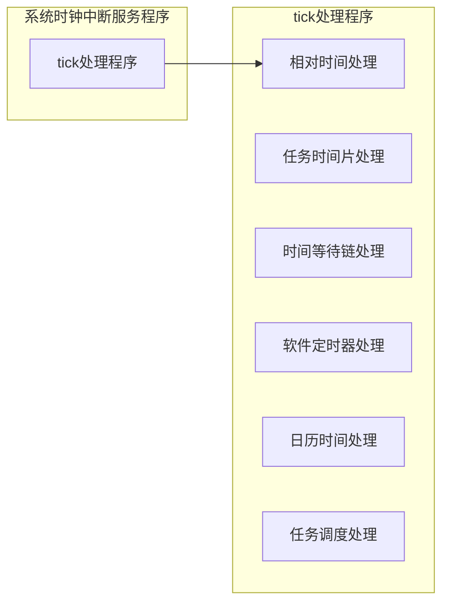
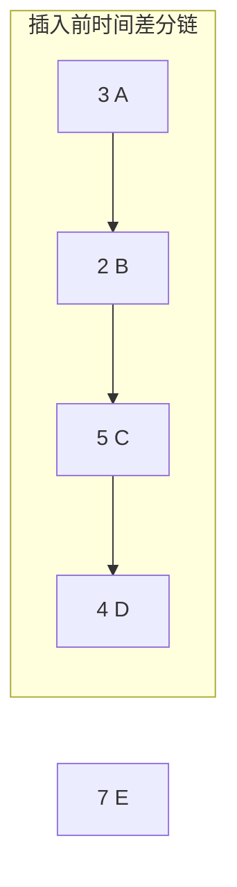
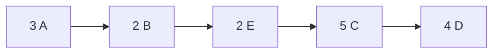

# 时钟管理

## 概述

时钟是处理具有时间约束特性必不可少的内容，在实时系统中具有非常重要的作用

实时内核通常提供以下时间管理功能

- 设置系统时间：使应用能够设置当前系统的日期和时间。
- 获得系统时间：实时内核可以把相对时间转换为以秒或是毫秒为单位的其它时间格式，并可根据实时时钟（Real Time Clock, RTC）获得日历时间
- 维护系统时基（ticks）、处理定时事件：通过时钟中断，维持系统日志时间、任务延迟时间、超时、时间片轮转调度等

## 硬件时钟设备

大多数嵌入式系统有两种时钟源

- 实时时钟（real time clock，RTC）
- 定时器/计数器

实时时钟

- 一般靠电池供电，即使系统断电，也可以维持日期和时间
- 实时时钟独立于操作系统，所以也被称为**硬件时钟**，为整个系统提供一个**计时标准**

定时器/计数器

- 实时内核需要一个定时器作为**系统时钟**（或称OS时钟），并由实时内核控制系统时钟工作
- 一般情况下，系统时钟的**最小粒度**是由应用和操作系统的特点决定的



- 在系统没有上电的情况下，可由后备电池供电
- 可以通过ARM的STRB/LDRB操作获取RTC以二进制编码的十进制数据格式向CPU提供8比特数据。数据包含秒、分、小时、日、月和年等内容
- 使用一个外部的32.768KHz晶振
- 包括一个闰年产生器
- 提供告警中断或是从掉电模式中唤醒的告警功能
- 能够避免2000年问题（即千年虫问题）
- 独立的电源引脚
- 能够为实时内核的系统时钟提供毫秒级的时间中断
- 能够进行循环复位

实时时钟（RTC）与系统时钟（OS时钟）的关系

- **实时时钟是硬件时钟**，独立于操作系统；**系统时钟并不是本质意义上的时钟**，而是一个定时器/计数器，只有当系统运行起来以后才有效，并且由实时内核完全控制
- 一般，实时时钟是系统时钟的时间基准，**实时内核通过读取实时时钟初始化系统时钟**，此后两者保持同步运行，共同维系系统时间

### 定时器/计数器

从硬件的角度来看，定时器（timer）和计数器（counter）的概念是可以互换的，其差别主要体现在硬件在特定应用中的使用情况

 一个简单的定时器/计数器



- 包含一个可装入的8位计数寄存器，一个时钟输入信号和一个输出脉冲
- 通过软件可以把一个位于0x00和0xFF之间的初始数据转入到计数寄存器。随后的每一个时钟输入信号都会导致该值被增加/减少
- 当8位计数器溢出时，就产生输出脉冲。
- 输出脉冲可以用来触发处理器上的一个中断，或是在处理器能够读取的地方设置一个二进制位。
- 输出脉冲是操作系统时钟的硬件基础，是因为输出脉冲将送到中断控制器上，产生中断信号，触发时钟中断，由时钟中断服务程序维持操作系统时钟的正常工作。
- 为了重启定时器，软件需要重新装入一个相同或不同的初始数据到计数寄存器。

计数器的工作方式

- 在一个典型的计数器中，当初始数据被装入后，可以启动计数器。
- 处理器通过数据总线读取计数寄存器当前值
- 锁存寄存器：保存处理器所写入的计数数据，计数器能够自动重新装入初始数据。
  - 当处理器向锁存寄存器写入数据时，计数寄存器也被写入了该数据。
  - 计数器溢出时，计数器产生输出脉冲，然后自动把锁存寄存器中的数据重新装入到计数寄存器。
  - 由于锁存寄存器仍然拥有处理器写入的数据，计数器将从同样的初始数据重新开始进行计数。
  - 这样的计数器能够产生与时钟具有相同精度的规则性输出。输出脉冲产生的周期性中断可以用于实时内核需要的tick，或是为UART提供一个波特率时钟，或是驱动需要规则脉冲的设备。

## 时间管理

系统时钟是由定时器/计数器产生的输出脉冲触发中断而产生的，系统时钟的值一般定义为**整数或长整数**

时基（ticks）：每次定时器/计数器输出脉冲都触发一个时钟中断，一次中断表示一个tick，也被称为一个“时钟滴答”

实时内核的时间管理以系统时钟为基础，通过tick实现管理

tick为系统的相对时间单位

一个tick与具体时间的对应关系可在初始化定时器时设定，也就是说，tick所对应的具体时间长度是可以调整的

一般来说，实时内核都提供相应的调整机制，应用可以根据特定情况改变tick对应的时间长度。

- 例如，可以使系统5毫秒产生一个tick，也可以使10毫秒产生一个tick。tick的大小决定了整个系统的时间粒度。

通常来说，实时内核提供以下主要与时间相关的管理：

- 维持相对时间（时间单位为tick）和日历时间
- 任务有限等待的计时
- 定时功能
- 时间片轮转调度的计时

管理功能是通过tick处理程序来实现的

- 定时器发生中断后，执行系统时钟中断处理程序，并在中断处理程序中调用tick处理程序，实现系统中与时间和定时相关的操作
- tick处理程序作为实时内核的一部分，与具体的定时器/计数器硬件无关，由系统时钟中断处理程序调用，使实时内核具有对不同定时器/计数器硬件的适应性



```c
void OSTickISR(void){
    Save processor registers;
    Call OSIntEnter() or increment OSIntNesting;
    if (OSIntNesting == 1){
        OSTCBCur->OSTCBStkPtr = SP;
    }
    Call OSTimeTick();
    Clear interrupting device;
    Re - enable interrupts(optional);
    Call OSIntExit();
    Restore processor registers;
    Execute a return from interrupt instruction;
}
void OSTimeTick(void){
#if OS_CRITICAL_METHOD == 3
    OS_CPU_SR cpu_sr;
#endif
    OS_TCB *ptcb;

    OSTimeTickHook();    //(1)
#if OS_TIME_GET_SET_EN > 0
    OS_ENTER_CRITICAL();
    OSTime++;    //(2)
    OS_EXIT_CRITICAL();
#endif
    if (OSRunning == TRUE){
        ptcb = OSTCBList;        //(3)
        //(4)遍历任务列表，不是空闲任务
        while (ptcb->OSTCBPrio != OS_IDLE_PRIO){
            OS_ENTER_CRITICAL();
            if (ptcb->OSTCBDly != 0){
                if (--ptcb->OSTCBDly == 0){
                    if ((ptcb->OSTCBStat & OS_STAT_SUSPEND) == 0x00){
                        //(5) 更新位图
                            OSRdyGrp |= ptcb->OSTCBBitY;                //(6)
                            OSRdyTbl[ptcb->OSTCBY] |= ptcb->OSTCBBitX;
                    }
                    else{
                        ptcb->OSTCBDly = 1; //如果挂起，需要置位就绪
                    }
                }
            }
            ptcb = ptcb->OSTCBNext;
            OS_EXIT_CRITICAL();
        }
    }
}
/*
* Tick Under uC/OS-II based on DSR
*/
void TickTask (void *pdata)
{
    pdata = pdata;
    for (;;) {
        OSMboxPend(...);    /* Wait for signal from Tick ISR */
        OSTimeTick();
        OS_Sched();
    }
}
void OSTickISR(void)
{
    Save processor registers;
    Call OSIntEnter() or increment OSIntNesting;
    if (OSIntNesting == 1) {
        OSTCBCur->OSTCBStkPtr = SP;
    }

    Post a 'dummy' message (e.g. (void *)1) to the tick mailbox;

    Call OSIntExit();
    Restore processor registers;
    Execute a return from interrupt instruction;
}
```

```assembly
 OSTickISR  PROC   FAR

            PUSHA                        ; Save interrupted task's context
            PUSH   ES
            PUSH   DS

            MOV    AX, SEG _OSIntNesting ; Reload DS
            MOV    DS, AX

            INC    BYTE PTR _OSIntNesting; Notify uC/OS-II of ISR

            INT    081H                  ; Chain into DOS's tick ISR

            CALL   FAR PTR _OSTimeTick   ; Process system tick

            CALL   FAR PTR _OSIntExit    ; Notify uC/OS-II of end of ISR

            POP    DS                ; Restore interrupted task's context
            POP    ES
            POPA

            IRET                         ; Return to interrupted task

_OSTickISR  ENDP
```

### 相对时间与日历时间

**相对时间即系统时间**，是指相对于系统启动以来的时间，以tick为单位，每发生一个tick，对系统的相对时间进行一次加1操作。

实时内核根据tick对应的时间长度，可以把**相对时间**转换为**以秒或是毫秒为单位的其他时间格式**，并可根据实时时钟获得**日历时间**。
内核API

- 设置系统时间  OSTimeSet
- 获得系统时间  OSTimeGet

```c
/*
* OSTimeGet and OSTimeSet Under uC/OS-II
*/
INT32U OSTimeGet (void){
    INT32U ticks;
    OS_ENTER_CRITICAL();
    ticks = OSTime;
    OS_EXIT_CRITICAL();
    return (ticks);
}

void OSTimeSet (INT32U ticks){
    OS_ENTER_CRITICAL();
    OSTime = ticks;
    OS_EXIT_CRITICAL();
}

/*
* 日历时间数据结构
*/
typedef struct
{
    unsigned32 year;        /* year*/
    unsigned32 month;     /* month，1-12 */
    unsigned32 day;         /* day，1-31 */
    unsigned32 hour;       /* hour，0-23 */
    unsigned32 minute;    /* minute，0-59 */
    unsigned32 second;    /* second，0-59 */
    unsigned32 ticks;   /* elapsed ticks between secs */
}   TOD;                         /*Time Of Day*/
```

### 任务有限等待计时

内核API

- 任务延时  OSTimeDly
- 按时分秒延时  OSTimeDlyHMSM
- 结束任务延时  OSTimeDlyResume

```c
/*
* OSTimeDly Under uC/OS-II
*/
void  OSTimeDly (INT16U ticks){
/* Allocate storage for CPU status register           */
#if OS_CRITICAL_METHOD == 3
    OS_CPU_SR  cpu_sr;
#endif
if (OSIntNesting > 0) {
        return;
    }
    if (ticks > 0)
    {                                    /* 0 means no delay!  所以不执行*/
        OS_ENTER_CRITICAL();
        if ((OSRdyTbl[OSTCBCur->OSTCBY] &= ~OSTCBCur->OSTCBBitX) == 0)
        {  /* Delay current task  将函数从优先级位图中去除 */
            OSRdyGrp &= ~OSTCBCur->OSTCBBitY;
        }
        OSTCBCur->OSTCBDly = ticks;     /* Load ticks in TCB         */
        OS_EXIT_CRITICAL(); // 退出临界区
        OS_Sched();       /* Find next task to run!    */
    }
}

void  OSTimeTick (void)
{
#if OS_CRITICAL_METHOD == 3
    OS_CPU_SR  cpu_sr;
#endif
    OS_TCB    *ptcb;

    OSTimeTickHook();                                                  (1)
#if OS_TIME_GET_SET_EN > 0
    OS_ENTER_CRITICAL();
    OSTime++;                                                          (2)
    OS_EXIT_CRITICAL();
#endif
    if (OSRunning == TRUE) {
        ptcb = OSTCBList;                                              (3)
        while (ptcb->OSTCBPrio != OS_IDLE_PRIO) {                      (4)
            OS_ENTER_CRITICAL();
            if (ptcb->OSTCBDly != 0) {
                if (--ptcb->OSTCBDly == 0) {
                    if ((ptcb->OSTCBStat & OS_STAT_SUSPEND) == 0x00) { (5)
                        OSRdyGrp               |= ptcb->OSTCBBitY;     (6)
                        OSRdyTbl[ptcb->OSTCBY] |= ptcb->OSTCBBitX;
                    } else {
                        ptcb->OSTCBDly = 1;
                    }
                }
            }
            ptcb = ptcb->OSTCBNext;
            OS_EXIT_CRITICAL();
        }
    }
}
```

### 任务有限等待计数

#### 时间差分链

- 一种有效的时间等待对象的组织方式，能有效降低时间等待对象的管理开销
- 采用单链表形式
- 在时间差分链中，每个表项所包含的计时值并非当前时刻到表项激活时刻的**绝对计数**，而是一个**相对计数**，绝对计数由该表项的值和先于它的所有表项的计数值相加得到
- 系统每接收到一个tick，就修订链首对象的时间值。如果链表对象的时间单位为tick，则每发生一个tick，链首对象的时间值就减1，当减到0时，链首对象就被激活，并从差分时间链中取下来，下一个对象又成为链首对象



- A对象需要等待3个时间单位就应被激活
- B对象需要等待5（3+2）个时间单位就应被激活
- C对象需要等待10（3+2+5）个时间单位就应被激活
- D对象需要等待14（3+2+5+4）个时间单位就应被激活

插入后时间差分链



计数过程

1. 比较链首，7>3
2. 比较在A后面的B，7-3=4 > 2
3. 比较B后面的C，7-3-2=2 < 5
4. E对象需要插入到差分链中介对象B和对象C之间的位置，E相对值：7-3-2=2
5. 修改C对象的相对值，C相对值：5-2=3

比较，减去

### 定时器

实时系统中的周期任务需要定期完成某些任务，需要用到软件定时器

为实现定时功能，实时内核需要提供软件定时器管理功能，应用程序可根据需要创建、使用软件定时器

- 软件定时器在创建时，由用户提供定时值，当软件定时器的定时值减法计数为0时，触发定时器服务程序
- 用户可在定时器服务程序中完成需要的操作
- 在tick处理程序中需要对软件定时器的定时值进行减1操作，并在定时值为0时，触发挂接在该定时器上的服务程序

软件定时器可用于实现“看门狗”（watchdog）

- 在应用的某个地方进行软件定时器的停止计时操作（复位操作），确保定时器在系统正常运行的情况下不会到期，即不会触发定时器服务程序
- 如果某个时候系统进入了定时器服务例程，就表示使用停止计时操作的地方没有执行到，系统出现了错误

在定时功能方面，内核通常提供以下功能：

- 创建软件定时器。分配一个定时器数据结构，创建一个软件定时器，并为这个定时器分配用户指定的名字。新创建的定时器没有被激活，且没有相应的定时器服务例程。软件定时器创建成功后，将为该定时器分配一个ID标识。

```c
/*
* 软件定时器数据结构
*/
typedef struct
{
    timer_class                  class; //所创建定时器的触发时间类型，可以是相对时间触发，也可以是绝对时间触发
    timer_state                  state; //定时器的当前状态，可以是活动状态、非活动状态或是中间状态（如正在进行计时链表的插入操作）
    timer_time                   initial; //触发时间间隔
    timer_time                   timeRemain; //剩余的触发时间
    timer_time                   startTime; //自系统启动以来所经历的时间
    timer_service_routine_entry  handler; //定时器需要触发的服务例程
    void                         *usrData; //需要触发的服务例程的参数
    attribute                    type; //定时器的触发类型,可以是单次触发、多次触发或是周期性触发
    unsigned32                   repeatCount; //多次触发时重复触发的次数
    unsigned32                   repeatRemain; //多次触发情况下的剩余触发次数
} timerInformation;
```

启动软件定时器。使定时器在给定的时间过去后，触发定时器服务例程。

- 对于软件定时器，通常还可以指定是单次触发还是周期触发
- 在单次触发中，只触发执行一次挂接的定时服务例程
- 周期触发则可以在每次触发服务例程后，经过相同的时间间隔又会触发挂接在该定时器上的服务例程

使软件定时器停止计时。使指定的软件定时器停止工作。因此，对应的定时器服务例程不再被触发，除非定时器被重新激活。

复位软件定时器。把定时器的定时值恢复到原来设定的值。

删除软件定时器。用来删除一个软件定时器。如果定时器还在工作，则其自动停止。该定时器对应的数据结构被返回给系统。

### 时间片轮转调度的计时

如果对任务设置了时间片处理方式，如何实现?

- 需要在tick处理程序中对当前正在运行的任务的已执行时间进行更新，使任务的已执行时间数值加1
- 执行加1操作后，如果任务的已执行时间同任务的时间片相等，需要结束当前任务的执行，设置调度标志，把当前任务放置到就绪链,使同优先级的下一个任务获得CPU
