# 嵌入式软件系统基础

## 嵌入式软件系统概述

这一部分可以参考[软件工程概述部分](..\软件工程\软件工程简介.md)

### 软件系统

软件(software)是计算机系统中与硬件(hardware)相互依存的另一部分，它包括程序(program)、相关数据(data)及其说明文档(document)

- 程序是按照事先设计的功能和性能要求执行的指令序列
- 数据是程序能正常操纵信息的数据结构
- 文档是与程序开发维护和使用有关的各种图文资料

软件产品特点

- 一种逻辑实体，具有抽象性

- 软件没有明显制作过程

- 使用过程中，没有磨损、老化的问题

- 对环境有不同程度的依赖性，导致了软件移植问题
- 软件的开发至今尚未完全摆脱手工作坊式的开发方式，生产效率低
- 软件是复杂的，而且以后会更加复杂
- 软件的成本相当昂贵
- 软件工作牵涉到很多社会因素

#### 特点

- 规模小，开发难度大
  - 嵌入式软件的规模一般较小，但开发难度大
  - 软件包括板级初始化程序（BSP）、驱动程序、嵌入式操作系统、应用程序、测试程序
- 快速启动，直接运行
  - 嵌入式软件需要快速启动，上电后在几十秒内就进入正常工作状态
- 实时性和可靠性要求高
  - 大多数嵌入式系统是实时系统，有实时性和可靠性的要求。这两方面需要硬件和软件的密切配合
- 程序一体化
  - 应用程序和操作系统，一体化程序
- 两个平台
  - 开发平台，运行平台

### 嵌入式软件系统的分类

- 系统软件：控制、管理计算机系统的资源
  - 嵌入式操作系统
  - 嵌入式中间件（CORBA、Java）
- 支持软件：辅助软件开发的工具，（国标将中间件划分在这里，与教材不同）
  - 系统分析设计工具
  - 仿真开发开发工具
  - 交叉开发工具
  - 测试工具
  - 配置管理工具
  - 维护工具
- 应用软件：面向应用领域
  - 手机软件
  - 路由器软件
  - 交换机软件
  - 飞控软件

从运行平台来分

- 运行在开发平台上的软件：设计、开发、测试工具
- 运行在嵌入式系统上的软件：SOC，应用程序、驱动程序及部分开发工具

### 嵌入式软件系统的体系结构

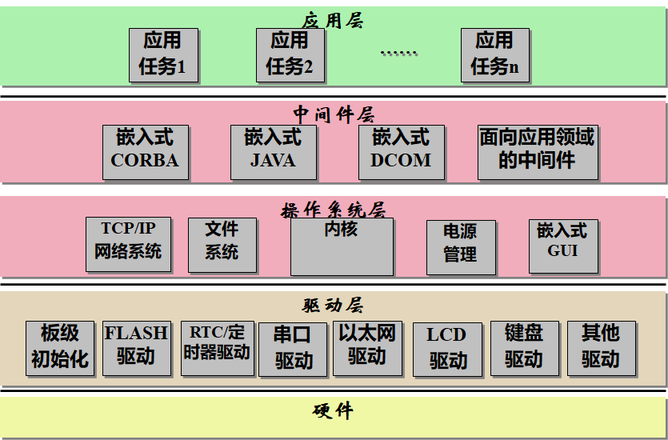

#### 应用层

- 应用层软件主要由多个相对独立的应用任务组成
- 每个应用任务完成特定的工作，如I/O任务、计算的任务、通信任务等，由操作系统调度各个任务的运行

#### 中间件层

- 一些复杂的嵌入式系统中也开始采用中间件技术，主要包括嵌入式CORBA、嵌入式Java、嵌入式DCOM和面向应用领域的中间件软件。

- 如基于嵌入式CORBA的应用于软件无线电台的应用中间件SCA（Software Core Architecture）

#### 操作系统层

- 操作系统层包括嵌入式**内核**、嵌入式TCP/IP网络系统、嵌入式文件系统、嵌入式GUI系统和电源管理等部分。
- 其中嵌入式**内核**是基础和必备的部分，其他部分要根据嵌入式系统的需要来确定。

#### 驱动层

- 板级初始化程序

  微处理器、存储器、中断控制器、DMA、定时器的初始化

- 与系统软件相关的驱动

  一般与系统绑定

- 与应用软件相关的驱动

与应用软件相关的驱动不一定需要与操作系统连接，这些驱动的设计和开发由应用决定

#### 硬件

### 运行流程

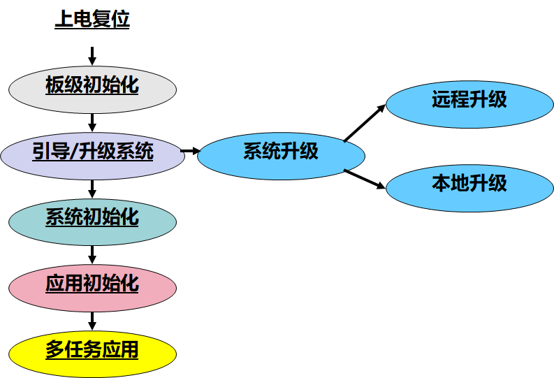

基于多任务操作系统的嵌入式软件的主要运行流程

该运行流程主要分为5个阶段

#### 板级初始化

- 上电复位复位后完成版级初始化工作
- 一般用汇编语言完成
  - CPU中堆栈指针寄存器的初始化
  - BSS段（Block Storage Space 未初始化数据）的初始化
  - CPU芯片级初始化：中断控制器、内存等初始化

#### 系统引导/升级阶段

- 根据需要分别进入系统软件引导阶段或系统升级阶段
- 软件可通过测试通信端口数据或判断特定开关的方式分别进入不同阶段

引导方式

- NOR Flash读取加载到RAM中

- 不需要引导到RAM直接在NorFlash，进入系统初始化

- 软件从外存中读取出来加载到RAM中运行

升级阶段

- 进入系统升级阶段后系统可通过**网络进行远程升级**或通过**串口进行本地升级**
- **远程升级**一般支持TFTP、FTP、HTTP等方式
- **本地升级**可通过Console口使用超级终端或特定的升级软件进行

#### 系统初始化

- 在该阶段进行操作系统等系统软件各功能部分必需的初始化工作，如根据**系统配置初始化数据空间**、初始化系统所需的**接口和外设**等
- 系统初始化阶段需要按**特定顺序**进行，如首先完成内核的初始化，然后完成网络、文件系统等的初始化，最后完成中间件等的初始化工作

#### 应用初始化

在该阶段进行**应用任务的创建，信号量、消息队列的创建**和与应用相关的其它初始化工作

#### 多任务应用运行阶段

各种初始化工作完成后，系统进入多任务状态，操作系统按照已确定的算法进行任务的调度，各应用任务分别完成特定的功能

## 嵌入式操作系统

### 概述

嵌入式操作系统是应用在嵌入式系统的操作系统，具有一般操作系统的功能，同时具有嵌入式软件的特点

- 可固化
- 可配置、可裁剪
- 独立的板级支持包，可修改
- 不同的CPU有不同的版本
- 应用的开发需要有集成交叉开发工具

随着嵌入式系统应用领域的扩展，目前嵌入式操作系统的市场在不断细分，出现了针对不同领域的产品，这些产品按领域的要求和标准提供特定的功能

### 嵌入式操作系统的演变

在嵌入式系统的发展过程中，从操作系统的角度来看，大致经历了以下几个阶段：

- 无操作系统阶段
  - 最初**基于单片机**的嵌入式应用一般没有操作系统的支持，只能通过汇编语言对系统进行直接控制，运行结束后再清除内存
  - 这一阶段嵌入式系统的主要特点是：系统简便、价格低廉，处理效率低，存储容量小，几乎没有用户接口。无法满足对执行效率、存储容量、可移植性、可扩展性都有较高要求的应用需要
- 简单操作系统阶段
  - 20世纪80年代，随着微电子工艺水平的提高，嵌入式系统的程序员也开始基于**一些简单的“操作系统”**开发嵌入式应用软件，大大缩短了开发周期、提高了开发效率
  - 简单的嵌入式操作系统虽然还比较简单，但已经初步具有了一定的兼容性和扩展性，内核精巧且效率高，主要用来控制系统负载以及监控应用程序的运行
- 实时操作系统阶段
  - 20世纪90年代，在分布控制、数字化通信和信息家电等巨大需求的牵引下，面向实时信号处理算法的DSP产品则向着高速度、高精度、低功耗的方向发展。随着嵌入式系统的规模也不断扩大，逐渐形成了**嵌入式实时多任务操作系统（RTOS）**，并开始成为主流
  - 这一阶段主要特点是：操作系统的实时性得到了很大改善，已经能够运行在各种不同类型的微处理器上，具有高度的模块化和扩展性
  - 此时的嵌入式操作系统已经**具备了多任务内核之外的功能，包括嵌入式文件、设备管理、嵌入式TCP/IP、嵌入式GUI等**，并提供了大量的应用程序接口API
- 面向Internet的阶段
  - 各类**嵌入式Linux操作系统**迅速发展，由于具有源代码开放、执行效率高、**网络结构完整**等特点，很适合信息家电等嵌入式系统的需要
  - 精简系统内核，优化关键算法，降低功耗和软硬件成本
  - 提供更加友好的**多媒体人机交互界面**

RTOS举例

VRTX，VxWorks，QNX，TinyOS，μcOS-II，TRLinux，eCos，Android，IOS

### 分类

从应用领域来分

- SymbianOS、MS MobileOS，PalmOS、Embedded Linux，OSEK/AUTOSAR

从实时性的角度来分

- VxWorks、QNX、Nuclear、OSE、DeltaOS（国产嵌入式OS）、ITRON OS
- WinCE，众多嵌入式Linux，PalmOS

商业模式

- 商业型：功能稳定...、开发费用+版税
- 开源型

### 嵌入式操作系统体系结构

目前操作系统的体系结构

- 宏内核（单块结构）
- 层次结构
- 客户/服务器（微内核）结构

#### 宏内核（单块结构）

- 操作系统由多种模块构成
- 模块之间可相互调用
- 用户态和核心态两种工作模式
- 两种执行权限和执行空间

如：Android

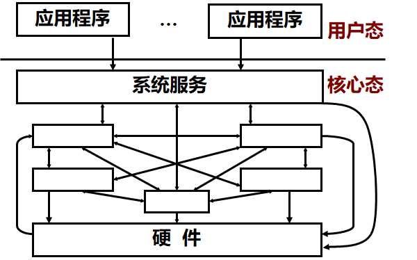

很难调试和维护，一个模块出现问题，整个系统崩溃，如：DOS

跟硬件相关的部分没有很好地剥离出来，可移植性存在问题

#### 层次结构

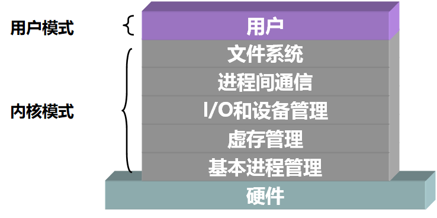

- 上层不能修改下层的数据
- N-1层为N层提供服务
- 提高操作系统的安全性

#### 客户/服务器（微内核）结构

- **微内核**，只完成任务管理、任务调度、通信等基本功能

- 其它功能实现为**系统任务或进程**，运行于用户模式

- 用户任务通过**系统调用发出请求**，服务器响应请求，微内核负责完成通信、同步、任务调度等基本功能

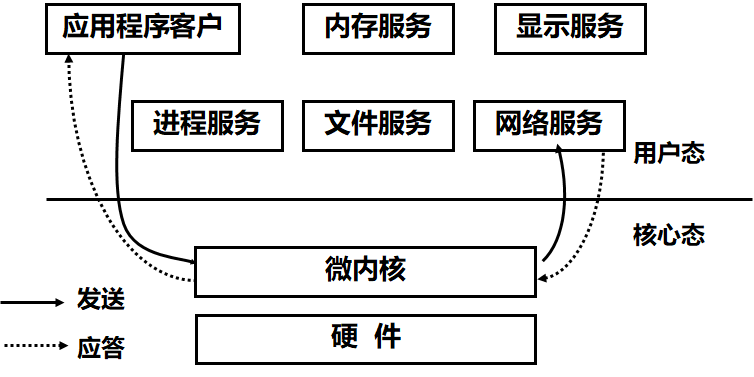

微内核结构的优点

- 提供一致的接口

- 可扩展性：扩展对新的软件/硬件支持

- 灵活性：可伸缩

- 可移植性

- 分布式系统支持

- 适用于面向对象操作系统环境

性能问题

- 通过微内核构造和发送信息、接受应答并解码所花费的时间比进行一次系统调用的时间多

- 很大程度取决于微内核的大小和功能

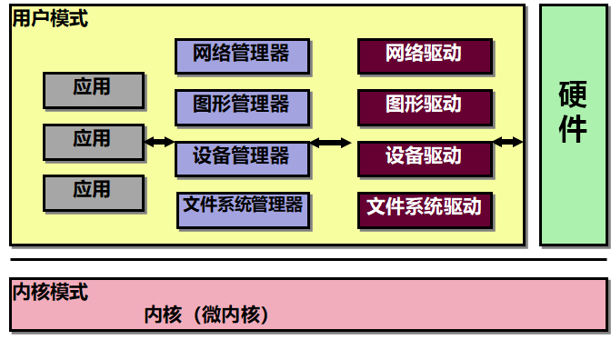

#### 分层和模块化

目前嵌入式操作系统主要采用分层和模块化相结合的结构或微内核结构。

- **分层和模块化结合**的结构将操作系统分为**硬件无关层、硬件抽象层和硬件相关层**，每层再划分功能模块。

- 这样移植工作便集中在硬件相关层，与其余两层无关，功能的伸缩则集中在模块上，从而确保其具有良好的可移植性和可伸缩性。

- 而采用微内核结构，则可利用其可伸缩的特点适应硬件的发展，便于扩展。 

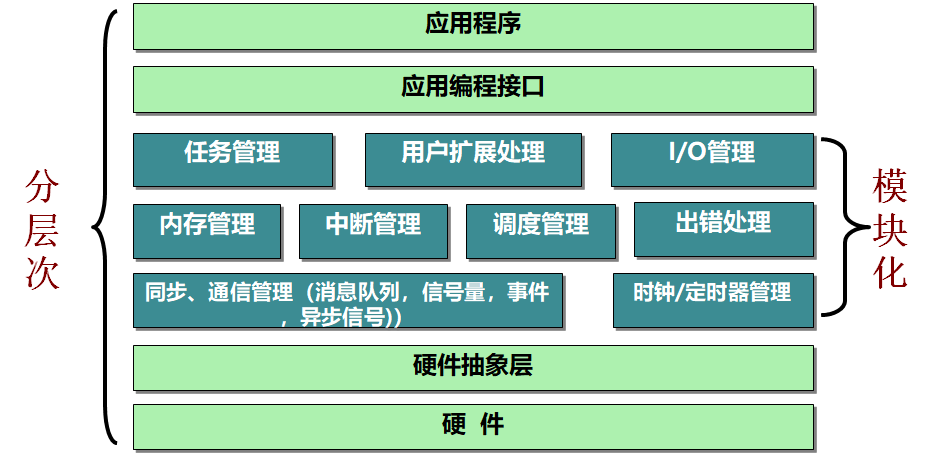

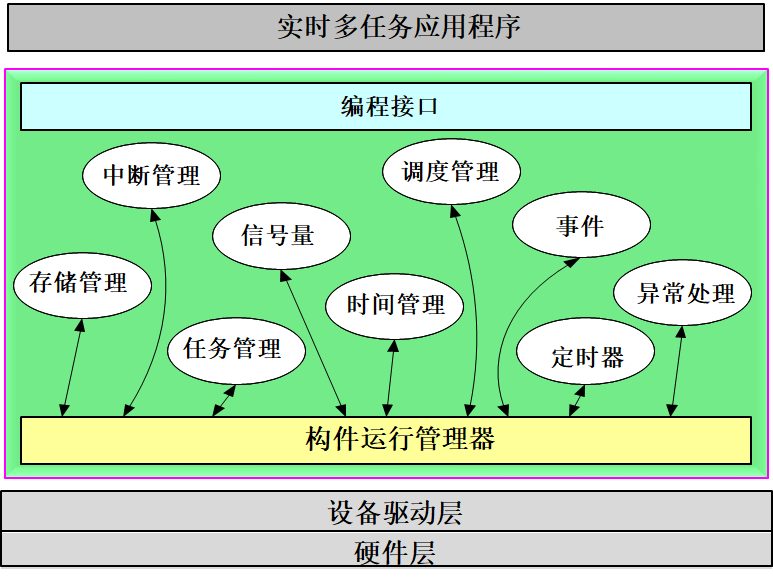

### 嵌入式操作系统的组成

嵌入式内核，嵌入式TCP/IP网络系统，嵌入式文件系统

通用操作系统组成：进程管理，存储器管理，文件管理，设备管理，用户界面

#### 嵌入式内核

- 内核是嵌入式操作系统的基础，也是必备的部分。

- 内核还提供特定的应用编程接口，但目前没有统一的标准。

##### 任务管理

- 内核的核心部分，具有**任务调度、创建任务、删除任务、挂起任务、解挂任务、设置任务优先级**等功能。

任务调度原则

- 通用计算机的操作系统追求的是**最大的吞吐率**，为了达到最佳整体性能，其调度原则是**公平**，采用Round-Robin或可变优先级调度算法，调度时机主要以**时间片为主驱动**。

- 而嵌入式操作系统多采用**基于静态优先级的可抢占的调度**，任务优先级是在运行前通过某种策略静态分配好的，一旦有优先级更高的任务就绪就马上进行调度。

##### 内存管理

- 嵌入式操作系统的内存管理比较简单。

- 通常不采用**虚拟存储管理**，而采用**静态内存分配和动态内存分配**（固定大小内存分配和可变大小内存分配）相结合的管理方式。

- 有些内核利用**MMU机制**提供内存保护功能。

- 通用操作系统广泛使用了虚拟内存的技术，为用户提供一个功能强大的虚存管理机制。

##### 通信、同步和互斥机制

- 这些机制提供**任务间、任务与中断处理程序**间的通信、同步和互斥功能。

- 一般包括信号量、消息、事件、管道、异步信号和共享内存等功能。

- 与通用操作系统不同的是，嵌入式操作系统需要解决在这些机制的使用中出现的**优先级反转**问题。

##### 中断管理

一般具有以下功能：

- 安装中断服务程序

- 中断发生时，对中断现场进行保存，并且转到相应的服务程序上执行

- 中断退出前，对中断现场进行恢复

- 中断栈切换

- 中断退出时的任务调度 

##### 时间管理

- 提供**高精度、应用可设置的系统时钟**，该时钟是嵌入式系统的时基，可设置为十毫秒以下。

- 提供**日历时间**，负责与时间相关的任务管理工作如任务对资源有限等待的计时、时间片轮转调度等，提供软定时器的管理功能等。

- 通用操作系统的系统时钟的精度由操作系统确定，应用不可调，且一般是几十个毫秒。

##### 任务扩展功能

- 任务扩展功能就是在内核中设置一些**Hook的调用点**，在这些调用点上内核调用应用设置的、应用自己编写的扩展处理程序，以扩展内核的有关功能。

- Hook调用点有任务创建、任务切换、任务删除、出错处理等。

#### 嵌入式TCP/IP

TCP/IP协议已经广泛地应用于嵌入式系统中
嵌入式TCP/IP网络系统提供符合TCP/IP协议标准的协议栈，提供Socket编程接口

嵌入式TCP/IP网络系统具有以下的特点：

- 可剪裁：

  能根据嵌入式系统的功能的要求选择所需的协议，对完整的TCP/IP协议簇进行剪裁，以满足用户的需要。

- 采用“零拷贝”（Zero Copy）技术，提高实时性

  零拷贝：是指TCP/IP协议栈没有用于各层间数据传递的缓冲区，协议栈各层间传递的都是数据指针，只有当数据最终要被驱动程序发送出去或是被应用程序取走时，才进行真正的数据搬移

- 采用静态分配技术

  在网络初始化时就**静态分配通信缓冲区**，设置了专门的发送和接收缓冲（其大小一般小于或等于物理网络上的MTU值），从而确保了每次发送或接收时处理的数据不会超过MTU值，也就避免了数据处理任务的阻塞等待。 

#### 嵌入式文件系统

通用操作系统的文件系统通常具有以下功能：

- 提供用户对文件操作的命令

- 提供用户共享文件的机制

- 管理文件的存储介质

- 提供文件的存取控制机制，保障文件及文件系统的安全性

- 提供文件及文件系统的备份和恢复功能

- 提供对文件的加密和解密功能

嵌入式文件系统相比之下较为简单，主要具有文件的存储、检索、更新等功能，一般不提供保护和加密等安全机制。

它以**系统调用和命令方式**提供对文件的各种操作，主要有：

- 设置和修改对文件和目录的存取权限 

- 提供建立、修改、改变、删除目录等服务

- 提供创建、打开、读、写、关闭、撤消文件等服务 

### 嵌入式实时操作系统µC/OS-II简介

µC/OS-II是一个**抢占式实时多任务内核**。它是用ANSI的C语言编写的，包含一小部分汇编语言代码，使之可以提供给不同架构的微处理器使用。

至今，从8位到64位，µC/OS-II已经在40多种不同架构的微处理器上使用。

使用µC/OS的领域包括：照相机行业、航空业、医疗器械、网络设备、自动提款机以及工业机器人等。 

µC/OS-II全部以源代码的方式提供，大约有5500行。

CPU相关的部分使用的是针对Intel80x86微处理器的代码。

µC/OS-II可以很容易地移植到不同架构的嵌入式微处理器上。 

µC/OS-II的特点：源代码、可移植、可固化、可裁减、可抢占性、支持多任务、可确定性、任务栈、系统服务、中断管理、稳定性和可靠性

## 嵌入式软件开发工具

嵌入式软件开发工具的集成度和可用性将直接关系到嵌入式系统的开发效率。

### 嵌入式软件开发工具的分类

需求分析(Requirement Analysis)：需求分析工具

设计(Software Design)：软件设计工具

编码(Coding)：编码、调试工具

测试(Test)：测试工具

发布、维护(Release)：配置管理工具、维护工具

**嵌入式软件的开发可以分为以下几种 ：**

- 编写简单的**板级测试**软件，主要是辅助硬件的调试 

- 开发基本的**驱动**程序

- 开发特定嵌入式操作系统的驱动程序（板级支持包）

- 开发嵌入式**系统**软件，如：嵌入式操作系统等

- 开发**应用**软件

与嵌入式OS相关的开发工具，用于开发：

- 基于嵌入式OS的应用

- 部分驱动程序等

与嵌入式OS无关的开发工具，用于开发：

- 基本的驱动程序

- 辅助硬件调试程序

- 系统软件

### 嵌入式软件的交叉开发环境

**交叉开发环境**是指用于嵌入式软件开发的所有工具软件的集合，一般包括：

- 文本编辑器

- 交叉编译器

- 交叉调试器

- 仿真器

- 下载器等

交叉开发环境由**宿主机和目标机**组成，宿主机与目标机之间在**物理连接**的基础上建立起**逻辑连接**

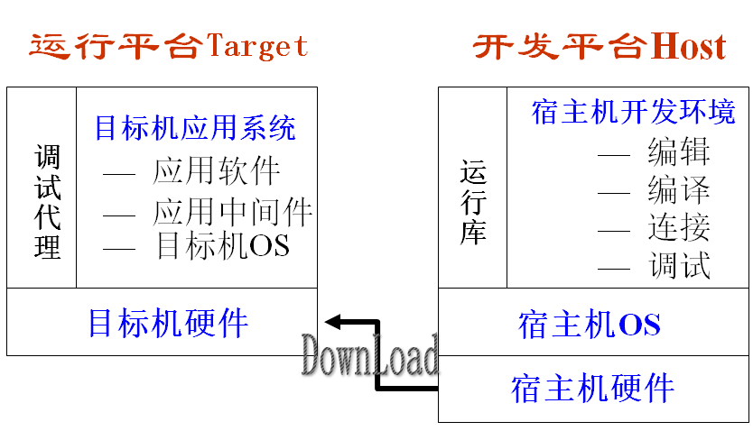

宿主机（Host） ：是用于开发嵌入式系统的计算机。一般为PC机（或者工作站），具备丰富的软硬件资源，为嵌入式软件的开发提供全过程支持。

目标机（Target）：即所开发的嵌入式系统，是嵌入式软件的运行环境，其硬件软件是为特定应用定制的。

在开发过程中，目标机端需接收和执行宿主机发出的各种命令如设置断点、读内存、写内存等，将结果返回给宿主机，配合宿主机各方面的工作。

**物理连接和逻辑连接** 

- **物理连接**是指宿主机与目标机通过物理线路连接在一起，连接方式主要有三种：
  - 串口
  - 以太口
  - OCD（On Chip Debug）方式，如JTAG、BDM等

- 物理连接是逻辑连接的基础。

- **逻辑连接**指宿主机与目标机间按某种通信协议建立起来的通信连接，目前逐步形成了一些通信协议的标准。

**设计完成后，嵌入式软件的开发进入实现阶段，可分为三个步骤：生成、调试和固化运行。**

- **软件的生成**主要是在宿主机上进行，利用各种工具完成对应用程序的编辑、交叉编译和链接工作，生成可供调试或固化的目标程序。

- **调试**是通过交叉调试器完成软件的调试工作。调试完成后还需进行必要的测试工作。

- **固化运行**是先用一定的工具将应用程序固化到目标机上，然后启动目标机，在没有任何工具干预的情况下应用程序能自动地启动运行。

### 嵌入式软件实现阶段的开发过程

#### 嵌入式软件生成阶段

三个过程

- 源代码程序的编写

- 编译成各个目标模块

- 链接成可供下载调试或固化的目标程序

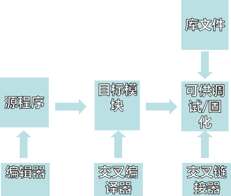

交叉编译：把在宿主机上编写的高级语言程序编译成可以运行在**目标机上**的代码，即在宿主机上能够编译生成**另一种CPU**（嵌入式微处理器）上的二进制程序。

#### 嵌入式软件的调试

交叉调试器（Cross debugger）

- 是指调试程序和被调试程序运行在不同机器上的调试器

- 调试器通过某种方式能控制目标机上被调试程序的运行方式

- 通过调试器能查看和修改目标机上的内存、寄存器以及被调试程序中的变量等

| 交叉调试                                   | 非交叉调试                                 |
| ------------------------------------------ | ------------------------------------------ |
| 调试器和被调试程序运行在**不同**的计算机上 | 调试器和被调试程序运行在**同一台**计算机上 |
| 可独立运行，无需操作系统支持               | 需要操作系统的支持                         |
| 被调试程序的**装载由调试器**完成           | 被调试程序的装载由专门的Loader程序完成     |
| 需要通过**外部通信**的方式来控制被调试程序 | 不需要通过外部通信的方式来控制被调试程序   |
| 可以直接调试**不同指令集**的程序           | 只能直接调试相同指令集的程序               |

交叉调试方式

-  Crash and Burn 

-  Rom Monitor

-  Rom Emulator

-  In Circuit Emulator

-  On Chip Debugging

Simulator方式（非交叉）

- 模拟器，模拟在目标机上运行

##### Crash and Burn

最早的嵌入式应用软件调试方法。

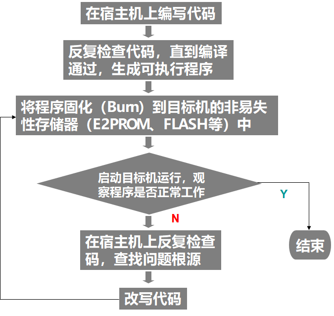

##### ROM Monitor

ROM Monitor是被**固化且运行**在目标机上的**一段程序**，负责监控目标机上被调试程序的运行，与宿主机端的调试器一起完成对应用程序的调试。

调试器与ROM Monitor之间的通信遵循远程调试协议。

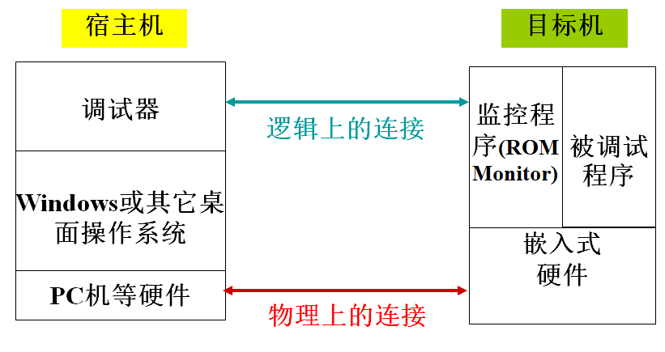

- 在目标机上电或复位后首先执行的就是ROM Monitor，它对目标机进行一些必要的初始化
  - 初始化要求的外围设备，如最基本的串口和用于内存刷新的系统计时器芯片
  - 初始化用于下载映像的内存系统
  - 初始化中断控制器和安装中断处理程序
- 初始化自己的程序空间

- 等待宿主机端的命令

ROM Monitor能配合调试器完成

- 程序映像下载
- 对目标机系统内存的读写
- 对寄存器的读写
- 设置和清除不同类型的断点
- 单步执行指令
- 复位系统
- …等调试功能

调试过程

1. 启动目标机，监控器掌握对目标机的控制，等待和调试器建立连接；
2. 启动调试器，并和监控器建立起通信连接；
3. 使用调试器将应用程序下载到目标机上的RAM空间中；
4. 使用调试器进行调试，发出各种调试命令，监控器解释并执行这些命令，通过目标机上的各种异常来获取对目标机的控制，将命令执行结果回传给调试器； 
5. 如果程序有问题，在调试器的帮助下定位错误；修改之后再重新编译链接并下载程序，开始新的调试，如此反复直至程序正确运行为止。 

###### 优点

1. 提高调试程序的效率 ，缩短开发周期，降低成本
2. 简单、方便
3. 可扩展性强，可支持许多高级调试功能
4. 成本低廉，不需专门的调试硬件支持
5. **几乎所有的交叉调试器都支持这种方式**

###### 缺点

1. Debug Monitor需要用Crash and Burn方法开发。
2. 当ROM Monitor占用CPU时，应用程序不响应外部的中断，因此不便调试有时间特性的程序。
3. 某些调试功能依赖于CPU硬件的支持（如硬件断点功能）
4. **ROM Monitor要占用目标机一定数量的资源，如CPU、RAM、ROM和通信设备等资源**
5. **调试环境不同于实际目标环境**

#### 仿真开发方式

嵌入式应用的开发经常会遭遇缺少目标机环境、缺乏目标机芯片等资源的问题，利用仿真器件、仿真环境进行开发的方法。

##### 硬件仿真开发

###### ROM Emulator

替代目标机上的ROM芯片的设备。可以实时地映射到目标机的ROM地址空间，从而仿真（Emulation）目标机的ROM

- 优点
  - 目标机可以没有ROM芯片、可以使用ROM Emulator提供的ROM空间且不需要用别的工具来写ROM
- 缺点
  - 目标机必须能支持外部ROM存储空间，而且由于其通常要和ROM Monitor配合使用，因此它拥有ROM Monitor的所有缺点

###### ICE

In-Circuit Emulator

用于替代目标机上CPU的设备，即在线仿真器

比一般的CPU有更多的引出线，能够将内部的信号输出到被控制的目标机

ICE上的Memory也可以被映射到用户的程序空间，这样即使目标机不存在的情形下也可以进行代码的调试

功能特点

- 同时支持软断点和硬件断点的设置

- 设置各种复杂的断点和触发器

- 实时跟踪目标程序的运行，并可实现选择性的跟踪

- 支持“Time Stamp” 

- 允许用户设置“Timer” 

- 提供“Shadow RAM”，能在不中断被调试程序的运行下查看内存和变量即**非干扰调试查询**

适用于：调试实时的应用系统、调试设备驱动程序、对硬件进行功能和性能的测试、实时性能分析

缺点：价格太昂贵，不利于团队开发，所仿CPU有限

###### OCD

On Chip Debugging

是CPU芯片提供的一种调试功能（片上调试）

将CPU的模式分为一般模式和调试模式

调试模式下，CPU首先从调试端口读取指令，通过调试端口可以控制CPU进入和退出调试模式；Host端的调试器可以直接向目标机发送要执行的指令，读写目标机的内存和各种寄存器，控制目标程序的运行以及完成各种复杂的调试功能

优点

1. 不占用目标机的资源
2. 调试环境和最终的程序运行环境基本一致
3. 支持软硬断点、Trace功能
4. 精确计量程序的执行时间
5. 提供时序分析功能

缺点

1. 调试的实时性不如ICE
2. 不支持非干扰调试查询
3. CPU必需具有OCD功能

存在各种实现

- BDM（Background Debugging Mode）

- JTAG（Joint Test Access Group）（主流方式）

- OnCE（On Chip Emulation）

边界扫描技术JTAG

JTAG——标准测试访问接口与边界扫描结构（Standard Test Access Port and Boundary Scan Architecture），已被IEEE1149.1标准所采纳，是面向用户的测试接口

Nexus标准可以进行多内核处理器的调试

##### 软件仿真开发

###### Simulator

一种软件仿真器，在宿主机上创建一个虚拟的目标机环境，再将应用系统下载到这个虚拟目标机上运行／调试。

软件仿真的对象

- 仿真处理器

- 仿真外设

- 仿真环境

软件仿真的级别

- 指令级仿真开发

- API级仿真开发

优点

 最大好处就是可以不用真正的目标机，可以在目标机环境并不存在的条件下开发目标机上的应用系统，并且在调试时可以利用Host资源提供更详细的错误诊断信息。

缺点

- 和实际的运行环境差别很大
- 设备模拟的局限性较大
- 实时特性较差
- 对Host的资源要求较高

适用范围

​	对时间特性没有严格要求、没有特殊外设、只需要验证逻辑正确的应用程序。

### 嵌入式软件的测试

测试工具：能够用来辅助测试的工具，主要用来支持测试人员的工作，本身不能直接用来进行测试。测试工具一般都是通用工具，测试人员应该根据实际情况对它们进行适当的调整。

嵌入式软件测试中经常用到的测试工具有：

- 内存分析工具

  - 嵌入式系统的内存资源通常是受限的，内存分析工具可以用来处理在进行动态内存分配时产生的缺陷。当动态分配的内存被错误地引用时，产生的错误通常难以再现，出现的失效难以追踪，使用内存分析工具可以很好地检测出这类缺陷。

    目前常用的内存分析工具有软件和硬件两种：

    - 基于软件的内存分析工具可能会对代码的执行性能带来很大影响，从而影响系统的实时性；
    - 基于硬件的内存分析工具对系统性能影响小，但价格昂贵，并且只能在特定的环境中使用。 

- 性能分析工具

  - 嵌入式系统的性能通常是一个非常关键的因素，开发人员一般需要对系统的某些关键代码进行优化来改进性能。

    性能分析工具

    - 可以提供有关数据，帮助确定哪些任务消耗了过多的执行时间，从而可以决定如何优化软件，以获得更好的时间性能。
    - 引导开发人员发现在系统调用中存在的错误以及程序结构上的缺陷。

- 覆盖分析工具

  - 在进行白盒测试时，可以使用代码覆盖分析工具追踪哪些代码被执行过
  - 分析过程一般通过插桩来完成，插桩可以是在测试环境中嵌入硬件，也可以是在可执行代码中加入软件，或者是两者的结合。
  - 开发人员通过对分析结果进行总结，可以确定哪些代码被执行过，哪些代码被遗漏了。
  - 目前常用的覆盖分析工具一般都提供有关功能覆盖、分支覆盖、条件覆盖等信息。 

- 缺陷跟踪工具等

##### 逻辑分析仪

工作机理：在不打断被测程序运行流程的基础上，对程序运行中的相关信息进行采集和分析，然后通过真实再现程序运行的逻辑流程和分析程序运行数据，帮助用户优化系统设计和解决出现的问题。

主要功能：

- 真实再现程序运行流程
- 发现系统死锁及软件造成的死机
- 发现系统内存泄漏
- 指导对任务的合理划分
- 指导关键路径设计与验证
- 指导合理分配任务堆栈
- CPU使用率统计
- 指导合理设计中断服务程序

### 嵌入式软件的固化运行

当调试完成之后，程序代码需要被完全烧入到目标板的非易失性存储器（如ROM或闪存）中，并且在真实的硬件环境上运行，这个过程叫做固化。

调试环境与固化环境的区别：

- 代码定位不同

- 初始化部分不同

| 阶段 | 调试环境                                                     | 固化环境                                                     |
| ---- | ------------------------------------------------------------ | ------------------------------------------------------------ |
| 编译 | 目标文件需要调试信息                                         | 目标文件不需要调整信息                                       |
| 链接 | 应用系统目标代码不需要Boot模块，此模块已由目标板上的监控器程序实现。 | 应用系统目标代码必须以Boot模块作为入口模块。                 |
| 定位 | 程序的所有代码段、数据段都依次被定位到调试空间的RAM中。      | 程序的各逻辑段按照其不同的属性分别定位到非易失性存储空间（ROM）或RAM中。 |
| 下载 | 宿主机上的调试器读入被调试文件，并将其下载到目标机上的调试空间中，目标机掉电后所有信息全部丢失。 | 在宿主机上利用固化工具将可固化的应用程序写入目标机的非易失性存储器中，目标机掉电后信息不丢失。 |
| 运行 | 被调试程序在目标监控器的控制下运行，并与后者共享某些资源，如CPU资源、RAM资源以及通信设备（如串口、网口等）资源。 | 程序在真实的目标硬件环境上运行                               |

Boot模块：当应用程序在真实的目标环境下运行时将首先执行该程序，它至少由系统加电时执行的代码组成。

Boot模块的主要功能：初始化CPU环境，使目标机硬件到已知的状态

- 初始化芯片的引脚

- 初始化系统外部控制寄存器

- 初始化基本输入输出设备

- 初始化MMU，包括片选控制寄存器等

- 执行数据拷贝 

------

## 基本术语

 任务（task）：RTOS的一个程序运行实体，调度的基本单位。（本教材约定任务和线程等价 ）

 上下文切换（Context Switching）：当处理器的控制权由运行任务（或线程）转交到另一个就绪任务（或线程）时所发生的事件序列。

 多任务系统：一个系统需要一个以上任务一起协同工作，形成一个有机整体。

 抢占（Preemptive）调度：当前执行任务被另一就绪任务打断，即当系统处于核心态运行时，允许任务的重新调度。

 不可抢占（Non-Preemptive）调度：一旦某个任务占用了CPU，就一直运行下去，直到任务自身放弃CPU时才进行调度，即当前执行任务不允许被打断。

 互斥（Mutual Exclusion）：控制多任务对共享数据进行串行访问的机制。

 优先级（Priority）：任务的紧急程度和重要性。通常会常用整数表示任务的优先级。

 优先级驱动（Priority Driven）：任何时刻，总是将处理器分配给优先级最高的任务的机制。

 可调度性（Schedulability）：一个任务的完成时间不大于截止时间（Deadline），称任务可调度；若系统所有任务可调度，称系统可调度。

 优先级反转（Priority Inversion）：高优先任务等待低优先级任务释放资源而被堵塞的情况 —— 产生死锁的原因

 优先级继承（Priority Inheritance）：优先级反转时，低优先级任务被暂时提高优先级，确保其尽快执行，并释放较高优先级任务所需的资源。

自举 Boot过程