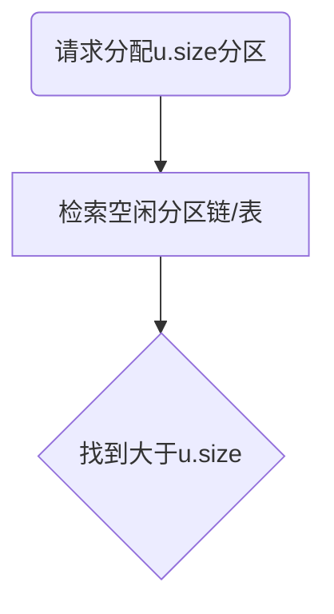

# 内存管理

## 存储(内存)管理概述

存储管理要求

- 重定位
  - memory 换出到Disk中，Disk换进memory，程序地址会上下浮动。如果程序中有跳转地址时，需要更新地址内容
- 保护
- 共享
- 逻辑组织
- 物理组织

## 程序的装入和链接

用户源程序编程一个可在内存中的程序，通常要经过3步

1. 编译：由编译程序(Compiler)将用户源代码编译成若干个目标模块
   1. 词法分析(检查关键字等)
   2. 语法分析
   3. 语义分析
   4. 中间代码
   5. 目标代码
2. 链接：有链接程序(linker)将编译后形成的一组目标模块，以及所需要的库函数链接在一起，形成一个完整的装入模块
3. 装入：由装入程序(loader)将装入模块装入内存

链接和装入 P219

### 装入

装入方式：绝对装入方式、重定位装入，运行时装入

#### 绝对装入

自动程序将驻留在内存的什么位置，编译程序将产生绝对地址的目标代码，如BIOS和底层驱动等。

程序中的逻辑地址与实际内存地址完全相同，不需要进行修改

#### 可重定位装入

目标模块的起始地址通常是从0开始的，程序中的其他地址也都是相对于起始地址计算的

地址在装入时进行计算，只进行一次变地址，装入后不在改变

假设：有程序A 0~1FFH，大小 200H。memory中装入起始地址300H。程序中有一条请求2FFH的请求，就会变成5FFH。

#### 运行时装入

采用动态重定位方式将程序装入内存

### 链接

链接器的功能是把一组目标模块作为输入，产生一个包含完整程序和数据模块的加载模块

#### 静态链接

链接之后整个模块不再做变化，装入时模块一次性全部装入(作为一个整体)

#### 装入时动态链接

装入内存时，边装入边链接

优点：

- 便于修改和更新
- 便于实现对目标模块的共享
  - 如果采取静态链接，每个模块必须含有目标模块的拷贝

#### 运行时动态链接

在执行中需要目标模块四，由OS去找到该模块并装入内存...

可以查看附录7

## 连续分配

分配方式：连续分配和离散分配（现代操作系统大多用离散分配，页和段）

### 连续分配方式

指一个用户程序分配一个连续的内存空间，连续分配方式有四种

1. 单一连续分配
2. 固定分区分配
3. 动态分区分配
4. 可重定位分区分配

#### 单一连续分配

单用户单任务系统

把内存分为系统区和用户区两部分

1. 系统区仅提供给OS使用，通常是放在内存的低址部分
2. 用户区是指除系统区以外的...

#### 固定分区分配

将用户空间划分为若干个固定大小的区域，在每个分区中只装入一道作业

划分分区的方法：

- 分区大小相等：当程序太小是，会造成内存空间的浪费。当程序太大是，<u>一个分区有不足以装入程序，使该程序无法运行</u>
- 分区大小不等：把内存划含有多个较小的分区、适量的中等分区及少量的大分区

因为一个分区只装一个进程，内零头：分区内无法利用的空的空间

#### 动态分区分配

按需分配

外零头（外部碎片）：若干不可利用的小分区

### 适配方法

- 最佳适配：空闲空间与要求的最接近的分区块
  - 优缺点：会剩下很多的外零头

- 最差适配：空闲空间与请求空间最不接近的分区块
- 首次适配：从头到尾找一个适合的（只要能装下）
- 下次适配，接着上次的位置往后找，

空闲分区表

空闲分区链：下一个可以分区的信息

紧凑：将用户程序间外零头消除，排到一起，可重定位的动态分区分配

伙伴系统实现

不容易实现

