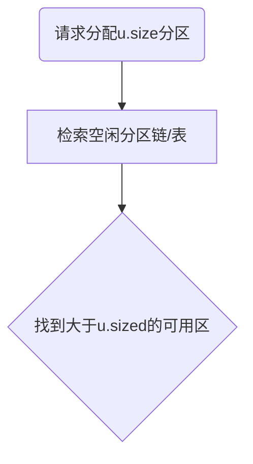

# 内存管理

## 存储(内存)管理概述

存储管理要求

- 重定位
  - memory 换出到Disk中，Disk换进memory，程序地址会上下浮动。如果程序中有跳转地址时，需要更新地址内容
- 保护
- 共享
- 逻辑组织
- 物理组织

## 程序的装入和链接

用户源程序编程一个可在内存中的程序，通常要经过3步

1. 编译：由编译程序(Compiler)将用户源代码编译成若干个目标模块
   1. 词法分析(检查关键字等)
   2. 语法分析
   3. 语义分析
   4. 中间代码
   5. 目标代码
2. 链接：有链接程序(linker)将编译后形成的一组目标模块，以及所需要的库函数链接在一起，形成一个完整的装入模块
3. 装入：由装入程序(loader)将装入模块装入内存

链接和装入 P219

### 装入

装入方式：绝对装入方式、重定位装入，运行时装入

#### 绝对装入方式

- 如果知道程序将驻留在内存的什么位置，那么，**编译程序**将产生绝对地址的目标代码，如BIOS和底层驱动等
- **绝对装入程序**按照装入模块中的地址，将程序和数据装入内存。装入模块被装入内存后，由于程序中的<u>逻辑地址与实际内存地址完全相同，故不需对程序和数据的地址进行修改</u>
- 为了便于程序的修改,对编译的程序采用符号地址，然后在编译或汇编时，再将这些符号地址转换为绝对地址

#### 可重定位装入

- 目标模块的起始地址通常是从0开始的，程序中的其它地址也都是相对于起始地址计算的
-  由装入程序将装入模块装入内存后，装入模块中程序所访问的所有逻辑地址与实际装入内存的物理地址不同 ，必须进行变换

把在装入时对目标程序中指令和数据的变换过程称为重定位。因为地址变换是在装入时一次完成的，地址在装入时进行计算，以后不再改变，故称为静态重定位

假设：有程序A 0~1FFH，大小 200H。memory中装入起始地址300H。程序中有一条请求2FFH的请求，就会变成5FFH。

 采用静态重定位方法将程序装入内存,称为可重定位装入方式

#### 运行时装入

采用动态重定位方式将程序装入内存

### 链接

链接器的功能是把一组目标模块作为输入，产生一个包含完整程序和数据模块的加载模块

#### 静态链接

链接之后整个模块不再做变化，装入时模块一次性全部装入(作为一个整体)

#### 装入时动态链接

装入内存时，边装入边链接

优点：

- 便于修改和更新
- 便于实现对目标模块的共享
  - 如果采取静态链接，每个模块必须含有目标模块的拷贝

#### 运行时动态链接

在执行中需要目标模块四，由OS去找到该模块并装入内存...

可以查看附录7

## 连续分配

分配方式：连续分配和离散分配（现代操作系统大多用离散分配，页和段）

### 连续分配方式

指一个用户程序分配一个连续的内存空间，连续分配方式有四种

1. 单一连续分配
2. 固定分区分配
3. 动态分区分配
4. 可重定位分区分配

#### 单一连续分配

单用户单任务系统

把内存分为系统区和用户区两部分

1. 系统区仅提供给OS使用，通常是放在内存的低址部分
2. 用户区是指除系统区以外的...

#### 固定分区分配

将用户空间划分为若干个固定大小的区域，在每个分区中只装入一道作业

划分分区的方法：

- 分区大小相等：当程序太小是，会造成内存空间的浪费。当程序太大是，<u>一个分区有不足以装入程序，使该程序无法运行</u>
- 分区大小不等：把内存划含有多个较小的分区、适量的中等分区及少量的大分区

因为一个分区只装一个进程，内零头：分区内无法利用的空的空间

#### 动态分区分配

按需分配

外零头（外部碎片）：若干不可利用的小分区

### 适配方法

- 最佳适配：空闲空间与要求的最接近的分区块
  - 优缺点：会剩下很多的外零头

- 最差适配：空闲空间与请求空间最不接近的分区块
- 首次适配：从头到尾找一个适合的（只要能装下）
- 下次适配，接着上次的位置往后找，

空闲分区表

空闲分区链：下一个可以分区的信息

紧凑：将用户程序间外零头消除，排到一起，可重定位的动态分区分配

:stop_button:

### 伙伴系统实现

伙伴系统是一种不需要紧凑的动态分区算法。

伙伴系统是内存块管理机制，采用二进制数的方式来分配和回收空间。

伙伴系统实现方式：假设整个内存的大小为2U 。在伙伴系统中，系统初始启动时整个内存将被视作单一的空闲分区。如果进程请求的尺寸s在 2U-1 < s <= 2U 之间，则全部分给进程，否则一分为二，再继续比较，直到满足需要的最小者为止。

100K接近128K，二分(512,256,128,128)到128，并分配一块

和伙伴空白空间合并（临近且大小一致的空白）

### Linux内存管理

Linux采用多种内存分配策略，2.4版采用伙伴系统：

- 把内存划分为块组，大小为2的幂次，如1页=20、2页=21、4页=22、8页=23等。
- 将相同大小的组织成一个队列。并用位示图表示占用与否。
- 将多个队列组织成一个表。

## 离散分配

### 离散分配方式

离散分配:为进程分配的空间不要求是连续的,可以是多个分离的空间

采用离散分配方式的存储管理有

- 分页存储管理
- 段式存储管理
- 段页式存储管理

### 分页存储管理

基本思想

- 页面或页（Page）：将一个**进程的逻辑**地址空间分成若干个大小相等的片
- （**物理**）块（Block）或页框（Frame）：把**内存空间**分成与页面相同大小的若干个存储块
- 在为进程分配内存时，以块为单位将进程中的若干个页分别装入到多个可以不相邻接的物理块中

页表：页号有块号之间的关系

- 在分页存储管理方式中，把每个作业**全部装入**内存后方能运行，则称为基本的分页存储管理方式，或称为纯分页存储管理方式
- 纯分页存储管理方式不具有支持实现虚拟存储器的功能

#### 页面大小

如果选择的页面较大，虽然可以减少页表的长度，提高页面换进换出的速度，但却又会使页内碎片增大。因此，页面的大小应选择得适中，且页面大小应是2的幂，通常为512B～8KB

空间的组织

- 地址空间为程序限定的空间
- 物理空间为内存限定空间
- 在页式管理系统中将地址空间分成大小相同页面。将内存空间分成与页面相同大小的存储块
- 分页的地址结构

页号P | 位移量w

#### 页表

<u>系统又为每个进程建立了一张页面映像表</u>，在分页系统中，允许将进程的每一页离散地存储在内存的任一物理块中，但系统应能保证进程的正确运行，即能在内存中找到每个页面所对应的物理块

在页表的表项中设置一存取控制字段，用于对该存储块中的内容加以保护

例子：进程5M,Page.size=2K 页表项32bit=4B

$$
页表长度=\frac{进程大小}{页大小}=\frac{5\times2^{20}}{2\times2^{10}}=5\times2^{9}\\页表大小=5\times2^{9}\times2^2B=5\times2^{11}B=10KB
$$
例：进程28K，page.size=8K，Call [14520]_10，求页号和偏移量:star2:
$$
{14520}\div{8\times2^{10}}=1\dots6328\\每块8K，对应实际地址前面共3块\\偏移量:3\times8K+6328=30904
$$

#### 地址变换机构