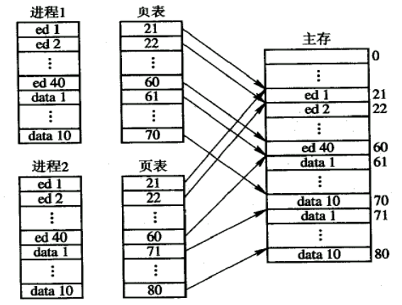
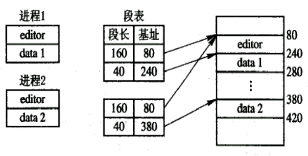
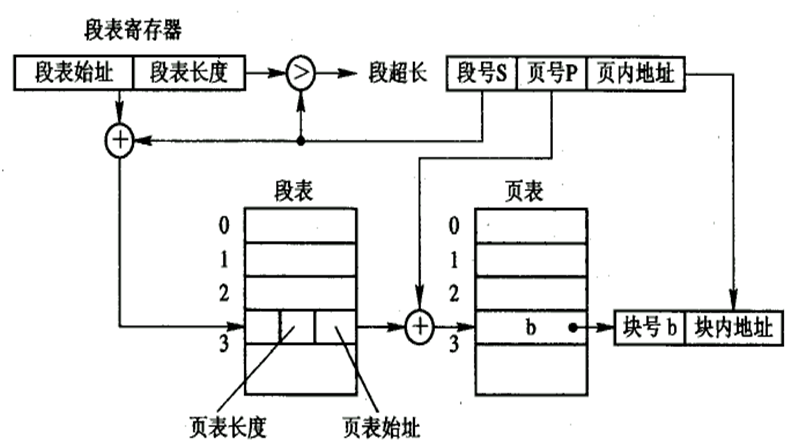

# 内存管理

## 存储(内存)管理概述

存储管理要求

- 重定位
  - memory 换出到Disk中，Disk换进memory，程序地址会上下浮动。如果程序中有跳转地址时，需要更新地址内容
- 保护
- 共享
- 逻辑组织
- 物理组织

## 程序的装入和链接

用户源程序编程一个可在内存中的程序，通常要经过3步

1. 编译：由编译程序(Compiler)将用户源代码编译成若干个目标模块
   1. 词法分析(检查关键字等)
   2. 语法分析
   3. 语义分析
   4. 中间代码
   5. 目标代码
2. 链接：有链接程序(linker)将编译后形成的一组目标模块，以及所需要的库函数链接在一起，形成一个完整的装入模块
3. 装入：由装入程序(loader)将装入模块装入内存

链接和装入 P219

### 装入

装入方式：绝对装入方式、重定位装入，运行时装入

#### 绝对装入方式

- 如果知道程序将驻留在内存的什么位置，那么，**编译程序**将产生绝对地址的目标代码，如BIOS和底层驱动等
- **绝对装入程序**按照装入模块中的地址，将程序和数据装入内存。装入模块被装入内存后，由于程序中的<u>逻辑地址与实际内存地址完全相同，故不需对程序和数据的地址进行修改</u>
- 为了便于程序的修改,对编译的程序采用符号地址，然后在编译或汇编时，再将这些符号地址转换为绝对地址

#### 可重定位装入

- 目标模块的起始地址通常是从0开始的，程序中的其它地址也都是相对于起始地址计算的
- 由装入程序将装入模块装入内存后，装入模块中程序所访问的所有逻辑地址与实际装入内存的物理地址不同 ，必须进行变换

把在装入时对目标程序中指令和数据的变换过程称为重定位。因为地址变换是在装入时一次完成的，地址在装入时进行计算，以后不再改变，故称为静态重定位

假设：有程序A 0~1FFH，大小 200H。memory中装入起始地址300H。程序中有一条请求2FFH的请求，就会变成5FFH。

 采用静态重定位方法将程序装入内存,称为可重定位装入方式

#### 运行时装入

采用动态重定位方式将程序装入内存

### 链接

链接器的功能是把一组目标模块作为输入，产生一个包含完整程序和数据模块的加载模块

#### 静态链接

链接之后整个模块不再做变化，装入时模块一次性全部装入(作为一个整体)

#### 装入时动态链接

装入内存时，边装入边链接

优点：

- 便于修改和更新
- 便于实现对目标模块的共享
  - 如果采取静态链接，每个模块必须含有目标模块的拷贝

#### 运行时动态链接

在执行中需要目标模块四，由OS去找到该模块并装入内存...

可以查看附录7

## 连续分配

分配方式：连续分配和离散分配（现代操作系统大多用离散分配，页和段）

### 连续分配方式

指一个用户程序分配一个连续的内存空间，连续分配方式有四种

1. 单一连续分配
2. 固定分区分配
3. 动态分区分配
4. 可重定位分区分配

#### 单一连续分配

单用户单任务系统

把内存分为系统区和用户区两部分

1. 系统区仅提供给OS使用，通常是放在内存的低址部分
2. 用户区是指除系统区以外的...

#### 固定分区分配

将用户空间划分为若干个固定大小的区域，在每个分区中只装入一道作业

划分分区的方法：

- 分区大小相等：当程序太小是，会造成内存空间的浪费。当程序太大是，<u>一个分区有不足以装入程序，使该程序无法运行</u>
- 分区大小不等：把内存划含有多个较小的分区、适量的中等分区及少量的大分区

因为一个分区只装一个进程，内零头：分区内无法利用的空的空间

#### 动态分区分配

根据进程的实际需要，动态地为之分配内存空间

外零头（外部碎片）：若干不可利用的小分区

### 适配方法

- 最佳适配：空闲空间与要求的最接近的分区块
  - 优缺点
- 为大作业分配大的内存空间创造了条件
  - 每次分配后所切割下来的剩余部分总是最小的，在存储器中会留下许多难以利用的小空闲区。会剩下很多的外零头
  
- 最差适配：空闲空间与请求空间最不接近的分区块
- 首次适配：从头到尾找一个适合的（只要能装下）
- 下次适配，接着上次的位置往后找

空闲分区表：在系统中设置一张空闲分区表，用于记录每个空闲分区的情况

空闲分区链：为了实现对空闲分区的分配和链接，设置前向指针和后向指针，通过前、后向链接指针将所有的空闲分区链接成一个双向链。下一个可以分区的信息

紧凑：将用户程序间外零头消除，排到一起，可重定位的动态分区分配

可重定位分区分配：采用动态重定位技术的分区分配

### 伙伴系统实现

伙伴系统是一种不需要紧凑的动态分区算法

伙伴系统是内存块管理机制，采用二进制数的方式来分配和回收空间

伙伴系统实现方式：假设整个内存的大小为2U 。在伙伴系统中，系统初始启动时整个内存将被视作单一的空闲分区。如果进程请求的尺寸s在 2U-1 < s <= 2U 之间，则全部分给进程，否则一分为二，再继续比较，直到满足需要的最小者为止。

100K接近128K，二分(512,256,128,128)到128，并分配一块

和伙伴空白空间合并（临近且大小一致的空白）

### Linux内存管理

Linux采用多种内存分配策略，2.4版采用伙伴系统：

- 把内存划分为块组，大小为2的幂次，如1页=20、2页=21、4页=22、8页=23等。
- 将相同大小的组织成一个队列。并用位示图表示占用与否。
- 将多个队列组织成一个表。

## 离散分配方式

离散分配:为进程分配的空间不要求是连续的,可以是多个分离的空间

采用离散分配方式的存储管理有

- 分页存储管理
- 段式存储管理
- 段页式存储管理

### 分页存储管理

基本思想

- 页面或页（Page）：将一个**进程的逻辑**地址空间分成若干个大小相等的片
- （**物理**）块（Block）或页框（Frame）：把**内存空间**分成与页面相同大小的若干个存储块
- 在为进程分配内存时，以块为单位将进程中的若干个页分别装入到多个可以不相邻接的物理块中
- 在分页存储管理方式中，把每个作业**全部装入**内存后方能运行，则称为基本的分页存储管理方式，或称为纯分页存储管理方式
- 纯分页存储管理方式不具有支持实现虚拟存储器的功能

#### 页面大小

如果选择的页面较大，虽然可以减少页表的长度，提高页面换进换出的速度，但却又会使页内碎片增大。因此，页面的大小应选择得适中，且页面大小应是2的幂，通常为512B～8KB

空间的组织

- 地址空间[^1]为程序限定的空间
- 物理空间为内存限定空间
- 在页式管理系统中将地址空间分成大小相同页面。将内存空间分成与页面相同大小的存储块
- 分页的地址结构

页号P | 位移量w

#### 页表

页表：页号有块号之间的映射关系，存储块号和标志位

<u>系统又为每个进程建立了一张页面映像表</u>，在分页系统中，允许将进程的每一页离散地存储在内存的任一物理块中，但系统应能保证进程的正确运行，即能在内存中找到每个页面所对应的物理块

在页表的表项中设置一存取控制字段，用于对该存储块中的内容加以保护，如读写权限等

例子：进程5M,Page.size=2K 页表项32bit=4B

$$
页表长度=\frac{进程大小}{页大小}=\frac{5\times2^{20}}{2\times2^{10}}=5\times2^{9}\\页表大小=5\times2^{9}\times2^2B=5\times2^{11}B=10KB
$$
例：进程28K，page.size=8K，Call [14520]_10，求页号和偏移量:star2:
$$
{14520}\div{8\times2^{10}}=1\dots6328\\每块8K，对应实际地址前面共3块\\偏移量:3\times8K+6328=30904
$$

#### 地址变换机构

为了能将用户地址空间中的逻辑地址，变换为内存空间中的物理地址，在系统中必须设置地址变换机构。该机构的基本任务是实现从逻辑地址到物理地址的转换。

基本的地址变换机构

页表大多驻留在内存中。在系统中只设置一个页表寄存器PTR，在其中存放页表在内存的始址和页表的长度

##### 例子

考虑一个简单分页系统，物理存储器大小为4GB,页大小为1KB,逻辑地址空间分为2^16个页

- 逻辑地址空间包含多少位？
- 一个帧中包含多少字节？1KB
- 物理地址中指定一个帧需要多少位？
- 页表中包含多少个页表项？2^16
- 每个页表项包含多少位？ 
  - 页表项存的是 页号和块号的对应关系
  - 页表中页号是由页表项宽度计算得到，并不存储
  - 页表中存储块号和标志位

页大小1KB 偏移量10bit表示；物理存储4GB，所以有2^22个物理块，需要22bit表示物理块；分成2^16页号，页号16位

16bit页号 | 10bit偏移量

#### 快表

为了提高地址变换速度，可在地址变换机构中，增设一个具有并行查寻能力的特殊高速缓冲寄存器，又称为“联想寄存器”（Associative Memory）或称为“快表”Cache

快表不可能做得很大，通常只存放16～512个页表项

Cache中存储的是最近经常命中的页表项

#### 多级页表

现代大多数计算机系统

- 采用离散分配方式来解决难以找到一块连续的大内存空间的问题
- 只将当前需要的部分页表项调入内存，其余的页表项仍驻留在磁盘上，需要时再调入

二级页表

将页表再进行分页，并离散地将各个页面分别存放在不同的物理块中 ，为**离散分配**的页面再建立一张页表，称为**外层页表** ，在每个页表项中记录了页表页面的物理块号。

离散分配节省了内存空间，将不需要的页表可以放在内存中

例子：若在32位的地址空间时，采用页面大小为4K占12位，一级页表结构，应具有20位的页号，即页表项应有1兆个。在采用两级页表结构时，逻辑地址结构可描述如下： 

两级页表地址变换的实现：

为了地址变换实现上的方便起见，在地址变换机构中同样需要增设一个外层页表寄存器，用于存放外层页表的始址，并利用逻辑地址中的外层页号，作为外层页表的索引，从中找到指定页表分页的始址，再利用P2作为指定页表分页的索引，找到指定的页表项，其中即含有该页在内存的物理块号，用该块号和页内地址d即可构成访问的内存物理地址。

外部*页表的里面存的是块号和标志位*，这个块存储的是内层页表的起始地址，物理地址对应的是数据或程序
$$
页表大小=页表项宽度\times页表长度(页表项数量)\\
页表长度=\frac{页面大小}{页表项大小}
$$
每一级页表长度不一定相等，但最大长度相等

### 分段存储管理

分段存储管理方式的引入原因：引入分段存储管理方式，主要是为了满足用户和程序员的下述一系列需要

硬件分配的基础偏移量与操作系统无关

- 方便编程

  - 使用段名和段内地址

  LOAD 1, [A] | < D >;

  STORE 1, [B] | < C >;

- 信息共享：在实现对程序和数据的共享时，是以信息的逻辑单位为基础的

- 信息保护：分段管理方式能更有效和方便地实现信息保护功能

- 动态增长：分段存储管理方式却能较好地解决数据段增长

- 动态链接：动态链接是指在作业运行之前，并不把几个目标程序段链接起来。要运行时，先将主程序所对应的目标程序装入内存并启动运行，当运行过程中又需要调用某段时，才将该段调入内存并进行链接

信息共享：分页系统中共享与分段系统中共享

分段的机理

- 在分段存储管理方式中，作业的地址空间被划分为若干个段，每个段定义了一组逻辑信息
- 每个段都有自己的名字
- 每个段都从0开始编址，并采用一段连续的地址空间。段的长度由相应的逻辑信息组的长度决定，因而各段长度不等
- 整个作业的地址空间，由于是分成多个段，因而是二维的，亦即，其逻辑地址由段号（段名）和段内地址所组成
- 分段地址中的地址具有如下结构
  - 段号[31-16]段内地址[15-0]

每一段必须在连续的空间

段表：

- 在系统中为每个进程建立一张段映射表，简称“段表”
- 每个段在表中占有一个表项，其中记录了该段在内存中的起始地址（又称为“基址”）和段的长度
- 段表是用于实现从逻辑段到物理内存区的映射 

有效地址的位数分配按硬件分配

分页和分段的比较（主要区别 ）

- 页是信息的物理单位，分页是为实现离散分配方式，以消减内存的外零头，提高内存的利用率。段则是信息的逻辑单位，它含有一组其意义相对完整的信息。分段的目的是为了能更好地满足用户的需要
- 页的大小固定且由系统决定，由系统把逻辑地址划分为页号和页内地址两部分，是由机器硬件实现的，因而在系统中只能有一种大小的页面，而段的长度却不固定，决定于用户所编写的程序，通常由编译程序在对源程序进行编译时，根据信息的性质来划分
- 分页的作业地址空间是一维的，即单一的线性地址空间，程序员只需利用一个记忆符，即可表示一个地址；而分段的作业地址空间则是二维的，程序员在标识一个地址时，既需给出段名，又需给出段内地址，**同时还需要段的基址**

优点：

- 分段系统的一个突出优点，是易于实现段的共享，即允许若干个进程共享一个或多个分段，且对段的保护也十分简单易行

- 在分页系统中，实现代码共享应在每个进程的页表中都建立相同个页表项和占用相同的页号。 而数据页面不受此限制
- **[可重入代码](可重入 - 维基百科，自由的百科全书.pdf)**[（](可重入 - 维基百科，自由的百科全书.pdf)[Reentrant Code](可重入 - 维基百科，自由的百科全书.pdf)[）](可重入 - 维基百科，自由的百科全书.pdf)又称为“纯代码”（Pure Code）是一种允许多个进程同时访 问的代码。为使各个进程所执行的代码完全相同，绝对不允许可重入代码在执行中有任何改变。因此，可重入代码是一种不允许任何进程对它进行修改的代码

### 段页是存储管理

基本原理：段页式系统的基本原理，是分段和分页原理的结合，即先将用户程序分成若干个段，再把每个段分成若干个页，并为每一个段赋予一个段名

段号 | 页号 | 页内偏移

对换的引入

- 是指把内存中暂时不能运行的进程或者暂时不用的程序和数据，调出到外存上，以便腾出足够的内存空间，再把已具备运行条件的进程或进程所需要的程序和数据，调入内存。对换是提高内存利用率的有效措施
- 如果对换是以整个进程为单位，便称之为“整体对换”或“进程对换”
- 为了实现进程对换，系统必须能实现三方面的功能：对换空间的管理、进程的换出、换入

对换空间的管理

- 在具有对换功能的OS中，通常把外存分为文件区和对换区。
- 进程在对换区中驻留的时间是短暂的、对换操作又较频繁，故对对换空间管理的主要目标，是提高进程换入和换出的速度
- 对换区采用连续分配方式，其分配算法可以是首次适应算法、循环首次适应算法或最佳适应算法

进程的换出与换入

- 进程的换出
  - 系统选择处于阻塞状态且优先级最低的进程作为换出进程，将该进程的程序和数据传送到磁盘的对换区上。便可回收该进程所占用的内存空间，并对该进程的进程控制块做相应的修改
- 进程的换入 （一般由调度程序实现）
  - 系统定时地查看所有进程的状态，从中找出“就绪”状态但已换出的进程
  - 将其中换出时间最久的进程作为换入进程
  - 有能满足进程需要的内存时可将之换入

注意：为了避免频繁的换进换出，设置换出的一个时间限制。例如在内存至少驻留2秒钟才能换出。 抖动

## 虚拟存储器的基本概念

虚存，相对于实际主存而存在

没有可用空间，但需要调入新的内容。需要换出一个不用的页表，将需要用的内容换入

局部性原理的表现：

- 时间局限性  产生时间局限性的典型原因，是由于在程序中存在着大量的循环操作
- 空间局限性  一旦程序访问了某个存储单元，在不久之后，其附近的存储单元也将被访问，即程序在一段时间内所访问的地址，可能集中在一定的范围之内，其典型情况便是程序的顺序执行

 局部性原理的根源：

- 程序执行时，除了少部分的转移和过程调用指令外，在大多数情况下仍是顺序执行的
- 过程调用将会使程序的执行轨迹由一部分区域转至另一部分区域，但经研究看出，过程调用的深度在大多数情况下都不超过5层。这就是说，程序将会在一段时间内都局限在这些过程的范围内运行
  - 顺序，循环，选择（一定程度上破坏了局部性）
- 程序中存在许多循环结构，这些虽然只由少数指令构成，但是它们将多次执行
- 程序中还包括许多对数据结构的处理，如对数组进行操作，它们往往都局限于很小的范围内

虚拟存储器定义

- 基于局部性原理，应用程序在运行之前，没有必要全部装入内存，仅须将那些当前要运行的部分页面或段先装入内存便可运行，其余部分暂留在盘上。 
- 所谓虚拟存储器：是指具有请求调入功能和置换功能，能从逻辑上对内存容量加以扩充的一种存储器系统，其逻辑容量由内存容量和外存容量之和所决定，其运行速度接近于内存速度，而每位的成本却又接近于外存。

### 虚拟存储的实现

- 请求分页存储管理方式 

  - 这是在分页系统的基础上，增加了请求调页功能和页面置换功能所形成的页式虚拟存储系统。它允许只装入部分页面的程序（及数据），便启动运行。以后，再通过调页功能及页面置换功能，陆续地把即将要运行的页面调入内存，同时把暂不运行的页面换出到外存上。置换时以页面为单位

  - 为了能实现请求调页和置换功能，系统必须提供必要的硬件支持和相应的软件:

    - 硬件支持
      1. 请求分页的页表机制上增加若干项，作为请求分页的数据结构
      2. 缺页中断机构:当要访问的页面尚未调入内存时，便产生缺页中断，请求调页
      3. 地址变换机构
    - 软件支持
      1. 实现请求调页的软件
      2. 实现页面置换的软件

      

- 请求分段系统

  - 它允许只装入若干段的用户程序和数据，即可启动运行。以后再通过调段功能和段的置换功能，将暂不运行的段调出，同时调入即将运行的段
  - 为了实现请求分段，系统同样需要必要的硬件支持。一般需要下列支持
    1. 请求分段的段表机制，这是在纯分段的段表机制基础上增加若干项而形成的
    2. 缺段中断机构
    3. 地址变换机构
  - **实现请求调段和段的置换功能也须得到相应的软件支持**

### 请求分页存储管理方式

请求分页的原理

请求分页系统是建立在基本分页基础上的，为了能支持虚拟存储器功能而增加了请求调页功能和页面置换功能。

请求分页中的硬件支持 

为了实现请求分页，系统必须提供一定的硬件支持。 除了需要一台具有一定容量的内存及外存的计算机系统外，还需要有页表机制、缺页中断机构以及地址变换机构。

####  页表机制

- 在请求分页系统中所需要的主要数据结构是页表
- 在请求分页系统中的每个页表项如下所示

| 页号         | 物理块号 | 标志位P | 访问字段A | 修改位M | 外存地址 |
| ------------ | -------- | ------- | --------- | ------- | -------- |
| 不存在页表内 |          |         |           |         |          |

#### 缺页中断机构

在请求分页系统中，每当所要访问的页面不在内存时，便产生一缺页中断，请求OS将所缺之页调入内存

抖动问题: 缺页中断又是一种特殊的中断，它与一般的中断相比，有着明显的区别，主要表现在下面两个方面：

1. 在指令执行期间产生和处理中断信号
2. 一条指令在执行期间，可能产生多次缺页中断

#### 地址变换机构

请求分页系统中的地址变换机构，是在分页系统地址变换机构的基础上，再为实现虚拟存储器而增加了某些功能而形成的

---

[^1]:进程能够访问的内存地址的集合

如32bit地址线可以访问2^32的地址空间