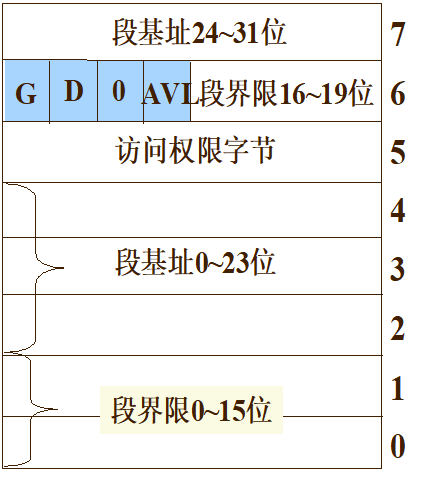

# 实训课

## test shell

```assembly
#cr: create
#to: time out
#req R2 1 #请求的是当前运行的进程，所以忽略向谁请求
#de: delete
#资源数量 R1:1 R2:2 R3:3 R4:4

cr x 1 #init() x
cr p 1 #当前运行x ready.Queue 中有p
cr q 1 #当前运行x ready.Queue 中有p q
cr r 1 #当前运行x ready.Queue 中有p q r
to #超时 x换进就绪，p运行 ready.Queue 中有q r x
req R2 1 #p请求1个资源
to #超时 p换进就绪，q运行 ready.Queue 中有r x p
req R3 3 #q请求3个资源
to #超时 q换进就绪，r运行 ready.Queue 中有x p q
req R4 3 #r请求3个资源 
to #超时 r换进就绪，x运行 ready.Queue 中有p q r
to #超时 x换进就绪，p运行 ready.Queue 中有q r x
req R3 1 #p请求 R3，超出资源 P进入R3的Blocked.Queue p
#调入 q执行
req R4 2 #q请求 R4,超出资源 q进入R4的Blocked.Queue q
#调入 r执行
req R2 2 #r请求 R2,超出资源 r进入R2的Blocked.Queue r
#调入 x执行
to #超时 x换进就绪，x运行 ready.Queue 没有东西
de q # 释放q，q拥有的R3 3个, p获得资源，进入就绪队列 ready.Queue p
to #超时 x换进就绪，p运行 ready.Queue x
to #超时 p换进就绪，x运行 ready.Queue p

```

创建PCB 记录进程状态

PCB包含资源信息，记录进程所使用的资源数，用链表记录用的资源、或者直接写在PCB里面

输出结果应为：init x x x x p p q q r r x p q r x x x p x

## 地址映射实验

- GDT: global descriptor table
- LDT: local descriptor table

- 描述存储器“段 descriptor”的属性的一个8字节的数据结构。
- 两种类型
  - 段描述符：用于描述代码、数据和堆栈段
  - 系统段描述符：中断描述符、任务段等

请求段页式管理，基础是段。构成描述符表，对单个进程描述符构成局部的描述表

GDTR首地址，GDT里面有很多LDT，LDTR是索引（不是地址）指向一个LDT。通过LDTR查找GDT获得LDT位置

通过bochsdbg.exe打开系统，c继续启动

```bash
sreg #查看寄存器
es:0x0017, dh=0x10c0f300, dl=0x00003fff, valid=1
	Data segment, base=0x10000000, limit=0x03ffffff, Read/Write, Accessed
cs:0x000f, dh=0x10c0fb00, dl=0x00000002, valid=1
	Code segment, base=0x10000000, limit=0x00002fff, Execute/Read, Accessed, 32-bit
ss:0x0017, dh=0x10c0f300, dl=0x00003fff, valid=1
	Data segment, base=0x10000000, limit=0x03ffffff, Read/Write, Accessed
ds:0x0017, dh=0x10c0f300, dl=0x00003fff, valid=3
	Data segment, base=0x10000000, limit=0x03ffffff, Read/Write, Accessed
fs:0x0017, dh=0x10c0f300, dl=0x00003fff, valid=1
	Data segment, base=0x10000000, limit=0x03ffffff, Read/Write, Accessed
gs:0x0017, dh=0x10c0f300, dl=0x00003fff, valid=1
	Data segment, base=0x10000000, limit=0x03ffffff, Read/Write, Accessed
ldtr:0x0068, dh=0x000082f9, dl=0xc2d00068, valid=1
tr:0x0060, dh=0x00008bf9, dl=0xc2e80068, valid=1
gdtr:base=0x0000000000005cb8, limit=0x7ff
idtr:base=0x00000000000054b8, limit=0x7ff
```

可以看到gdtr和ldtr，宽度64bit

是第13项 地址是 0x5cb8 + 13x8 获得LDT首地址

```bash
xp/2w 0x5cb8+13*8#打印两个字
[bochs]:
0x0000000000005d20 <bogus+       0>:    0x92d00068      0x000082fd
```

大端表示，所以需要高低对调一下 0x000082f9 c2d00068

### 段描述符

G位(粒度位)：

G=0, 段的长度以字节为单位

段长最大1M字节

G=1,段的长度以页(4K字节)为长度单位

段长最大1M´4K=4G字节

D位：D=0，16位指令方式

   D=1，32位指令方式

AVL位：AVL=0，程序不可使用本段

  AVL=1，程序可以使用本段



获得段基地址00f9c2d0，程序中j是一个全局变量

GDT和LDT格式完全一样

ds:0017,ds的格式与LDTR相同  从LDT首地址找到数据段首地址(需要知道数据段)

数据段首地址是LDT的第2项（0,1,2）

```bash
xp/2w 0xf9c2d0+2*8
[bochs]:
0x0000000000f9c2e0 <bogus+       0>:    0x00003fff      0x10c0f300
xp/2w 0xf9c2d0+16 #我运行
[bochs]:
0x0000000000f9c2e0 <bogus+       0>:    0x0000c3c9      0x83e58955 
```

得到 0x10c0f300 00003fff 因为LDT和GDT格式相同套用上面的结构

| 基地址 | 10 00 00 00 |
| ------ | ----------- |
| 界限   | 3f ff       |

这里的基地址是数据段基地址，再由j的偏移地址 得到 0x10 00 30 04 这个是线性地址

线性地址：当系统没有开启页式存储管理等同于物理地址，如果没有开启就是一个逻辑地址

```bash
creg #CPU页式管理寄存器
CR0=0x8000001b: PG cd nw ac wp ne ET TS em MP PE                                                                   CR2=page fault laddr=0x000000000805dc0c
CR3=0x0000000000000000
	PCD=page-level cache disable=0
	PWT=page-level write-through=0
CR4=0x00000000: smep osxsave pcid fsgsbase smx vmx osxmmexcpt osfxsr pce pge mce pae pse de tsd pvi vme
EFER=0x00000000: ffxsr nxe lma lme sce  
```

CR0的最高位代表是否启用页式管理，1启用，0未启用

0x10 00 30 04根据这个逻辑地址填入对应页式格式

通过二级页表格式

- 0001 0000 00|00 0000 0011 | 0000 0000 0100
- 外层页号 | 内层页号 | 偏移量

CR3为页表的起始地址，地址为0存的是页表宽度4字节/32bit

从0数0x40项x4字节

```bash
xp 0+0x40*4
0x0000000000000100 <bogus+       0>:    0x00fa5027
```

得到faa027 前20bit块号，后12bit标志位

0xfaa块的起始地址 faa*4K,起始地址是 0xfaa000,得到内层块号起始地址

根据内层页号数3个,得到0xfa7000加上页内偏移得到0xfa7004 这个是最终j的物理地址

```bash
setpmem 0xfa7004 2 0 #将j的值改为0，让程序while循环停止
```

