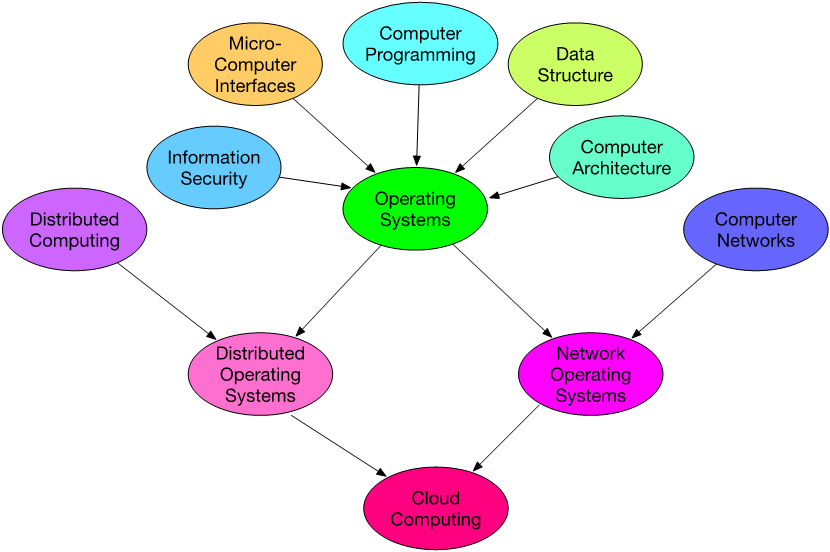
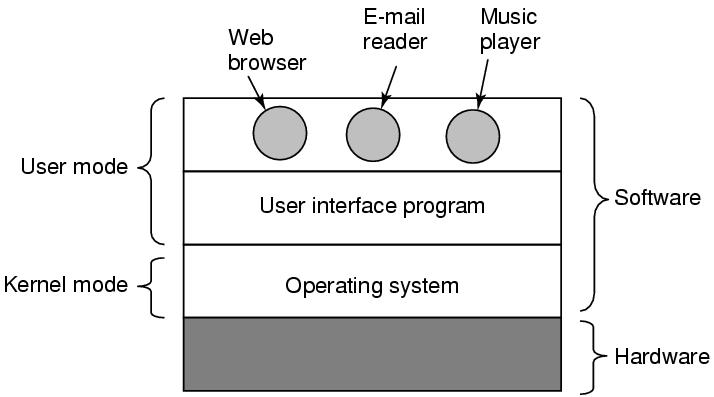
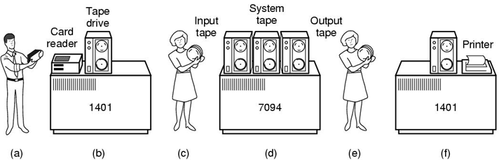
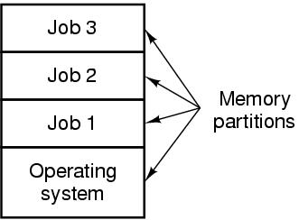
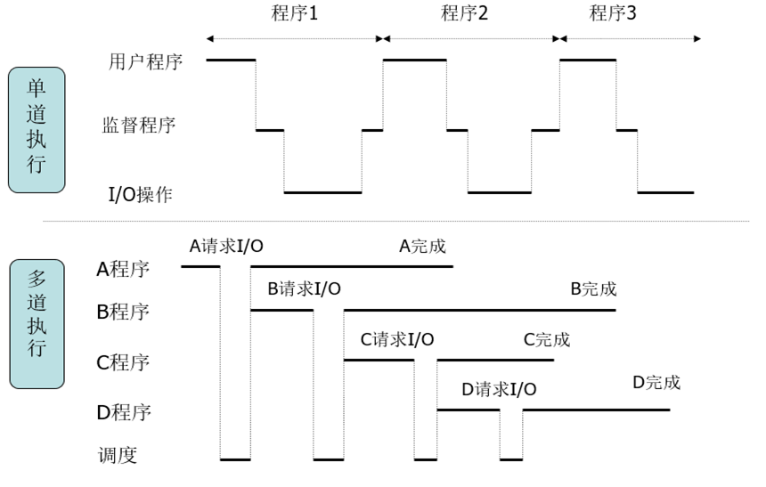
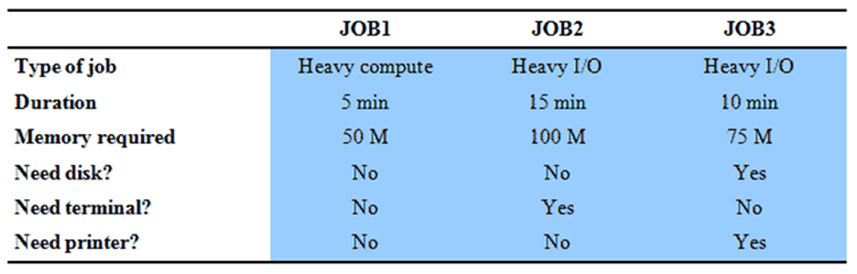
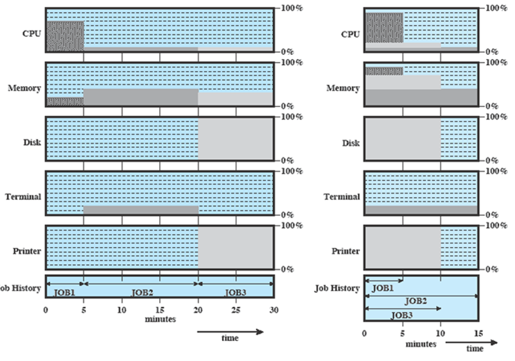
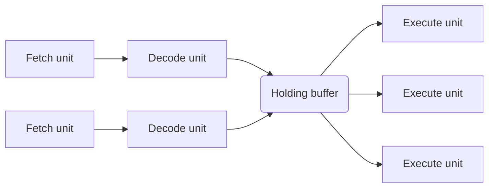

# Computer Operating Systems

## 前言

https://studentcompetitions.com/posts/10-mooc-websites-to-start-your-free-online-education

64课时(上课56、上机8学时)

- 教学理论和综合应用相结合
  - 基础课程
  - 考研的课程
  - 应用价值

- 成绩构成：
  - 期末考试占60%

  - 平时20%,实验10%,10%期中

### 参考

- Andrew S. Tanenbaum
  - 现代操作系统
  - 操作系统：设计与实现

- **William Stallings**
  - **操作系统精髓与设计原理**

- 汤小丹, 梁红兵
  - 计算机操作系统

- Orange'S：一个操作系统的实现
- Linux内核源代码情景分析
- Linux内核完全注释
- UNIX环境高级编程（第3版）(圣经)

### 特点

- 内容多
  - 涉及计算机各个方面

- 内容抽象
  - 不易找到直观形象的例子

- 概念性强
  - 太多的定义

- 枯燥、授课难度较大

操作系统与学科联系图



```
Cloud Computing -> Big Data -> AI
```

### 规则

- 随机抽样回答问题
- 按时完成理论作业以及实际作业
  - 作业发布在蓝墨云上
- 不定期翻转课堂，做好预习

# 绪论

- 什么是操作系统

- 操作系统的发展与变革

- 操作系统万花筒

- 相关硬件知识

- 初识操作系统
  - 相关概念、层次结构、系统调用…

## What is An Operation System

A modern couputer consists of:

- One or more processors
- Main memory
- Disks
- Printers
- Verious input/output devices

Managing all these components requires a layer of software - the **operating system**



```
通过软件、命令行、程序使用操作系统
Kernel mode: 内核模式，可执行特权指令
```

- 操作系统
  - 控制应用程序执行的**程序**

  - 应用程序和计算机硬件间的**接口**

- 目标
  - **方便**：使计算机更易于使用
  - **有效**：允许以更有效的方式使用计算机系统资源
  - **扩展能力**：在不妨碍服务的前提下，有效地开发、测试和引入新的系统功能

### The Operating SYstem as a Resource Manager

- 允许多道程序同时执行

- 管理和保护存储器、I/O设备以及其他资源

- 多路复用
  - 时间（时间片）
  - 空间（硬盘分区）

## 操作系统的历史变革

### No OS at all

没有操作系统

### Simple Batch Systems（简单批处理系统）



1401将卡纸转磁带，7094将磁带数据读出运算输出到另一个磁带，1401将输出磁带结果打印出来

- 缺点：不交互，不及时，在简单批处理系统，处理器必须等待I / O指令完成才能继续处理

### Multiprogramming (多道批处理)

对多个应用程序控制





- 多道程序设计示例
  - 系统可用内存250MB
  - 示例程序执行属性



```
Heavy compute: 计算密集型
Heavy IO: IO密集型
```



​	单道程序设计的系统设备利用率较低

​	多道程序设计技术可以显著提高系统设备利用率

**吞吐量：单位时间内完成的任务的数量**

- 多道批处理系统——简单批处理系统的改进

  - 内存中同时存放**多个**作业

  - 多个作业可**并发**执行

  - **作业调度程序**负责作业的调度

- 多道批处理系统的硬件支持

  - 中断(中断控制器)

  - DMA(Direct Memory Access，直接内存存取)（通道）

  - (排队仲裁器)等

- 多道批处理系统的特征

  多道性：内存中同时驻留多道程序并发执行，从而有效地提高了资源利用率和系统吞吐量

  调度性：作业调度、进程调度

  无序性：作业的完成顺序与它进入内存的顺序之间无严格的对应关系

  无交互能力

- 需要解决的基本问题(现代操作系统的功能)

  - 内存管理
  - 处理机管理
  - 作业管理
  - I/O设备管理
    - 防止IO死锁
  - 文件管理

- **特征**

  - **多道性、无序性、调度性**

- **优点**

  - **提高了资源利用率和吞吐能力。**

- **缺点**

  - **平均周转时间长，没有交互能力**
### 调度算法的评价指标

- 利用率
  $$
  利用率=\frac{工作的时间}{总时间}
  $$
  
- 系统吞吐量
  $$
  系统吞吐量=\frac{总共完成了多少到作业}{总时间}
  $$
  
- 周转时间

$$
周转时间=作业完成时间−作业提交时时间
$$

$$
平均周转时间=\frac{作业1的周转时间+...+作业n的周转时间}{n}
$$

$$
带权周转时间=\frac{作业周转时间作业}{实际运行时间}
$$

$$
平均带权周转时间=\frac{作业1的带权周转时间+...+作业n的带权周转时间}{n}
$$

- 等待时间

  - 进程/作业等待被服务的时间之和

  $$
  等待时间=周转时间-运行时间
  $$

  $$
  平均等待时间=\frac{等待时间}{总数}
  $$

- 响应时间

  - 从用户提交请求到首次产生响应所用的时间

------

 操作系统是一组控制和管理计算机硬件和软件资源，合理地对各类作业进行调度，以及方便用户使用的**程序的集合**。

> An operating system (OS) is **system software** that **manages** computer hardware and software **resources** and **provides** common **services** for computer programs.
>

### 分时系统

- 产生原因

  人机交互、共享主机、方便上机
- 分时系统
  - 采用**多道程序**设计技术处理多个交互作业

  - 多个用户**共享**处理器

  - 多个用户通过不同终端**同时**访问系统

- 分时系统的特点
  - 多路性：多个用户分时使用一台计算机。
  - 独立性：独立运行，不混淆，不破坏。
  - 及时性：系统能在很短的时间得到回答。
  - 交互性：能实现人机对话

批处理系统多道系统程序设计与分时的比较

|                | 批处理系统多道系统设计             | 分时                                                         |
| -------------- | ---------------------------------- | ------------------------------------------------------------ |
| 主要目标       | 充分利用处理器                     | 减小响应时间<br>响应时间：用户提交作业开始，到系统第一次响应用户请求为止 |
| 操作系统指令源 | 作业控制语言命令<br>作业提供的命令 | 终端键入的命令                                               |

### 实时系统

- 概念

   系统能**及时（即时）响应**外部事件请求，在**规定的时间内完成**对该事件的处理，并控制所有实时任务**协调一致**地运行。

  及时：允许时间内响应

  即时：立刻马上响应

- 应用领域

  - 航空航天

  - 军事

  - 工业控制

- 实时系统的分类
  - 软实时系统：要求一定的实时性，产生后果较小
  - 硬实时系统：高要求的实时性

- 实时系统与分时系统比较
  - 应用领域
  - 响应速度
  - 调度准则
    - 实时系统：优先级

# Computer Hardware Review

关于计算机组成原理和体系结构

- David A.Patterson
  - http://www.cs.berkeley.edu/~pattrsn/

- John L.Hennessy
  - http://www.stanford.edu/~hennessy/

## CPU

### CPU Pipelining

(a) A three-stage pipeline. 


(b) A superscalar CPU.



### Multithreaded and Multicoe Chips


(a) A quad-core chip with a shared L2 cache. Core左上角黑色为一级缓存，所有core共享一个缓存
(b) A quad-core chip with separate L2 caches.

## Memory


不同存储介质之间，读写速度不同，但又有频繁的交流，所以需要缓存

缓存要考虑的问题：导入导出的时间和位置

**Disks**


**IO Devices**

**Buses**

# The Operating System Zoo

- Mainframe operating systems （大型机）

- Server operating systems（服务器）

- Multiprocessor operating systems（多处理器）

- Personal computer operating systems（个人计算机）

- Handheld operating systems（掌上电脑）

- Embedded operating systems（嵌入式）

- Sensor node operating systems（传感器）

- Real-time operating systems（实时操作系统）

- Smart card operating systems（智能卡系统）

## Operating System Comcepts

## 进程 Process

- 本质上是一个正在执行的程序
  - 有自己的活动状态
    - 未响应（可能情况）：运行错误，等待输入，资源不足

- OS通过进程表来维护进程
  - 如何维护？进程列表：进程状态，进程资源...

  - 要考虑哪些问题？

**进程树**

### 地址空间 Address Space

- 一个程序可以使用的地址的集合

- 思考：
  - 一个进程的地址空间是否可以大于主存自身的空间？可以

    - 64位最大地址空间有
      $$
      2^{64}bit = 128GB
      $$

    - 进程的地址空间大小，不是进程的实际大小(没有被装载进主存的程序会)

    - 地址范围不是真实的，是虚拟地址的范围，有时甚至会超过实际物理内存的大小

  - 若干个进程地址空间之和是否可以大于主存自身的空间？

### 文件 File

- 文件系统

- 目录

- 路径
  - 绝对路径
  - 相对路径
- 文件的访问
  - 权限


### 安全 Security

- 数据应该受到保护
  - 存储
    - 访问保护、反病毒保护、实体安全保护
  - 处理
  - 传输
    - 完整、机密、认证、非否认（接收方/发送方 检测是否接收/发送）

### Shell

操作系统的壳

用户与OS之间的接口

- Unix：sh、bash
- Windows：command.exe

### 系统调用 System Call

- 可以深入到内核的一个特殊过程调用

- 系统调用的过程

  - 假设用户在用户态下执行程序，需要系统服务
  - 执行一个系统调用指令
  - 操作系统进行参数检查，找到所需进程，转移控制权

  - 执行系统调用

  - 返回到用户态


**Process Management**

# 操作系统的功能

**操作系统应具有五方面的功能：**

1. 处理机管理

2. 存储器管理

3. 设备管理

4. 文件管理

5. 方便用户使用的用户接口。

