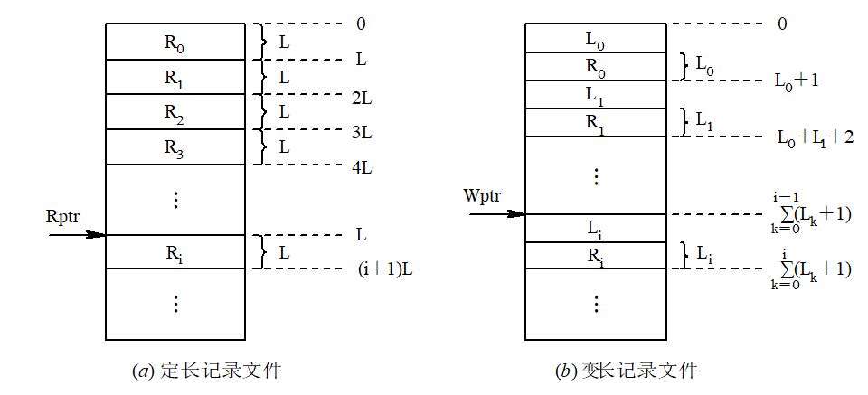
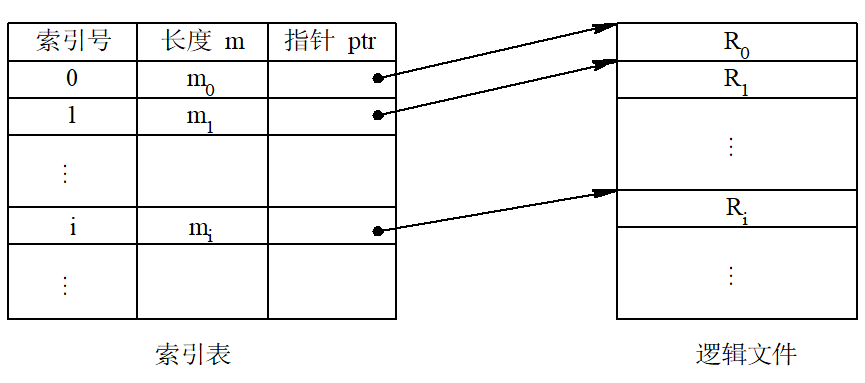
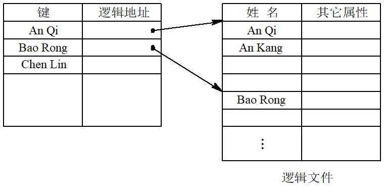
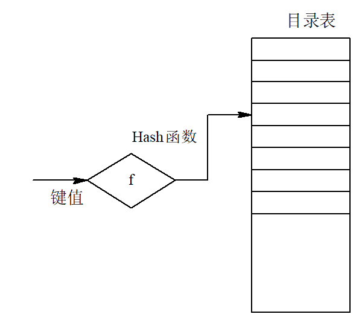
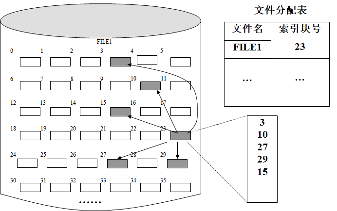
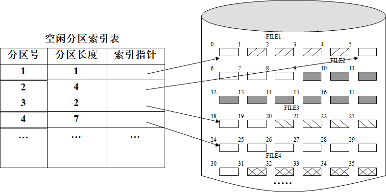
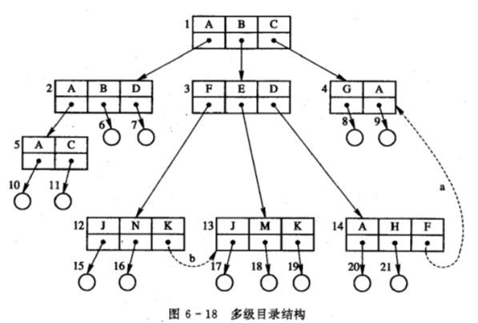
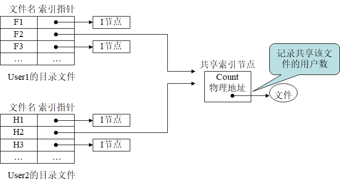

# 文件

## 文件和文件系统

文件结构

1. 字段：基本数据单位，用于描述对象某种属性，每个字段都具有一个唯一值
   1. 长度和数据类型两个属性，长度分固定长度和可变长度
   2. 若干子字段组成，符合字段。取值决于组成它的各个分字段的值
2. 记录：是一组相关字段的集合，是应用程序可处理数据单位
3. 文件：文件是若干相关记录的集合

非结构数据库 MongoDB/HDFS/

数据库：相关数据的集合，通常由若干数据库表格构成

文件系统：操作系统中的各类文件、管理文件的软件，以及管理文件所涉及到的数据结构等信息的集合

少数文件系统从操作系统中分离出来，独立于操作系统存在，绝大多数操作系统都包含文件系统部分

文件系统设计目标

- 有效地组织管理文件
  - 需要设计相应的管理数据结构来组织管理这些文件集，数据结构包括文件控制块、文件目录
  - 为加快访问速度，需要相应有一套的缓存管理机制
- 提供方便的用户接口
  - 文件系统会提供若干访问文件系统的系统调用或系统命令 ，用户能够方便有效地使用文件系统提供的功能 

文件系统模型

用户（程序）-->文件系统接口 --> 对对象操作和管理的软件集合 -->对象及其属性

屏蔽底层数据的不同特点，HAL 硬件抽象层（Hardware Abstraction Layer）

| 文件系统实现模型 | 描述                                                         |
| ---------------- | ------------------------------------------------------------ |
| 文件系统接口     | 命令、系统、调用和图像窗口                                   |
| 逻辑功能层       | 访问存储介质的物理参数，形成响应的驱动命令，启动实施IO操作   |
| 物理驱动层       | 将逻辑功能层发下的命令转化为相应的驱动程序，完成文件物理存储设备的处理 |

- 对象及其属性 文件、文件目录、外部存储设备
- 管理软件的集合 存储空间、目录、地址映射、共享保护
- 文件系统接口 命令、系统调用

文件系统与数据库管理系统区别与联系

1. 数据库管理系统中定义的各种数据结构对人家系统透明，文件系统只处理**无结构、无格式**的字节流
   - 关系型数据库 非结构化数据库 NoSQL
     - SQL(结构化查询语言) 
     - BigData 大部分属于非关系型数据 非结构化
       - MongoDB HBase
   - 文件系统给数据库管理提供“记录——流转换”接口
   - 无论文件系统是在操作系统中还是操作系统上，数据库管理系统DBMS过于依赖文件系统都需要构建在文件系统之上。这种数据库性能不高
2. 为了提高数据库性能，数据库管理系统不依赖于操作系统提供的文件系统，独立的数据组织及存取机制，直接操纵文件存储设备，存储管理程序大多能提供一些低级接口

相关概念

- 文件
  - 具有各种文件属性
- 记录
  - 数据项的集合
- 数据项
  - 基本数据项
  - 组合数据项

文件分类

- 系统文件、用户文件、库文件
- 源文件、目标文件、可执行文件
- 只读、读写、执行
- 普通文件、目录文件、特殊文件

### 一类特殊文件：设备文件

- 由于对这类设备的I/O和对文件的读写操作相同，因此也被看着文件，通常称为设备文件 .
- 传输的信息均由一组顺序出现的字符序列组成，通常称为流设备 .
- 通常对设备文件的命名不同于普通文件，需要特别规定

## 文件的逻辑结构

- 逻辑结构
  - 用户的观点
    - 顺序
    - 索引
  - 独立于物理特性
- 物理结构
  - 系统的观点 硬件
    - 空闲空间
    - 占用空间
  - 具体物理组织形式
- 两种结构都会影响文件的检索速度

### 文件逻辑结构:star:

- 有结构文件
  - 一系列记录组成
  - 记录可以是定长，也可以是变长
  - 记录的组织形式
    - 顺序
    - 索引
    - 顺序索引
    - 哈希
- 无结构文件
  - 流式文件
- 半结构
  - 异步加载的网页

结构化文件与流文件的联系：硬件都块设备，所以需要进行流到块的转换

### 有结构文件的结构

- windows和unix这种系统则把结构化留给应用程序
- Windows和UNIX提供了低级文件系统 
- IBM MVS实现了一个结构化的文件系统
- Macintosh提供了一些记录－流转换功能，它可以被称为高级文件系统

#### 顺序文件

##### 逻辑记录的排序

串结构，记录之间的顺序与关键字无关。通常方法由世界来决定，存入世界的先后排列。

顺序结构，指文件中的所有记录按关键字(词)排列。可以按关键词的长短从小到大排序，也可以从大到小排序；或按其英文字母顺序排序

##### 顺序文件(Sequential File)读写操作



##### 顺序文件的优缺点

顺序文件的最佳应用场合，是在对诸记录进行批量存取时， 即每次要读或写一大批记录

在交互应用的场合，如果用户(程序)要求查找或修改单个记录，为此系统便要去逐个地查找诸记录。这时， 顺序文件所表现出来的性能就可能很差， 尤其是当文件较大时， 情况更为严重

如果想增加或删除一个记录， 都比较困难

#### 索引文件

对于定长记录文件，如果要查找第i个记录， 可直接根据下式计算来获得第i个记录相对于第一个记录首址的地址
$$
A_i=i\times L
$$
对于可变长度记录的文件，要查找其第i个记录时，须首先计算出该记录的首地址。为此，须顺序地查找每个记录，从中获得相应记录的长度Li，然后才能按下式计算出第i个记录的首址。假定在每个记录前用一个字节指明该记录的长度
$$
A_i=\sum^{i-1}_{i=0}{L_i+i}
$$


#### 索引顺序

字典索引查找，按种类分类，按顺序查找



#### 哈希

直接文件 hash文件

- 对于直接文件，则可根据给定的记录键值，直接获得指定记录的物理地址。
- 记录键值本身就决定了记录的物理地址。这种由记录键值到记录物理地址的转换被称为键值转换(Key to address transformation)



## 磁盘存储器的管理

部分内容包含在内存管理章节里面

- 分配单位是磁盘块
  - 连续分配方式
  - 离散分配方式
- 实现存储空闲空间分配
  - 空闲分区表
    - 号 起始 结束
  - 空闲分区链
    - head 指向 起始点|长度|指针
  - 位示图
  - 索引

- 分区分配 加快查找
  - 最佳（有序，从小到大排列）
  - 最坏（有序，从小到大排列）
  - 首次适应(地址从低到高)
  - 循环首次适应(地址从低到高)

### 文件存储空间的分配技术

都存在一张分配表：文件名 索引块号

- 连续分配：物理结构

  - 修改空间分区表，compact紧凑
  - 不方便追加数据

- 链接分配

  - data和指针，指针指向下一块的位置
  - 必须从头开始查找

- 索引分配

  - 文件存一列索引，按顺序索引块就可以得到整一块文件
  - 可以进行多级索引，大文件存取

  - 需要一个索引表

- 基于可变分区的索引分配

  - 当文件较大时，索引块存储一张包含 起始块号 分区长度 的索引表

#### 连续分配

- 优点
  - 简单、容易实现
  - 对于顺序文件，能很快检索文件中的数据块,连续读/写多个数据块内容时，性能较好
- 缺点
  - 它不利于文件尺寸的动态增长
  - 该分配方案可能会导致磁盘碎片，严重降低外存空间的利用率

#### 链接分配

为文件分配非连续的若干数据块，数据块之间用指针相连，这种分配方式称为链接分配，以该方式管理的文件称为链接文件

分配的优点:

- 链接分配技术不要求文件存储到彼此相邻的数据块中，消除连续分配引起的碎片，提高了外存空间的利用率
- 链接分配技术还能适应文件尺寸的动态增长

缺点

- 链接分配技术适合于文件的顺序存取，但对于随机存取却相当低效
- 打破了局部性原理

#### 索引分配

1. 利用专门的索引块存储索引信息
2.  一个数据块容纳不了一个文件的所有分区时，需要若干个索引结点进行存储，建立二级索引或多级索引



优点：

- 索引分配方法支持文件的直接存取
- 索引分配能满足文件的动态增长需要，只需要更新索引结点的内容，就可以把新增加的分区记录下来
- 利用多级索引，可以支持大型文件的存取

缺点：

- 建立一个索引表占存储空间

基于可变分区的索引分配


##### 多级索引

索引节点：INode=IndexNode，

- Inode
  - 属性
  - 多个数据
  - 一级间接
    - 指针 ->多个数据
  - 二级间接
    - 指针->指针->多个数据

例子：12个直接块，每个索引节点有一个一级、二级和三级间接指针。系统大小和磁盘扇区大小是8KB。如果磁盘指针32位，（8位表示物理磁盘，24位标识物理块）

1. 系统支持的最大文件大小是多少？

   直接块:12x8KB=96KB

   一级间接 8K/4 = 2K个指针, 2Kx8KB = 16MB

   二级间接 (2K)^2 x 8KB = 32GB

   三级间接 (2K)^3 x 8KB = 64TB

   该文件系统最大支持 64TB+32GB+16MB+96KB

2. 系统支持最大文件系统分区是多少？

   24位用于标识
   $$
   2^{24}\times8K=2^{32}=128GB
   $$
   
3. 若内存中除文件索引节点外没有其他信息，访问在位置13423956 需要访问多少次？

   估算页表大小，找到这个位置处于 间接页表 访问3次

### 空闲磁盘空间的管理

管理方式：空闲分区表、空闲分区链表、索引及位示图

分配方法：与分区分配是一样的

- 最佳（有序，从小到大排列）
- 最坏（有序，从小到大排列）
- 首次适应(地址从低到高)
- 循环首次适应(地址从低到高)

#### 空闲分区表

采用空闲分区表管理磁盘空闲空间，将磁盘空间中各个空闲分区登记在一张表中，一个分区对应一个表项，每个表项包含有空闲分区号、分区起始块号、分区长度等主要信息

空闲分区号 | 分区起始块号 | 分区长度

特点

- 实现简单
- 将各空闲分区按照长度从小到大的顺序进行排列。再利用有效的查找算法，如折半查找、冒泡法查找等，能很快找到需要大小的空闲分区
- 当存储空间中的空闲分区分布较分散且数量较多时，空闲分区表将会很大
- 一个很大的空闲分区表一次性全部装入内存，则需要很大的内存空间，而且会降低空闲分区表的检索速度

#### 空闲分区链表

通过指针将各个空闲分区连接起来，并记载各空闲分区大小，称为空闲分区链表。采用空闲分区链表法不存在空闲分区表的额外空间开销

head --> 地址|大小|指针 --> 地址|大小|指针

问题

- 当使用一段时间以后，可能会使空闲分区链表中包含太多小分区
- 由于链接指针，如果一个文件需要很多空闲分区，这种操作模式将大大降低文件存储速度
- 由许多离散小分区组成的文件时，将回收的小分区链接到空闲分区链表中需要很长时间
- 若一个文件申请连续存储空间，则需要花费较长的时间查找相邻的空闲分区

#### 索引

索引方法为空闲分区建立索引表。可以基于空闲存储块建立索引，也可以基于可变分区建立索引



特点

- 基于可变分区建立索引比基于存储块建立索引的效率高
- 根据索引项查找空闲分区，将会提高文件存储效率 
- 利用索引方法管理空闲空间，适合于各种文件分配法

#### 位示图

- 位示图利用二进制位0、1表示存储空间中存储块的使用状态。空闲分区用0表示，已分配分区用1表示
- 用位示图表示存储空间的使用状态，可以容易地找到一个或一组连续的空闲分区
- 位示图需要占用的存储空间大小为：磁盘容量（字节数）/ （8 * 数据块大小）
- 搜索一个很大的位示图将会降低文件系统的性能

## 文件目录及文件控制块

对目录管理的要求如下 ：

1. 实现“按名存取”
2. 提高对目录的检索速度
3. 文件共享
4. 允许文件重名

### 文件目录

整个文件系统中包含所有文件说明信息的集合称为“文件目录”，其中每个文件对应有一个目录项，描述了该文件的目录信息

- 系统中由多个文件的目录项构成一种特殊的文件，称为目录文件
- 目录文件具有固定格式，由系统进行管理，用户不能直接访问目录

组织目录信息的方式，不同文件系统组织目录信息的方式是不同的：

1. 只将一些必要信息如文件名、文件大小、外存中的存储位置等保存在文件目录中。

   例如：UNIX系统的目录仅有文件名和指针

2. 有的文件系统将一个文件的全部目录内容信息组织成一个目录项

   例如：DOS系统的目录

#### 常见的目录结构

##### 单级目录结构

整个系统中，所有用户的全部文件目录保存在一张目录表中，**每个文件的目录项占用一个表项**

目录项中主要记载的信息有：文件名及扩展名，文件的物理地址，其它属性，如文件长度、建立日期、文件类型等

单级目录的优点：简单且能实现目录管理的基本功能——按名存取

单级目录缺点：

- 查找速度慢
- 不允许重名
- 不便于实现文件共享

##### 两级目录

为每一个用户建立一个单独的用户文件目录UFD，再建立一个主文件目录MFD。在主文件目录中，每个用户目录文件都占有一个目录项，其目录项中包括用户名和指向该用户目录文件的指针。

两级目录结构优点：

1. 提高了检索目录的速度
2. 在不同的用户目录中，可以使用相同的文件名
3. 不同用户还可使用不同的文件名来访问系统中的同一个共享文件

##### 层次目录结构

树型目录结构：主目录在这里被称为根目录，把数据文件称为树叶，其它的目录均作为树的结点



- 路径名：从树的根（即主目录）开始，把全部目录文件名与数据文件名，依次地用“/”连接起来，即构成该数据文件的路径名（path name）
  - 系统中的每一个文件都有惟一的路径名
  - 绝对路径是指，从根目录开始，遍历与文件名相连的子目录，连同文件名一起构成的文件路径表示方式
- 当前目录：为每个进程设置一个“当前目录”，又称为“工作目录”进程对各文件的访问都相对于“当前目录”而进行，通常称为相对路径

添加删除目录

增加目录：在用户要创建一个新文件时，只需查看在自己的UFD及其子目录中，有无与新建文件相同的文件名。若无，便可在UFD或其某个子目录中增加一个新目录项

目录删除采用下述两种方法处理：

- 不删除非空目录
- 可删除非空目录

### 文件控制块

- 当一个文件被进程打开以后，系统将在内存中为之建立一个称为“文件控制块FCB(File Control Block) ”的数据结构，用于记载文件在内存中的使用情况 
- FCB的地址将被记录到它的PCB中，以利于以后进程对它的使用
- 文件系统将把文件目录项和文件分配表中的全部或大多数信息，以及当前使用文件的有关信息，填入文件控制块FCB中

- **FCB包含目录项，FCB不等于目录项**

典型FCB

| 文件名                       | 文件标识符           |
| ---------------------------- | -------------------- |
| 文件结构                     | 文件类型             |
| 文件组织                     | 记录长度             |
| 当前文件大小                 | 最大文件尺寸         |
| 文件设备                     | 物理位置             |
| 存储控制                     | 口令                 |
| 文件建立时间                 | 最近存取时间         |
| 最近修改时间                 | 当前存取方式         |
| 当前的共享状态               | 共享访问是的等待状态 |
| 进程访问文件所用的逻辑单元号 | 当前的逻辑位置       |
| 访问元素的当前物理位置       | 下一个元素的物理位置 |
| 缓冲区大小                   | 缓冲区地址           |
| 指向下一个FCB的指针          | 文件创建只           |
| 临时/永久文件                | 文件拥有者           |

“按名存取”的实现过程

打开文件 文件名-->目录搜索，查找目录项在磁盘上的物理位置-->建立文件控制块，将相应文件信息复制到文件控制块中

读写文件 访问文件控制块，获得文件在磁盘上的物理位置-->将文件数据的传输 内存<-->磁盘

关闭文件 释放文件控制块

#### 打开文件表

每打开一个文件,就会返回给该进程打开文件的FCB（文件控制块）地址指针

一个进程对应一个打开文件表，该表中记录了该进程已打开的所有文件的FCB（文件控制块）地址指针

文件表方便进程对这些文件的进行存取

在进程控制块（PCB）中有一个指向打开文件表的指针

### FAT文件系统

1．目录及文件分配表的实现 

文件分配表是用来描述文件数据在磁盘上的块分布的一个数据结构

管理磁盘的最大单位叫磁盘卷

- 一个磁盘卷可以跨越多个物理磁盘，也可以是一个物理磁盘的一个区域
- 个磁盘卷通常被格式化成一种物理文件系统格式

FAT文件系统是根据其组织形式

引导扇区 FAT1 FAT2 根目录 其他目录和文件

- 根目录必须存放在磁盘卷的一个固定位置，这样才可以正确地找到启动系统所需要的文件
- FAT文件系统保存了两个文件分配表，这样当其中一个遭到破坏时可以保护磁盘卷
- 使用引导扇区来装载操作系统的核心文件

文件分配表FAT

- FAT文件系统格式化的盘卷以簇为单位进行分配
- 簇的概念 ——磁盘上描述基本单位的划分方法，以位来考虑
- 根据簇的不同，FAT文件系统有三个不同的版本

FAT根目录

- 在硬盘上，根目录有512项
- 位于根目录上的每个文件和子目录，在根目录中都包含一个目录项 
- 每个目录项的大小为32字节

文件的查找：在FAT文件系统中，当访问一个文件时，通过文件名在目录表中查到其首簇号，通过首簇号查FAT表得到其数据所在位置

#### 文件控制块的实现

- 当打开一个FAT的文件时，把要打开文件的管理控制信息从辅存的目录表和FAT表中读到内存，形成FCB
- 将FCB的地址以一个文件描述符（FD）的形式返回给用户进程 
- 文件操作均可通过FD得到该打开文件的描述信息 。在用户和实际物理文件之间建立一条“通道”或者“操作界面” 

### LINUX文件系统

- 扇区(Sector)为最小的物理储存单位，每个扇区为512bytes
- 柱面(Cylinder)，磁柱是分区(partition)的最小单位
  - 第一个扇区最重要，里面有
    - 主要开机区(Master boot record，MBR) 其中MBR占有446bytes
    - 分区表(partition table)，而partition table则占有64bytes

- 主要分区与延伸分区最多可以有四笔(硬盘的限制)
- 延伸分区最多只能有一个(操作系统的限制)
- 逻辑分区是由延伸分区持续切割出来的分区；
- 能够被格式化后，作为数据存取的分区为主要分区与逻辑分区。延伸分区无法格式化
- 逻辑分区的数量依操作系统而不同，在Linux系统中，IDE硬盘最多有59个逻辑分区(5号到63号)，SATA硬盘则有11个逻辑分区

磁盘分区完毕后还需要进行格式化(format)，传统的磁盘与文件系统应用中，一个分区只能被格式化成为一个文件系统，现代技术可以让一个分区能被格式化成多个文件系统

- Linux是一个unix类操作系统
- Linux中用EXT2文件系统结构
- 在EXT2文件系统中，查找文件的过程：
  - 当访问一个文件时，通过文件名在“目录表”中查到其“索引节点号”
  - 通过“索引节点号”查“索引节点表”
  - 通过“索引节点表”得到其“索引节点”
  - 通过索引节点得到文件数据所在位置

Linux文件系统的一个文件由目录项、inode和数据块组成

- **目录项**:包括文件名和inode节点号。
- **Inode**：又称文件索引节点，是文件基本信息的存放地和数据块指针存放地。
- **数据块**：文件的具体内容存放地。

目录项-->Inode表-->数据块

## 文件共享

文件共享是指多个用户进程访问同一个文件。

文件共享的有效控制需要考虑同时存取和存取权限问题

- 控制存取权限就是控制授权用户以合法的方式访问文件 
- 允许多个用户同时读文件内容，但不允许同时修改，或同时读且修改文件内容

当用户修改文件内容时，将整个文件作为临界资源，锁定整个文件，不允许其他共享用户同时读或写文件，解锁后才能读或写文件

- 也可以仅仅锁定指定的一条记录，允许其他共享用户读/写该文件的其它记录

#### 为共享用户设置的存取权限的类型

无，探知，执行，读，追加，更新，修改权限，删除

根据实现文件共享的方式不同，可以分为3种实现方

- 利用链接目录项实现法——链接目录项要求在文件目录项中设置一个链接指针，用于指向共享文件的目录项
- 利用索引节点实现法——通过共享文件索引节点来共享文件
- 利用URL实现法——通过URL方式共享文件

#### 链接目录项实现文件共享

根据链接指针内容找到共享文件的目录项，读取该目录项中文件起始位置等信息，操作该文件。每当有用户进程共享文件时，共享文件目录项中的“共享计数”加1；当用户不再共享该文件，撤消链接指针时，“共享计数”减1。只有当共享文件用户数为1时（假设文件被创建时，共享计数为1），该文件主才有权删除共享文件。 

引用初始值是1，当其他文件引用它时才加一

#### 利用索引节点实现文件共享



当user1想删除文件时，只是删除了目录项，系统不允许user1删除索引节点。只有当共享

### 利用URL实现文件共享

一个完整的URL包括访问文件的方法（协议）、文件所在的主机域名、目录路径名和文件名几部份

## 软硬链接

```bash
touch f1 #创建f1,touch命令用于修改文件或者目录的时间属性，包括存取时间和更改时间。若文件不存在，系统会建立一个新的文件
cat f1 #命令用于连接文件并打印到标准输出设备上
ln -s f1 f2 #创建软链接
ls -l
ln f1 f3 #创建硬链接

#查看内容是一致的
ls -l
cat f1
cat f2
cat f3

rm -f f1 #删掉f1
#f2 无法cat，f3可以
ln f3 f1 #重新链接f1
#现在f2可以正常使用了
```

