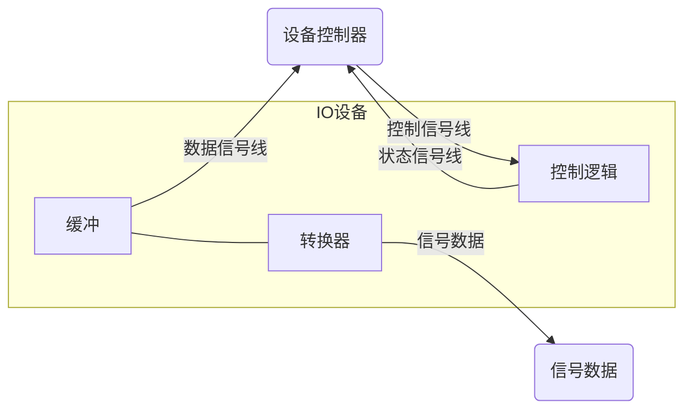

# 设备管理

## 概述

### 设备管理的作用

设备管理的对象主要是IO设备

- 设备管理的基本任务：
  - 完成提出的IO要求
  - 提高IO速率
  - 改善IO设备的利用率
- 设备管理的主要功能
  - 缓冲区管理：缓冲区的高利用率
    - cpu --cache-->memory --buffer-->Disk --buffer--> ....
  - 设备分配：进程对共享设备的访问方式
    - 死锁，同步互斥
  - 设备处理：对设备动作的控制（驱动）
  - 虚拟设备
  - 实现设备独立性：设备无关性

### IO设备类型

指标

- 传输速率
- 设备共享属性
  - 独占、共享、虚拟
- 信息交换单位
  - Byte keybord,mouse
  - Block Disk,USB
- 设备接口
  - PCI USB HDMI....

### 设备控制

:stop_button: 缺IO图

基本功能

- 接收和识别命令 R/W
- 数据交换
- 标识和报告设备的状态
- 地址识别
- 数据缓冲
- 差错控制

:stop_button: 设备控制器组成

### IO通道

IO通道设备的引入，专门处理IO机器

特殊的处理机，具有执行IO指令的能力，通过执行通信程序来控制IO操作

- 指令类型单一
- 没有自己的内存（或非常小），是通道与CPU共享内存

1. 字节多路通道 Byte Multiplexor Channel
2. 数组多路通道

单通道瓶颈问题，多同理系

### 总线系统

## IO控制方式:star:

### 程序IO方式

需要CPU参与

### 中断方式

中断驱动

外中断由中断屏蔽字操作，保护现场：上下文和寄存器保护

### DMA方式 Direct memory access

降低CPU参与，只在启动DMA传送命令和处理中断时才用到CPU

### 通道方式

## 缓冲技术

在设备管理中，引入缓冲主要原因

- 缓和CPU与IO设备间速度不匹配的矛盾
- 减少对CPU中断
- ... :stop_button:

### 单一缓冲区组织方式

在单缓冲情况下，每当用户程序发出IO请求是，操作系统便在主存中为之分配一缓冲区

无缓冲如果IO给的memory数据不全，CPU只能等待IO给全数据才能处理

有缓冲时，IO在写缓冲时，CPU可以读另一个缓冲

### 双缓冲

### 循环缓冲

把缓冲认为是一个环，是一种生产者消费者问题

### 缓冲池

申请缓冲，分配缓冲，回收缓冲

根据缓冲块的个数决定控制行为

### SPOOLING 

是一个特别的应用，在Windows有spoolsv.exe 假脱机:stop_button:

目的：将一台物理IO设备

结构示意图:stop_button:

磁盘中开辟若干缓冲区，分为输入和输出两类

难点：无法给每个电脑都配备输入机和输出机

解决：用一个进程模拟输入和输出机

特点：

1. 提高IO速度
2. 独占设备改为共享设备
3. 实现虚拟设备功能

## 设备独立性

程序使用逻辑设备而系统使用物理设备

- 优点
  - 设备分配的灵活性
  - 易于IO重定向
- 实现
  - 设备独立性软件
  - 设备驱动软件
  - 逻辑设备表 LUT

#### 设备无关性的实现

逻辑设备包LUT：设备映射

是一个软件的数据结构

| 主设备号        | 逻辑设备号                 | 驱动程序入口地址 |
| --------------- | -------------------------- | ---------------- |
| 3               | /dev/tty1（键盘输入设备1） | 3000             |
| 3               | /dev/tty2（键盘输入设备2） | 3000             |
| 5（针式打印机） | /dev/lp（打印机)           | 5000             |

用激光打印机替换针式打印机后

7（激光打印机） /dev/lp 7000 修改对应的表项就可以使用不同设备

### 设备查找

用逻辑设表 请求分配IO设备

逻辑设备LUT，找到逻辑设备名， 找到物理设备

找到物理设备对应的控制器和通道

1. 启用控制器
2. 启用通道
3. 启用设备