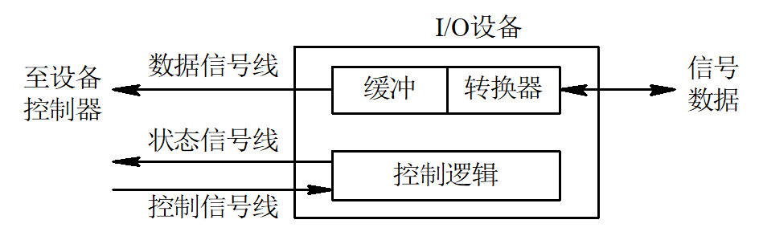
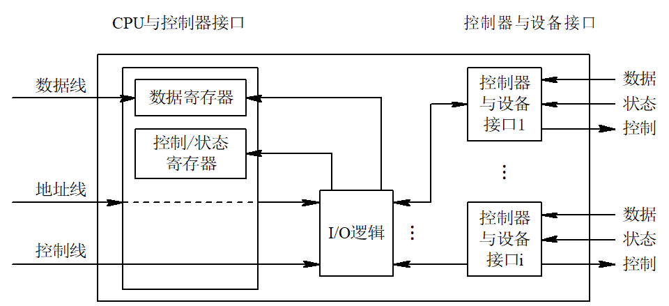

# 设备管理

## 概述

### 设备管理的作用

设备管理的对象主要是IO设备

- 设备管理的基本任务：
  - 完成提出的IO要求
  - 提高IO速率
  - 改善IO设备的利用率
- 设备管理的主要功能
  - 缓冲区管理：缓冲区的高利用率
    - cpu --cache-->memory --buffer-->Disk --buffer--> ....
  - 设备分配：进程对共享设备的访问方式
    - 死锁，同步互斥
  - 设备处理：对设备动作的控制（驱动）
  - 虚拟设备
  - 实现设备独立性：设备无关性

### IO设备类型

指标

- 传输速率
- 设备共享属性
  - 独占、共享、虚拟
- 信息交换单位
  - Byte keybord,mouse
  - Block Disk,USB
- 设备接口
  - PCI USB HDMI....

### 设备控制

基本功能

- 接收和识别命令 R/W
- 数据交换
- 标识和报告设备的状态
- 地址识别
- 数据缓冲
- 差错控制

### IO通道

IO通道设备的引入，专门处理IO机器

特殊的处理机，具有执行IO指令的能力，通过执行通信程序来控制IO操作

- 指令类型单一
- 没有自己的内存（或非常小），是通道与CPU共享内存

1. 字节多路通道 Byte Multiplexor Channel
2. 数组多路通道

单通道瓶颈问题，多同理系

### 总线系统

## IO控制方式:star:

### 程序IO方式

需要CPU参与

### 中断方式

中断驱动

外中断由中断屏蔽字操作，保护现场：上下文和寄存器保护

### DMA方式 Direct memory access

降低CPU参与，只在启动DMA传送命令和处理中断时才用到CPU

### 通道方式

## 缓冲技术

在设备管理中，引入缓冲主要原因

- 缓和CPU与IO设备间速度不匹配的矛盾
- 减少对CPU中断频率，放宽对CPU中断响应时间的限制
- 提高CPU和IO设备之间的并行性

### 单一缓冲区组织方式

在单缓冲情况下，每当用户程序发出IO请求是，操作系统便在主存中为之分配一缓冲区

无缓冲如果IO给的memory数据不全，CPU只能等待IO给全数据才能处理

有缓冲时，IO在写缓冲时，CPU可以读另一个缓冲

### 双缓冲

### 循环缓冲

把缓冲认为是一个环，是一种生产者消费者问题

### 缓冲池

申请缓冲，分配缓冲，回收缓冲

根据缓冲块的个数决定控制行为

### SPOOLING 

是一个特别的应用，在Windows有spoolsv.exe 假脱机:stop_button:

在主机的直接控制下，实现脱机输入、输出功能。此时的外围操作与CPU对数据的处理同时进行，我们把这种在联机情况下实现的同时外围操作称为SPOOLine（Simultaneaus Periphernal Operating On-Line）

目的：将一台物理IO设备

磁盘中开辟若干缓冲区，分为输入和输出两类

难点：无法给每个电脑都配备输入机和输出机

解决：用一个进程模拟输入和输出机

特点：

1. 提高IO速度
2. 独占设备改为共享设备
3. 实现虚拟设备功能

## 设备独立性

程序使用逻辑设备而系统使用物理设备

- 优点
  - 设备分配的灵活性
  - 易于IO重定向
- 实现
  - 设备独立性软件
  - 设备驱动软件
  - 逻辑设备表 LUT

#### 设备无关性的实现

逻辑设备包LUT：设备映射

是一个软件的数据结构

| 主设备号        | 逻辑设备号                 | 驱动程序入口地址 |
| --------------- | -------------------------- | ---------------- |
| 3               | /dev/tty1（键盘输入设备1） | 3000             |
| 3               | /dev/tty2（键盘输入设备2） | 3000             |
| 5（针式打印机） | /dev/lp（打印机)           | 5000             |

用激光打印机替换针式打印机后

7（激光打印机） /dev/lp 7000 修改对应的表项就可以使用不同设备

### 设备查找

用逻辑设表 请求分配IO设备

逻辑设备LUT，找到逻辑设备名， 找到物理设备

找到物理设备对应的控制器和通道

1. 启用控制器
2. 启用通道
3. 启用设备

## 设备分配及分配算法

银行家，互斥

- 在多道程序环境下，系统中设备所有进程共享。为防止诸进程对系统资源的无序竞争（死锁，混乱），**系统设备不允许用户自行使用，必须由操作系统统一分配**
- 进程向系统提出IO请求，只要**可能和安全**（安全状态，参考银行家算法）的
- 系统的独占设备和共享共享设备。不同设备有不同的分配算法
  - 独占设备：只允许一个进程访问
  - 共享设备：多个进程同时访问，一个进程没有进行结束，又可以分配给其他进程使用，磁盘属于共享设备
    - 他们可以独立的进行操作，并不需要一个进程释放磁盘之后才能为另一进程使用磁盘，他们可以同时在系统中占有磁盘运行，所以我们称磁盘为共享设备

独占设备分配方式：临界资源分配策略，静态分配策略

常见分配

- 先来先服务
- 优先级高者优先

### 设备分配中的安全性

1. 安全分配方式
2. 不安全分配方式

参考进程的管理，产生死锁的必要条件

1. 互斥条件
2. 请求和保持条件
3. 不剥夺条件
4. 环路等待条件

安全分配方式

- 在采用这种分配策略时，一旦进程已经获得某种设备（资源）后便阻塞，使它不可能再请求任何资源，而在它运行时又不保持任何资源。
- 优点：这种分配方式已经摒弃了造成死锁的四个必要条件之一的“请求和保持”条件，因而是安全的。 
- 缺点：是进程进展缓慢，即CPU与I/O设备是串行工作。 

不安全分配方式

- 在这种分配方式中，进程发出I/O请求后仍继续运行，需要时又可发出第二个I/O请求、第三个I/O请求。仅当进程所请求的设备已被另一进程占用时，进程才进入阻塞状态。 
- 优点：是一个进程可同时操作多个设备，从而使进程推进迅速。 
- 缺点：是分配不安全，因为它可能具备”请求和保持”条件，从而可能造成死锁。 

### 设备分配过程

系统设备表，设备控制表，控制器控制表，通道控制表

## 磁盘管理

在多道程序设计中，同时会有若干个访问者请求磁盘执行输入输出操作，每一时刻只允许一个访问者执行输入输出操作，其余的必须等待。

### 寻址时间构成

- 寻找时间——磁头在移动臂带动下移动到指定柱面所花的时间
- 延迟时间——指定扇区旋转到磁头下所需的时间
- 传送时间——由磁头进行读写完成信息传送的时间

### 磁盘分配算法

根据磁盘的操作时间，对磁盘调度分为“移臂调度”和“旋转调度”两部分组成。

#### 移臂调度算法 

常用的移臂调度算法有

- 先来先服务算法
- 最短寻找时间优先算法
  - 最短寻找时间优先SSTF：调度算法总是从等待访问者中挑选寻找时间最短的那个请求先执行，而不管访问者到来的先后次序
- 电梯调度算法 SCAN
  - 算法总是从移动臂当前位置开始沿着臂的移动方向去选择离当前移动臂最近的那个柱面的访问者，如果沿臂的移动方向无请求访问时，就改变臂的移动方向再选择
  - 要求磁头臂仅沿一个方向，直到最后一个磁道。有时LOOK策略，在这个方向上没有其他请求为止
  - 然后反转服务方向
  - 移动臂的方向
    1. 移动臂是向外移的
    2. 移动臂是向里移的
- 单向扫描算法 CSCAN
  - 循环扫描调度算法，该算法不考虑等待访问者的先后次序，总是从0号柱面开始向里扫描，按照各访问者所要访问的柱面位置的次序去选择访问者。移动臂到达最后一个柱面后，立即带动读写磁头快速返回到0号柱面

#### 旋转调度

 当移动臂定位后，应该优先选择延迟时间最短的访问者去执行，根据延迟时间来决定执行次序的调度称为“旋转调度”

进行旋转调度时应分析下列情况： 

1. 若干等待访问者请求访问同一磁道上的不同扇区
2. 若干等待访问者请求访问不同磁道上的不同编号的扇区
3. 若干等待访问者请求访问不同磁道上具有相同编号的扇区

## RAID

- 数据分块，即把数据分布在多个盘上
- 非冗余阵列、无冗余信息
- 严格地说，它不属于RAID系列