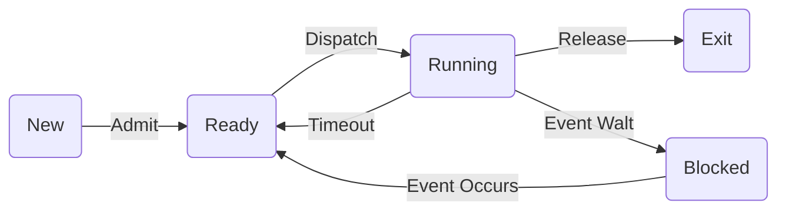
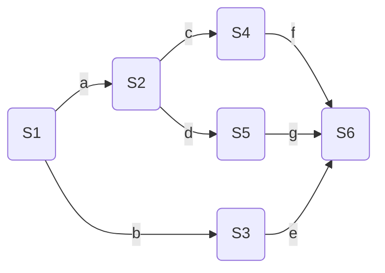

# 进程和线程 Processes and Threads

## 自己动手引导计算机启动

所需软件

- Virtual Box, VMware等虚拟机软件
- Ubuntu，RedHat等Linux发行版
- Windows
- Linux下的汇编编译器nasm
- 程序源文件编辑器
- Internet

```assembly
	org	07c00h			; 告诉编译器程序加载到7c00处
	mov	ax, cs
	mov	ds, ax
	mov	es, ax
	call	DispStr			; 调用显示字符串例程
	jmp	$			; 无限循环
DispStr:
	mov	ax, BootMessage
	mov	bp, ax			; ES:BP = 串地址
	mov	cx, 16			; CX = 串长度
	mov	ax, 01301h		; AH = 13,  AL = 01h
	mov	bx, 000ch		; 页号为0(BH = 0) 黑底红字(BL = 0Ch,高亮)
	mov	dl, 0
	int	10h			; 10h 号中断
	ret
BootMessage:		
	db	"Hello, OS world!"
	times 	510-($-$$)	db	0; 填充剩下的空间，使生成的二进制代码恰好为512字节
	dw 	0xaa55				; 结束标志

```

1. 编写汇编程序

2. https://blog.csdn.net/judyge/article/details/52278384

3. 用nasm编译上述汇编程序

   nasm boot.asm - o boot.bin

   提示:需要先安装nasm工具，在Ubuntu环境下，使用： sudo apt-get install nasm即可

4. 将bin文件转换成可启动的映像文件

   ```bash
   $dd if=boot.bin of=boot.img bs=512 count=1
   1+0 records in
   1+0 records out
   512 bytes copied, 0.000222849 s, 2.3 MB/s
   $dd if=/dev/zero of=boot.img skip=1 seek=1 bs=512 count=2879
   2879+0 records in
   2879+0 records out
   1474048 bytes (1.5 MB, 1.4 MiB) copied, 0.0214993 s, 68.6 MB/s
   ```

5. 将生成的img文件拷贝出来用于启动虚拟机

   sudo mkdir /mnt/share

   sudo mount - t vboxsf Kanbox /mnt/share

   前提：安装virtualBox的附件

6. 新建虚拟机，用img文件启动

## 进程 process

进程是操作系统最核心的概念

现代操作系统的一切都为进程而展开

进程是**正在运行的程序的一个抽象（正解）**

- 进程执行模型
  - 顺序执行（Sequential Mode）
  - 并发执行（Parallel Mode）

- 伪并行
  - 并行与并发

## 进程的执行模型

对应到操作系统当中，进程的执行模型同样有**顺序执行**和**并行执行**。

顺序执行：一个进程执行完毕，再紧接着执行另外一个进程


缺点：执行效率太低

并行执行：四个进程同时执行，相互独立，互不干扰


缺点：硬件要求太高

### 进程的并发执行模型

**并发(concurrence)执行是微观上的顺序执行，宏观上的并行执行**

 并发


有两个程序A和B共享一个变量N，初始值为5

A A1:N=N+1

B B1: Print(N)

​    B2: N=0;

不同的执行顺序，会产生不一样的结果

## 进程的状态


进程的三种基本状态

- **就绪（Ready）状态**：当进程已分配到除CPU以外的所有必要资源后，只要再获得CPU，便可立即执行。

- **执行状态（Running）**：进程已获得CPU，其程序正在执行。

- **阻塞状态（Blocked）**：正在执行的进程由于发生某事件而暂时无法继续执行时，便放弃处理机而处于暂停状态，把这种暂停状态称为阻塞状态，有时也称为等待状态。

````mermaid
graph RL
a((就绪)) --进程调度--> b((执行))
b --请求资源--> c((阻塞))
c --请求得到满足--> a
b --时间片用完-->a
````

单阻塞队列


多阻塞队列


多阻塞队列可以分类请求，分别处理，只需要检测CPU请求的队列

New：进程已经创建，但未被OS接纳为可执行进程，并且程序还在辅存，PCB在内存

Exit：因停止或取消，被OS从执行状态释放



### 进程的挂起状态

挂起状态：使执行的进程暂停执行,静止下来,我们把这种静止状态称为挂起状态。

| 事件           | 说明                                                         |
| -------------- | ------------------------------------------------------------ |
| 交换           | 操作系统需要释放足够的内存空间，以调入并执行处于就绪状态的进程 |
| 其他OS原因     | 操作系统可能挂起后台进程或工具程序进程，或者被怀疑导致问题的进程 |
| 交互式用户请求 | 用户可能希望挂起一个程序的执行，目的是为了调试或者与一个资源的使用和连接 |
| 定时           | 一个进程可能会周期性地执行（例如记账或系统监视进程），而且可能等待下个时间间隔时挂起 |
| 父进程请求     | 父进程可能会希望挂起后代进程的执行，一检查或修改挂起的进程，或者协调不同后代进程之间的行为 |

引入了挂起状态


- 空白→新建：系统调用、用户登陆、用户请求……
- 新建→就绪：系统尚有空余资源，接纳进程并放入就绪队列

- 就绪→运行：获得了除了CPU之外的所有资源

- 运行→完毕：进程正常执行完毕或者被KILL

- 运行→就绪：时间片用完、CPU被抢占

- 运行→阻塞：等待请求完成

- 阻塞→就绪：请求已经完成

- 就绪（阻塞）→退出：无偿地被KILL

- 阻塞→阻塞挂起：释放内存空间

- 就绪→就绪挂起：没有阻塞进程，挂起就绪进程以释放空间

- 就绪挂起→就绪：没有就绪进程或者就绪进程优先级较低

- 阻塞挂起→阻塞

- 阻塞挂起→就绪挂起

## 进程的控制

- 进程状态（若干状态之间的转换及转换依据）

- 进程映像
  - 进程的程序、数据、堆、栈的集合

- 进程控制块 PCB （Process Control Block）
  - 用于控制进程属性的集合

- 进程图


primary process table中就是进程映像，Process Image中的进程也会和其他tables有交互

**进程控制块**

| PCB存储信息 | 内容和功能（p87)                                  |
| ----------- | ------------------------------------------------- |
| 标识符      | PID和进程名称（名称会重复） Win:>tasklist可以查看 |
| 状态        |                                                   |
| 优先级      |                                                   |
| 程序计数器  | 下一条执行指令的地址                              |
| 内存指针    | 程序代码和进程相关数据指针、共享内存块指针等      |
| 上下文      | 处理器的寄存器数据信息                            |
| IO状态      | 处理器的使用时间总和、时间限制等，设备状态        |
| 审计信息    | 执行时间，使用资源。供操作系统参考和参考          |

进程标识

- 标识符

处理器状态信息

- 用户可见寄存器，控制和状态寄存器，栈指针

进程控制信息

- 调度和状态信息，进程间通信，特权、存储管理、资源使用情况


- 操作系统维持着一个由PCB组成的链表，根据链表中的PCB来控制系统中的进程
- 进程控制块面临的难题——安全保护
  - 病毒会不出现在PCB中，或修改其他进程

**进程图 Process Graph**

进程图是用于描述一个进程的家族关系的有向树。

**子进程**可以继承**父进程**所拥有的资源。

当子进程被撤消时，应将其从父进程那里获得的资源归还给父进程。 

思考：父进程死掉，子进程怎么办？

#### 进程的创建 Process Creation

Events which cause process creation:

- 系统初始化 System initialization.

- 正在运行的进程调用了一个进程创建系统

  Execution of a process creation system call by a running process.

- 用户请求 A user request to create a new process.

- 批处理作业的初始化 Initiation of a batch job.

分配一个唯一进程标识符，分配相应空间（包括进程映像所以元素）

调用进程**创建原语**按下述步骤创建一个新进程：

1. 申请空白PCB。  

2. 为新进程分配资源。为新进程的程序和数据以及用户栈分配必要的内存空间。

3. 初始化进程控制块。
   - 初始化标识信息。
   - 初始化处理机状态信息。使程序计数器指向程序的入口地址，使栈指针指向栈顶；
   - 初始化处理机控制信息：进程的状态、优先级。

4. 将新进程插入就绪队列。

关于Unix和Windows的不同做法

- Unix：fork()

- 创建一个和调用进程相同的副本。
  - 相同的存储映像、相同的环境……

- 子进程执行execve修改存储映像

#### 进程终止 Process Termination

Events which cause process termination:

- Normal exit (voluntary).

- Error exit (voluntary).

- Fatal error (involuntary).

- Killed by another process (involuntary).

利用**终止原语**(原子操作，不可再分)终止进程

- 检索将被终止的进程PCB

- 终止该进程的执行（若有子进程，一并终止）

- 回收资源

- 将该进程PCB从当前队列中移除

#### 进程的阻塞

调用**阻塞原语**自我阻塞

自我阻塞，所以阻塞是发生在运行过程中。会插入到不同的阻塞队列中

- 暂停进程的执行，修改PCB运行状态

- 将PCB插入阻塞队列

- 调度新进程

#### 进程的唤醒

调用**唤醒原语**唤醒进程

- 检索阻塞队列，寻找要唤醒进程的PCB

- 修改PCB的运行状态

- 插入PCB到就绪队列

#### 进程的挂起与激活

利用**挂起原语**挂起进程

利用**激活原语**激活进程

### 进程的切换

步骤

- 保存处理器状态信息

- 更新当前进程的状态

- 将当前进程PCB移动到相应的队列

- 选择另一个进程PCB

- 更新该进程的PCB

- 更新内存管理的数据结构

- 恢复当前进程被切换前的上下文信息

### 模式切换

模式切换可以不改变正处于运行态的进程的状态。

​	进程切换会导致模式切换，反之不一定改变

​	如：使用内心功能，进程发出系统调用请求，进程一直处于执行状态；当系统调用为IO处理时，进程状态会变成阻塞状态

保存上下文环境和恢复上下文环境只需要很小的开销

## 线程 Threads

回顾进程的概念

- 每个进程有自己独立的地址空间

- 每个进程拥有自己资源的控制权
  - I/O、主存、文件……
- 进程是操作系统的最小调度单位
  - 进程切换

为了减少操作系统的开销，现代操作系统引入线程的概念

线程是调度的最小单位

进程是资源拥有的最小单位

一个进程可以有多个线程

组合方式：单进程单线程	单进程多线程	多进程单线程	多线程多进程

线程的特点

- 同一个进程的所有线程共享该进程的资源

- 同一个进程的所有线程共享同一个地址空间

线程的优点

- 创建快（比进程大约快10倍）（在进程的资源基础上创建）

- 终止快（线程终止不需要被回收）

- 切换快（一般在进程内部切换，保存信息较少）

- 通信快，无需内核介入


在支持线程的操作系统中，线程是调度分派的最小单位，进程是资源拥有的最小单位

线程同样具有几种基本状态

- 就绪、执行、阻塞

同样存在进程的调度

对进程的操作影响到进程中的所有线程

**线程的基本操作**

- 派生（Spawn)：当产生一个新进程时，同时也为该进程派生了一个线程，随后，进程中的线程可以在同一个进程中派生另一个线程，新线程被放置在就绪队列中。

- 阻塞（Block)：当线程需要等待一个事件时，它将阻塞，此时处理器转而执行另一个就绪线程。

- 解除阻塞（Unblock）：当阻塞一个线程的事件发生时，该线程被转移到就绪队列中。

- 结束（Finish）：当一个线程完成时，其寄存器的信息和栈都被释放。

- 线程的实现
  - 用户级线程
    - 线程的管理由应用程序完成
  - 内核级线程
    - 线程的管理由内核完成，应用程序通过API访问线程


a. 用户级线程，操作系统感知不到线程存在，只知道进程存在。信息交换只在用户空间完成

b. 内核级线程，调用API完成，操作系统可以感知到。用户控件不能完成信息交换，需要调用API在内核完成信息交换，需要模式切换有较大开销。

**用户级线程**与内核级线程的比较

- 用户级线程不需要模式切换（由应用程序完成）

- 用户级线程由应用程序实现调度管理

- 用户级线程可以在任意操作系统中运行（语言提供用户级线程库）

**缺点**

- 用户级线程执行系统调用时，同一进程所有线程都会被阻塞

- 不能利用多处理机技术

用户级线程与**内核级线程**的比较

- 内核实现内核级线程的调度管理

- 可以充分利用多处理机技术

**缺点**

- 有模式切换的开销

## 进程的并发

并发是所有问题的基础，也是操作系统设计的基础

由并发带来的两个问题

- 对资源的相互制约：同步

- 对资源的相互共享：互斥

### 相关的关键概念

- 临界资源：一次仅允许一个进程访问的资源为临界资源

- 临界区
  - 把在每个进程中访问临界资源的那段**代码**称为临界区
  - 代码作为一个共享资源，一次只能允许一个进程访问

- 死锁：两个或两个以上的进程相互等待导致都不能执行

- 活锁：由于某些条件不满足，导致进程不断重复尝试而不能正常推进执行

- 互斥：当一个进程在临界区访问临界资源时，其他进程不能进入该临界区访问共享资源

- 竞争：多个进程读写一个共享数据时依赖它们执行的相对时间
  - 竞争条件发生在多个进程或线程读写数据时，其最终结果取决于多个进程的指令执行顺序

- 饥饿：一个进程得不到执行机会（P134）

合作关系：直接知道（直接通信），间接知道（通过共享）

进程的并发会导致程序执行结果不封闭

- 全局资源

  对全局资源的访问秩序非常重要

- 资源分配

  不好的分配算法可能导致死锁

为了实现对临界资源的访问，每个进程都**互斥**地进入自己的临界区：**一次只有一个程序在临界区**

1. 进入临界区之前，对预先访问的临界资源进行检查

2. 若该资源尚未被访问，则可以进入临界区；反之则不能

3. 设置正在访问标志

最后，将资源恢复为未访问标志

### 互斥可能带来的问题

- 死锁：进程P1占有资源R1，等待资源R2；进程P2占有资源R2，等待资源R1

- 饥饿：无限期地被推迟访问

#### 同步机制应该遵循的准则

1. **空闲让进**（临界区没有进程就让进）
2. **忙则等待**（只有一个进程进入临界区）
3. **有限等待**
4. **让权等待**

#### 实现互斥访问

- 严格轮换

​	每个进程每次都从头执行到尾

- 屏蔽中断

​	刚刚进入临界区时就屏蔽中断，刚要出临界区就打开中断

- 专用机器指令

​	test_and_set、test_and_clear 

- 软件方法

​	信号量

### 软件方法解决互斥与同步

1. 能否保住互斥？
2. 会不会出现互斥礼让？
3. 会不会死锁？

算法分析（ Dekker’s Algorithm ）

```c
Int turn=0; //共享的全局变量
Process 0
{
    while turn≠0 do {nothing};
    <critical section>;
    turn=1;
}
Process 1
{
    while turn ≠ 1 do {nothing};
    <critical section>;
    turn=0;
}
```

解析：保证了互斥，但存在问题：进程“忙等”进入临界区；若黑板标志修改失败，其他进程**永久阻塞**

-------

```c
boolean flag[2]; //共享的全局变量
Process 0
{
    while flag[1] do {nothing};
    flag[0]=true;
    <critical section>;
    flag[0]=false;
}
Process 1
{
    while flag[0] do {nothing};
    flag[1]=true;
    <critical section>;
    flag[1]=false;
}
```

若进程执行完临界区，恢复自己标志为“false”失败，则其他进程永久阻塞。

-------

在检查其他进程之前，希望进到临界区，则设置自己 flag=true。

当设置标志为真后，如果其他进程在临界区，则本进程阻塞，直到其他进程释放临界区为止。

```c
var flag : array [0，1] of boolean :false ;
Process 0
{
    flag[0]=true;
    while flag[1] do {nothing};
    <critical section>;
    flag[0]=false;
}
Process 1
{
    flag[1]=true;
    while flag[0] do {nothing};
    <critical section>;
    flag[1]=false;
}
```

如果两个进程在执行while之前都把flag设置成true，那么每个进程都会以为对方进入了临界区，使自己处于阻塞，从而导致死锁。

-------

主要思想是将标志重置，不会发生死锁。

实现过程：

- 希望进到临界区，则设置自己 标志为：flag=true。
- 如果其他进程在临界区，则将本进程标志置为flag=false，稍后又置为true，这一过程重复到能进入临界区为止。

```c
var flag : array [0，1] of boolean :false ;
Process 0
{
    flag[0]=true;	//希望进入临界区
    while flag[1] do {
        flag[0]=false;
        <delay for a shot time>;
        flag[0]=true;
    };
    <critical section>;
    flag[0]=false;
}
Process 1
{
    flag[1]=true;
    while flag[0] do {
    	flag[1]=false;
        <delay for a shot time>;
        flag[1]=true;
    };
    <critical section>;
    flag[1]=false;
}
```

检查其它进程，然后重置，再检查，再重置…，

重置序列可以无线延伸，任何一个进程都不能进入自己的临界区。(这种现象称为:互斥礼让)

互斥礼让的第二种方法

```c
var flag : array [0，1] of boolean :false ;
turn : 0,1;
Process 0
{
    flag[0]=true;	//希望进入临界区
    turn = 1;
    while flag[1] && turn == 1 do { nothing };
    <critical section>;
    flag[0]=false;
}
Process 1
{
    flag[1]=true;
    turn = 0;
    while flag[0] && turn == 0 do { nothing };
    <critical section>;
    flag[1]=false;
}
```


## 进程的并发

常用并发机制

1. 信号量

   以上三个整数值（初始化，+，-）都是原子操作，如果操作失败会撤销

2. 二元信号量

   只取0,1

3. 互斥量

   加锁和解锁的量必须是同一个

4. 条件变量
5. 管程
6. 事件标志
7. 信箱/消息
8. 自旋锁

### 信号量

#### 整形信号量

最初由Dijkstra把整型信号量定义为一个整型量，除初始化外，仅能通过两个标准的**原子操作**(Atomic Operation) wait(S)和signal(S)来访问。这两个操作一直被分别称为P、V操作。 wait和signal操作可描述为：
```c
P(S):  while (S<=0); S=S-1;
V(S):  S=S+1;
```

p(wait) v(signal)

不能对信号量直接做加减操作，因为操作不满足原子操作。需要调用P和V函数

面临的问题

- 只要是信号量S≤0， 就会不断地测试。因此，该机制并未遵循“让权等待”的准则

可能存在盲等

#### 记录型信号量

一个用于代表资源数目的整型变量value外

一个进程链表L，用于链接所有等待进程

````c
typedef struct semaphore{
	int Value;
    List_of_Process L;
}

P(S):
     S.value  =S.value-1;
     if  (S.value<0)
          block(S,L);//切换至阻塞队列
         
V(S):
     S.value=S.value+1;
     if  (S.value<=0)
         wakeup(S,L); 
````

S.value的初值表示系统中某类资源的数目，因而又称为资源信号量，对它的每次wait操作，意味着进程请求一个单位的该类资源，因此描述为S.value=S.value-1；

当S.value＜0时，表示该类资源已分配完毕，因此进程应调用block原语，进行自我阻塞，放弃处理机，并插入到信号量链表S.L中。可见，该机制遵循了“让权等待”准则。 此时S.value的绝对值表示在该信号量链表中已阻塞进程的数目。

对信号量的每次signal操作，表示执行进程释放一个单位资源，故S.value=S.value+1操作表示资源数目加1。若加1后仍是S.value≤0，则表示在该信号量链表中，仍有等待该资源的进程被阻塞，故还应调用wakeup原语，将S.L链表中的第一个等待进程唤醒。

如果S.value的初值为1，表示只允许一个进程访问临界资源，此时的信号量转化为互斥信号量。

强信号量，按排队顺序唤醒。弱信号量，唤醒资源靠竞争


#### AND信号量

AND同步机制的基本思想

**将进程在整个运行过程中需要的所有资源，一次性全部地分配给进程，待进程使用完后再一起释放。只要尚有一个资源未能分配给进程，其它所有可能为之分配的资源，也不分配给他。**亦即，对若干个临界资源的分配，采取原子操作方式：要么全部分配到进程，要么一个也不分配。

#### 信号量集

思考：记录型信号量有何不便之处？

- 当一次需要多个资源时，需要进行多次P操作

- 同理，要进行多次释放V操作

如何改进：

t为下限值，d为需求值

```c
Swait(S1, t1, d1, …, Sn, tn, dn)
    if ( S1≥t1 and … and Sn≥tn )
       for  ( i=1;i<=n; i++)
             Si =Si-di;
    else
        Place the executing process in the waiting queue of the first Si with Si＜ti and set its program counter to the beginning of the Swait Operation. ;
signal(S1, d1, …, Sn, dn)
   for  ( i=1;i<=n; i++){
       Si =Si+di;
       Remove all the process waiting in the queue associated with Si into the ready queue;
   } 
```

​    一般“信号量集”的几种特殊情况：

1. Swait(S, d, d)。 此时在信号量集中只有一个信号量S， 但允许它每次申请d个资源，当现有资源数少于d时，不予分配。
2. Swait(S, 1, 1)。 此时的信号量集已蜕化为一般的记录型信号量(S＞1时)或互斥信号量(S=1时)。
3. Swait(S, 1, 0)。这是一种很特殊且很有用的信号量操作。当S≥1时，允许多个进程进入某特定区；当S变为0后，将阻止任何进程进入特定区。换言之，它相当于一个可控开关。

### 信号量的应用

**利用信号量实现进程互斥**

```c
P1:
Semaphore mutex=1;
while(1){
    P(mutex);
    Critical Section;
    V(mutex);
}
P2:
Semaphore mutex=1;
while(1){
    P(mutex);
    Critical Section;
    V(mutex);
}
```

**利用信号量实现前趋关系**



需要保证在前趋结束，才能开始执行后面的进程

```c
Semaphore a=0,b=0,c=0,d=0,e=0,f=0,g=0;//使用信号量必须初始化
S1;V(a);V(b);
P(a);S2;V(c);V(d);
P(b);S3;V(e);
P(c);S4;V(f);
P(d);S5;V(g);
P(e);P(f);P(g);S6;
```

同一层级的执行顺序靠调度

**生产者消费者问题**

1. 生产者生产产品，提供给消费者去消费。

2. 为使得生产者进程和消费者进程能并发执行（执行中可能会被打断），在两者之间设置了具有*n*个缓冲区的缓冲池。

3. 生产者进程将他生产的产品放入缓冲池（一次一个），消费者进程从缓冲池中拿走产品（一次一个）。

4. 缓冲池已满时，生产者不能再放，缓冲池已空时，消费者不能再拿。

生产者与消费者之间的联系

- 互斥
  - 共享缓冲区（缓冲区作为一种临界资源）

- 同步
  - 相互等待（有产品才能消费、有消费才能不断生产）

使用循环缓存，只需要单一方向生成/消费即可

假定在生产者和消费者之间的公用缓冲池中，具有n个缓冲区，这时可利用**互斥信号量Mutex**实现诸进程对缓冲池的互斥使用

利用**信号量Empty和Full**分别表示缓冲池中空缓冲区和满缓冲区的数量。

```c
Semaphore Mutex=1; //定义互斥信号量，注意是1
Semaphore Full=0;Empty=n; //定义同步信号量
//这样初始化是为了阻塞消费者，此时消费者可用资源为0，n是缓冲区大小为生产者可生产空位
product_Item Buffer[n]; //定义产品缓冲区
int in=0; //定义生产者初始化指针
int out=0; //定义消费者初始化指针

Producer://	生产者进程
while(1){
    ...; // 生产者生产产品 Pro_Item
    P(Empty);
    P(Mutex);//加锁
    Buffer[in]=Pro_Item;
    in=(in++)%n;
    V(Mutex);//解锁
    V(Full);
}

Consumer:
while(1){
    P(Full);
    P(Mutex);
    Item=Buffer[out];
    out=(out++)%n;
    V(Mutex);
    V(Empty);
    ...; //消费者消费过程
}
```

互斥信号量：PV同一进程中成对

同步信号量：PV不同进程中成对

如果 empty和Mutex 交换 会导致死锁，产生原因 生产者连续生产n次后，再次进行P([pro]mutex) P1([pro]empty) P2([con]mutex) 死锁

因此

1. P操作一定要对同步信号量操作，再对互斥信号量操作
2. PV成对出现

P不当会导致死锁，V操作不会导致阻塞

### 利用AND信号量

```c
Semaphore Mutex=1; //定义互斥信号量，注意是1
Semaphore Full=0;Empty=n; //定义同步信号量
//这样初始化是为了阻塞消费者，此时消费者可用资源为0，n是缓冲区大小为生产者可生产空位
product_Item Buffer[n]; //定义产品缓冲区
int in=0; //定义生产者初始化指针
int out=0; //定义消费者初始化指针

Producer://	生产者进程
while(1){
    ...; // 生产者生产产品 Pro_Item
    P(Empty,Mutex);
    Buffer[in]=Pro_Item;
    in=(in++)%n;
    V(Mutex,Full);//解锁
}

Consumer:
while(1){
    P(Full,Mutex);
    Item=Buffer[out];
    out=(out++)%n;
    V(Mutex，Empty);
    ...; //消费者消费过程
}
```

### 无限缓存

缓冲区无限大

生产者不停地放

满足：

1. 互斥
2. 消费者有限制

```c
int n;
binary_semaphore s = 1,delay = 0;//二元信号量
void producer(){
    while(true){
        produce();
        semWaitB(s);
        append();
        n++;
        if(n == 1)semSignalB(delay);//通知消费者有数据可取
        semSignalB(s);
    }
}
void consumer(){
    semWaitB(delay);
    while(true){
        semWaitB(s);
        take();
        n--;
        semSignalB(s);
        consume();
        if(n == 0) semWaitB(delay);
    }
}
void main(){
    n = 0;
    parbegin(producer, consumer);
}
```

以上程序存在错误

|      | Producer                   | Consumer                                          | s    | n    | Delay |
| ---- | -------------------------- | ------------------------------------------------- | ---- | ---- | ----- |
| 1    |                            |                                                   | 1    | 0    | 0     |
| 2    | semWaitB(s)                |                                                   | 0    | 0    | 0     |
| 3    | n++ //生产                 |                                                   | 0    | 1    | 0     |
| 4    | if(n==1) semSignalB(delay) |                                                   | 0    | 1    | 1     |
| 5    | semSignalB(s)              |                                                   | 1    | 1    | 1     |
| 6    |                            | semWaitB(delay)                                   | 1    | 1    | 0     |
| 7    |                            | semWaitB(s)                                       | 0    | 1    | 0     |
| 8    |                            | n-- //消费                                        | 0    | 0    | 0     |
| 9    |                            | semSignalB(s)                                     | 1    | 0    | 0     |
| 10   | semWaitB(s)                |                                                   | 0    | 0    | 0     |
| 11   | n++// 生产                 |                                                   | 0    | 1    | 0     |
| 12   | if(n==1) semSignalB(delay) |                                                   | 0    | 1    | 1     |
| 13   | semSignalB(s)              |                                                   | 1    | 1    | 1     |
| 14   |                            | if(n==0) :warning:semWaitB(delay) //这delay不匹配 | 1    | 1    | 1     |
| 15   |                            | semWaitB(s)                                       | 0    | 1    | 1     |
| 16   |                            | n-- //这里消费空数据                              | 0    | 0    | 1     |
| 17   |                            | semSignalB(s)                                     | 1    | 0    | 1     |
| 18   |                            | if(n==0) :warning:semWaitB(delay)                 | 1    | 0    | 0     |
| 19   |                            | semWaitB(s)                                       | 0    | 0    | 0     |
| 20   |                            | n--:stop_sign:                                    | 0    | -1   |       |

主要问题是生产者和消费者对于n同时进行操作，消费者消费了一个不存在的内容

正确的程序

```c
int n;
binary_semaphore s = 1,delay = 0;//二元信号量
void producer(){
    while(true){
        produce();
        semWaitB(s);
        append();
        n++;
        if(n == 1)semSignalB(delay);//通知消费者有数据可取
        semSignalB(s);
    }
}
void consumer(){
    int m; // a local variable
    semWaitB(delay);
    while(true){
        semWaitB(s);
        take();
        n--;
        m = n;
        semSignalB(s);
        consume();
        if(m == 0) semWaitB(delay);
    }
}
void main(){
    n = 0;
    parbegin(producer, consumer);
}
```

这里的n类似一个信号量，所以不使用二元函数，进行改进

```c
semaphore n = 0, s = 1;
void producer(){
    while(true){
        produce();
        semWait(s);
        append();
        semSignal(s);
        semSignal(n);
    }
}
void consumer(){
    while(true){
        semWait(n);
        semWait(s);
        take();
        semSignal(s);
        consume();
    }
}
void main(){
    parbegin(producer, consumer);
}
```


-------

进程如果阻塞了，还会占用已经申请的资源。如果进程占用所有资源，其他进程得不到资源需要一直等到释放。如果造成严重问题需要进行剥夺或人工干预

