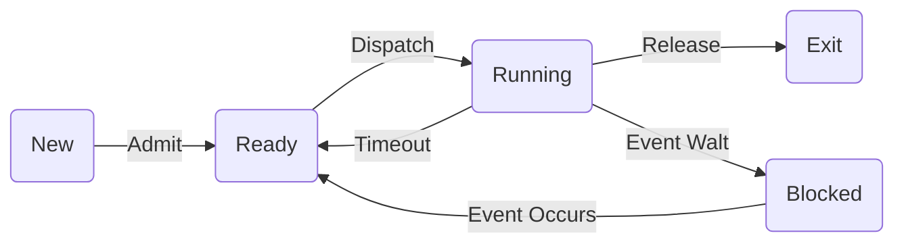

# 进程和线程 Processes and Threads

## 自己动手引导计算机启动

所需软件

- Virtual Box, VMware等虚拟机软件
- Ubuntu，RedHat等Linux发行版
- Windows
- Linux下的汇编编译器nasm
- 程序源文件编辑器
- Internet

```assembly
	org	07c00h			; 告诉编译器程序加载到7c00处
	mov	ax, cs
	mov	ds, ax
	mov	es, ax
	call	DispStr			; 调用显示字符串例程
	jmp	$			; 无限循环
DispStr:
	mov	ax, BootMessage
	mov	bp, ax			; ES:BP = 串地址
	mov	cx, 16			; CX = 串长度
	mov	ax, 01301h		; AH = 13,  AL = 01h
	mov	bx, 000ch		; 页号为0(BH = 0) 黑底红字(BL = 0Ch,高亮)
	mov	dl, 0
	int	10h			; 10h 号中断
	ret
BootMessage:		
	db	"Hello, OS world!"
	times 	510-($-$$)	db	0; 填充剩下的空间，使生成的二进制代码恰好为512字节
	dw 	0xaa55				; 结束标志

```

1. 编写汇编程序

2. https://blog.csdn.net/judyge/article/details/52278384

3. 用nasm编译上述汇编程序

   nasm boot.asm –o boot.bin

   提示:需要先安装nasm工具，在Ubuntu环境下，使用： sudo apt-get install nasm即可

4. 将bin文件转换成可启动的映像文件

   ```bash
   $dd if=boot.bin of=boot.img bs=512 count=1
   1+0 records in
   1+0 records out
   512 bytes copied, 0.000222849 s, 2.3 MB/s
   $dd if=/dev/zero of=boot.img skip=1 seek=1 bs=512 count=2879
   2879+0 records in
   2879+0 records out
   1474048 bytes (1.5 MB, 1.4 MiB) copied, 0.0214993 s, 68.6 MB/s
   ```

5. 将生成的img文件拷贝出来用于启动虚拟机

   sudo mkdir /mnt/share

   sudo mount –t vboxsf Kanbox /mnt/share

   前提：安装virtualBox的附件

6. 新建虚拟机，用img文件启动

## 进程

进程是操作系统最核心的概念

现代操作系统的一切都为进程而展开

进程是**正在运行的程序的一个抽象（正解）**

- 进程执行模型
  - 顺序执行（Sequential Mode）
  - 并发执行（Parallel Mode）

- 伪并行
  - 并行与并发

### 进程的执行模型

对应到操作系统当中，进程的执行模型同样有**顺序执行**和**并行执行**。

顺序执行：一个进程执行完毕，再紧接着执行另外一个进程


缺点：执行效率太低

并行执行：四个进程同时执行，相互独立，互不干扰


缺点：硬件要求太高

### 进程的并发执行模型

**并发(concurrence)执行是微观上的顺序执行，宏观上的并行执行**

 并发


有两个程序A和B共享一个变量N，初始值为5

A A1:N=N+1

B B1: Print(N)

​    B2: N=0;

不同的执行顺序，会产生不一样的结果

### 进程的状态


进程的三种基本状态

- **就绪（Ready）状态**：当进程已分配到除CPU以外的所有必要资源后，只要再获得CPU，便可立即执行。

- **执行状态（Running）**：进程已获得CPU，其程序正在执行。

- **阻塞状态（Blocked）**：正在执行的进程由于发生某事件而暂时无法继续执行时，便放弃处理机而处于暂停状态，把这种暂停状态称为阻塞状态，有时也称为等待状态。

````mermaid
graph RL
a((就绪)) --进程调度--> b((执行))
b --请求资源--> c((阻塞))
c --请求得到满足--> a
b --时间片用完-->a
````

单阻塞队列


多阻塞队列


多阻塞队列可以分类请求，分别处理，只需要检测CPU请求的队列

New：进程已经创建，但未被OS接纳为可执行进程，并且程序还在辅存，PCB在内存

Exit：因停止或取消，被OS从执行状态释放



### 进程的挂起状态

挂起状态：使执行的进程暂停执行,静止下来,我们把这种静止状态称为挂起状态。

| 事件           | 说明                                                         |
| -------------- | ------------------------------------------------------------ |
| 交换           | 操作系统需要释放足够的内存空间，以调入并执行处于就绪状态的进程 |
| 其他OS原因     | 操作系统可能挂起后台进程或工具程序进程，或者被怀疑导致问题的进程 |
| 交互式用户请求 | 用户可能希望挂起一个程序的执行，目的是为了调试或者与一个资源的使用和连接 |
| 定时           | 一个进程可能会周期性地执行（例如记账或系统监视进程），而且可能等待下个时间间隔时挂起 |
| 父进程请求     | 父进程可能会希望挂起后代进程的执行，一检查或修改挂起的进程，或者协调不同后代进程之间的行为 |

引入了挂起状态


- 空白→新建：系统调用、用户登陆、用户请求……
- 新建→就绪：系统尚有空余资源，接纳进程并放入就绪队列

- 就绪→运行：获得了除了CPU之外的所有资源

- 运行→完毕：进程正常执行完毕或者被KILL

- 运行→就绪：时间片用完、CPU被抢占

- 运行→阻塞：等待请求完成

- 阻塞→就绪：请求已经完成

- 就绪（阻塞）→退出：无偿地被KILL

- 阻塞→阻塞挂起：释放内存空间

- 就绪→就绪挂起：没有阻塞进程，挂起就绪进程以释放空间

- 就绪挂起→就绪：没有就绪进程或者就绪进程优先级较低

- 阻塞挂起→阻塞

- 阻塞挂起→就绪挂起