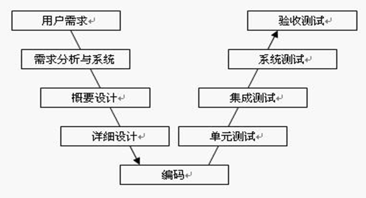
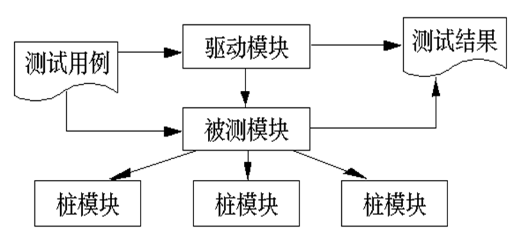

# 软件测试策略

## 软件测试策略概述

- 软件测试策略为软件开发人员、质量保证组织、和客户提供了一个路线图，规定了测试的主要步骤
- 测试策略必须和测试计划、测试用例设计、测试执行、还有测试结果数据的收集与分析结合在一起
- 测试策略还应当具备足够的灵活性，这样在必要的时候它能够有足够的可塑性来应付所有的大软件系统
- 测试策略还必须保证足够的严格，这样才能保证对项目的整个进程进行合理的计划和跟踪管理

### 软件测试的过程模型

#### 软件测试V模型

V 模型非常明确地标明了测试过程中存在的不同级别，并且清楚地描述了这些测试阶段和开发过程期间各阶段应关系：

1. 单元测试的主要目的是验证软件模块是否按详细设计的规格说明正确运行
2. 集成测试主要目的是检查多个模块间是否按概要设计说明的方式协同工作
3. 系统测试的主要目的是验证整个系统是否满足需求规格说明
4. 验收测试从用户的角度检查系统是否满足合同中定义的需求，以及以确认产品是否能符合业务上的需要

### 回归测试

问题：

- 在软件测试的各个阶段，在修正发现的软件缺陷或增加新功能时，变化的部分必须进行再测试
- 对软件修改可能引入新的软件缺陷以及其他问题

回归测试定义：有选择地重新测试系统或其组件，以验证对软件的修改没有导致不希望出现的影响，以及系统或组件仍然符合其指定的需求

回归测试可以在所有的测试级别执行，并应用于功能和非功能测试中

回归测试应该尽量采用自动化测试

范围

1. 缺陷再测试：重新运行所有发现故障的测试，而新的软件版本已经修正了这些故障
2. 功能改变的测试：测试所有修改或修正过的程序部分
3. 新功能测试：测试所有新集成的程序
4. 完全回归测试：测试整个系统

标准

- 只重复测试计划中的高优先级测试
- 功能测试中，忽略特定的变化
- 只针对特定配置进行测试
- 只针对特定子系统或测试级别进行测试

测试基本步骤

单元测试、集成测试和系统测试的步骤：

- 计划与准备阶段
  - 制定计划
  - 编写与评审测试用例
  - 编写测试脚本和准备测试环境
- 执行阶段
  - 搭建环境、构造测试数据
  - 执行测试并记录问题
  - 和开发人员一起确认问题
  - 撰写测试报告
- 返工与回归测试阶段

## 单元测试

单元测试又称模块测试，是**针对软件设计的最小单位 ─ 程序模块，进行正确性检验的测试工作**。其目的在于发现各模块内部可能存在的各种差错

单元测试需要**从程序的内部结构出发设计测试用例**。多个模块可以平行地独立进行单元测试

单元的内涵

单元测试的主要依据

### 进入和退出条件

进入条件：

- 被测代码编译链接通过
- 被测代码静态检查工具检查通过
- 已完成至少一轮代码检视或走读
- 单元测试用例的检视通过
- 单元测试代码写完并通过检测

退出条件：

- 所用测试用例执行通过
- 单元测试覆盖率达到预定要求
- 单元测试未被执行的代码进行正式审查

### 单元测试主要内容

- 模块接口
- 局部数据结构
- 独立路径
- 出错处理
- 边界条件

#### 模块接口测试

在单元测试的开始，应对**通过被测模块的数据流进行测试**。测试项目包括：

- 调用本模块的输入参数是否正确
- 本模块调用子模块时输入给子模块的参数是否正确
- 全局变量的定义在各模块中是否一致 

在做内外存交换时要考虑：

- 文件属性是否正确
- OPEN与CLOSE语句是否正确
- 缓冲区容量与记录长度是否匹配
- 读写操作之前是否打开了文件
- 结束文件处理时是否关闭了文件
- 正文书写／输入错误
- I/O错误是否检查并做了处理

#### 局部数据结构测试

- 不正确或不一致的数据类型说明
- 使用尚未赋值或尚未初始化的变量
- 错误的初始值或错误的缺省值
- 变量名拼写错或书写错
- 不一致的数据类型
- 全局数据对模块的影响

#### 路径测试

- 选择适当的测试用例，对模块中**重要的执行路径**进行测试
- 应当设计测试用例查找由于**错误的计算、不正确的比较**或**不正常的控制流**而导致的错误
- 对基本执行路径和循环进行测试可以发现大量的路径错误

#### 错误处理

- 出错的描述是否难以理解
- 出错的描述是否能够对错误定位
- 显示的错误与实际的错误是否相符
- 对错误条件的处理正确与否
- 在对错误进行处理之前，错误条件是否已经引起系统的干预等

#### 边界测试

- 注意数据流、控制流中刚好等于、大于或小于确定的比较值时出错的可能性。对这些地方要仔细地选择测试用例，认真加以测试
- 如果对模块运行时间有要求的话，还要专门进行关键路径测试，以确定最坏情况下和平均意义下影响模块运行时间的因素

### 测试用例设计

在单元测试时，测试者需要依据详细设计说明书和源程序清单，了解该模块的I/O条件和模块的逻辑结构

**主要采用白盒测试的测试用例，辅之以黑盒测试的测试**用例，使之对任何合理的输入和不合理的输入，都能鉴别和响应

### 单元测试的环境

模块并不是一个独立的程序，在考虑测试模块时，同时要考虑它和外界的联系，用一些辅助模块去模拟与被测模块相联系的其它模块

- 驱动模块 (driver)
- 桩模块 (stub) ── 存根模块

如果一个模块要完成多种功能，可以将这个模块看成由几个小程序组成。

必须对其中的每个小程序先进行单元测试要做的工作，**对关键模块还要做性能测试**

对支持某些标准规程的程序，更要着手进行**互联测试**。有人把这种情况特别称为模块测试，以区别单元测试

## 集成测试

**将软件集成起来后进行测试**。又称为子系统测试、组装测试、部件测试等

- 主要可以检查诸如两个模块单独运行正常，但集成起来运行可能出现问题的情况
- 一种范围很广的测试，当向下细化时，就成为单元测试

### 集成测试的主要方法

- 自顶向下的集成方法
- 自底向上的集成方法
- SMOKE方法

#### 自顶向下的集成方法

含义：

- 将模块**按系统程序结构，沿控制层次自顶向下进行集成**。从属于主控模块的按深度优先方式（纵向）或者广度优先方式（横向）集成到结构中去

优点

- 测试过程中较早地验证了主要的控制和判断点
- 选用按深度方向集成的方式，可以首先实现和验证一个完整的软件功能

缺点：桩的开发量较大

可分为：**广度优先方式和深度优先方式**

#### 自底向上的集成方法

含义

- 从软件结构最底层的模块开始，按照接口依赖关系逐层向上集成以进行测试

特点

- 由于是从最底层开始集成，对于一个给定层次的模块，它的子模块（包括子模块的所有下属模块）已经集成并测试完成，所以不再需要使用桩模块进行辅助测试。在模块的测试过程中需要从子模块得到的信息可以直接运行子模块得到

优点

- 每个底层模块都已经测试，不需要桩模块

缺点

- 每个模块都必须编写驱动模块
- 缺陷的隔离和定位不如自顶向下

##### 注意事项

- 在实际工作中，常常是综合使用自底向上和自顶向下的集成方法
- 例如，按进度选择优先测试已经完成的模块
  - 如果已完成的模块所调用的模块没有完成，就采用自顶向下的方法，打桩进行测试
  - 如果已经完成模块的上层模块没有完成，可以采用自底向上集成方式

#### SMOKE方法

含义

- 将已经转换为代码的软件构件集成为构造（build）。一个构造包括所有的数据文件、库、可复用的模块以及实现一个或多个产品功能所需的工程化构件

设计一系列测试

- 暴露影响构造正确地完成其功能的错误
- 发现极有可能造成项目延迟的业务阻塞（show stopper）错误

集成方法可以是自顶向下，也可以自底向上

#### 集成测试用例的设计

- 通过性测试设计用例
  - 用来验证需求和设计是否得到满足、软件功能是否得到实现
  - 可以考虑等价类分法、场景分析法、状态图法等
- 失效性测试设计用例
  - 主要以已知的缺陷空间为依据设计测试用例
  - 可以考虑边界值法、错误猜测法、因果图法和状态图法等
- 集成测试的覆盖率
  - 接口覆盖率
  - 接口路径覆盖率

注意**接口有显性和隐性**之分。函数调用（API）接口属于显性接口，而消息、网络协议等都属于隐性接口。

## 系统测试

含义

- 从**用户使用的角度**来进行的测试，主要工作是将完成了集成测试的系统放在真实的运行环境下进行测试，用于功能确认和验证

系统测试基本上使用**黑盒测试**方法

系统测试的依据主要是软件需求规格说明

### 系统测试意义

系统测试在软件开发过程中属于必不可少的一环，是软件质量保证的最重要环节

- 从测试的内容上看
  - 系统测试针对的是外部输入层的测试空间，如果不进行系统测试，那么外部输入层向接口层转换的代码就没有得到测试。此外，许多功能是系统所有组件相互协调中得到的，只能在系统测试级别进行观察和测试
- 从测试的角度上看
  - 在单元测试和集成测试阶段，测试针对的是各级技术规格说明，即从软件开发者的技术观点的角度考虑的。而系统测试是从客户的观点来考虑系统是否完全正确地满足了需求

### 系统测试的主要内容

- 功能性测试
- 性能测试
- 压力测试
- 恢复测试
- 安全测试
- 其他的系统测试还包括配置测试、兼容性测试、本地化测试、文档测试、易用性测试等

#### 功能测试

含义：在规定的一段时间内运行软件系统的所有功能，以验证这个软件系统有无严重错误

#### 可靠性测试

如果系统需求说明书中有对可靠性的要求，则需进行可靠性测试

1.  平均失效间隔时间 MTBF (Mean Time Between Failures) 是否超过规定时限?
2.  因故障而停机的时间 MTTR (Mean Time To Repairs) 在一年中应不超过多少时间

#### 强度测试

含义

检查在系统运行环境不正常乃至发生故障的情况下，系统可以运行到何种程度的测试。

例子

- 把输入数据速率提高一个数量级，确定输入功能将如何响应
- 设计需要占用最大存储量或其它资源的测试用例进行测试
- 设计出在虚拟存储管理机制中引起“颠簸”的测试用例进行测试
- 设计出会对磁盘常驻内存的数据过度访问的测试用例进行测试

强度测试的一个**变种是敏感性测试**

在程序有效数据界限内一个小范围内的一组数据可能引起极端的或不平稳的错误处理出现，或者导致极度的性能下降的情况发生。此测试用以发现可能引起这种不稳定性或不正常处理的某些数据组合

#### 性能测试

含义

检查系统是否满足在需求说明书中规定的性能。特别是对于实时系统或嵌入式系统

性能测试常常需要与强度测试结合起来进行，并常常要求同时进行硬件和软件检测

对软件性能的检测表现:

响应时间、吞吐量、辅助存储区，例如缓冲区，工作区的大小等、处理精度，等等

#### 恢复测试

目的

- 证实在克服硬件故障(包括掉电、硬件或网络出错等)后，系统能否正常地继续进行工作，并不对系统造成任何损害

可采用人工干预手段，模拟硬件故障，故意造成软件出错。并由此检查：

- 错误探测功能──系统能否发现硬件失效与故障
- 能否切换或启动备用的硬件
- 在故障发生时能否保护正在运行的作业和系统状态
- 在系统恢复后能否从最后记录下来的无错误状态开始继续执行作业，等等
- 掉电测试：其目的是测试软件系统在发生电源中断时能否保护当时的状态且不毁坏数据，然后在电源恢复时从保留的断点处重新进行操作

#### 驱动/停止测试

目的

 验证在机器启动及关机阶段，软件系统正确处理的能力

包括

 反复启动软件系统 (例如，操作系统自举、网络的启动、应用程序的调用等)

 在尽可能多的情况下关机

#### 配置测试

目的

检查计算机系统内各个设备或各种资源之间的相互联结和功能分配中的错误

包括类型：

**配置命令测试**：验证全部配置命令的可操作性（有效性）；特别对最大配置和最小配置要进行测试。软件配置和硬件配置都要测试

**循环配置测试**：证明对每个设备物理与逻辑的，逻辑与功能的每次循环置换配置都能正常工作

**修复测试**：检查每种配置状态及哪个设备是坏的。并用自动的或手工的方式进行配置状态间的转换

#### 安全性测试

目的

- 检验在系统中已经存在的系统安全性、保密性措施是否发挥作用，有无漏洞
- 破坏保护机构进入系统的主要方法有以下几种：
-  正面攻击或从侧面、背面攻击系统中易受损坏的那些部分
-  以系统输入为突破口，利用输入的容错性进行正面攻击
- 申请和占用过多的资源压垮系统，以破坏安全措施，从而进入系统
-  故意使系统出错，利用系统恢复的过程，窃取用户口令及其它有用的信息
-  通过浏览残留在计算机各种资源中的垃圾（无用信息），以获取如口令，安全码，译码关键字等信息
-  浏览全局数据，期望从中找到进入系统的关键字
-  浏览那些逻辑上不存在，但物理上还存在的各种记录和资料等

## 验收测试

时间

通过了系统的有效性测试及软件配置审查之后，就应开始系统的验收测试

人员

- 以用户为主的测试。软件开发人员和QA（质量保证）人员也应参加
- 由用户参加设计测试用例，使用生产中的实际数据进行测试

在测试过程中，除了考虑软件的功能和性能外，还应对软件的可移植性、兼容性、可维护性、错误的恢复功能等进行确认

确认测试应交付的文档有：

- 确认测试分析报告
- 最终的用户手册和操作手册
- 项目开发总结报告

### 主要形式

- 根据合同进行的验收测试
- 用户验收测试
- 现场测试

### α测试和β测试

在软件交付使用之后，用户将如何实际使用程序，对于开发者来说是无法预测的

#### α测试

含义

由**一个用户在开发环境**下进行的测试，也可以是公司内部的用户在**模拟实际操作环境**下进行的测试

目的

评价软件产品的FLURPS（即功能、局域化、可使用性、可靠性、性能和支持）。尤其注重产品的界面和特色

时间

可以从软件产品**编码结束**之时开始，或在**模块（子系统）测试完成**之后开始，也可以在**确认测试**过程中产品达到一定的稳定和可靠程度之后再开始

#### β测试

含义

由软件的**多个用户在实际使用环境**下进行的测试。这些用户返回有关错误信息给开发者

测试时，开发者通常不在测试现场。因而，β测试是在开发者无法控制的环境下进行的软件现场应用

在β测试中，由**用户记下**遇到的所有问题，包括**真实的以及主观认定的**，定期向开发者报告

目的

主要衡量产品的FLURPS。着重于产品的支持性，包括文档、客户培训和支持产品生产能力

时间

只有当α测试达到一定的可靠程度时，才能开始β测试。它处在整个测试的最后阶段。同时，产品的所有手册文本也应该在此阶段完全定稿

## 测试停止的标准

软件测试的基本原则之一就是软件是无法完全测试的。那么，如何衡量是否已经进行了充分的测试，可以停止测试了呢？

使用概率论模型和软件可靠性理论，可以建立软件故障作为执行时间的函数的(在测试过程中发现的错误)模型

对数泊松执行时间模型的软件故障模型
$$
\mu(t)=\frac{1}{\theta} \ln(\lambda_0 \theta t + 1)\\
\mu(t)是在测试时间t后，预期的故障累积数目\\
\lambda_0是测试开始时初始软件故障的密度\\
\theta值决定了随着软件修正进程，故障密度随呈指数递减的情况
$$
求导可以得到瞬时的故障密度
$$
\lambda (t)=\frac{\lambda_0}{\lambda_0 \theta t + 1}
$$
如果在测试过程中实际收集的数据和对数泊松执行时间模型计算出的数据能够基本接近的话，那么可以用这个模型来预测为了达到一个可以接收的低故障密度，整个测试过程所需要的时间。

## 软件测试的组织

测试团队的组建

各测试阶段中采用的模式

测试中的人员及其承担的任务

- 测试经理
- 测试设计人员
- 测试自动化人员
- 测试管理员
- 测试人员

## 小结

测试的通用V 模型定义了测试的基本级别：单元测试、集成测试、系统测试和验收测试

单元测试检查单一的软件组件。集成测试检查这些组件的协调。系统测试从用户角度检查整个系统。在验收测试时，客户采用根据合同进行的验收测试、操作验收测试和用户验收测试来检查产品

在测试的各个级别中，在修改程序后，都要执行回归测试

测试有多种类型：功能测试、性能测试、压力测试、恢复测试和安全测试等

由于软件测试不可能发现所有的软件缺陷，因此可以用对数泊松执行时间模型估计测试终止的时间

要保证测试工作的顺利进行，需要对测试进行有效组织，要尽量避免由开发人员测试自己的代码