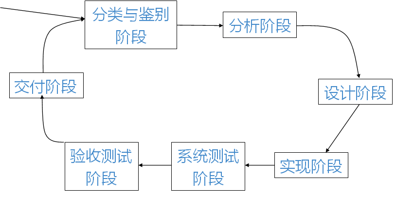
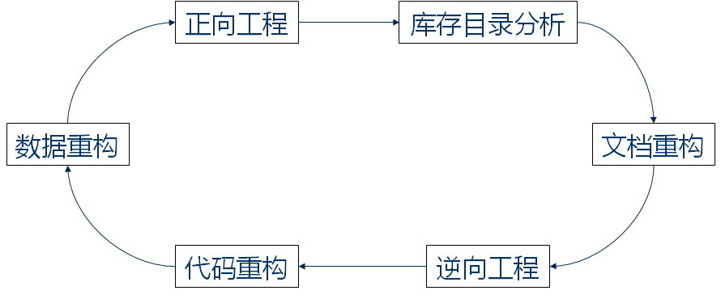
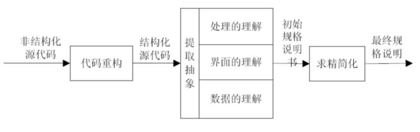

# 软件维护

## 软件维护概述

### 软件维护的基本概念

定义：**软件维护是指由于软件产品出现问题或需要改进而对代码及相关文档的修改，其目的是对现有软件产品进行修改的同时保持其完整性**

软件维护必要性

- 改正错误
- 改善设计
- 实现软件的改进（Implement enhancements）
- 与其他系统进行交互
- 为使用不同的硬件、软件、系统的新性能以及通讯设备等而对软件进行改进
- 完成遗留程序的移植
- 软件退出使用

### 软件维护的基本类型

维护的类型有四种：

- 纠错性维护
- 适应性维护
- 完善性维护
- 预防性维护

#### 纠错性维护

原因

在软件交付使用后，因开发时测试的不彻底、不完全，必然会有部分隐藏的错误遗留到运行阶段

这些隐藏下来的错误在某些特定的使用环境下就会暴露出来

含义

为了识别和纠正软件错误、改正软件性能上的缺陷、排除实施中的误使用，应当进行的诊断和改正错误的过程就叫做改正性维护

#### 适应性维护

原因

在使用过程中， 外部环境（新的硬、软件配置）， 数据环境（数据库、数据格式、数据输入/输出方式、数据存储介质）可能发生变化

定义

为使软件适应这种变化，而去修改软件的过程就叫做适应性维护

#### 完善性维护

原因

在软件的使用过程中，用户往往会对软件提出新的功能与性能要求

定义

为了满足这些要求，需要修改或再开发软件，以扩充软件功能、增强软件性能、改进加工效率、提高软件的可维护性，这种情况下进行的维护活动叫做完善性维护

特点

完善性维护不一定是救火式的紧急维修，而可以是有计划、有准备的一种再开发活动

#### 预防性维护

目的

预防性维护是为了提高软件的可维护性、可靠性等，为以后进一步改进软件打下良好基础

定义

采用先进的软件工程方法对需要维护的软件或软件中的某一部分（重新）进行设计、编制和测试

在整个软件维护阶段所花费的全部工作量中，**完善性维护占了几乎一半的工作量**

### 维护的困难性

1. 配置管理工作不到位
2. 人员变动造成的影响
3. 许多软件的可读性差
4. 任务紧、时间急的情况下处理维护请求

## 应注意问题

### 技术方面

- 程序的理解
- 测试
- 影响分析
- 可维护性

#### 影响分析的目标

决定改变的范围。这对合理计划和完成工作有重要意义

对完成工作所需的资源进行精确的估计

分析改变的费用/效益比

由于对软件进行变更往往是牵一发而动全身的，因此如果给出了一个变更，必须考虑到与之相关的其他复杂情况

#### 决定软件可维护性的主要因素

- 可理解性
- 可测试性
- 可修改性
- 可移植性
- 可重用性

影响软件可维护性的维护环境的因素

- 软件维护的文档
- 软件的运行环境
- 软件的维护组织
- 软件维护质量

### 管理方面

- 契合组织的目标
- 人力资源
- 过程
- 如何组织维护活动
- 外包

## 软件维护过程模型

1. 分类与鉴别阶段
2. 分析阶段
3. 设计阶段
4. 实现阶段
5. 系统测试阶段
6. 验收测试阶段
7. 交付阶段

## 软件维护技术

- 程序的理解
- 软件再工程
- 软件逆向工程

### 程序的理解

清晰简明的文档

代码浏览工具（Source Insight）

程序理解的任务：以软件维护、升级和再工程为目的，在不同的抽象级别上建立基本软件的概念模型，包括从代码本身的模型到基本应用领域的模型，即建立从问题/应用域到程序设计/实现域的映射集

具体任务

- 通过检查单个的程序设计结构，程序被表示成抽象语法树、符号表或普通源文本
- 尽量做到程序隐含信息的显性表示及程序内部关系的可视化
- 从源代码中提取信息，并存放在通用的数据库中，然后通过查询语言对数据库进行查询
- 检查程序构造过程中的结构关系，明确表示程序组成部分之间的依赖关系
- 识别程序的高层概念，如标准算法、数据结构、语法及语义匹配等

### 软件再工程（Re-engineering）

:star2:现有软件进行仔细审查和改造，进行重新构造，成为新的形式，和对新形式的实现

- 库存目录分析
- 文档重构
- 逆向工程
- 代码重构
- 数据重构
- 正向工程

#### 库存目录分析

对软件组织用语的每个应用系统都进行预防性维护是不现实的，也是不必要的。一般说来，下述3类程序有可能成为预防性的对象：

- 该程序将在今后数年内继续维护的对象
- 当前正在成功地使用着该程序
- 可能在最近的将来要对该程序做较大程度的修改或扩充

#### 文档重构

老程序固有的特点缺乏文档，根据具体情况可采用下述3种方法之一来处理这个问题：

- 如果一个程序是相对稳定的，正在走向生命的终点，而且可能不会再修改它，则不必为它建立文档
- 为了便于今后的维护，必须更新文档，但是由于资源有限，应该采用“使用时建立文档”的方法，也就是说，不是一下子把某应用系统的文档全部都重建起来，而是只建立系统中当前正在修改的那些部分的完整文档
- 如果某应用系统是用户完成业务工作的关键，而且必须重构全部文档，则仍然应该尽量把文档工作减少到必需的最小量

#### 逆向工程

软件的逆向工程是，分析程序以便在比源程序更高的抽象层次上创建出程序的某种描述的过程，也就是说，逆向工程是一个恢复设计结果的过程

#### 代码重构

某些老程序的体系结构比较合理，但是，一些模块的编码方式却是**难于理解、测试和维护**的

在这种情况下，可以重构这些模块的代码

通常，代码重构并不修改程序的体系结构，它只关注个体模块的设计细节以及在模块中定义的局部数据结构

如果重构扩展到模块边界之外并涉及软件体系结构，则重构变成了正向工程

#### 数据重构

对数据体系结构差的程序很难进行适应性和完善性维护，因此，数据体系结构比源代码对程序的长期生存力有更大的影响

数据重构是一种全范围的再工程活动

由于数据结构对程序体系结构及程序中的算法有很大影响，对数据的修改必然会导致程序体系结构或代码层的改变

#### 正向工程

正向工程也称为革新或改造

正向工程过程应用现代软件工程的概念、原理、技术和方法，重新开发现有的某些应用系统

在大多数情况下，经过正向工程过程后的出的软件，不仅重新实现了现有系统的功能，而且增加了新功能，提高了整体性能

### 软件逆向工程（Software Reverse Engineering）

:star2:**分析目标系统，识别系统的构件及其交互关系，并且通过高层抽象或其他形式来展现目标系统的过程**

对逆向工程而言，抽象的层次、完备性、工具与分析人员协同工作的程度、过程的方向性等因素是需要考虑的

- 数据的逆向工程
- 处理的逆向工程
- 用户界面的逆向工程
- 逆向工程的工具

#### 数据的逆向工程

数据的逆向工程发生在不同的抽象层次

- 内部数据结构的逆向工程
- 数据库结构的逆向工程

对新数据模型实施再工程

- 构造一个初始的对象模型
- 确定候选键
- 精化实验性的类
- 定义一般化关系
- 找出关联关系

#### 处理的逆向工程

为了理解过程抽象，需要在不同的抽象级别（系统级、程序级、构件级、模式级和语句级）分析代码

对大型系统，通常用半自动方法完成逆向工程。

使用自动化工具帮助软件工程师理解现有代码的语义，然后将该过程的结果传递给重构和正向工程工具以完成再工程过程

#### 用户界面的逆向工程

弄清几个问题：

- 界面必须处理的基本动作是什么？
- 系统对这些动作的行为反应的简要描述是什么？
- 有哪些界面的等价概念是相关的？

#### 逆向工程的工具

静态模型逆向工具

- Rational Rose
- Rigi
- JBPAS

动态模型逆向工具

- SCED
- ISVis
- Borland Together

## 小结

- 软件维护可以分为纠错性维护、适应性维护、完善性维护、预防性维护
- 软件维护实践中经常会遇到各种困难，需要在技术、管理方面进行考虑，并对维护费用进行估算
- 软件维护按IEEE 维护过程模型可以分为七个阶段。
  - 分类与鉴别阶段
  - 分析阶段
  - 设计阶段
  - 实现阶段
  - 系统测试阶段
  - 验收测试阶段
  - 交付阶段
- 程序的理解对软件维护具有重要意义，程序理解的任务就是要揭示程序的功能与实现机制
- 软件的再工程是对现有软件进行仔细审查和改造，进行重新构造，最终成为一个新的形式。六种活动构成了再工程的循环模型
  - 库存目录分析
  - 文档重构
  - 逆向工程
  - 代码重构
  - 数据重构
  - 正向工程
- 软件逆向工程包括数据逆向工程、处理逆向工程和用户界面逆向工程