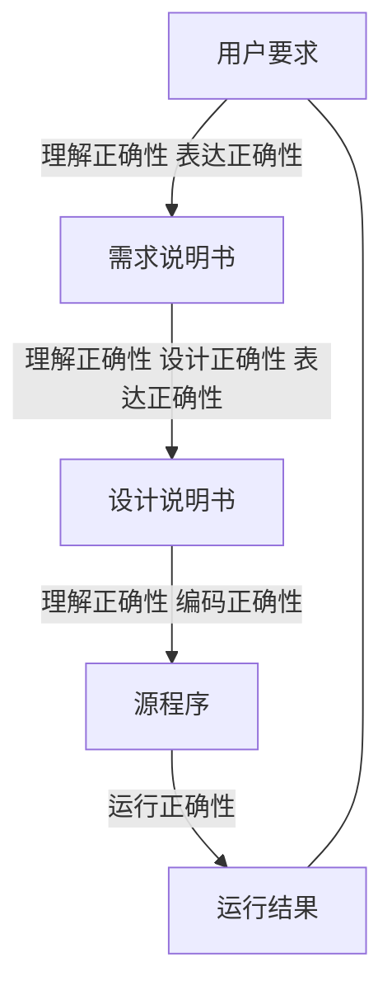

# 课程介绍

## 课程计划和考试安排

学时：讲授32 实验16

闭卷考试

工程实验分组，4次

## 教材

软件工程：共同演进

## 主要内容

职业化，规范化的软件开发

- Engineering object
  - Usability
  - Correctness
  - Economical
- Engineering principle
  - Adopt right development paradigm
  - Use good design method
  - Provide high quality engineering support
  - Fulfil effective engineering management
- Activity
  - Requirement
  - Design
  - Implementation
  - Verification
  - Maintenance

软件工程过程

### 软件工程知识体系

需求，设计，构建，测试，维护，质量

配置管理，工程管理，过程，工具