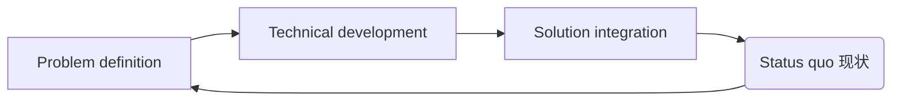
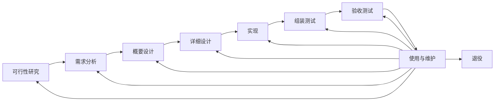
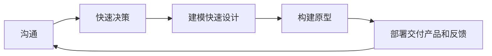
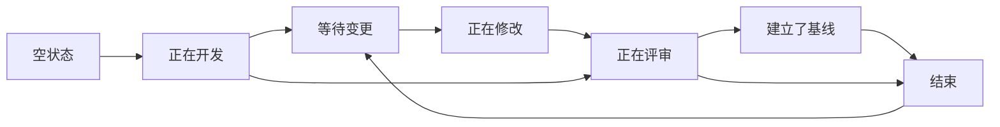
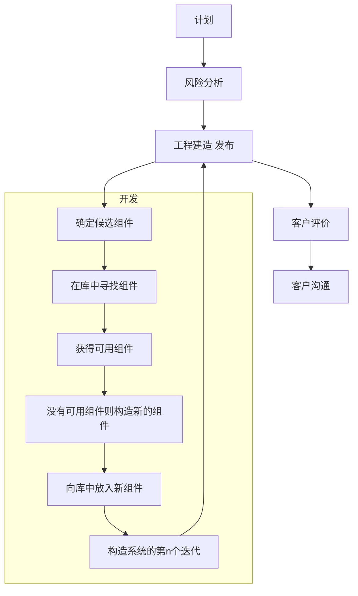
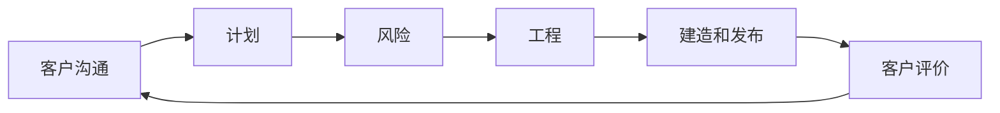

# 软件过程模型

- 软件质量是软件工程的焦点，软件过程是为开发高质量软件所需完成任务的框架，是软件质量的保证
- 软件工程是有创造力、有知识的人在定义好的、成熟的软件过程框架中进行的创造性工作

过程：产生某种预定输出的一系列可预测的步骤，包括一组活动、约束和资源要素

软件过程：

- 开发和维护软件及其相关产品所涉及的一系列活动
- 过程是活动的集合
- 活动是任务的集合
- 任务是将输入转换成输出的操作

## 基本软件过程



基本过程：是构建高质量软件所需完成**任务的框架**，规定了完成各项**任务的工作步骤**

沟通，计划，建模，结构，部署

- 沟通：包括软件设计者与客户沟通，客户提出要求，软件设计者收集材料，以及其它相关活动
- 计划：软件开发小组讨论使用何种方法及何种工具来实现客户需求
- 建模：软件开发小组讨论选择何种模型来满足需求。不同的需求需要不同的模型
- 构造：编码和测试
- 部署：软件交付给客户。客户给出建议和反馈，软件实施小组改进软件

过程性质

- 时间性
- 并发性
- 嵌套性
- 度量性

### 软件过程管理

软件生命周期：方法论和体系结构

软件过程定义：具体工作的输入输出

软件过程执行，软件产品与过程工作度量，软件过程控制

软件过程评估和改进：过程与工具

### 软件过程成熟度模型CMM

软件过程成熟度：显示地定义、管理、度量、控制和执行的程度

作用：软件过程制度化，基础设施和公司文化

不成熟标志

- 缺乏确定的软件过程及相应的管理和控制
- 有软件过程但不严格遵循和强制执行
- 管理被动，采用救火式策略：出了问题才解决、只顾眼前不管长远

CMM: Capability Maturity Model 软件行业标准模型

基本原理：软件组织过程能力成熟度分5个等级，定义了一组过程能力目标

主要作用：按计划、高效率、低成本提交有质量标志的软件

成熟度模型标准CMMI

1. 初始级：有能力的人
2. 可重复级：基本项目管理
3. 已定义级：过程标准化
4. 量化管理级：量化管理
5. 优化级：持续的过程改进

## 软件过程模型

结构架构，软件开发模型，软件生存周期模型，软件工程范型

可行性研究，需求分析，概要设计，详细设计，实现，组装测试，验收测试，使用与维护，退役

### 基本软件过程

#### 需求分析

含义：解决现实世界某个问题的软件产品及其约束的描述

内容：做什么软件

任务与输出：编制软件需求说明书或初步的系统用户手册

作用：使不同人员准确理解客户需求

- 随着认识的深入，需求是不断变化的
- 需求的理解需要迭代进行，需要管理修改变更

#### 软件设计

含义

- 最核心内容，设计是过程，是过程的结果
- 将需求转换为可以实现的技术方案
- 做软件，达到规定程度
- 编制软件设计说明书

任务

- 概要设计：总体色剂，各项需求转换成软件体系结构，每个模块都与需求对应
- 详细设计：对每个模块要完成的工作进行具体描述，为源程序编写打基础

相关内容

- 结构化分析与设计
- 面向对象分析与设计
- 软件体系结构
- 软件设计模型

#### 软件编码

含义

- 将软件设计转换成结构良好、清晰易读，且与设计相一致的计算机可以运行的程序代码
- 即用某种特定程序设计语言表示的“源程序清单”
- 提交“源程序”与“可执行程序模块”

#### 软件测试

含义

- 是软件生命周期的重要组成部分
- 通过测试来判断一个软件是否满足规定的功能和性能要求，发现软件所存在的问题，避免出现缺陷导致事故
- 产生软件评测报告

任务

- 单元测试：检测各模块在功能和结构上存在的问题并加以纠正
- 组装测试：将已测试通过的模块按一定顺序组装起来，按规定的各项需求，逐项进行有效性测试，决定已开发的软件是否合格，能否交付给用户使用

#### 软件运行与维护

需要改正软件运行过程中发现的缺陷、提高软件性能或其他属性、使软件产品适应新的环境

- 改正性维护：运行中发现了软件中的错误需要修正
- 适应性维护：为了适应新的软件工作环境而做适当的变更
- 完善性维护：为了增强软件的功能而做的变更

### 瀑布模型Waterfall Model

软件生命周期：软件产品或软件系统从设计、投入使用到被淘汰的全过程

软件开发过程与软件生命周期是一致的，以文档为驱动，自上而下

顺序性，依赖性，推迟实现，每个阶段必须完成规定文档



线性过程太理想化

> 瀑布模型适用于系统需求明确、技术成熟、工程管理较严格的场合

- 瀑布模型不够灵活。在下一阶段开始之前，当前阶段的结果需要固定下来，这个条件非常严格。
- 瀑布模型整体性太强。开发计划是面向单一交付日期制定的，在分析阶段出现的任何错误，都只能在软件交付给用户后才能发现。若没有正确理解用户需求，或者在设计、编码和测试阶段需求发生改变，则瀑布模型将导致软件产品的不合格。
- 瀑布模型是严格的文档驱动的，比较繁琐。

瀑布模型的优点

- 过程透明性高，过程可管理性高
- 推迟实现
- 每个阶段都有文档，并且它能较好地与其它过程模型相结合。

缺点

- 灵活性差
- 风险控制能力弱
- 过多文档增加工作量

将项目分割成了不同的阶段，在软件开发的早期就需要投入大量的成本，使得它难以应对客户需求的变更。

### 演化过程模型

需求难一次获得，难一次开发成功

基本思想：多次迭代，实验性原型产品，探索可行性，后期优化完善得到满意的产品

在使用演化模型开发系统时，有两种途径。

- 原型，原型系统适用于开发者对需求知之甚少的情况
- 软件设计者和用户一起工作以更好地了解用户需求。在该模型中，系统可以逐渐优化并增加一些新功能。

#### 原型模型

完整而准确的需求规格说明事实上很难做到，需求、技术

含义：模拟开发系统的原始模型，是软件早期一个可运行版本，反映了最终系统的重要特性。是一种基于进行用户开发的模型

适用情况

> 客户定义一个总体目标集，但是他们并不清楚系统的具体输入输出；或开发者不确定算法的效率、软件与操作系统是否兼容以及客户与计算机交互的方式。此时，原型法是很好的选择



缺点:

1. 设计者在质量和原型间有所折中
2. 客户意识不到一些**质量问题**

使用策略：废弃，追加

优点

- 强调用户参与和决策，强化了用户与开发人员的沟通
- 可加快需求的确定，能够处理需求的不确定性和风险
- 简化了项目管理、缩短了开发时间、降低了风险和开发成本

缺点

- 不适用于开发大型系统
- 软件可维护性差
- 用户合作要求高，如果合作不好，反而会拖延开发进度

#### 并行开发模型

含义

指软件开发主要技术活动和任务的并行性

作用

缩短软件开发周期，提高软件开发速度

并发模型可以表示为一系列技术活动、任务和它们的相关状态。该模型通过补充以下任务来实现系统：原型实现，分析模型，需求规则和设计



- 不是一种独立的完整开发过程
- 适用于所有的软件开发
- 具有更强的包容性、综合性和灵活性

核心思想：通过评审建立基准/基线

#### 基于构建的模型

面向对象类和类的继承的重用

系统体系结构、框架、设计模式只实现部分软件重用

分析设计类等多层次上的重用

- 需求：与其它模型相同，这里不再赘述
- 组件分析：根据需求规格搜索可满足该需求的组件。通常情况下，没有完全匹配的情况，因而组件通常需要加以修改
- 系统设计：与其它模型的系统设计有所不同，因为该模型是基于重用的。设计者必须考虑到重用的概念，但遗憾的是，如果没有可重用的组件，还要设计新的软件
- 开发和集成：在这个阶段，组件集成到系统中



优点

- 充分利用软件复用，提高了软件开发的效率
- 允许多个项目同时开发，降低成本，提高了可维护性，可实现分步提交软件产品。

缺点

- 缺乏通用的构件组装结构标准，风险较大；
- 构件可重用和系统高效性之间不易协调；
- 过分依赖构件会导致产品质量受构件质量影响

### 增量过程模型

非整体开发的模型、进化式的开发过程，允许从**部分需求**定义出发

#### 增量模型

增量模型结合了原型模型的基本要素和迭代的特征，采用了基于时间的线性序列，每个线性序列都会输出该软件的一个“增量”

```mermaid
stateDiagram
    state 增量1 {
        分析 --> 设计
        设计 --> 编码
        编码 --> 测试
    }
    增量1 --> 增量2
    state 增量2 {
        分析 --> 设计
        设计 --> 编码
        编码 --> 测试
    }
    增量2 --> 增量3
    state 增量3 {
        分析 --> 设计
        设计 --> 编码
        编码 --> 测试
    }
    增量3 --> 最终产品交付
```

增量：小而可用的软件

特点

- 在前面增量的基础上开发后面的增量
- 每个增量的开发可用瀑布或快速原型模型
- 迭代的思路

优点

- 引入增量包概念，不需要提供完整的需求。只要有一个增量包出现，开发就可以进行
- 在项目的初始阶段不需要投入太多的人力资源
- 增量可以有效地管理技术风险，降低系统失败风险
- 有利于增加客户信心，提高系统可靠性、可维护性和稳定性

缺点

- 增量粒度难以选择：每个增量必须提供一些系统功能，这使得开发者很难根据客户需求给出大小适合的增量
- 确定所有的基本业务比较困难

#### RAD模式

快速应用开发模型（RAD）是一个增量过程模型，强调短暂的开发周期。RAD模型是瀑布模型的“高速”变体，通过基于组件的构建方法实现快速开发。如果需求以及项目范围得到明确界定，RAD能使开发团队在很短的时间内（如60到90天）建立一个“全功能系统”

RAD模型主要用于信息系统软件的开发，包括以下几个阶段：业务建模：

业务活动中的信息流被模型化，以回答如下问题：

1. 什么信息驱动业务流程？
2. 生成什么信息？
3. 谁生成该信息？
4. 该信息流往何处？
5. 谁处理它？

数据建模：在本阶段，业务建模阶段定义的一部分信息流被精细化，形成一组支持该业务所需的数据对象。标识出每个对象的特征(称为属性)，并定义这些对象间的关系

过程建模：在本阶段，数据建模阶段定义的数据对象变换成为要完成一个业务功能所需的信息流。  

RAD模型也有它的不足之处：

1. 对大型项目而言，RAD需要足够的人力资源。
2. 开发者和客户都要实现承诺，否则将导致失败。
3. 并非所有系统都适合（不能合理模块化的系统、高性能需求并且要调整构件接口的、技术风险很高的系统均不适合）。

#### 螺旋模型

适用场合：支持需求不明确、特别是大型软件系统的开发，并支持面向规格说明、面向过程、面向对象等多种软件开发方法，是一种具有广阔前景的模型

螺旋模型的优点如下：9)强调可选方案和限制条件，以支持现有解决方案的重用。10)维护和开发一样，是螺旋模型的一个阶段。11)评估（预算和进度）更加准确，因为重要问题能及早发现。12)更能应对开发过程中出现的各种变化。13)软件工程师可以提前开始项目工作。



螺旋模型也有其缺点：

- 仅适用于内部（一个公司内部）项目，因为开发过程中要进行风险评估，该模型不能用于合同性的软件开发。
- 螺旋模型是风险驱动的，因此它需要经验丰富的员工。
- 只适用于大型软件的开发。如果风险分析占用了整个项目成本的主要部分，则使用该模型没有任何意义。

### 其他过程模型

### 敏捷过程

敏捷软件过程：基本原理和开发准则的结合

- 强调客户满意度和较早的软件增量交付
- 小但有激情的团队
- 非正式的方法
- 最小的软件工程产品
- 简化整体开发
- 开发准则强调分析和设计的交付，以及开发者和客户之间积极持续的交流

目前的敏捷过程模型主要包括

极限编程（XP），自适应软件开发（ASD），动态系统开发方法（DSDM）等

**缺点**

本身不是完整的方法论，是对生命周期过程的补充。在应用传统的过程方法时，可以借鉴敏捷过程的指导思想

**敏捷模型的价值观**

- 个人和交互胜过过程和工具
- 实用的软件胜过面面俱到的文档
- 客户合作胜过合同谈判
- 响应变化胜过遵循计划

## 过程和产品的关系

过程为中心