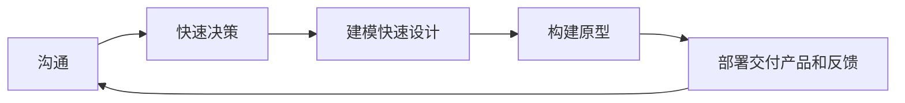
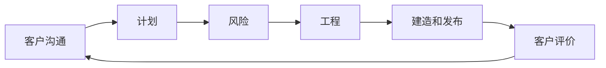

# 软件过程模型

有组织的和一致的，不同的人使用同一过程

一致性不排斥灵活性

被检查、理解、控制和改进

传授经验

## 基本软件过程

沟通，计划，建模，结构，部署

软件过程管理

软件生命周期：方法论和体系结构

软件过程定义：具体工作的输入输出

软件过程执行，软件产品与过程工作度量，软件过程控制

软件过程评估和改进

### 软件过程成熟度模型CMM

定义、管理、度量、控制和执行的程度

软件过程制度化，基础设施和公司文化

软件行业标准模型

基本原理：软件组织过程能力成熟度分5个等级，定义了一组过程能力目标

主要作用：按计划、高效率、低成本

1. 初始级：有能力的人
2. 可重复级：基本项目管理
3. 已定义级：过程标准化
4. 量化管理级：量化管理
5. 优化级：持续的过程改进

结构架构，软件开发模型，软件生存周期模型，软件工程范型

可行性研究，需求分析，概要设计，详细设计，实现，组装测试，验收测试，使用与维护，退役

基本软件过程：需求分析

含义：解决现实世界某个问题的软件产品及其约束的描述

内容：做什么软件

任务与输出：编制软件需求说明书或初步的系统用户手册

软件设计

含义：最核心内容，将需求转换为可以实现的技术方案

### 瀑布模型Waterfall Model

以文档为驱动，自上而下

顺序性，依赖性，推迟实现，每个阶段必须完成规定文档

- 瀑布模型不够灵活。在下一阶段开始之前，当前阶段的结果需要固定下来，这个条件非常严格。
- 瀑布模型整体性太强。开发计划是面向单一交付日期制定的，在分析阶段出现的任何错误，都只能在软件交付给用户后才能发现。若没有正确理解用户需求，或者在设计、编码和测试阶段需求发生改变，则瀑布模型将导致软件产品的不合格。
- 瀑布模型是严格的文档驱动的，比较繁琐。

瀑布模型的优点是它的每个阶段都有文档，并且它能较好地与其它过程模型相结合。它的主要问题是它将项目分割成了不同的阶段，在软件开发的早期就需要投入大量的成本，使得它难以应对客户需求的变更。

### 演化模型

需求难一次获得

多次迭代，实验性原型产品，探索可行性，后期优化完善得到满意的产品

在使用演化模型开发系统时，有两种途径。

- 原型，原型系统适用于开发者对需求知之甚少的情况
- 软件设计者和用户一起工作以更好地了解用户需求。在该模型中，系统可以逐渐优化并增加一些新功能。

并发模型

#### 原型模型

完整而准确的需求规格说明事实上很难做到，需求、技术

含义：模拟开发系统的原始模型，是软件早期一个可运行版本，反映了最终系统的重要特性。是一种基于进行用户开发的模型



#### 并行开发模型

并发模型可以表示为一系列技术活动、任务和它们的相关状态。该模型通过补充以下任务来实现系统：原型实现，分析模型，需求规则和设计

### 基于构建的模型

面向对象类和类的继承的重用

系统体系结构、框架、设计模式只实现部分软件重用

分析设计类等多层次上的重用

- 需求：与其它模型相同，这里不再赘述
- 组件分析：根据需求规格搜索可满足该需求的组件。通常情况下，没有完全匹配的情况，因而组件通常需要加以修改
- 系统设计：与其它模型的系统设计有所不同，因为该模型是基于重用的。设计者必须考虑到重用的概念，但遗憾的是，如果没有可重用的组件，还要设计新的软件
- 开发和集成：在这个阶段，组件集成到系统中。

### 增量过程模型

#### 增量模型

增量模型结合了原型模型的基本要素和迭代的特征，采用了基于时间的线性序列，每个线性序列都会输出该软件的一个“增量”

```mermaid
stateDiagram
    state 增量1 {
        分析 --> 设计
        设计 --> 编码
        编码 --> 测试
    }
    增量1 --> 增量2
    state 增量2 {
        分析 --> 设计
        设计 --> 编码
        编码 --> 测试
    }
    增量2 --> 增量3
    state 增量3 {
        分析 --> 设计
        设计 --> 编码
        编码 --> 测试
    }
    增量3 --> 最终产品交付
```

#### RAD模式

快速应用开发模型（RAD）是一个增量过程模型，强调短暂的开发周期。RAD模型是瀑布模型的“高速”变体，通过基于组件的构建方法实现快速开发。如果需求以及项目范围得到明确界定，RAD能使开发团队在很短的时间内（如60到90天）建立一个“全功能系统”

RAD模型主要用于信息系统软件的开发，包括以下几个阶段：业务建模：

业务活动中的信息流被模型化，以回答如下问题：

1. 什么信息驱动业务流程？
2. 生成什么信息？
3. 谁生成该信息？
4. 该信息流往何处？
5. 谁处理它？

数据建模：在本阶段，业务建模阶段定义的一部分信息流被精细化，形成一组支持该业务所需的数据对象。标识出每个对象的特征(称为属性)，并定义这些对象间的关系

过程建模：在本阶段，数据建模阶段定义的数据对象变换成为要完成一个业务功能所需的信息流。  

RAD模型也有它的不足之处：

1. 对大型项目而言，RAD需要足够的人力资源。
2. 开发者和客户都要实现承诺，否则将导致失败。
3. 并非所有系统都适合（不能合理模块化的系统、高性能需求并且要调整构件接口的、技术风险很高的系统均不适合）。

#### 螺旋模型

螺旋模型的优点如下：9)强调可选方案和限制条件，以支持现有解决方案的重用。10)维护和开发一样，是螺旋模型的一个阶段。11)评估（预算和进度）更加准确，因为重要问题能及早发现。12)更能应对开发过程中出现的各种变化。13)软件工程师可以提前开始项目工作。



螺旋模型也有其缺点：

- 仅适用于内部（一个公司内部）项目，因为开发过程中要进行风险评估，该模型不能用于合同性的软件开发。
- 螺旋模型是风险驱动的，因此它需要经验丰富的员工。
- 只适用于大型软件的开发。如果风险分析占用了整个项目成本的主要部分，则使用该模型没有任何意义。

## 过程和产品的关系

过程为中心